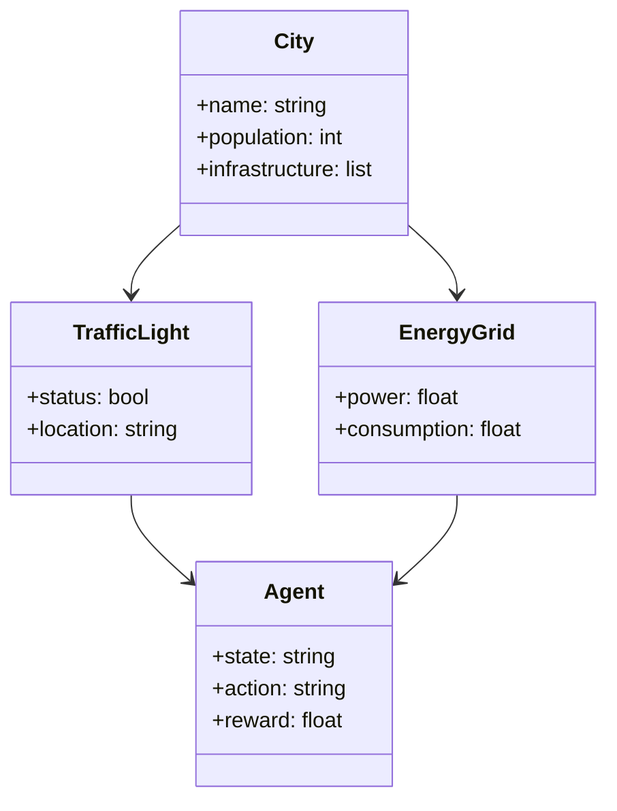
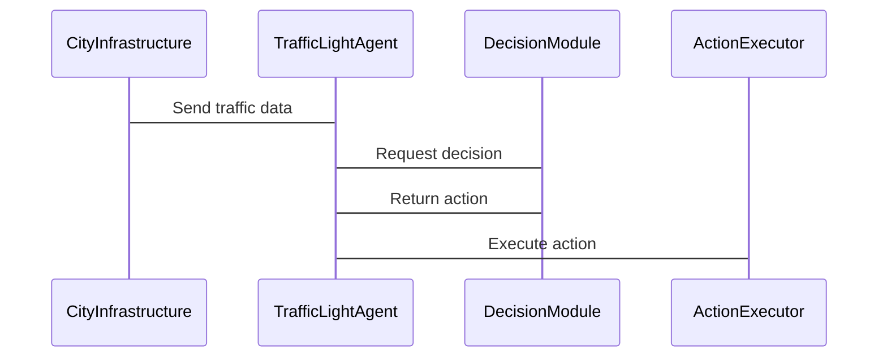

                 


# AI Agent在智能城市规划模拟中的角色

> **关键词**：AI Agent、智能城市、城市规划、强化学习、系统架构

> **摘要**：  
本文探讨了AI Agent在智能城市规划模拟中的核心作用。通过分析AI Agent的定义、原理及其在城市交通、能源管理和环境监测等领域的应用，展示了其在提高城市规划效率和决策质量中的潜力。文章还详细介绍了AI Agent的数学模型、算法原理和系统架构设计，并通过实际案例展示了其在智能城市中的应用前景。

---

# 引言

随着城市化进程的加速，城市规划面临着前所未有的挑战。传统城市规划方法依赖于人工经验，效率低下且难以应对复杂的城市动态。AI Agent（人工智能代理）作为一种能够自主感知、决策和执行的智能实体，正在成为智能城市规划的核心工具。本文将深入探讨AI Agent在智能城市规划中的角色，分析其技术原理、应用场景和系统架构，并通过实际案例展示其潜力。

---

# 第1章: AI Agent与智能城市规划的背景

## 1.1 AI Agent的基本概念

### 1.1.1 什么是AI Agent
AI Agent是一种能够感知环境、自主决策并执行任务的智能实体。它可以分为**简单反射型Agent**、**基于模型的反射型Agent**、**目标驱动型Agent**和**效用驱动型Agent**。

### 1.1.2 AI Agent的核心特征
- **自主性**：能够在无外部干预的情况下独立运行。
- **反应性**：能够实时感知环境变化并做出反应。
- **目标导向性**：基于目标进行决策和行动。

### 1.1.3 AI Agent在智能城市中的作用
AI Agent可以辅助城市规划者进行交通管理、资源分配和环境监测，从而提高城市的运行效率。

---

## 1.2 智能城市规划的定义与目标

### 1.2.1 智能城市的定义
智能城市是通过物联网、大数据和人工智能等技术，实现城市基础设施、交通、能源和环境的智能化管理。

### 1.2.2 智能城市规划的核心目标
- 提高城市资源利用效率。
- 优化城市交通系统。
- 降低城市环境污染。

### 1.2.3 智能城市规划的关键要素
包括城市基础设施、交通网络、能源系统和环境监测系统。

---

## 1.3 AI Agent在智能城市规划中的应用背景

### 1.3.1 城市规划的传统方法与局限性
传统城市规划依赖人工经验和静态数据，难以应对城市动态变化。

### 1.3.2 AI技术在城市规划中的优势
- 提高决策效率。
- 实现实时动态优化。
- 支持大规模数据处理。

### 1.3.3 AI Agent在智能城市规划中的角色定位
AI Agent作为城市规划的辅助工具，能够实时分析城市数据并提供优化建议。

---

## 1.4 本章小结

本章介绍了AI Agent的基本概念及其在智能城市中的作用，分析了智能城市规划的核心目标和关键要素。AI Agent通过实时感知和自主决策，为智能城市规划提供了新的可能性。

---

# 第2章: AI Agent的核心概念与原理

## 2.1 AI Agent的定义与分类

### 2.1.1 AI Agent的定义
AI Agent是一种能够感知环境、自主决策并执行任务的智能实体。

### 2.1.2 AI Agent的分类
- **简单反射型Agent**：基于当前感知做出反应，适用于简单的任务。
- **基于模型的反射型Agent**：利用内部模型进行决策，适用于复杂环境。
- **目标驱动型Agent**：基于目标进行决策和行动。
- **效用驱动型Agent**：通过最大化效用来做出决策。

### 2.1.3 不同类型AI Agent的对比分析

| 类型                  | 特点                                                                 |
|-----------------------|----------------------------------------------------------------------|
| 简单反射型Agent      | 基于当前感知做出反应，适用于简单任务                                       |
| 基于模型的反射型Agent | 利用内部模型进行决策，适用于复杂环境                                       |
| 目标驱动型Agent      | 基于目标进行决策和行动                                                     |
| 效用驱动型Agent      | 通过最大化效用来做出决策                                                   |

---

## 2.2 AI Agent的工作原理

### 2.2.1 感知与决策机制
AI Agent通过传感器或数据源感知环境，利用算法进行决策。

### 2.2.2 行为与执行机制
基于决策结果，AI Agent执行相应的动作，例如调整交通信号灯或优化能源分配。

### 2.2.3 AI Agent的生命周期
包括初始化、感知、决策、执行和终止五个阶段。

---

## 2.3 AI Agent在智能城市规划中的应用

### 2.3.1 AI Agent在城市交通管理中的应用
通过实时调整交通信号灯，优化交通流量。

### 2.3.2 AI Agent在城市能源管理中的应用
通过动态调整能源分配，提高能源利用效率。

### 2.3.3 AI Agent在城市环境监测中的应用
通过实时监测空气质量，提出环境保护建议。

---

## 2.4 本章小结

本章详细介绍了AI Agent的核心概念和工作原理，并分析了其在智能城市规划中的应用场景。AI Agent通过实时感知和自主决策，为智能城市规划提供了高效的支持。

---

# 第3章: AI Agent的数学模型与算法原理

## 3.1 AI Agent的决策模型

### 3.1.1 基于强化学习的决策模型
通过强化学习（如Q-Learning）进行决策，优化奖励函数。

### 3.1.2 基于监督学习的决策模型
通过监督学习，基于历史数据进行预测和决策。

### 3.1.3 基于无监督学习的决策模型
通过无监督学习发现数据中的潜在模式，辅助决策。

---

## 3.2 AI Agent的优化算法

### 3.2.1 强化学习算法（如Q-Learning）
通过状态、动作和奖励函数，优化决策策略。

### 3.2.2 遗传算法
通过模拟自然选择和遗传变异，优化决策方案。

### 3.2.3 贪婪算法
通过贪心策略，选择当前最优解。

---

## 3.3 AI Agent的数学模型

### 3.3.1 状态空间模型
表示所有可能的状态集合，例如交通信号灯的状态。

### 3.3.2 动作空间模型
表示所有可能的动作集合，例如调整交通信号灯的时间。

### 3.3.3 奖励函数模型
定义每个动作的奖励值，例如减少交通拥堵的奖励。

---

## 3.4 本章小结

本章介绍了AI Agent的决策模型和优化算法，并分析了其数学模型。通过强化学习和遗传算法，AI Agent可以在复杂环境中优化决策。

---

# 第4章: AI Agent在智能城市规划中的系统架构

## 4.1 系统需求分析

### 4.1.1 功能需求
- 实时数据采集
- 自主决策
- 系统优化

### 4.1.2 性能需求
- 高效性
- 稳定性
- 可扩展性

### 4.1.3 接口需求
- 数据接口
- 用户接口
- 系统接口

---

## 4.2 系统架构设计

### 4.2.1 领域模型（Mermaid类图）


### 4.2.2 系统架构（Mermaid架构图）


### 4.2.3 系统接口设计
- 数据接口：实时采集交通和能源数据。
- 用户接口：提供可视化界面供用户监控和管理。

### 4.2.4 系统交互（Mermaid序列图）


---

## 4.3 本章小结

本章详细介绍了AI Agent在智能城市规划中的系统架构，包括需求分析、架构设计和接口设计。通过类图和序列图，展示了系统的模块划分和交互流程。

---

# 第5章: AI Agent的项目实战

## 5.1 环境搭建

### 5.1.1 技术选型
- Python编程语言
- TensorFlow机器学习框架
- Pandas数据处理库

### 5.1.2 环境配置
安装必要的Python包，例如：
```bash
pip install numpy pandas tensorflow matplotlib
```

---

## 5.2 系统核心实现

### 5.2.1 AI Agent的实现代码
```python
class AIAgent:
    def __init__(self, state_space, action_space):
        self.state_space = state_space
        self.action_space = action_space
        self.q_table = {}  # Q-Learning表格

    def perceive(self, state):
        # 返回当前状态的动作
        return self.q_table.get(state, 0)

    def learn(self, state, action, reward):
        # 更新Q-Learning表格
        self.q_table[state] = reward
```

### 5.2.2 交通信号灯优化案例
```python
# 初始化状态空间和动作空间
states = ['red', 'green']
actions = ['switch', 'keep']

# 初始化AI Agent
agent = AIAgent(states, actions)

# 模拟交通信号灯优化
current_state = 'red'
for _ in range(10):
    action = agent.perceive(current_state)
    reward = 1 if action == 'switch' else 0
    agent.learn(current_state, action, reward)
    current_state = 'green' if action == 'switch' else 'red'
```

---

## 5.3 项目小结

本章通过实际案例展示了AI Agent在交通信号灯优化中的应用。通过Q-Learning算法，AI Agent能够根据交通流量动态调整信号灯状态，从而优化交通效率。

---

# 结语

AI Agent作为智能城市规划的核心工具，通过实时感知、自主决策和动态优化，为城市交通、能源管理和环境监测提供了高效的支持。随着技术的不断进步，AI Agent将在智能城市规划中发挥越来越重要的作用。

---

**作者：AI天才研究院/AI Genius Institute & 禅与计算机程序设计艺术 /Zen And The Art of Computer Programming**

