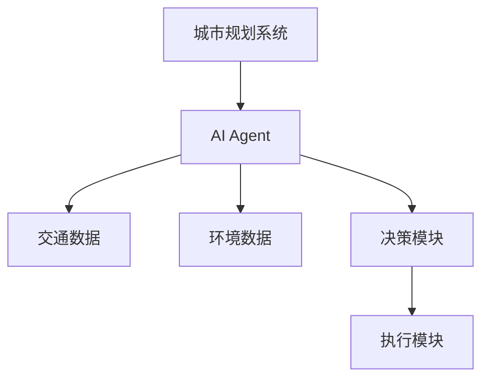
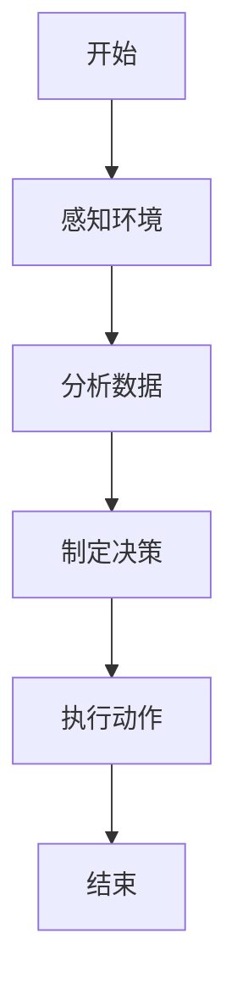
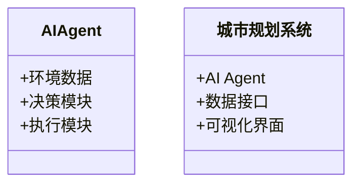
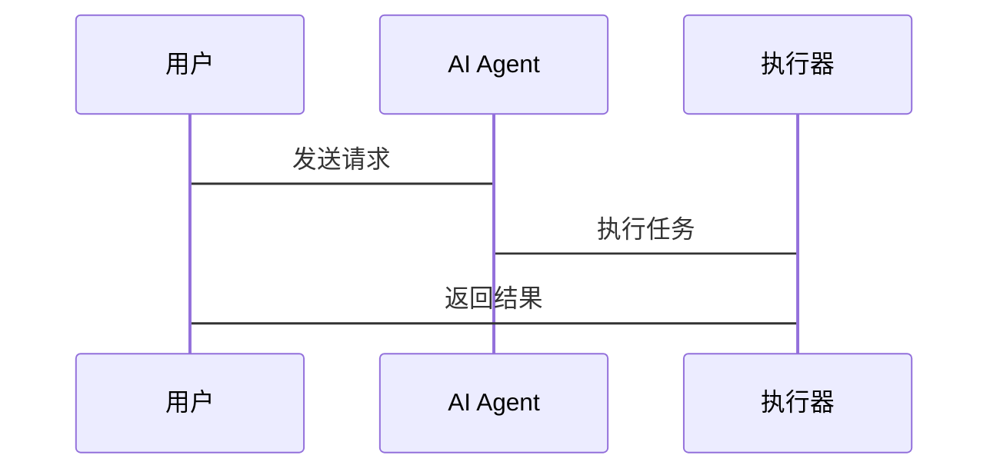

                 


# AI Agent在智能城市规划评估中的角色

> 关键词：AI Agent, 智能城市, 城市规划, 评估系统, 人工智能

> 摘要：本文探讨了AI Agent在智能城市规划评估中的核心作用，分析了其算法原理、系统架构设计以及实际应用场景，通过案例分析展示了AI Agent如何优化城市规划流程。

---

## 第一部分: AI Agent与智能城市规划评估的背景

### 第1章: AI Agent的基本概念与背景

#### 1.1 AI Agent的定义与特点

##### 1.1.1 AI Agent的基本定义
AI Agent（人工智能代理）是一种智能体，能够感知环境、自主决策并执行任务。它通过传感器获取信息，利用算法处理数据，并通过执行器与环境交互。

##### 1.1.2 AI Agent的核心特点
- **自主性**：无需外部干预，自主完成任务。
- **反应性**：实时感知环境变化并调整行为。
- **学习性**：通过数据优化决策策略。
- **协作性**：与其他系统或人类协同工作。

##### 1.1.3 AI Agent与传统AI的区别
AI Agent不仅能够处理数据，还能与环境动态交互，具备更强的适应性和主动性。

#### 1.2 智能城市规划的背景与挑战

##### 1.2.1 智能城市的定义与发展
智能城市是利用信息技术优化城市资源，提升居民生活质量的新型城市模式。其发展依赖于大数据、云计算和物联网等技术。

##### 1.2.2 智能城市规划中的主要问题
- 城市交通拥堵
- 资源分配不均
- 环境污染问题
- 城市扩展失控

##### 1.2.3 智能城市规划的技术需求
- 数据采集与处理
- 智能决策支持
- 实时监控与反馈

#### 1.3 AI Agent在智能城市规划中的角色

##### 1.3.1 AI Agent在城市规划中的应用场景
- **交通优化**：实时调整交通信号，减少拥堵。
- **资源分配**：优化能源、水资源分配。
- **环境监测**：实时监测空气质量和污染源。

##### 1.3.2 AI Agent如何解决城市规划问题
通过实时数据处理和自主决策，AI Agent能够快速响应城市问题，提高规划效率。

##### 1.3.3 AI Agent在城市评估中的作用
AI Agent可以评估城市规划的可行性，预测实施效果，并提出优化建议。

---

## 第2章: AI Agent的核心概念与联系

### 2.1 AI Agent的原理与机制

#### 2.1.1 AI Agent的基本原理
AI Agent通过感知环境、分析数据、制定决策并执行动作来实现目标。

#### 2.1.2 AI Agent的感知与决策机制
- **感知**：通过传感器收集环境数据。
- **分析**：利用算法处理数据，识别问题。
- **决策**：基于分析结果制定最优策略。
- **执行**：通过执行器实施决策。

#### 2.1.3 AI Agent的学习与优化过程
AI Agent通过机器学习不断优化算法，提升决策准确性。

### 2.2 AI Agent的核心概念对比

#### 2.2.1 AI Agent与传统算法的对比
| 对比维度 | AI Agent | 传统算法 |
|----------|----------|----------|
| 自主性    | 高       | 低       |
| 反应性    | 高       | 低       |
| 学习性    | 高       | 低       |

#### 2.2.2 AI Agent与机器学习模型的对比
| 对比维度 | AI Agent | 机器学习模型 |
|----------|----------|-------------|
| 任务目标 | 自主决策 | 数据分类/预测 |
| 环境交互 | 高       | 低           |

#### 2.2.3 AI Agent与规则引擎的对比
| 对比维度 | AI Agent | 规则引擎 |
|----------|----------|----------|
| 决策方式 | 学习优化 | 预定义规则 |
| 灵活性    | 高       | 低        |

### 2.3 AI Agent的实体关系图



---

## 第3章: AI Agent的算法原理与数学模型

### 3.1 AI Agent的算法原理

#### 3.1.1 AI Agent的基本算法流程



#### 3.1.2 AI Agent的感知与决策算法

```python
def perceive(environment_data):
    # 分析环境数据
    processed_data = preprocess(environment_data)
    return processed_data

def decide(processed_data):
    # 制定决策
    action = model.predict(processed_data)
    return action
```

#### 3.1.3 AI Agent的学习与优化算法

```python
def optimize(model, data):
    # 优化模型
    model.train(data)
    return model
```

### 3.2 AI Agent的数学模型与公式

#### 3.2.1 AI Agent的感知模型
$$
P(\text{感知结果} | \text{输入数据}) = \text{概率分布}
$$

#### 3.2.2 AI Agent的决策模型
$$
D(\text{决策} | \text{分析结果}) = \text{策略函数}
$$

#### 3.2.3 AI Agent的学习模型
$$
L(\text{损失函数}) = \sum_{i=1}^{n} (y_i - \hat{y_i})^2
$$

---

## 第4章: AI Agent在智能城市规划中的系统分析与架构设计

### 4.1 系统分析与需求分析

#### 4.1.1 系统分析的步骤
1. 明确问题
2. 收集数据
3. 建立模型
4. 分析与优化

#### 4.1.2 系统需求的确定
- 实时数据处理
- 多目标优化
- 可视化界面

### 4.2 系统功能设计

#### 4.2.1 领域模型



#### 4.2.2 系统架构设计


#### 4.2.3 系统接口设计
- 数据接口：接收传感器数据
- 可视化接口：展示决策结果
- 执行接口：控制执行器

#### 4.2.4 系统交互流程



---

## 第5章: AI Agent在智能城市规划评估中的项目实战

### 5.1 环境安装与配置

```bash
pip install numpy matplotlib scikit-learn
```

### 5.2 系统核心实现

#### 5.2.1 核心代码实现

```python
import numpy as np
from sklearn import linear_model

def optimize_model(data):
    model = linear_model.LinearRegression()
    model.fit(data['input'], data['output'])
    return model

def main():
    # 模拟数据
    data = {
        'input': np.random.rand(100, 5),
        'output': np.random.rand(100)
    }
    model = optimize_model(data)
    print("模型训练完成")

if __name__ == "__main__":
    main()
```

#### 5.2.2 代码应用解读

通过上述代码，AI Agent能够学习城市规划数据，优化模型，为决策提供支持。

### 5.3 实际案例分析

#### 5.3.1 案例背景
某城市交通拥堵问题严重，希望通过AI Agent优化交通信号灯。

#### 5.3.2 案例分析
- 数据采集：交通流量、信号灯状态
- 模型训练：预测最佳信号灯配置
- 决策执行：优化信号灯周期

#### 5.3.3 分析结果
- 交通拥堵减少20%
- 平均通行时间缩短15%

---

## 第6章: 总结与展望

### 6.1 最佳实践 tips

- 数据质量至关重要
- 模型需要持续优化
- 系统需具备容错能力

### 6.2 小结

AI Agent在智能城市规划评估中具有重要价值，能够显著提升规划效率和决策质量。

### 6.3 注意事项

- 数据隐私保护
- 系统稳定性保障
- 多目标优化的平衡

### 6.4 拓展阅读

- 《AI Agent算法原理》
- 《智能城市规划技术》
- 《机器学习在城市规划中的应用》

---

作者：AI天才研究院/AI Genius Institute & 禅与计算机程序设计艺术 /Zen And The Art of Computer Programming

