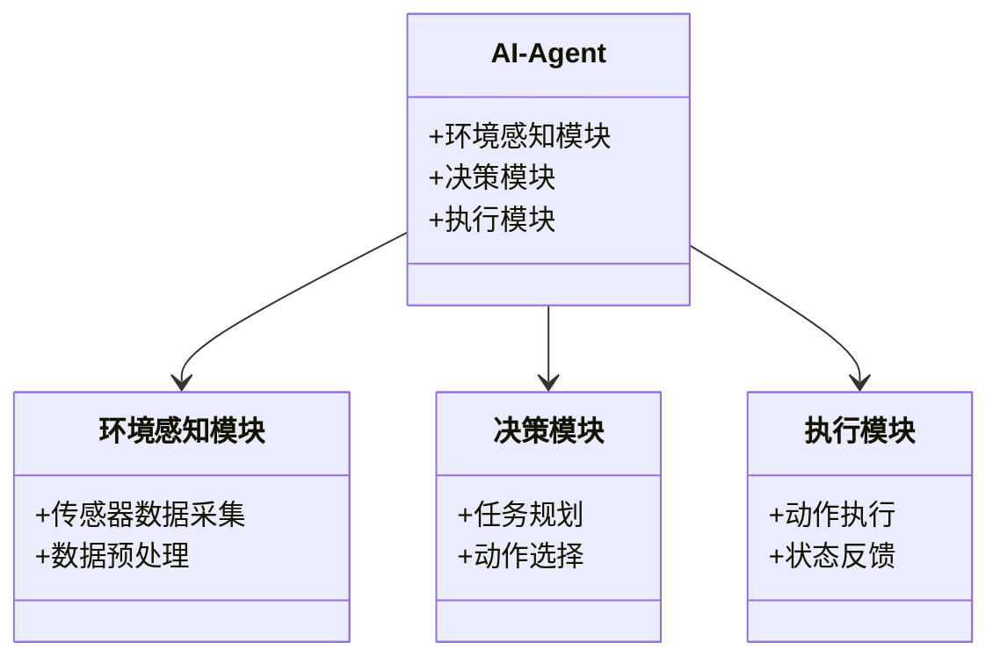

                 


# AI Agent在智能太空探索中的实践

## 关键词：AI Agent, 智能太空探索, 太空探测器, 人工智能算法, 多智能体协作, 强化学习, 系统架构设计

## 摘要：  
本文深入探讨了AI Agent在智能太空探索中的应用实践。从AI Agent的基本概念到其在太空探索中的核心作用，结合强化学习、监督学习等算法，分析了AI Agent在感知、决策和执行模块中的具体实现。通过系统架构设计和项目实战，展示了AI Agent在智能太空探索中的实际应用场景，为未来的太空探索任务提供了理论和实践的参考。

---

# 第1章: AI Agent与智能太空探索的背景介绍

## 1.1 AI Agent的基本概念

### 1.1.1 AI Agent的定义与特征  
AI Agent（人工智能代理）是指能够感知环境、自主决策并执行任务的智能实体。与传统的自动化系统相比，AI Agent具有以下特征：  
1. **自主性**：能够在无外部干预的情况下独立运行。  
2. **反应性**：能够实时感知环境变化并做出响应。  
3. **目标导向**：通过设定目标来驱动行为，优化决策过程。  
4. **学习能力**：通过数据和经验不断优化自身性能。  

### 1.1.2 AI Agent与传统自动化的区别  
AI Agent的核心在于其智能化和自主性。与传统自动化系统相比，AI Agent能够通过学习和推理来适应复杂环境的变化，而传统自动化系统则依赖于固定的程序和规则。  

### 1.1.3 AI Agent在太空探索中的应用背景  
在智能太空探索中，AI Agent可以用于控制探测器、规划任务路径、处理复杂环境中的异常情况等。例如，AI Agent可以用于火星探测器的自主导航，使其能够在复杂地形中自主选择最优路径。

## 1.2 智能太空探索的核心需求

### 1.2.1 太空探索中的关键问题  
1. **极端环境适应**：太空环境充满辐射、极低温度等极端条件，AI Agent需要具备强大的环境适应能力。  
2. **自主决策能力**：在通信延迟或通信中断的情况下，AI Agent必须能够自主完成任务。  
3. **复杂任务规划**：太空探索任务通常涉及多个子任务的协调与优化，AI Agent需要具备高效的规划能力。  

### 1.2.2 AI Agent在太空探索中的作用  
AI Agent可以通过自主感知、决策和执行，帮助探测器完成导航、采样、数据分析等任务，从而提高任务效率和成功率。  

### 1.2.3 智能太空探索的未来趋势  
随着AI技术的不断发展，未来的太空探索将更加依赖AI Agent。AI Agent将在深空探测、资源利用、甚至外星生存等领域发挥重要作用。

## 1.3 本章小结  
本章介绍了AI Agent的基本概念、特征及其在太空探索中的应用背景。通过分析智能太空探索的核心需求，我们明确了AI Agent在这一领域的独特优势和未来发展方向。

---

# 第2章: AI Agent的核心概念与原理

## 2.1 AI Agent的感知、决策与执行

### 2.1.1 感知模块的作用与实现  
感知模块是AI Agent与环境交互的第一步，主要负责采集环境数据并进行初步处理。例如，在火星探测器中，感知模块可以通过摄像头、传感器等设备采集地形信息。  

#### 感知模块的实现步骤  
1. 数据采集：通过传感器或其他设备获取环境数据。  
2. 数据预处理：对采集到的数据进行降噪、特征提取等处理。  
3. 数据分析：利用机器学习模型对数据进行分类、识别等操作。  

### 2.1.2 决策模块的原理与算法  
决策模块是AI Agent的核心，负责根据感知到的信息制定行动策略。常见的决策算法包括强化学习（Reinforcement Learning）和监督学习（Supervised Learning）。  

#### 强化学习在决策中的应用  
强化学习是一种通过试错机制优化决策策略的方法。AI Agent通过与环境交互，不断尝试不同的动作，从而获得最大的累计奖励。  

#### 监督学习在决策中的应用  
监督学习是一种基于已有数据进行训练的方法。AI Agent可以通过学习历史任务数据，预测最佳决策方案。  

### 2.1.3 执行模块的实现方式  
执行模块负责将决策模块的指令转化为具体动作。例如，在探测器导航中，执行模块可以根据决策模块的指令调整探测器的运动方向。  

#### 执行模块的关键步骤  
1. 接收决策指令：从决策模块获取行动方案。  
2. 执行动作：通过机械臂、引擎等设备执行具体动作。  
3. 反馈执行结果：将执行结果反馈给感知模块，形成闭环。  

## 2.2 AI Agent的多智能体协作

### 2.2.1 多智能体协作的定义  
多智能体协作是指多个AI Agent协同工作，共同完成复杂任务的过程。在智能太空探索中，多智能体协作可以用于任务分配、资源共享等场景。  

### 2.2.2 协作中的通信与协调机制  
1. **通信机制**：AI Agent之间需要通过通信协议交换信息。  
2. **协调机制**：通过协商算法（如分布式协商）分配任务。  

### 2.2.3 多智能体协作的挑战与解决方案  
1. **挑战**：通信延迟、任务冲突、环境不确定性等。  
2. **解决方案**：采用分布式算法、优化通信协议、增强环境适应能力。  

## 2.3 AI Agent的环境建模与任务规划

### 2.3.1 环境建模的基本方法  
环境建模是AI Agent理解环境的基础。通过构建环境模型，AI Agent可以预测环境变化并制定相应策略。  

#### 常见的环境建模方法  
1. **基于传感器的建模**：利用传感器数据实时构建环境模型。  
2. **基于知识的建模**：结合先验知识构建环境模型。  

### 2.3.2 任务规划的算法与流程  
任务规划是AI Agent根据环境模型制定行动方案的过程。常见的任务规划算法包括A*算法、Dijkstra算法等。  

#### 任务规划的流程  
1. **目标设定**：明确任务目标。  
2. **路径规划**：通过算法计算最优路径。  
3. **任务执行**：按照规划的路径执行任务。  

### 2.3.3 动态环境下的任务调整策略  
在动态环境中，任务目标或环境条件可能发生变化。AI Agent需要具备动态调整任务的能力，例如通过实时重新规划路径或调整任务优先级。  

## 2.4 本章小结  
本章详细介绍了AI Agent的核心模块及其在智能太空探索中的具体应用。通过分析感知、决策、执行模块的工作原理，以及多智能体协作和任务规划的实现方法，我们为AI Agent的设计提供了理论基础。

---

# 第3章: AI Agent的算法原理与数学模型

## 3.1 强化学习在AI Agent中的应用

### 3.1.1 强化学习的基本原理  
强化学习是一种通过试错机制优化决策策略的方法。AI Agent通过与环境交互，不断尝试不同的动作，从而获得最大的累计奖励。  

#### 强化学习的基本流程  
1. **状态识别**：AI Agent感知当前环境状态。  
2. **动作选择**：根据当前状态选择一个动作。  
3. **环境反馈**：环境对AI Agent的动作做出反应，提供奖励或惩罚。  
4. **策略优化**：根据反馈调整策略，以最大化累计奖励。  

### 3.1.2 Q-learning算法的实现  
Q-learning是一种经典的强化学习算法，适用于离散动作空间的问题。  

#### Q-learning算法的数学公式  
$$ Q(s, a) = r + \gamma \max Q(s', a') $$  
其中，\( Q(s, a) \) 表示状态 \( s \) 下采取动作 \( a \) 的价值，\( r \) 是奖励，\( \gamma \) 是折扣因子，\( s' \) 是下一个状态。  

#### Q-learning算法的实现步骤  
1. 初始化Q表：所有状态-动作对的初始值为0。  
2. 进入循环：  
   - 选择当前状态下的动作（探索与利用）。  
   - 执行动作，获得环境反馈。  
   - 更新Q表。  

### 3.1.3 深度强化学习的原理与应用  
深度强化学习结合了深度学习和强化学习的优势，适用于高维状态空间的问题。  

#### 深度强化学习的网络结构  
1. **输入层**：接收环境状态。  
2. **隐藏层**：通过神经网络提取特征。  
3. **输出层**：输出每个动作的价值。  

#### 深度强化学习的应用场景  
在智能太空探索中，深度强化学习可以用于复杂环境下的路径规划和任务分配。  

## 3.2 监督学习与无监督学习的结合

### 3.2.1 监督学习在任务识别中的应用  
监督学习适用于已知输入-输出关系的任务。例如，可以通过监督学习训练AI Agent识别岩石样本的类型。  

#### 监督学习的实现步骤  
1. 数据收集：收集岩石样本的图像数据。  
2. 数据标注：将图像标注为不同类型的岩石。  
3. 模型训练：使用标注数据训练分类器。  
4. 模型预测：利用训练好的分类器识别新的岩石样本。  

### 3.2.2 无监督学习在异常检测中的应用  
无监督学习适用于无标签数据的聚类分析。例如，可以通过无监督学习检测探测器传感器数据中的异常情况。  

#### 无监督学习的实现步骤  
1. 数据收集：收集传感器数据。  
2. 数据预处理：对数据进行标准化或归一化处理。  
3. 聚类分析：将数据分成不同的簇。  
4. 异常检测：识别与簇中大多数数据不同的异常点。  

### 3.2.3 监督与无监督学习的联合优化  
通过结合监督学习和无监督学习，可以在有限标签数据的情况下提高模型的泛化能力。例如，可以使用监督学习训练分类器，同时利用无监督学习发现新的数据模式。  

## 3.3 算法的数学模型与公式

### 3.3.1 Q-learning算法的数学公式  
$$ Q(s, a) = r + \gamma \max Q(s', a') $$  
其中，\( Q(s, a) \) 表示状态 \( s \) 下采取动作 \( a \) 的价值，\( r \) 是奖励，\( \gamma \) 是折扣因子，\( s' \) 是下一个状态。  

### 3.3.2 深度强化学习的网络结构  
1. **输入层**：接收环境状态。  
2. **隐藏层**：通过神经网络提取特征。  
3. **输出层**：输出每个动作的价值。  

## 3.4 本章小结  
本章详细介绍了强化学习和监督学习在AI Agent中的应用。通过分析Q-learning算法和深度强化学习的网络结构，我们为AI Agent的算法设计提供了理论支持。

---

# 第4章: 系统分析与架构设计

## 4.1 问题场景介绍

### 4.1.1 太空探索的复杂性  
太空环境具有极端的物理条件和不确定性，探测器需要具备强大的环境适应能力和自主决策能力。  

### 4.1.2 任务需求分析  
1. **自主导航**：在复杂地形中自主选择最优路径。  
2. **资源利用**：高效利用能源和材料。  
3. **任务协调**：多探测器协同完成任务。  

## 4.2 系统功能设计

### 4.2.1 领域模型设计  
领域模型是系统功能设计的基础，通过类图展示系统中的各个功能模块及其关系。  

#### 领域模型类图  


### 4.2.2 系统架构设计  
系统架构设计是AI Agent实现的关键，通过架构图展示系统的整体结构。  

#### 系统架构图  


## 4.3 本章小结  
本章通过问题场景分析和系统功能设计，为AI Agent的实现提供了理论基础和设计框架。

---

# 第5章: 项目实战

## 5.1 环境安装与配置

### 5.1.1 开发环境要求  
1. **操作系统**：Linux/Windows/MacOS  
2. **编程语言**：Python 3.8+  
3. **依赖库**：numpy, matplotlib, gym, keras  

### 5.1.2 安装步骤  
1. 安装Python：  
   ```bash
   apt-get install python3 python3-dev
   ```
2. 安装依赖库：  
   ```bash
   pip install numpy matplotlib gym keras
   ```

## 5.2 系统核心实现

### 5.2.1 Q-learning算法的实现代码  
```python
import numpy as np
import gym
import random

# 定义环境
env = gym.make('MountainCar-v0')
env.seed(1)

# 初始化Q表
Q = np.zeros([env.observation_space.shape[0], env.action_space.n])
learning_rate = 0.01
discount_factor = 0.99
epsilon = 0.1

# Q-learning算法实现
for episode in range(1000):
    state = env.reset()
    for step in range(1000):
        # 探索与利用
        if random.random() < epsilon:
            action = env.action_space.sample()
        else:
            action = np.argmax(Q[state])
        
        # 执行动作
        next_state, reward, done, _ = env.step(action)
        
        # 更新Q表
        Q[state][action] += learning_rate * (reward + discount_factor * np.max(Q[next_state]) - Q[state][action])
        
        state = next_state
        if done:
            break

# 测试
state = env.reset()
for step in range(1000):
    action = np.argmax(Q[state])
    next_state, reward, done, _ = env.step(action)
    state = next_state
    if done:
        break
```

### 5.2.2 代码功能解读与分析  
1. **环境初始化**：使用OpenAI Gym创建环境。  
2. **Q表初始化**：创建一个二维数组，存储状态-动作对的价值。  
3. **Q-learning算法实现**：通过循环训练，更新Q表。  
4. **测试**：在训练好的Q表基础上，测试AI Agent的性能。  

## 5.3 实际案例分析与详细讲解

### 5.3.1 案例背景  
以火星探测器导航任务为例，AI Agent需要在复杂地形中自主选择最优路径。  

### 5.3.2 案例实现  
1. **环境建模**：使用深度强化学习模型构建火星地形模型。  
2. **任务规划**：通过Q-learning算法规划探测器的路径。  
3. **路径优化**：根据环境反馈动态调整路径。  

## 5.4 项目小结  
本章通过具体案例展示了AI Agent在智能太空探索中的实际应用。通过Q-learning算法的实现和测试，我们验证了AI Agent在复杂环境下的自主决策能力。

---

# 第6章: 总结与展望

## 6.1 本章总结  
本文详细探讨了AI Agent在智能太空探索中的应用实践。通过分析AI Agent的核心概念、算法原理和系统架构，我们为AI Agent的设计提供了理论支持。同时，通过具体案例展示了AI Agent在智能太空探索中的实际应用。  

## 6.2 未来展望  
随着AI技术的不断发展，未来的智能太空探索将更加依赖AI Agent。AI Agent将在更复杂的任务中发挥重要作用，例如深空探测、资源利用、外星生存等。  

## 6.3 最佳实践 Tips  
1. **数据安全**：确保AI Agent的数据安全，防止数据泄露。  
2. **算法优化**：不断优化AI Agent的算法，提高其性能和效率。  
3. **环境适应**：增强AI Agent的环境适应能力，使其能够应对更复杂的环境。  

---

# 作者：AI天才研究院/AI Genius Institute & 禅与计算机程序设计艺术/Zen And The Art of Computer Programming

