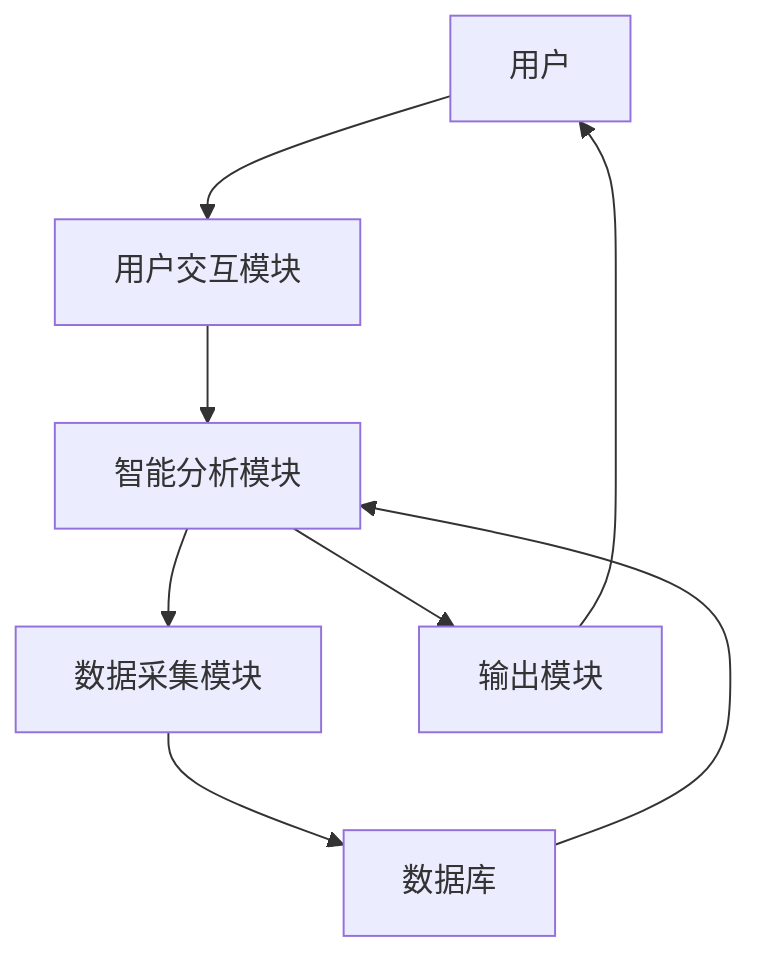

                 


# AI Agent在智能客户关系管理中的作用

> **关键词**：AI Agent, 智能CRM, 机器学习, 客户画像, 预测分析

> **摘要**：AI Agent通过机器学习和自然语言处理技术，能够自动化处理客户请求、分析数据、预测客户行为，从而优化客户关系管理。本文从背景、核心概念、算法原理、系统架构、项目实战到案例分析，全面阐述AI Agent在智能CRM中的作用，并展望未来发展趋势。

---

## 目录大纲：《AI Agent在智能客户关系管理中的作用》

### 第一部分：背景与概述

#### 第1章：AI Agent与智能客户关系管理概述

##### 1.1 AI Agent的基本概念
- 1.1.1 AI Agent的定义与特点
  - AI Agent的定义：人工智能代理是一种能够感知环境并采取行动以实现目标的智能实体。
  - 特点：自主性、反应性、主动性、社交能力。

- 1.1.2 AI Agent的核心功能与应用场景
  - 数据收集与分析
  - 自动化决策与执行
  - 与用户的交互与反馈

##### 1.2 智能客户关系管理（CRM）概述
- 1.2.1 CRM的定义与作用
  - CRM定义：客户关系管理是一种企业管理系统，用于优化与客户的关系和互动。
  - 作用：提高客户满意度、增加客户忠诚度、提升销售效率。

- 1.2.2 CRM的主要功能与流程
  - 数据管理：客户信息、交易记录、服务历史。
  - 分析与预测：客户行为分析、销售预测、市场趋势分析。
  - 自动化处理：邮件营销、任务提醒、客户分组。

##### 1.3 AI Agent与CRM的结合
- 1.3.1 结合的必要性与优势
  - 必要性：传统CRM依赖人工操作，效率低下且容易出错。
  - 优势：自动化、智能化、实时响应。

- 1.3.2 结合的主要应用场景
  - 自动化客户服务：智能回复、24/7支持。
  - 客户画像与精准营销：基于数据分析的个性化推荐。
  - 风险预警：预测客户流失，提前采取措施。

---

### 第二部分：核心概念与技术原理

#### 第2章：AI Agent在CRM中的核心作用

##### 2.1 AI Agent的功能模块
- 2.1.1 数据收集与分析模块
  - 数据来源：客户互动记录、社交媒体数据、销售数据。
  - 分析方法：自然语言处理、机器学习模型。

- 2.1.2 客户画像与预测模块
  - 客户画像：基于数据的客户特征分析。
  - 预测模型：客户行为预测、需求预测。

- 2.1.3 自动化处理模块
  - 自动化任务：邮件发送、任务提醒、客户分类。

##### 2.2 AI Agent与CRM系统的交互流程
- 2.2.1 数据输入与处理
  - 数据预处理：清洗、格式转换。
  - 特征提取：关键字段识别。

- 2.2.2 智能决策与反馈
  - 模型推理：基于输入数据生成决策。
  - 反馈机制：实时更新数据，优化模型。

- 2.2.3 结果输出与优化
  - 输出结果：决策建议、预测结果。
  - 模型优化：基于反馈调整参数。

---

### 第三部分：算法原理与实现

#### 第3章：AI Agent的算法基础

##### 3.1 机器学习算法在AI Agent中的应用
- 3.1.1 监督学习与无监督学习
  - 监督学习：分类、回归。
  - 无监督学习：聚类、降维。

- 3.1.2 深度学习模型简介
  - 神经网络：卷积神经网络（CNN）、循环神经网络（RNN）。
  - 预测模型：长短期记忆网络（LSTM）。

##### 3.2 算法实现步骤
- 3.2.1 数据预处理与特征提取
  - 数据清洗：去除噪声数据。
  - 特征工程：选择关键特征。

- 3.2.2 模型训练与优化
  - 模型选择：根据任务选择合适算法。
  - 参数调优：网格搜索、随机搜索。

- 3.2.3 模型评估与部署
  - 评估指标：准确率、召回率、F1分数。
  - 部署流程：API接口、集成到系统中。

---

### 第四部分：系统架构设计

#### 第4章：AI Agent CRM系统的架构分析

##### 4.1 系统功能模块设计
- 4.1.1 数据采集模块
  - 功能：收集客户数据。
  - 接口：数据库连接、API接口。

- 4.1.2 智能分析模块
  - 功能：数据分析、预测模型运行。
  - 接口：与数据采集模块和用户交互模块通信。

- 4.1.3 用户交互模块
  - 功能：用户输入、结果展示。
  - 接口：图形界面、API调用。

##### 4.2 系统架构图


---

### 第五部分：项目实战

#### 第5章：基于AI Agent的CRM系统实现

##### 5.1 项目环境安装
- 5.1.1 安装Python
  - 命令：`python --version`
- 5.1.2 安装机器学习库
  - 命令：`pip install scikit-learn`

##### 5.2 系统核心实现源代码
```python
# 简单的客户分类模型
from sklearn.datasets import make_classification
from sklearn.model

