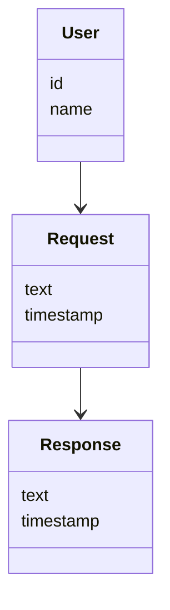

                 


# AI Agent在智能客户服务中的角色

> 关键词：AI Agent, 智能客服, 自然语言处理, 机器学习, 客户服务, 聊天机器人

> 摘要：本文详细探讨了AI Agent在智能客户服务中的角色，从基本概念到核心原理，再到应用场景和系统架构，全面分析了AI Agent如何提升客户服务的效率和质量。文章结合实际案例，深入讲解了AI Agent的技术实现和最佳实践，为读者提供了全面的视角。

---

## 第1章: AI Agent的基本概念与背景

### 1.1 AI Agent的定义与特点

#### 1.1.1 AI Agent的定义
AI Agent（人工智能代理）是一种能够感知环境并采取行动以实现目标的智能系统。在智能客户服务中，AI Agent通常以聊天机器人或语音助手的形式出现，能够理解和响应用户的请求。

#### 1.1.2 AI Agent的核心特点
- **智能性**：基于NLP和机器学习技术，能够理解和生成人类语言。
- **自主性**：能够在没有人工干预的情况下独立运行。
- **适应性**：能够根据用户反馈和环境变化进行调整。
- **实时性**：能够快速响应用户请求，提供即时服务。

#### 1.1.3 AI Agent与传统客服的区别
| 特性         | 传统客服             | AI Agent           |
|--------------|----------------------|--------------------|
| 响应速度     | 较慢                 | 实时               |
| 可用性       | 有限（工作时间）     | 24/7可用           |
| 处理能力     | 依赖人工             | 自动处理           |
| 成本         | 高（需要大量人力）   | 低（自动化处理）   |

---

### 1.2 智能客户服务的发展历程

#### 1.2.1 传统客户服务模式的局限性
- 人工客服受限于工作时间，无法提供24/7服务。
- 人工客服效率低，无法同时处理多个请求。
- 人工客服可能存在情绪波动，影响服务质量。

#### 1.2.2 AI技术在客户服务中的应用趋势
- **自动化**：通过AI技术实现自动响应，降低人工成本。
- **智能化**：利用NLP和机器学习技术提高对话质量。
- **个性化**：基于用户数据提供定制化服务。

#### 1.2.3 智能客户服务的现状与未来展望
- 当前，AI Agent已广泛应用于电商、银行、医疗等领域。
- 未来，AI Agent将更加智能化，能够处理更复杂的任务。

---

### 1.3 AI Agent在智能客户服务中的角色

#### 1.3.1 AI Agent在智能客户服务中的定位
AI Agent是智能客户服务的核心，负责与用户交互、处理请求和提供解决方案。

#### 1.3.2 AI Agent的核心功能与应用场景
- **对话系统**：通过NLP技术实现自然语言对话。
- **知识库查询**：基于知识库提供准确的信息。
- **任务管理**：协助用户完成复杂任务。

#### 1.3.3 AI Agent与人类客服的关系
- AI Agent可以辅助人类客服，分担简单任务。
- 在复杂任务中，AI Agent可以作为备用支持。

---

## 第2章: AI Agent的核心概念与原理

### 2.1 AI Agent的核心概念

#### 2.1.1 知识库与对话系统
知识库是AI Agent的核心，存储产品信息、常见问题解答等。对话系统负责将用户输入转化为查询，从知识库中获取答案。

#### 2.1.2 自然语言处理（NLP）技术
NLP技术使AI Agent能够理解和生成自然语言。常用技术包括分词、实体识别、句法分析和情感分析。

#### 2.1.3 机器学习与深度学习
机器学习用于训练AI Agent识别用户意图，深度学习（如BERT）用于生成更自然的回复。

---

### 2.2 AI Agent的类型与分类

#### 2.2.1 基于规则的AI Agent
基于预定义的规则和关键词匹配，适用于简单任务。

#### 2.2.2 基于机器学习的AI Agent
通过训练数据学习用户意图，适用于复杂任务。

#### 2.2.3 基于知识图谱的AI Agent
利用知识图谱进行推理，适用于需要深度理解的任务。

---

### 2.3 AI Agent的工作原理

#### 2.3.1 用户意图识别
AI Agent通过NLP技术分析用户的输入，识别其意图。

#### 2.3.2 自然语言理解（NLU）
NLU技术将用户的输入转化为结构化数据，供系统处理。

#### 2.3.3 生成式对话
基于训练好的模型生成回复，确保对话的连贯性和自然性。

---

## 第3章: AI Agent在智能客户服务中的应用场景

### 3.1 智能客服的主要场景

#### 3.1.1 售前咨询
用户询问产品信息、价格等，AI Agent提供实时解答。

#### 3.1.2 售后支持
处理用户的投诉、退货请求等。

#### 3.1.3 投诉处理
快速响应用户投诉，提供解决方案。

---

### 3.2 AI Agent在智能客服中的具体应用

#### 3.2.1 基于NLP的对话系统
通过NLP技术实现自然语言对话，提升用户体验。

#### 3.2.2 基于知识库的智能问答
从知识库中快速检索答案，提高准确性。

#### 3.2.3 基于机器学习的意图识别
通过机器学习模型识别用户的深层需求。

---

### 3.3 AI Agent在智能客服中的优势

#### 3.3.1 提高响应速度
AI Agent可以24/7实时响应，减少用户等待时间。

#### 3.3.2 降低人工成本
自动化处理简单任务，减少人工客服需求。

#### 3.3.3 提升客户满意度
通过精准理解和快速响应，提高客户满意度。

---

## 第4章: 自然语言处理（NLP）技术

### 4.1 NLP的核心算法

#### 4.1.1 分词
将用户输入的文本分割成词语或短语，便于后续处理。

#### 4.1.2 实体识别
识别文本中的命名实体（如人名、地名、组织名等）。

#### 4.1.3 句法分析
分析句子的语法结构，理解句子的含义。

#### 4.1.4 情感分析
判断文本中表达的情感倾向（正面、负面、中性）。

---

### 4.2 基于NLP的对话系统实现

#### 4.2.1 对话流程
1. 用户输入请求。
2. AI Agent解析请求。
3. AI Agent生成回复。
4. 回复用户。

#### 4.2.2 实现代码
```python
def nlp_pipeline(text):
    # 分词
    words = tokenizer(text)
    # 实体识别
    entities = entityRecognizer(words)
    # 句法分析
    syntax = syntaxAnalyzer(words)
    return entities, syntax
```

---

## 第5章: 机器学习算法在AI Agent中的应用

### 5.1 机器学习的核心算法

#### 5.1.1 分类算法
- **贝叶斯分类**：通过概率论进行分类。
- **决策树**：通过树状结构进行分类。

#### 5.1.2 聚类算法
- **K-means**：将数据划分为K个簇。

#### 5.1.3 深度学习模型
- **神经网络**：通过多层神经网络进行特征提取和分类。

---

### 5.2 基于机器学习的意图识别

#### 5.2.1 训练数据
- 文本数据：用户输入和对应的标签（如“查询产品”、“投诉”）。

#### 5.2.2 模型训练
```python
# 使用贝叶斯分类器训练意图识别模型
from sklearn.naive_bayes import MultinomialNB
model = MultinomialNB()
model.fit(X_train, y_train)
```

#### 5.2.3 模型预测
```python
# 预测用户输入的意图
y_pred = model.predict(X_test)
```

---

## 第6章: 系统分析与架构设计

### 6.1 系统功能设计

#### 6.1.1 领域模型


#### 6.1.2 系统架构


---

## 第7章: 项目实战

### 7.1 环境安装

#### 7.1.1 安装Python和必要的库
```bash
pip install numpy scikit-learn nltk
```

#### 7.1.2 安装NLP工具
```bash
pip install spacy
python -m spacy download en_core_web_sm
```

---

### 7.2 核心代码实现

#### 7.2.1 对话系统实现
```python
def respond(text):
    # 分词
    words = tokenize(text)
    # 意图识别
    intent = predict_intent(words)
    # 生成回复
    response = generate_response(intent)
    return response
```

#### 7.2.2 知识库查询
```python
def query_knowledge_base(question):
    # 转换为结构化查询
    query = structurize(question)
    # 获取结果
    result = db.query(query)
    return result
```

---

### 7.3 案例分析

#### 7.3.1 实际案例
- 用户输入：“我的订单在哪里？”
- 系统处理：识别意图“查询订单”，从知识库中获取订单信息并返回。

---

## 第8章: 总结与最佳实践

### 8.1 小结
AI Agent在智能客户服务中发挥着越来越重要的作用，通过NLP和机器学习技术，能够提高服务效率和质量。

### 8.2 注意事项
- 数据隐私保护
- 系统稳定性
- 用户体验优化

### 8.3 拓展阅读
- 《自然语言处理实战》
- 《机器学习实战》

---

作者：AI天才研究院/AI Genius Institute & 禅与计算机程序设计艺术 /Zen And The Art of Computer Programming

