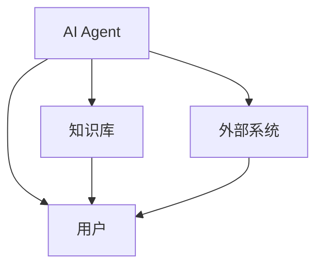
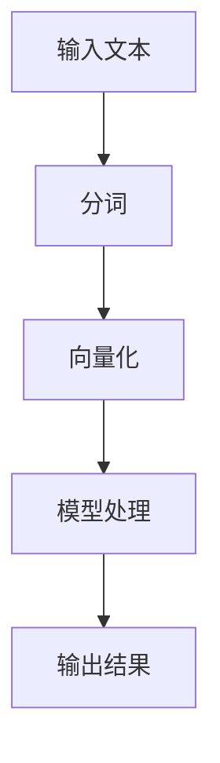
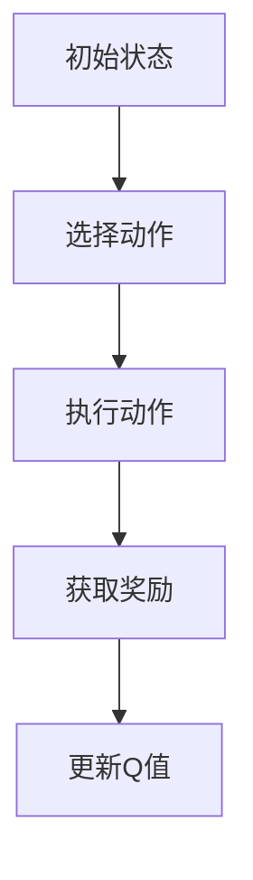

                 


# AI Agent在智能客服中的应用

## 关键词：AI Agent, 智能客服, 自然语言处理, 强化学习, 机器学习, 客服系统

## 摘要：  
本文详细探讨了AI Agent在智能客服中的应用，从背景介绍、核心概念到算法原理、系统架构，再到项目实战和最佳实践，全面解析了AI Agent如何提升智能客服的效率和用户体验。通过自然语言处理和强化学习等技术，AI Agent能够实现智能化的客服交互，为企业提供高效、个性化的客户服务解决方案。

---

## 第一部分: AI Agent 在智能客服中的应用背景

## 第1章: AI Agent 的基本概念与背景

### 1.1 AI Agent 的定义与特点
#### 1.1.1 AI Agent 的定义
AI Agent（人工智能代理）是一种能够感知环境、自主决策并执行任务的智能实体。它通过接收输入、分析信息、做出决策并输出结果来完成特定任务。AI Agent 在智能客服中的应用，使其能够以自然语言与用户交互，解决用户的问题并提供服务。

#### 1.1.2 AI Agent 的核心特点
- **自主性**：AI Agent 能够自主完成任务，无需人工干预。
- **反应性**：能够实时感知环境并做出响应。
- **学习能力**：通过机器学习不断优化自身的性能。
- **可扩展性**：能够适应不同场景和用户需求的变化。

#### 1.1.3 AI Agent 与传统客服的区别
| 特性                | AI Agent                      | 传统客服                     |
|---------------------|-------------------------------|------------------------------|
| 交互方式            | 自然语言交互                 | 人工坐席执行                 |
| 响应速度            | 实时响应                     | 受限于人工处理速度           |
| 可扩展性            | 支持大规模并发               | 有限的并发能力               |
| 智能水平            | 高度智能化                   | 依赖人工判断                 |

### 1.2 智能客服的发展历程
#### 1.2.1 传统客服模式的局限性
传统客服模式主要依赖人工坐席执行，存在响应速度慢、服务一致性差、成本高等问题，难以满足大规模用户的个性化需求。

#### 1.2.2 智能客服的兴起背景
随着人工智能技术的快速发展，智能客服逐渐取代传统模式，通过自然语言处理（NLP）和机器学习等技术，实现高效、智能的客户服务。

#### 1.2.3 AI Agent 在智能客服中的应用前景
AI Agent 的引入，使得智能客服能够实现24/7全天候服务，支持多语言、多渠道的用户交互，极大地提升了用户体验和服务效率。

### 1.3 本章小结
本章主要介绍了AI Agent的基本概念、特点以及与传统客服的区别，阐述了智能客服的发展历程和AI Agent的应用前景。

---

## 第二部分: AI Agent 的核心概念与原理

## 第2章: AI Agent 的核心概念

### 2.1 AI Agent 的核心要素
#### 2.1.1 感知模块
感知模块负责接收用户的输入并将其转化为可处理的格式，例如通过自然语言处理技术将用户的文本或语音转化为结构化的数据。

#### 2.1.2 决策模块
决策模块基于感知到的信息，结合知识库和上下文，生成响应内容或执行任务。

#### 2.1.3 执行模块
执行模块负责将决策模块生成的响应发送给用户，或调用外部系统完成任务。

### 2.2 AI Agent 的工作原理
#### 2.2.1 感知层的实现
感知层主要依赖自然语言处理技术，包括分词、词向量化和意图识别等步骤。

#### 2.2.2 决策层的实现
决策层基于感知到的信息，通过规则引擎或机器学习模型生成响应。

#### 2.2.3 执行层的实现
执行层负责将决策层生成的响应发送给用户，或调用外部系统完成任务。

### 2.3 AI Agent 的实体关系图


### 2.4 本章小结
本章详细讲解了AI Agent的核心概念和工作原理，通过实体关系图展示了系统的组成和交互关系。

---

## 第三部分: AI Agent 的算法原理与数学模型

## 第3章: 自然语言处理算法

### 3.1 自然语言处理的核心算法
#### 3.1.1 词袋模型
词袋模型是一种简单有效的文本表示方法，将文本表示为词的集合，不考虑词序。

#### 3.1.2 词嵌入模型
词嵌入模型（如Word2Vec）通过上下文关系生成词向量，能够捕捉词语的语义信息。

#### 3.1.3 注意力机制
注意力机制（如在Transformer模型中）通过加权不同的词向量，生成更精细的文本表示。

### 3.2 自然语言处理的数学模型
#### 3.2.1 余弦相似度的计算
$$\text{余弦相似度} = \frac{\vec{a} \cdot \vec{b}}{|\vec{a}| |\vec{b}|}$$

#### 3.2.2 梯度下降的优化算法
$$\text{梯度下降} = -\eta \cdot \nabla J$$

### 3.3 自然语言处理的实现流程


### 3.4 本章小结
本章详细讲解了自然语言处理的核心算法及其数学模型，通过流程图展示了实现流程。

---

## 第四章: 强化学习算法

### 4.1 强化学习的核心概念
#### 4.1.1 状态空间
状态空间是指智能体所处环境的所有可能状态。

#### 4.1.2 动作空间
动作空间是指智能体在状态空间中可以执行的所有动作。

#### 4.1.3 奖励函数
奖励函数用于衡量智能体动作的好坏，引导智能体学习最优策略。

### 4.2 强化学习的数学模型
#### 4.2.1 Q-learning 算法
$$Q(s, a) = Q(s, a) + \alpha \cdot (r + \gamma \cdot \max Q(s', a') - Q(s, a))$$

### 4.3 强化学习的实现流程


### 4.4 本章小结
本章详细讲解了强化学习的核心概念和数学模型，通过流程图展示了实现流程。

---

## 第五部分: 项目实战

## 第5章: 项目实战

### 5.1 环境安装
- 安装Python和相关库（如TensorFlow、Keras、NLTK）。

### 5.2 核心代码实现
```python
import numpy as np
from sklearn.feature_extraction.text import TfidfVectorizer
from tensorflow.keras.models import Sequential
from tensorflow.keras.layers import Dense

# 数据预处理
texts = ["...", "..."]  # 用户输入
labels = [0, 1]        # 标签

# 词向量化
vectorizer = TfidfVectorizer()
X = vectorizer.fit_transform(texts).toarray()

# 构建模型
model = Sequential()
model.add(Dense(64, activation='relu', input_dim=X.shape[1]))
model.add(Dense(1, activation='sigmoid'))
model.compile(optimizer='adam', loss='binary_crossentropy', metrics=['accuracy'])

# 训练模型
model.fit(X, labels, epochs=10, batch_size=32)
```

### 5.3 代码解读与分析
- 词向量化：使用TF-IDF方法将文本转换为向量。
- 模型构建：使用Dense层构建神经网络模型。
- 模型训练：使用Adam优化器和二进制交叉熵损失函数进行训练。

### 5.4 实际案例分析
通过实际案例分析，展示AI Agent在智能客服中的具体应用，例如解决用户的常见问题。

### 5.5 本章小结
本章通过实际项目展示了AI Agent在智能客服中的实现过程，从数据预处理到模型训练，再到实际应用，帮助读者掌握AI Agent的核心技术。

---

## 第六部分: 最佳实践

## 第6章: 最佳实践

### 6.1 小结
本文详细探讨了AI Agent在智能客服中的应用，从背景介绍、核心概念到算法原理、系统架构，再到项目实战和最佳实践，全面解析了AI Agent如何提升智能客服的效率和用户体验。

### 6.2 注意事项
- 数据质量：确保训练数据的多样性和代表性。
- 模型优化：通过不断优化算法和模型参数，提升AI Agent的性能。
- 伦理问题：注意数据隐私和用户隐私保护。

### 6.3 拓展阅读
- 推荐阅读《深度学习》（Deep Learning）- Ian Goodfellow等。
- 推荐学习强化学习和自然语言处理的最新研究成果。

---

## 作者：AI天才研究院/AI Genius Institute & 禅与计算机程序设计艺术 /Zen And The Art of Computer Programming

---

以上是《AI Agent在智能客服中的应用》的完整目录和内容概述，确保文章结构清晰，内容详实，技术语言专业且易于理解。

