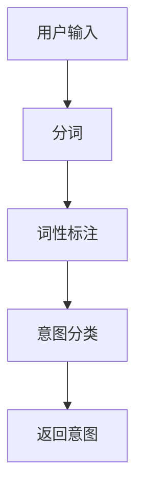
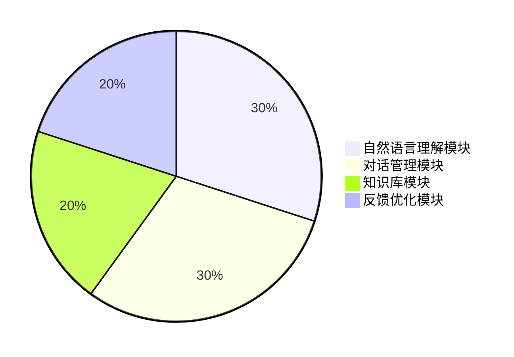
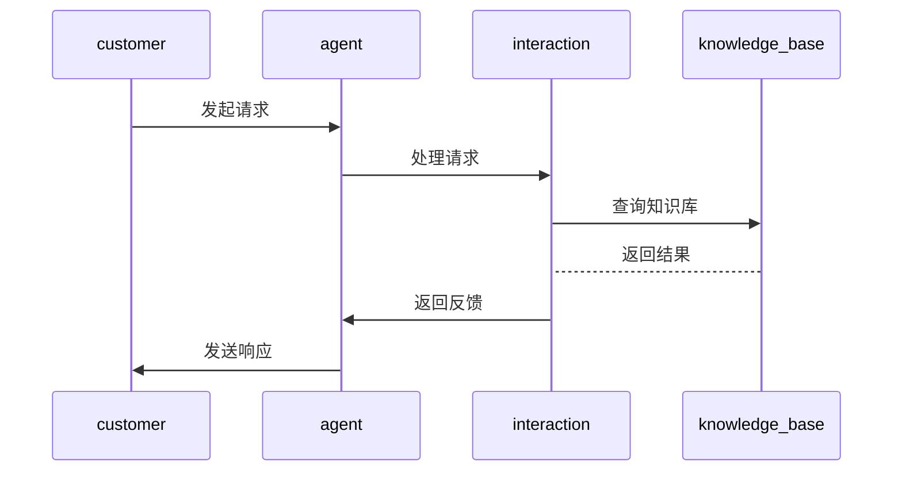

                 


# AI Agent在智能客服中的应用实践

---

## 关键词：
AI Agent, 智能客服, 自然语言处理, 机器学习, 对话系统, 人工智能

---

## 摘要：
本文详细探讨了AI Agent在智能客服中的应用实践。通过分析AI Agent的核心概念、算法原理、系统架构和实际案例，展示了AI Agent如何提升智能客服的效率和服务质量。文章从理论到实践，系统性地讲解了AI Agent在智能客服中的技术实现和应用价值，并展望了未来的发展方向。

---

# 第一部分: AI Agent的核心概念与技术基础

## 第1章: AI Agent的核心概念

### 1.1 AI Agent的定义与特点
AI Agent（人工智能代理）是一种能够感知环境、自主决策并执行任务的智能实体。其核心特点包括：
- **自主性**：能够在没有外部干预的情况下独立运行。
- **反应性**：能够实时感知环境并做出响应。
- **目标导向性**：以特定目标为导向，优化决策和行动。

**AI Agent与传统客服的区别对比表：**

| 特性                | AI Agent                | 传统客服                |
|---------------------|-------------------------|--------------------------|
| 响应速度            | 实时响应                | 需要人工处理            |
| 服务范围            | 支持多种场景            | 通常局限于特定问题      |
| 工作时间            | 24/7无休               | 有固定工作时间          |
| 效率                | 高效处理大量请求        | 效率受限于人工处理能力  |

**ER实体关系图：**

```mermaid
erDiagram
    customer: 客户
    agent: AI Agent
    interaction: 交互记录
    customer --> interaction: 发起请求
    agent --> interaction: 处理请求
    customer --> agent: 接收反馈
```

---

## 第2章: AI Agent的技术基础

### 2.1 自然语言处理（NLP）基础
NLP是AI Agent实现智能对话的核心技术。以下是NLP的关键技术：

- **分词（Tokenization）**：将文本分割成有意义的词汇或短语。
- **词性标注（POS Tagging）**：识别每个词汇的词性（如名词、动词）。
- **句法分析（Parsing）**：分析句子的语法结构。
- **实体识别（NER）**：识别文本中的命名实体（如人名、地名）。

**常见NLP模型：**
- **BERT**：用于文本理解和生成。
- **GPT**：用于生成式对话。

### 2.2 机器学习与深度学习
机器学习是AI Agent实现智能决策的基础。以下是常用算法：

- **监督学习**：通过标记数据训练模型。
- **无监督学习**：从无标记数据中发现模式。
- **强化学习**：通过奖励机制优化决策。

**数学模型：**
- **线性回归**：$y = \beta_0 + \beta_1x + \epsilon$
- **神经网络**：$a = \sigma(wx + b)$，其中$\sigma$为激活函数。

---

# 第三部分: AI Agent在智能客服中的应用

## 第3章: AI Agent在智能客服中的算法实现

### 3.1 意图识别算法
意图识别是AI Agent理解用户需求的关键步骤。常用算法包括：

- **基于规则的意图识别**：通过预定义规则匹配用户输入。
- **基于机器学习的意图识别**：使用分类算法（如SVM、随机森林）进行意图分类。

**意图识别流程图：**



### 3.2 对话状态管理
对话状态管理是AI Agent实现连续对话的核心技术。常用算法包括：

- **马尔可夫链模型**：描述对话状态的转移概率。
- **记忆网络**：记录对话历史信息。

**数学模型：**
- **马尔可夫链**：$P(s_t|s_{t-1})$，表示当前状态$s_t$的概率依赖于前一状态$s_{t-1}$。

---

## 第4章: AI Agent的系统架构设计

### 4.1 系统功能模块
AI Agent在智能客服中的系统架构通常包括以下几个模块：

- **自然语言理解模块**：负责解析用户输入。
- **对话管理模块**：负责维护对话状态。
- **知识库模块**：存储业务知识和上下文信息。
- **反馈优化模块**：根据用户反馈优化响应。

**系统架构图：**



### 4.2 系统接口设计
AI Agent与智能客服系统的交互通常通过以下接口实现：

- **API接口**：提供标准的接口供其他系统调用。
- **消息队列**：处理异步请求。

**系统交互流程图：**



---

## 第5章: AI Agent在智能客服中的项目实战

### 5.1 环境配置与代码实现
以下是AI Agent在智能客服中的实现代码示例：

```python
# 环境安装
pip install transformers
pip install numpy
pip install scikit-learn

# 意图识别代码
from transformers import pipeline

classifier = pipeline("text-classification", model="bert-base-uncased")

def get_intention(text):
    return classifier(text)[0]['label']

# 对话管理代码
class DialogManager:
    def __init__(self):
        self.state = {}

    def update_state(self, key, value):
        self.state[key] = value

    def get_state(self, key):
        return self.state.get(key, None)
```

### 5.2 实际案例分析
以下是一个实际案例：

**场景描述：**
用户通过智能客服查询订单状态。

**代码实现：**
```python
# 用户输入
user_input = "请告诉我我的订单状态。"

# 分词与词性标注
tokens = tokenizer(user_input)

# 意图识别
intention = get_intention(user_input)

# 对话管理
dialog_manager = DialogManager()
dialog_manager.update_state("intent", intention)
```

**案例分析：**
通过上述代码，AI Agent能够准确识别用户的意图，并根据意图调用相应的功能模块（如查询订单状态）。

---

## 第6章: 总结与展望

### 6.1 总结
本文详细探讨了AI Agent在智能客服中的应用实践，从核心概念、技术基础到系统架构和项目实战，全面分析了AI Agent的优势和实现方法。

### 6.2 未来展望
随着NLP和机器学习技术的不断发展，AI Agent在智能客服中的应用将更加广泛。未来的研究方向包括：
- 更高效的意图识别算法。
- 更智能的对话管理技术。
- 更强大的知识库管理能力。

---

## 作者：AI天才研究院 & 禅与计算机程序设计艺术

