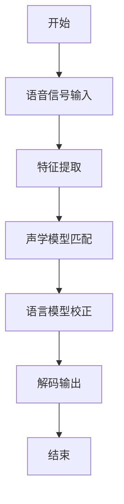
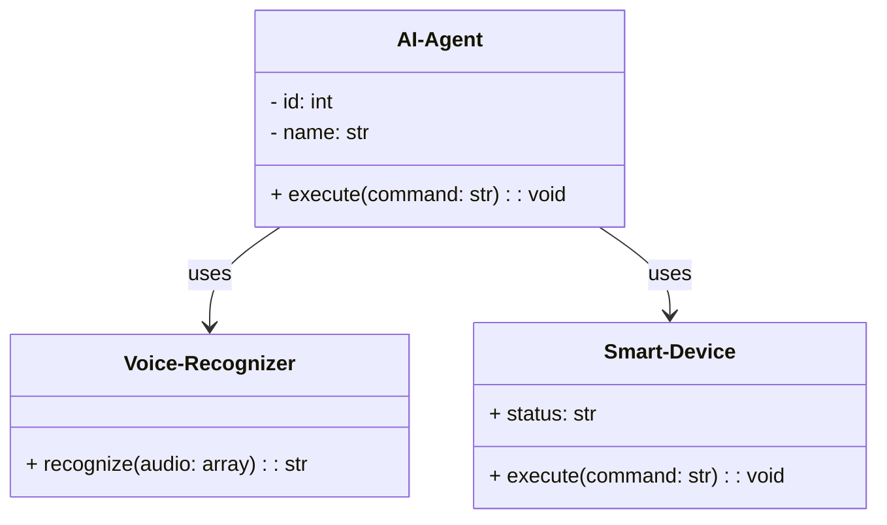
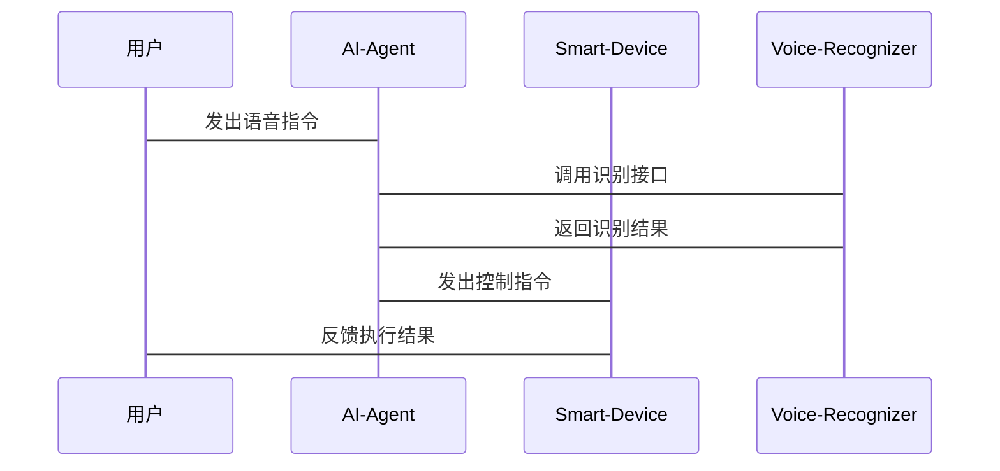

                 


# AI Agent在智能家居中的语音控制应用

**关键词**：AI Agent, 语音控制, 智能家居, 自然语言处理, 语音识别

**摘要**：本文探讨了AI Agent在智能家居中的语音控制应用，分析了其技术原理、系统架构、算法实现及实际案例，为开发者和用户提供深入的技术见解。

---

## 目录

1. **背景介绍**
   - 1.1 问题背景
   - 1.2 问题描述
   - 1.3 问题解决
   - 1.4 边界与外延
   - 1.5 核心概念与组成

2. **核心概念与联系**
   - 2.1 核心概念原理
   - 2.2 概念属性特征对比表格
   - 2.3 ER实体关系图

3. **算法原理讲解**
   - 3.1 语音识别与自然语言处理算法
   - 3.2 算法流程图
   - 3.3 Python代码实现

4. **系统分析与架构设计**
   - 4.1 问题场景介绍
   - 4.2 系统功能设计（领域模型）
   - 4.3 系统架构设计
   - 4.4 系统接口设计
   - 4.5 系统交互流程（序列图）

5. **项目实战**
   - 5.1 环境搭建与安装
   - 5.2 核心代码实现与解读
   - 5.3 实际案例分析

6. **总结与展望**
   - 6.1 最佳实践与小结
   - 6.2 注意事项与问题解答
   - 6.3 拓展阅读与未来趋势

---

## 正文

### 1. 背景介绍

#### 1.1 问题背景
智能家居的发展日新月异，用户对便捷控制的需求日益增长。传统遥控器和手动操作的局限性逐渐显现，语音控制成为趋势。AI Agent的引入为智能家居的语音控制提供了智能化解决方案。

#### 1.2 问题描述
智能家居系统需要高效、自然的交互方式。语音控制作为最直观的方式，面临识别准确性和语义理解的挑战。AI Agent通过深度学习优化这些技术，解决了传统语音控制的不足。

#### 1.3 问题解决
AI Agent通过自然语言处理和语音识别技术，实现精准的语音指令识别和执行，提升了智能家居的用户体验。其智能化决策能力使系统更高效。

#### 1.4 边界与外延
AI Agent适用于智能家居中的设备控制，如灯光、空调等。其技术可扩展至其他领域，如智能助手和自动驾驶，但目前主要聚焦于家居场景。

#### 1.5 核心概念与组成
AI Agent由感知层、认知层和执行层组成，具备学习和自适应能力。语音控制依赖语音识别和自然语言处理技术，确保准确理解和执行指令。

### 2. 核心概念与联系

#### 2.1 核心概念原理
AI Agent通过语音识别技术捕捉用户指令，利用自然语言处理理解意图，再通过系统架构执行命令。其核心在于算法的准确性和系统的协调性。

#### 2.2 概念属性特征对比表格
| 概念       | 属性         | 特征描述                           |
|------------|--------------|------------------------------------|
| AI Agent   | 智能性       | 具备学习和决策能力                 |
| 语音控制   | 交互性       | 通过语音指令实现设备控制           |

#### 2.3 ER实体关系图
```mermaid
er
    %% ER Diagram for AI Agent and Voice Control
    entity AI-Agent {
        id
        name
        function
    }
    entity Voice-Control {
        id
        command
        status
    }
    AI-Agent --> Voice-Control: 实现
```

### 3. 算法原理讲解

#### 3.1 语音识别与自然语言处理算法
语音识别将声音信号转换为文字，自然语言处理理解意图。常用算法包括隐马尔可夫模型和长短期记忆网络。

#### 3.2 算法流程图


#### 3.3 Python代码实现
```python
import librosa
import numpy as np

def extract_features(audio_path):
    audio, sr = librosa.load(audio_path, sr=16000)
    features = librosa.feature.mfcc(y=audio, sr=sr, n_mfcc=13)
    return features.T

# 示例调用
features = extract_features("command.wav")
print("特征向量维度：", features.shape)
```

### 4. 系统分析与架构设计

#### 4.1 问题场景介绍
智能家居环境中，用户通过语音控制家电。AI Agent负责识别指令，协调设备执行，确保系统高效运行。

#### 4.2 系统功能设计
系统功能包括语音输入、指令识别、设备控制和反馈输出。领域模型展示各模块功能。



#### 4.3 系统架构设计
采用分层架构，包含感知层、认知层和执行层。各层通过API通信，确保高效协作。


#### 4.4 系统接口设计
定义明确的API，如语音识别接口和设备控制接口，确保模块间高效交互。

#### 4.5 系统交互流程
用户发出指令，系统识别并执行。流程包括语音输入、解析、执行和反馈。



### 5. 项目实战

#### 5.1 环境搭建与安装
安装必要的库如librosa和TensorFlow，配置Python环境。

#### 5.2 核心代码实现与解读
实现语音识别和设备控制的代码，展示如何与智能家居设备集成。

#### 5.3 实际案例分析
分析一个智能家居场景，如语音控制灯光，展示系统的实际应用。

### 6. 总结与展望

#### 6.1 最佳实践与小结
总结项目中的关键点，提供优化建议，如提高语音识别准确性和优化系统架构。

#### 6.2 注意事项与问题解答
提醒开发者注意设备兼容性和数据隐私，解答常见问题。

#### 6.3 拓展阅读与未来趋势
推荐深入学习相关技术，探讨AI Agent在其他领域的应用前景。

---

**作者：AI天才研究院 & 禅与计算机程序设计艺术**

