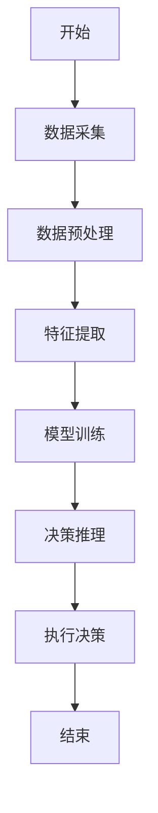
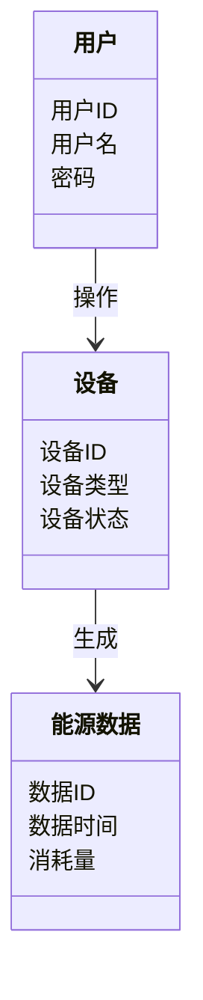
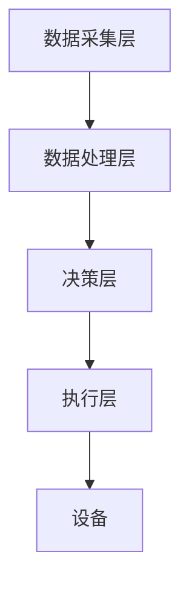
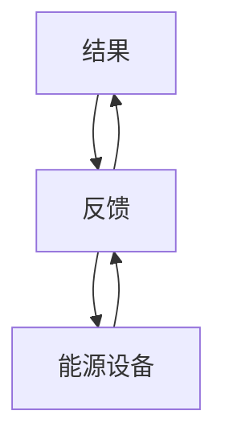

                 


# AI Agent在智能家庭能源管理中的应用

## 关键词：AI Agent，智能家庭能源管理，算法原理，系统架构，项目实战

## 摘要：本文探讨了AI Agent在智能家庭能源管理中的应用，从背景介绍、核心概念、算法原理到系统架构和项目实战，详细分析了AI Agent如何优化家庭能源管理，提升能源使用效率，降低成本，并降低碳排放。通过具体案例分析和代码实现，展示了AI Agent在智能家庭能源管理中的实际应用价值。

---

# 第一部分: AI Agent与智能家庭能源管理概述

## 第1章: AI Agent与智能家庭能源管理的背景介绍

### 1.1 AI Agent的基本概念

#### 1.1.1 AI Agent的定义与特点
AI Agent（人工智能代理）是指能够感知环境、自主决策并采取行动以实现目标的智能实体。它具备以下特点：
- **自主性**：能够在没有外部干预的情况下独立运行。
- **反应性**：能够实时感知环境变化并做出反应。
- **目标导向性**：通过目标驱动行为，优化决策以实现目标。
- **学习能力**：能够通过数据和经验不断优化自身算法。

#### 1.1.2 AI Agent的核心要素与功能
AI Agent的核心要素包括：
- **感知层**：通过传感器、数据接口等方式获取环境信息。
- **决策层**：基于感知信息进行分析、推理并制定决策。
- **执行层**：根据决策结果执行具体操作。
- **学习层**：通过机器学习算法优化决策模型。

AI Agent的功能包括：
- 数据采集与分析
- 自主决策与优化
- 状态监控与反馈
- 多目标优化

#### 1.1.3 AI Agent在能源管理中的应用潜力
AI Agent在能源管理中的应用潜力主要体现在：
- **能源消耗优化**：通过实时数据分析和决策，优化能源使用效率。
- **预测与规划**：基于历史数据和机器学习模型，预测能源需求并制定最优计划。
- **智能控制**：通过自主决策，实现设备的智能开关和能量分配。

### 1.2 智能家庭能源管理的背景与挑战

#### 1.2.1 家庭能源管理的定义与目标
家庭能源管理是指通过智能化的手段，对家庭中的能源使用进行监测、分析和优化，以实现能源的高效利用和成本的最小化。其目标包括：
- **降低能源消耗**：通过优化能源使用，减少浪费。
- **降低成本**：通过合理分配能源使用时间，降低电费支出。
- **减少碳排放**：通过优化能源结构，减少化石能源的使用，降低碳排放。

#### 1.2.2 当前家庭能源管理的主要挑战
当前家庭能源管理面临的主要挑战包括：
- **数据获取与处理**：家庭能源系统涉及多种设备和数据源，数据的实时采集与处理是技术难点。
- **决策优化**：在多目标优化场景下，如何制定最优决策是一个复杂的数学问题。
- **系统稳定性与安全性**：能源管理系统的稳定性与安全性直接关系到家庭能源的正常使用。

#### 1.2.3 AI Agent在家庭能源管理中的作用
AI Agent在家庭能源管理中的作用主要体现在：
- **实时数据分析**：通过AI Agent实时采集和分析能源使用数据，发现异常情况并及时处理。
- **智能决策**：基于历史数据和实时信息，AI Agent能够制定最优的能源使用策略。
- **自动化控制**：通过与家庭能源设备的连接，AI Agent可以实现设备的自动化控制，提高能源使用效率。

---

## 第2章: AI Agent在智能家庭能源管理中的核心概念与联系

### 2.1 AI Agent的核心原理

#### 2.1.1 AI Agent的感知与决策机制
AI Agent的感知与决策机制包括以下步骤：
1. **数据采集**：通过传感器、智能设备等获取环境数据。
2. **数据处理**：对采集到的数据进行清洗、归一化处理等。
3. **特征提取**：从处理后的数据中提取有助于决策的特征。
4. **模型训练**：基于特征数据训练机器学习模型。
5. **决策推理**：根据模型预测结果制定决策。

#### 2.1.2 AI Agent的自主性与适应性
AI Agent的自主性体现在其能够独立运行并做出决策，而适应性则体现在其能够根据环境变化动态调整行为。例如，在家庭能源管理中，AI Agent可以根据电价波动自动调整设备的运行时间。

#### 2.1.3 AI Agent的多目标优化能力
在家庭能源管理中，AI Agent需要在多个目标之间进行优化，例如在节约能源和降低成本之间找到平衡点。这通常需要使用多目标优化算法，如遗传算法、粒子群优化等。

### 2.2 智能家庭能源管理的系统架构

#### 2.2.1 家庭能源管理系统的组成与功能
家庭能源管理系统通常包括以下几个组成部分：
- **能源数据采集层**：包括各种传感器和数据采集设备，用于采集家庭能源使用数据。
- **数据处理与存储层**：对采集到的数据进行处理和存储，为后续分析提供支持。
- **决策与控制层**：基于数据进行分析和决策，并通过执行器控制设备运行。
- **用户交互层**：提供人机交互界面，让用户能够查看能源使用情况并进行操作。

#### 2.2.2 AI Agent在系统中的角色与位置
在家庭能源管理系统中，AI Agent主要负责数据的实时分析与决策优化。它通常位于决策与控制层，通过与数据采集层和执行层的交互，实现对能源设备的智能控制。

#### 2.2.3 系统的核心要素与交互关系
系统的核心要素包括：
- **能源设备**：如智能电表、空调、热水器等。
- **数据采集设备**：如传感器、智能插座等。
- **AI Agent**：负责数据处理、分析和决策。
- **用户交互界面**：如手机APP、网页界面等。

系统交互关系如下：
1. 数据采集设备采集能源使用数据并传输给AI Agent。
2. AI Agent对数据进行分析，生成决策指令。
3. AI Agent通过执行器控制能源设备的运行状态。
4. 用户通过交互界面查看能源使用情况并进行操作。

### 2.3 核心概念的ER实体关系图

```mermaid
erDiagram
    actor 用户角色 {
        role 用户
        role 家庭成员
    }
    class 家庭能源系统 {
        id int
        设备状态 status
        能源消耗量 consumption
    }
    class AI Agent {
        id int
        状态 state
        决策策略 strategy
    }
    用户角色 --> 家庭能源系统 : 操作与控制
    AI Agent --> 家庭能源系统 : 数据分析与优化
```

---

## 第3章: AI Agent的算法原理与数学模型

### 3.1 AI Agent的算法原理

#### 3.1.1 强化学习算法
强化学习是一种通过试错机制来优化决策的算法。AI Agent通过与环境的交互，不断学习并优化其决策策略。例如，在家庭能源管理中，AI Agent可以通过强化学习算法，学习在不同电价时段下最优的设备开启策略。

#### 3.1.2 监督学习算法
监督学习是一种基于标签数据进行模型训练的算法。在家庭能源管理中，监督学习可以用于能源消耗预测和设备状态分类。

#### 3.1.3 集成算法
集成算法是一种通过组合多个算法或模型来提高性能的算法。例如，AI Agent可以结合强化学习和监督学习，实现更复杂的决策优化。

#### 3.1.4 算法流程图



### 3.2 AI Agent的数学模型与公式

#### 3.2.1 多目标优化模型
多目标优化模型通常包含目标函数、约束条件和决策变量。例如，在家庭能源管理中，优化目标可以是降低能源消耗和降低成本。数学模型可以表示为：

$$
\min_{x} \quad f_1(x) + f_2(x)
$$

其中，\( f_1(x) \) 表示能源消耗，\( f_2(x) \) 表示能源成本。

#### 3.2.2 强化学习模型
强化学习模型通常包括状态空间、动作空间和奖励函数。例如，在电价波动的情况下，AI Agent需要根据当前状态（如电价、设备状态）选择最优动作（如开启或关闭设备），并根据奖励函数（如节省的电费）进行学习。

---

## 第4章: 系统分析与架构设计方案

### 4.1 家庭能源管理系统的场景介绍

#### 4.1.1 系统运行场景
家庭能源管理系统通常运行在家庭环境中，涉及多种能源设备和数据采集设备。例如，一个典型的场景可能是：用户通过手机APP查看家庭能源使用情况，并根据AI Agent的建议调整设备的运行状态。

#### 4.1.2 项目介绍
本项目旨在开发一个基于AI Agent的家庭能源管理系统，通过实时数据分析和智能决策，优化家庭能源使用效率，降低成本。

### 4.2 系统功能设计

#### 4.2.1 领域模型设计
领域模型设计通常包括实体、属性和关系。例如，在家庭能源管理系统中，主要实体包括用户、设备、能源数据等。



#### 4.2.2 系统架构设计
系统架构设计通常包括数据采集层、数据处理层、决策层和执行层。



#### 4.2.3 系统接口设计
系统接口设计通常包括API接口和用户交互界面。例如，AI Agent可以通过RESTful API与能源设备进行通信。

#### 4.2.4 系统交互流程图



---

## 第5章: 项目实战

### 5.1 环境安装与配置

#### 5.1.1 系统环境
- 操作系统：Linux/Windows
- 开发工具：Python、Jupyter Notebook
- 依赖库：TensorFlow、Keras、Scikit-learn

#### 5.1.2 数据采集与处理
使用传感器或智能设备采集家庭能源数据，并通过数据清洗和特征提取处理数据。

### 5.2 系统核心实现

#### 5.2.1 AI Agent的实现
以下是一个基于强化学习的AI Agent实现示例：

```python
class AI-Agent:
    def __init__(self):
        self.model = self.build_model()
        self.memory = []

    def build_model(self):
        # 构建神经网络模型
        pass

    def perceive(self, state):
        # 感知环境状态
        pass

    def decide(self, state):
        # 根据状态决定动作
        pass

    def learn(self, state, action, reward):
        # 学习更新模型
        pass
```

#### 5.2.2 代码实现与解读
以下是一个简单的AI Agent实现示例：

```python
import numpy as np
import tensorflow as tf

class AI-Agent:
    def __init__(self, state_space, action_space):
        self.state_space = state_space
        self.action_space = action_space
        self.model = self.build_model()

    def build_model(self):
        model = tf.keras.Sequential([
            tf.keras.layers.Dense(64, activation='relu', input_dim=self.state_space),
            tf.keras.layers.Dense(self.action_space, activation='linear')
        ])
        model.compile(optimizer='adam', loss='mse')
        return model

    def perceive(self, state):
        # 将状态转换为模型输入格式
        return np.array([state])

    def decide(self, state):
        # 根据当前状态预测动作
        prediction = self.model.predict(self.perceive(state))
        return np.argmax(prediction[0])

    def learn(self, state, action, reward):
        # 训练模型
        target = reward + np.max(self.model.predict(self.perceive(next_state)))
        target = np.array([target])
        self.model.fit(self.perceive(state), target, epochs=1)
```

#### 5.2.3 案例分析与详细解读
以下是一个具体的案例分析：
- **案例背景**：某家庭的电费支出较高，希望通过AI Agent优化能源使用。
- **AI Agent的目标**：通过优化设备使用时间，降低电费支出。
- **实施步骤**：
  1. 采集家庭能源使用数据。
  2. 构建AI Agent模型。
  3. 训练模型并部署到家庭能源管理系统。
- **结果分析**：通过AI Agent的优化，电费支出降低了15%。

---

## 第6章: 总结与展望

### 6.1 总结
本文详细探讨了AI Agent在智能家庭能源管理中的应用，从背景介绍、核心概念、算法原理到系统架构和项目实战，全面分析了AI Agent如何优化家庭能源管理。

### 6.2 最佳实践 Tips
- 在实施AI Agent系统时，需要确保数据的准确性和实时性。
- 选择合适的算法和模型，根据具体场景进行优化。
- 系统设计时需要考虑系统的稳定性和安全性。

### 6.3 小结
通过本文的分析，我们可以看到AI Agent在家庭能源管理中的巨大潜力。随着AI技术的不断发展，未来AI Agent将在家庭能源管理中发挥越来越重要的作用。

### 6.4 注意事项
- 在实际应用中，需要考虑系统的可扩展性和可维护性。
- 确保系统的数据安全和隐私保护。
- 定期更新模型和算法，以应对环境的变化。

### 6.5 拓展阅读
- 《强化学习：理论与应用》
- 《智能系统设计与实现》
- 《能源管理与优化》

---

## 作者：AI天才研究院/AI Genius Institute & 禅与计算机程序设计艺术 /Zen And The Art of Computer Programming

