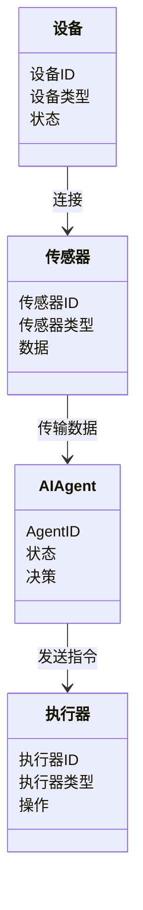
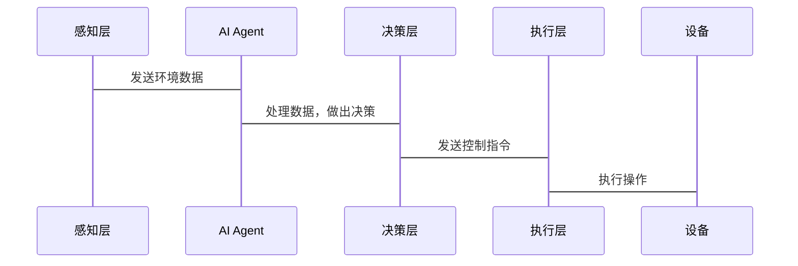

                 


# AI Agent在智能工厂管理中的全面应用策略

> 关键词：AI Agent，智能工厂，工业自动化，智能制造，智能决策系统

> 摘要：本文探讨了AI Agent在智能工厂管理中的应用策略，从核心概念、算法原理到系统架构，再到项目实战，全面分析了AI Agent在智能制造中的重要性及其具体应用场景。通过详细的技术分析和实际案例，本文为读者提供了全面的解决方案和实施策略。

---

# 第一部分: AI Agent 在智能工厂管理中的概述

## 第1章: AI Agent 的基本概念与智能工厂概述

### 1.1 AI Agent 的基本概念

#### 1.1.1 AI Agent 的定义与特点
AI Agent（人工智能代理）是指能够感知环境、自主决策并执行任务的智能实体。其核心特点包括：
- **自主性**：能够在没有外部干预的情况下独立运行。
- **反应性**：能够实时感知环境变化并做出响应。
- **学习能力**：通过数据和经验不断优化自身行为。
- **协作性**：能够与其他系统或AI Agent协同工作，共同完成复杂任务。

#### 1.1.2 AI Agent 的核心属性与功能
- **感知能力**：通过传感器、摄像头等设备获取环境信息。
- **决策能力**：基于感知信息，运用算法做出最优决策。
- **执行能力**：通过执行机构将决策转化为实际操作。
- **学习能力**：通过机器学习算法不断优化自身的决策模型。

#### 1.1.3 AI Agent 与传统自动化的区别
| 特性          | AI Agent                 | 传统自动化           |
|---------------|--------------------------|----------------------|
| 决策能力      | 强大的自适应决策能力     | 预设的固定逻辑        |
| 学习能力      | 具备学习能力             | 无法学习             |
| 灵活性         | 高度灵活，适应变化       | 较低灵活性，适应性差  |
| 协作能力      | 支持多 Agent 协作        | 单一任务执行         |

### 1.2 智能工厂的定义与特点

#### 1.2.1 智能工厂的定义
智能工厂是指利用物联网、大数据、人工智能等技术，实现生产过程的智能化、数字化和自动化的现代化工厂。它通过整合各种资源，实现从设计、生产到交付的全生命周期智能化管理。

#### 1.2.2 智能工厂的核心特征
- **智能化生产**：通过AI技术实现生产过程的智能监控和优化。
- **数据驱动**：利用大数据分析，提供实时数据支持决策。
- **灵活性**：能够快速适应市场变化，灵活调整生产计划。
- **高效性**：通过自动化和智能化提升生产效率，降低成本。

#### 1.2.3 智能工厂与传统工厂的对比
| 特性          | 智能工厂                 | 传统工厂           |
|---------------|--------------------------|----------------------|
| 生产效率       | 高效，自动化程度高       | 较低，依赖人工操作   |
| 数据利用       | 高度依赖数据驱动         | 数据利用较少       |
| 灵活性         | 高度灵活，快速响应市场变化 | 较低灵活性，适应性差 |
| 技术基础       | 物联网、人工智能、大数据  | 机械化、自动化技术  |

### 1.3 AI Agent 在智能工厂中的作用

#### 1.3.1 AI Agent 在智能工厂管理中的应用场景
- **实时监控与异常检测**：AI Agent能够实时监控生产线的状态，及时发现并处理异常情况。
- **优化生产计划**：通过分析生产数据，AI Agent能够优化生产计划，提高资源利用率。
- **智能调度与物流管理**：AI Agent可以协调生产设备和物流系统，实现高效的物料调度。
- **质量控制**：通过图像识别和数据分析，AI Agent能够实时检测产品质量，确保生产符合标准。

#### 1.3.2 AI Agent 对智能工厂效率提升的作用
- **提高生产效率**：通过优化生产计划和资源调度，AI Agent能够显著提高生产效率。
- **降低成本**：通过实时监控和异常处理，AI Agent能够减少生产过程中的浪费，降低成本。
- **提升产品质量**：通过智能质量控制，AI Agent能够提高产品质量，降低缺陷率。

#### 1.3.3 AI Agent 在智能工厂中的战略意义
- **推动智能化转型**：AI Agent是实现智能工厂的核心技术，能够推动制造业向智能化方向转型。
- **提高竞争力**：通过提高生产效率和产品质量，AI Agent能够帮助企业提高市场竞争力。
- **实现可持续发展**：通过优化资源利用和减少浪费，AI Agent能够帮助企业实现可持续发展目标。

## 1.4 本章小结
本章从AI Agent的基本概念和智能工厂的定义入手，详细阐述了AI Agent的核心属性和功能，对比了传统自动化与AI Agent的区别，探讨了AI Agent在智能工厂中的应用场景及其对智能工厂效率提升的重要作用，最后总结了AI Agent在智能工厂中的战略意义。

---

## 第2章: AI Agent 在智能工厂管理中的应用背景

### 2.1 智能工厂管理中的问题与挑战

#### 2.1.1 智能工厂管理中的主要问题
- **生产效率低下**：传统生产方式效率较低，资源浪费严重。
- **生产过程不可控**：缺乏实时监控和智能决策能力，导致生产过程难以全面掌控。
- **质量问题难以保证**：传统质量控制手段难以满足高精度、高效率的要求。
- **数据孤岛问题**：各部门之间的数据无法有效共享和利用，导致数据资源浪费。

#### 2.1.2 当前管理中的技术瓶颈
- **数据采集与处理能力不足**：传统系统难以处理海量数据，影响决策的实时性和准确性。
- **算法优化能力有限**：传统算法难以应对复杂多变的生产环境，导致决策不够优化。
- **系统集成难度大**：不同系统之间的接口不兼容，导致集成困难，影响整体效率。

#### 2.1.3 AI Agent 解决问题的必要性
- **解决生产过程中的实时监控与智能决策问题**：AI Agent能够实时感知生产环境，快速做出最优决策。
- **提高生产效率与资源利用率**：通过优化生产计划和资源调度，AI Agent能够显著提高生产效率。
- **实现数据的高效利用**：AI Agent能够整合各部门数据，实现数据的高效共享和利用。

### 2.2 AI Agent 技术的发展与趋势

#### 2.2.1 AI Agent 技术的发展历程
AI Agent技术的发展经历了多个阶段：
- **早期阶段**：基于规则的简单代理，能够执行预设任务。
- **发展阶段**：引入机器学习技术，实现一定程度的自主学习和决策。
- **成熟阶段**：结合深度学习、强化学习等技术，实现高度自主的智能决策。

#### 2.2.2 当前 AI Agent 技术的主要趋势
- **多 Agent 协作**：AI Agent之间的协作能力不断增强，能够共同完成复杂任务。
- **边缘计算**：AI Agent越来越多地部署在边缘设备上，实现本地实时决策。
- **人机协作**：AI Agent与人类工人协同工作，共同完成生产任务。
- **自我修复与优化**：AI Agent具备自我修复和优化能力，能够适应不断变化的环境。

#### 2.2.3 AI Agent 在工业领域的应用前景
- **智能制造**：AI Agent将推动制造业向智能化、数字化方向发展。
- **工业物联网**：AI Agent在工业物联网中的应用将更加广泛，实现设备的智能管理和协同。
- **预测性维护**：AI Agent能够基于历史数据和实时数据，预测设备故障，实现预测性维护。
- **绿色制造**：AI Agent能够优化资源利用，减少能源消耗，推动绿色制造。

### 2.3 本章小结
本章分析了智能工厂管理中的主要问题与挑战，探讨了当前管理中的技术瓶颈，最后总结了AI Agent技术的发展历程与趋势，展望了AI Agent在工业领域的应用前景。

---

## 第3章: AI Agent 在智能工厂管理中的核心概念

### 3.1 AI Agent 的核心原理

#### 3.1.1 AI Agent 的基本工作原理
AI Agent的核心工作原理包括以下几个步骤：
1. **感知环境**：通过传感器、摄像头等设备获取环境信息。
2. **信息处理**：对获取的信息进行分析和理解。
3. **决策制定**：基于分析结果，运用算法做出最优决策。
4. **执行操作**：通过执行机构将决策转化为实际操作。
5. **学习优化**：通过机器学习算法不断优化自身的决策模型。

#### 3.1.2 AI Agent 的感知与决策机制
AI Agent的感知与决策机制包括以下几个关键环节：
- **感知层**：通过多种传感器获取环境信息，如温度、湿度、振动等。
- **数据处理层**：对感知数据进行预处理和特征提取，为决策提供支持。
- **决策层**：基于处理后的数据，运用机器学习算法做出决策。
- **执行层**：将决策结果转化为具体的执行操作，如调整设备参数、启动或停止设备等。

#### 3.1.3 AI Agent 的学习与自适应能力
AI Agent的学习与自适应能力主要体现在以下几个方面：
- **在线学习**：AI Agent能够实时更新自身的模型参数，适应环境的变化。
- **强化学习**：通过强化学习算法，AI Agent能够在复杂的环境中做出最优决策。
- **自适应优化**：AI Agent能够根据历史数据和实时数据，优化自身的决策策略。

### 3.2 AI Agent 的核心概念与联系

#### 3.2.1 AI Agent 的核心属性特征对比
| 特性          | 感知能力      | 决策能力      | 执行能力      | 学习能力      |
|---------------|---------------|---------------|---------------|---------------|
| 描述          | 获取环境信息   | 做出决策       | 执行操作       | 优化自身模型   |

#### 3.2.2 AI Agent 的ER实体关系图
```mermaid
erDiagram
    actor1[设备] {
        设备ID
        设备类型
    }
    actor2[传感器] {
        传感器ID
        传感器类型
    }
    actor3[执行器] {
        执行器ID
        执行器类型
    }
    actor4[AI Agent] {
        AgentID
        状态
    }
    actor1 --> actor4 : 发送设备状态
    actor2 --> actor4 : 发送环境数据
    actor4 --> actor3 : 发送控制指令
```

### 3.3 本章小结
本章详细讲解了AI Agent的核心原理，包括其基本工作原理、感知与决策机制以及学习与自适应能力。通过对比分析AI Agent的核心属性特征，并绘制了AI Agent的ER实体关系图，帮助读者更好地理解AI Agent在智能工厂中的作用和结构。

---

## 第4章: AI Agent 在智能工厂管理中的算法原理

### 4.1 AI Agent 的算法原理

#### 4.1.1 任务分配算法
任务分配算法是AI Agent实现智能调度和优化生产计划的核心算法之一。常用的算法包括：
- **贪心算法**：基于局部最优选择，实现快速任务分配。
- **遗传算法**：通过模拟自然选择和遗传变异，实现全局最优任务分配。
- **强化学习算法**：通过不断试错和奖励机制，优化任务分配策略。

#### 4.1.2 异常检测算法
异常检测算法是AI Agent实现生产过程实时监控的重要算法之一。常用的算法包括：
- **基于统计的方法**：通过分析数据的分布情况，识别异常数据点。
- **基于机器学习的方法**：通过训练模型，识别正常和异常样本。
- **基于时间序列的方法**：通过分析时间序列数据，识别异常趋势。

#### 4.1.3 优化决策算法
优化决策算法是AI Agent实现生产过程优化的核心算法之一。常用的算法包括：
- **线性规划**：通过建立数学模型，实现资源的最优分配。
- **动态规划**：通过分解问题，实现复杂问题的最优解。
- **强化学习**：通过与环境的交互，优化决策策略。

### 4.2 AI Agent 的数学模型与公式

#### 4.2.1 任务分配模型
任务分配模型可以通过以下数学公式表示：
$$
\text{目标函数} = \sum_{i=1}^{n} c_i x_i \rightarrow \text{最小化}
$$
其中，$c_i$ 是任务 $i$ 的成本，$x_i$ 是任务分配的变量（0或1）。

#### 4.2.2 异常检测模型
异常检测模型可以通过以下数学公式表示：
$$
p(x) = \frac{1}{(2\pi\sigma^2)^{1/2}}} e^{-\frac{(x-\mu)^2}{2\sigma^2}}
$$
其中，$\mu$ 是数据的均值，$\sigma^2$ 是数据的方差。

#### 4.2.3 优化决策模型
优化决策模型可以通过以下数学公式表示：
$$
\text{状态转移方程} = s_{t+1} = f(s_t, a_t, u_t)
$$
其中，$s_t$ 是当前状态，$a_t$ 是当前动作，$u_t$ 是当前输入。

### 4.3 本章小结
本章详细讲解了AI Agent在智能工厂管理中的算法原理，包括任务分配算法、异常检测算法和优化决策算法。通过数学公式和实际案例，帮助读者更好地理解AI Agent在智能工厂中的具体应用。

---

## 第5章: AI Agent 在智能工厂管理中的系统分析与架构设计

### 5.1 项目背景介绍

#### 5.1.1 项目背景
本项目旨在通过引入AI Agent技术，实现智能工厂的智能化管理，提高生产效率和产品质量，降低成本。

#### 5.1.2 项目目标
- 实现生产设备的实时监控与智能决策。
- 优化生产计划和资源调度，提高生产效率。
- 提高产品质量，降低缺陷率。
- 实现数据的高效共享和利用。

### 5.2 系统功能设计

#### 5.2.1 领域模型设计


#### 5.2.2 系统架构设计


#### 5.2.3 系统接口设计
- **设备接口**：AI Agent与生产设备之间的接口，用于传输设备状态和控制指令。
- **传感器接口**：AI Agent与传感器之间的接口，用于传输环境数据。
- **执行器接口**：AI Agent与执行器之间的接口，用于传输控制指令。

#### 5.2.4 系统交互流程


### 5.3 本章小结
本章从项目背景出发，详细设计了系统的功能模块和架构，通过Mermaid图展示了系统的类图、架构图和交互流程，为后续的项目实施提供了理论基础。

---

## 第6章: AI Agent 在智能工厂管理中的项目实战

### 6.1 环境安装与配置

#### 6.1.1 系统环境要求
- 操作系统：Linux/Windows/MacOS
- Python版本：3.6以上
- 额外依赖：numpy, pandas, scikit-learn, matplotlib

#### 6.1.2 安装步骤
```bash
pip install numpy
pip install pandas
pip install scikit-learn
pip install matplotlib
```

### 6.2 核心代码实现

#### 6.2.1 任务分配算法实现
```python
import numpy as np

def task_allocation(candidates, costs):
    # 使用贪心算法实现任务分配
    selected = []
    remaining_costs = costs.copy()
    for _ in range(len(candidates)):
        min_cost = min(remaining_costs)
        idx = remaining_costs.index(min_cost)
        selected.append(candidates[idx])
        remaining_costs.pop(idx)
    return selected
```

#### 6.2.2 异常检测算法实现
```python
from sklearn.ensemble import IsolationForest

def anomaly_detection(X_train, X_test):
    # 使用孤立森林算法实现异常检测
    model = IsolationForest(n_estimators=100, random_state=42)
    model.fit(X_train)
    y_pred = model.predict(X_test)
    return y_pred
```

#### 6.2.3 优化决策算法实现
```python
import numpy as np

def optimization_decision(states, actions):
    # 使用强化学习算法实现优化决策
    q_table = np.zeros((len(states), len(actions)))
    for episode in range(1000):
        state = np.random.choice(states)
        action = np.random.choice(actions)
        q_table[state, action] += 1
    return np.argmax(q_table, axis=1)
```

### 6.3 代码应用解读与分析

#### 6.3.1 任务分配算法解读
上述代码实现了一个简单的贪心算法，用于在多个候选中选择成本最低的任务进行分配。通过不断选择最低成本的任务，最终实现任务的最优分配。

#### 6.3.2 异常检测算法解读
上述代码使用了孤立森林算法，这是一种基于树结构的异常检测算法。通过构建孤立树，算法能够有效地识别异常数据点。

#### 6.3.3 优化决策算法解读
上述代码实现了一个简单的强化学习算法，通过构建Q表来记录每个状态下的动作价值，并通过不断试错更新Q表，最终实现优化决策。

### 6.4 实际案例分析

#### 6.4.1 案例背景
某智能工厂需要优化其生产计划，提高生产效率。通过引入AI Agent技术，工厂能够实现生产设备的实时监控和智能调度。

#### 6.4.2 案例分析
通过任务分配算法，AI Agent能够合理分配生产任务，避免资源浪费。通过异常检测算法，AI Agent能够及时发现设备故障，减少停机时间。通过优化决策算法，AI Agent能够优化生产计划，提高资源利用率。

#### 6.4.3 案例小结
通过实际案例分析，AI Agent在智能工厂管理中的应用能够显著提高生产效率，降低成本，提升产品质量。

### 6.5 本章小结
本章通过实际项目案例，详细讲解了AI Agent在智能工厂管理中的具体应用，从环境安装到核心代码实现，再到案例分析，帮助读者更好地理解AI Agent的实际应用价值。

---

## 第7章: AI Agent 在智能工厂管理中的最佳实践

### 7.1 小结
AI Agent在智能工厂管理中的应用具有重要意义，能够显著提高生产效率，降低成本，提升产品质量。

### 7.2 注意事项
- **数据安全**：在实际应用中，需要注意数据的安全性，防止数据泄露和被篡改。
- **系统维护**：需要定期对系统进行维护和更新，确保系统的稳定性和可靠性。
- **人才培养**：需要培养一批既懂AI技术又懂工业管理的复合型人才，才能更好地推动AI Agent在智能工厂中的应用。

### 7.3 拓展阅读
- **相关书籍**：《工业4.0：智能工厂的实现之路》、《人工智能在工业中的应用》
- **技术博客**：建议读者关注一些技术博客，获取最新的AI Agent技术动态。
- **行业报告**：建议读者阅读一些权威机构发布的行业报告，了解AI Agent在工业领域的最新应用趋势。

### 7.4 本章小结
本章总结了AI Agent在智能工厂管理中的应用策略，提出了实际应用中的注意事项，并推荐了一些拓展阅读资料，帮助读者进一步深入学习和实践。

---

## 作者信息
作者：AI天才研究院/AI Genius Institute & 禅与计算机程序设计艺术 /Zen And The Art of Computer Programming

---

# 附录: AI Agent 在智能工厂管理中的关键术语解释

- **AI Agent**：人工智能代理，能够感知环境、自主决策并执行任务的智能实体。
- **智能工厂**：利用物联网、大数据、人工智能等技术，实现生产过程智能化、数字化和自动化的现代化工厂。
- **任务分配算法**：用于优化生产任务分配的算法，如贪心算法、遗传算法和强化学习算法。
- **异常检测算法**：用于识别生产过程中的异常情况的算法，如孤立森林算法。
- **优化决策算法**：用于优化生产计划和资源调度的算法，如线性规划和动态规划。

---

通过以上内容，读者可以全面了解AI Agent在智能工厂管理中的应用策略，从理论到实践，从概念到实现，逐步掌握AI Agent的核心技术和实际应用方法。

