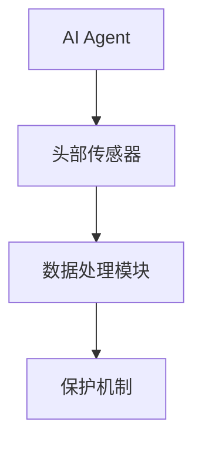
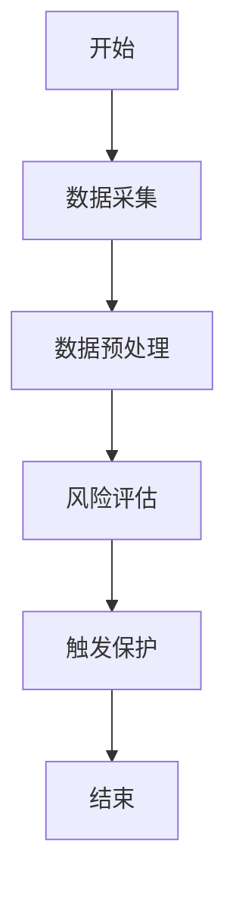

                 


# AI Agent在智能帽子中的头部保护功能

> 关键词：AI Agent、智能帽子、头部保护、可穿戴设备、算法、系统架构

> 摘要：本文探讨AI Agent在智能帽子中的头部保护功能，分析其工作原理、系统架构及实际应用场景，结合算法实现和项目实战，提供深入的技术解析。

---

## 第一部分: 背景介绍

### 第1章: 问题背景

#### 1.1 当前头部保护技术的不足
传统头部保护设备（如普通帽子、头盔）存在以下问题：
- 无法实时监测头部状态。
- 保护机制单一，仅能被动防护。
- 缺乏智能化手段，无法主动预警。

#### 1.2 AI技术在头部保护中的潜在价值
AI技术可以通过以下方式提升头部保护功能：
- 实时监测头部运动、受力情况。
- 智能分析潜在风险，提前预警。
- 自适应调整保护策略。

#### 1.3 智能帽子的市场需求与应用场景
- **市场需求**：运动、医疗、工业等领域对头部保护需求旺盛。
- **应用场景**：
  - 运动保护：如滑雪、骑行。
  - 医疗监测：如脑部健康监测。
  - 工业安全：如高空作业保护。

---

## 第二部分: AI Agent的核心概念与联系

### 第2章: 核心概念与联系

#### 2.1 AI Agent的原理
AI Agent在智能帽子中的工作流程：
1. **感知层**：通过传感器采集头部数据（如加速度、压力）。
2. **决策层**：AI算法分析数据，评估风险。
3. **执行层**：触发保护机制（如气囊充气、震动提醒）。

#### 2.2 核心概念对比
| 功能特性       | 传统帽子         | 智能帽子         |
|----------------|------------------|------------------|
| 数据采集       | 无               | 有（加速度、压力传感器） |
| 风险评估       | 无               | AI算法实时评估     |
| 保护机制       | 被动防护         | 主动预警 + 被动防护 |

#### 2.3 ER实体关系图


---

## 第三部分: AI Agent的算法原理

### 第3章: 算法原理讲解

#### 3.1 算法流程
1. 数据采集：传感器获取头部运动数据。
2. 数据预处理：去除噪声，提取有效特征。
3. 风险评估：基于深度学习模型预测风险。
4. 保护触发：根据评估结果启动保护机制。

#### 3.2 算法实现


#### 3.3 数学模型
公式1：数据预处理降噪（均值滤波）：
$$ y_i = \frac{y_{i-1} + y_i + y_{i+1}}{3} $$

公式2：风险评估模型（基于加速度的最大值）：
$$ R = \max(a_x, a_y, a_z) $$

---

## 第四部分: 系统架构设计

### 第4章: 系统分析与架构设计方案

#### 4.1 问题场景介绍
- 用户需求：实时监测头部状态，主动保护。
- 功能需求：监测、预警、保护。

#### 4.2 系统功能设计
- 数据采集模块：采集头部运动数据。
- 数据处理模块：降噪、特征提取。
- AI算法模块：风险评估、决策。
- 保护机制模块：触发气囊、震动提醒。

#### 4.3 系统架构设计


---

## 第五部分: 项目实战

### 第5章: 项目实现与案例分析

#### 5.1 环境安装
- 安装Python、TensorFlow、NumPy。

#### 5.2 核心实现代码
```python
import numpy as np
import tensorflow as tf

# 数据预处理
def preprocess_data(data):
    return (data - np.mean(data)) / np.std(data)

# 风险评估模型
model = tf.keras.Sequential([
    tf.keras.layers.Dense(64, activation='relu'),
    tf.keras.layers.Dense(1, activation='sigmoid')
])
model.compile(optimizer='adam', loss='binary_crossentropy')
```

#### 5.3 案例分析
- **案例1**：滑雪场景中检测头部受到撞击，触发气囊保护。
- **案例2**：医疗场景中实时监测头部健康状态，预警异常情况。

---

## 第六部分: 最佳实践

### 第6章: 总结与注意事项

#### 6.1 总结
- AI Agent在智能帽子中的应用提升了头部保护的智能化水平。
- 系统架构和算法实现是关键。

#### 6.2 注意事项
- 数据隐私保护需重视。
- 传感器精度影响保护效果。
- 算法需不断优化以提高准确性。

#### 6.3 拓展阅读
- 推荐阅读《深度学习》（Ian Goodfellow著）。
- 关注可穿戴设备领域的最新技术动态。

---

作者：AI天才研究院/AI Genius Institute & 禅与计算机程序设计艺术 /Zen And The Art of Computer Programming

