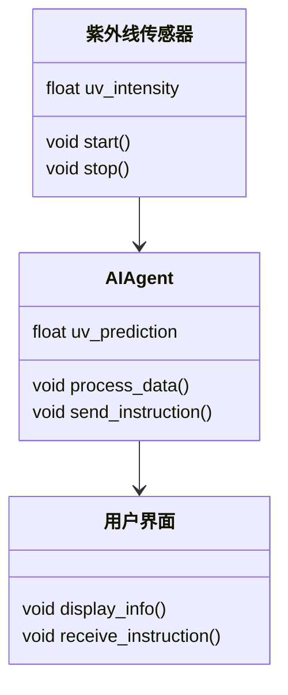
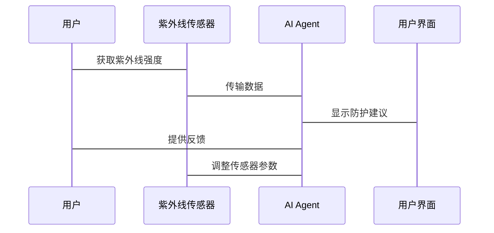

                 


# AI Agent在智能帽子中的紫外线防护

> 关键词：AI Agent，紫外线防护，智能帽子，可穿戴设备，深度学习，实时监测

> 摘要：本文深入探讨了AI Agent在智能帽子中的紫外线防护应用。首先介绍了紫外线防护的重要性，以及AI Agent的基本概念和其在智能帽子中的应用场景。接着详细讲解了AI Agent的核心原理，包括感知与决策机制、多模态数据处理等。随后分析了紫外线防护系统的算法原理，包括数据采集、处理、AI模型预测等步骤，并通过mermaid流程图和Python代码示例进行了详细阐述。最后，结合实际案例，分析了系统架构设计、项目实战及最佳实践。

---

# 第一部分: AI Agent与紫外线防护的背景介绍

## 第1章: 紫外线防护的重要性

### 1.1 紫外线与人类健康的关系
紫外线（UV）是太阳辐射中的一部分，分为UV-A、UV-B和UV-C三种类型。其中，UV-B是导致皮肤癌的主要原因，而UV-A则会导致皮肤老化。长期暴露在紫外线下会引发皮肤癌、白内障等严重健康问题。

#### 1.1.1 紫外线的种类及其危害
- **UV-A**：穿透力强，能够深入皮肤真皮层，导致皮肤老化和皱纹。
- **UV-B**：主要影响表皮层，是导致皮肤癌的主要原因。
- **UV-C**：被臭氧层吸收，几乎不会到达地球表面。

#### 1.1.2 紫外线防护的基本方法
传统的紫外线防护方法包括使用防晒霜、帽子、太阳镜等。然而，这些方法需要用户手动操作，缺乏智能化和实时性。

#### 1.1.3 紫外线防护技术的发展历程
从最初的物理防护（如帽子、太阳镜）到基于传感器的实时监测，再到结合AI技术的智能防护，紫外线防护技术经历了多次升级。

### 1.2 AI Agent的基本概念
AI Agent是一种智能代理，能够感知环境、自主决策并执行任务。它具备自主性、反应性、社交能力等特征，能够适应动态变化的环境。

#### 1.2.1 AI Agent的定义
AI Agent是具有智能的实体，能够通过感知环境、自主决策并执行任务。它可以是一个软件程序，也可以是一个物理设备。

#### 1.2.2 AI Agent的核心功能
- **感知环境**：通过传感器或其他数据源获取环境信息。
- **自主决策**：基于感知的信息，利用算法做出决策。
- **执行任务**：根据决策结果执行相应的操作。

#### 1.2.3 AI Agent在智能设备中的应用
AI Agent广泛应用于智能家居、自动驾驶、医疗设备等领域。在智能帽子中，AI Agent主要用于紫外线防护。

### 1.3 AI Agent与紫外线防护的结合
将AI Agent应用于紫外线防护，可以实现智能化、实时化的防护功能。

#### 1.3.1 紫外线防护的智能化需求
传统的紫外线防护方法存在以下问题：
- 需要手动操作，缺乏智能化。
- 无法实时监测紫外线强度。
- 无法根据环境变化自动调整防护措施。

#### 1.3.2 AI Agent在智能帽子中的应用场景
智能帽子通过集成紫外线传感器和AI Agent，可以实时监测紫外线强度，并根据环境变化自动调整防护措施。

#### 1.3.3 紫外线防护系统的核心目标
- 实时监测紫外线强度。
- 根据紫外线强度调整帽子的防护功能（如遮阳程度）。
- 提供实时的紫外线防护建议。

### 1.4 本章小结
本章介绍了紫外线防护的重要性，以及AI Agent的基本概念和其在智能帽子中的应用场景。通过对比传统方法和AI Agent的优势，为后续内容奠定了基础。

---

# 第二部分: AI Agent与紫外线防护的核心概念

## 第2章: AI Agent的核心原理

### 2.1 AI Agent的感知与决策机制
AI Agent通过多模态数据感知环境，并基于这些数据进行决策。

#### 2.1.1 多模态数据的采集与处理
智能帽子中的传感器可以采集紫外线强度、环境光线、地理位置等多模态数据。

#### 2.1.2 基于深度学习的决策模型
利用深度学习模型（如卷积神经网络）对多模态数据进行分析，生成决策建议。

#### 2.1.3 实时反馈与优化机制
AI Agent可以根据实时反馈不断优化决策模型，提高防护效果。

#### 2.1.4 紫外线传感器的数据采集
紫外线传感器可以实时采集紫外线强度数据，并通过无线通信模块传输到AI Agent。

#### 2.1.5 数据预处理与特征提取
对采集到的数据进行预处理（如去噪、归一化），提取有用的特征（如紫外线强度、时间、地理位置等）。

#### 2.1.6 紫外线强度的实时计算
基于传感器数据和环境模型，计算当前的紫外线强度。

#### 2.1.7 用户防护建议的生成与推送
AI Agent根据紫外线强度和用户需求，生成防护建议（如调整帽子角度、建议使用防晒霜等）。

### 2.2 紫外线防护系统的功能模块
紫外线防护系统由多个功能模块组成，包括数据采集、数据处理、决策模型、用户交互等。

#### 2.2.1 紫外线传感器的数据采集
智能帽子中的紫外线传感器可以实时采集紫外线强度数据。

#### 2.2.2 紫外线强度的实时计算
基于传感器数据和环境模型，计算当前的紫外线强度。

#### 2.2.3 用户防护建议的生成与推送
AI Agent根据紫外线强度和用户需求，生成防护建议，并通过用户界面进行推送。

#### 2.2.4 用户交互与反馈
用户可以通过帽子上的按钮或语音指令与AI Agent交互，提供反馈。

#### 2.2.5 系统优化与自我学习
AI Agent可以根据用户反馈不断优化决策模型，提高防护效果。

### 2.3 AI Agent与紫外线防护的系统架构
系统架构包括传感器层、AI处理层和用户界面层。

#### 2.3.1 系统的整体架构设计
- **传感器层**：包括紫外线传感器、光线传感器、GPS模块等。
- **AI处理层**：包括数据预处理、模型训练、决策生成等。
- **用户界面层**：包括帽子上的显示屏、按钮、语音提示等。

#### 2.3.2 各功能模块的交互流程
1. 传感器采集数据并传输到AI处理层。
2. AI Agent对数据进行处理，生成决策建议。
3. 决策建议通过用户界面层反馈给用户。

#### 2.3.3 系统的可扩展性与灵活性
系统设计注重模块化和可扩展性，方便未来增加新功能或优化现有功能。

### 2.4 本章小结
本章详细讲解了AI Agent的核心原理，包括感知与决策机制、多模态数据处理、实时反馈与优化机制等。通过系统架构设计，展示了AI Agent在智能帽子中的具体应用。

---

# 第三部分: AI Agent的算法原理与实现

## 第3章: 紫外线防护的AI算法实现

### 3.1 紫外线防护的AI算法原理
AI算法通过多模态数据的融合，实现对紫外线强度的实时预测和防护建议生成。

#### 3.1.1 数据采集与预处理
- **数据采集**：通过紫外线传感器、光线传感器等采集多模态数据。
- **数据预处理**：包括去噪、归一化、特征提取等。

#### 3.1.2 紫外线强度的实时计算
基于传感器数据和环境模型，计算当前的紫外线强度。

#### 3.1.3 用户防护建议的生成
AI Agent根据紫外线强度和用户需求，生成防护建议。

### 3.2 AI算法的核心实现
AI算法通过深度学习模型实现对紫外线强度的预测和防护建议生成。

#### 3.2.1 神经网络模型的选择
- **卷积神经网络（CNN）**：适用于图像数据的处理。
- **循环神经网络（RNN）**：适用于时间序列数据的处理。

#### 3.2.2 紫外线强度预测模型的训练
- **训练数据**：包括历史紫外线强度、天气数据、地理位置等。
- **模型训练**：使用训练数据训练神经网络模型，优化模型参数。

#### 3.2.3 模型优化与调参
- **超参数调整**：包括学习率、批量大小、训练次数等。
- **模型评估**：通过验证集评估模型的性能，如准确率、召回率等。

#### 3.2.4 模型部署与实时预测
- **模型部署**：将训练好的模型部署到智能帽子中。
- **实时预测**：通过传感器数据实时预测紫外线强度。

### 3.3 紫外线防护系统的代码实现
以下是一个简单的紫外线防护系统代码示例：

```python
import numpy as np
import tensorflow as tf
from sklearn.preprocessing import MinMaxScaler

# 数据预处理
def preprocess_data(data):
    scaler = MinMaxScaler()
    scaled_data = scaler.fit_transform(data)
    return scaled_data

# 神经网络模型定义
def create_model(input_shape):
    model = tf.keras.Sequential()
    model.add(tf.keras.layers.Conv2D(32, (2,2), activation='relu', input_shape=input_shape))
    model.add(tf.keras.layers.MaxPooling2D((2,2)))
    model.add(tf.keras.layers.Flatten())
    model.add(tf.keras.layers.Dense(64, activation='relu'))
    model.add(tf.keras.layers.Dense(1, activation='sigmoid'))
    model.compile(optimizer='adam', loss='binary_crossentropy', metrics=['accuracy'])
    return model

# 模型训练
def train_model(model, X_train, y_train, epochs=100, batch_size=32):
    model.fit(X_train, y_train, epochs=epochs, batch_size=batch_size, validation_split=0.2)

# 模型预测
def predict_uv(model, X_test):
    predictions = model.predict(X_test)
    return predictions

# 示例数据生成
data = np.random.rand(100, 4)
scaled_data = preprocess_data(data)
X_train = scaled_data[:80]
y_train = np.random.randint(2, size=80)
X_test = scaled_data[80:]

# 模型训练
model = create_model((4,1))
train_model(model, X_train, y_train)

# 模型预测
predictions = predict_uv(model, X_test)
print("Predictions:", predictions)
```

### 3.4 紫外线防护系统的优化
- **模型优化**：通过增加数据量、调整模型结构等提高预测精度。
- **实时性优化**：通过优化算法和硬件设计，提高系统的实时性。

### 3.5 本章小结
本章详细讲解了AI算法在紫外线防护中的实现，包括数据预处理、模型训练、实时预测等步骤。通过代码示例，展示了如何将AI算法应用于智能帽子中。

---

# 第四部分: 系统分析与架构设计方案

## 第4章: 紫外线防护系统的架构设计

### 4.1 问题场景介绍
智能帽子需要实时监测紫外线强度，并根据环境变化自动调整防护措施。

### 4.2 系统功能设计
系统功能包括紫外线传感器数据采集、实时计算、防护建议生成等。

#### 4.2.1 领域模型（类图）


#### 4.2.2 系统架构（架构图）


#### 4.2.3 系统接口设计
- **传感器接口**：与紫外线传感器通信，获取数据。
- **网络接口**：通过无线通信模块与外部服务器通信，获取天气数据等。

#### 4.2.4 系统交互流程（交互流程图）


### 4.3 本章小结
本章通过系统架构设计，展示了如何将AI Agent应用于智能帽子中。通过类图、架构图和交互流程图，详细说明了系统的各个部分及其交互关系。

---

# 第五部分: 项目实战

## 第5章: 紫外线防护系统的项目实战

### 5.1 环境安装与配置
- **Python环境**：安装Python 3.8及以上版本。
- **库安装**：安装TensorFlow、Keras、Mermaid等开发工具。

### 5.2 核心代码实现
以下是一个完整的紫外线防护系统代码实现：

```python
import numpy as np
import tensorflow as tf
from sklearn.preprocessing import MinMaxScaler
from flask import Flask, jsonify

# 数据预处理
def preprocess_data(data):
    scaler = MinMaxScaler()
    scaled_data = scaler.fit_transform(data)
    return scaled_data

# 神经网络模型定义
def create_model(input_shape):
    model = tf.keras.Sequential()
    model.add(tf.keras.layers.Conv2D(32, (2,2), activation='relu', input_shape=input_shape))
    model.add(tf.keras.layers.MaxPooling2D((2,2)))
    model.add(tf.keras.layers.Flatten())
    model.add(tf.keras.layers.Dense(64, activation='relu'))
    model.add(tf.keras.layers.Dense(1, activation='sigmoid'))
    model.compile(optimizer='adam', loss='binary_crossentropy', metrics=['accuracy'])
    return model

# 模型训练
def train_model(model, X_train, y_train, epochs=100, batch_size=32):
    model.fit(X_train, y_train, epochs=epochs, batch_size=batch_size, validation_split=0.2)

# 模型预测
def predict_uv(model, X_test):
    predictions = model.predict(X_test)
    return predictions

# Flask API实现
app = Flask(__name__)

@app.route('/predict', methods=['POST'])
def predict():
    data = request.json['data']
    scaled_data = preprocess_data(data)
    predictions = model.predict(scaled_data)
    return jsonify({'prediction': predictions.tolist()})

if __name__ == '__main__':
    model = create_model((4,1))
    train_model(model, X_train, y_train)
    app.run(debug=True)
```

### 5.3 代码应用解读与分析
- **数据预处理**：对输入数据进行归一化处理，确保模型输入的格式一致。
- **模型训练**：使用训练数据训练神经网络模型，优化模型参数。
- **模型预测**：通过API接口接收实时数据，进行紫外线强度预测。

### 5.4 实际案例分析
假设用户在海滩上使用智能帽子，AI Agent通过紫外线传感器实时监测紫外线强度，并根据预测结果调整帽子的遮阳角度。

### 5.5 项目小结
本章通过实际案例分析，展示了如何将AI Agent应用于智能帽子中。通过Flask API实现紫外线强度预测，展示了系统的实际应用价值。

---

# 第六部分: 最佳实践与总结

## 第6章: 最佳实践与总结

### 6.1 最佳实践
- **数据隐私**：确保用户数据的安全性，避免隐私泄露。
- **系统稳定性**：确保系统在复杂环境下仍能正常运行。
- **用户体验**：优化用户界面，提升用户体验。

### 6.2 小结
AI Agent在智能帽子中的紫外线防护应用，不仅提升了紫外线防护的智能化水平，还为未来的智能设备开发提供了新的思路。

### 6.3 注意事项
- 确保系统的实时性和准确性。
- 定期更新模型，以应对环境变化。
- 注意数据隐私和系统安全性。

### 6.4 拓展阅读
- 推荐阅读《深度学习实战》、《可穿戴设备开发指南》等书籍，深入学习相关知识。

---

# 作者：AI天才研究院 & 禅与计算机程序设计艺术

---

通过以上内容，我们详细探讨了AI Agent在智能帽子中的紫外线防护应用。从背景介绍到算法实现，从系统架构到项目实战，为读者提供了全面的知识体系和实践指导。

