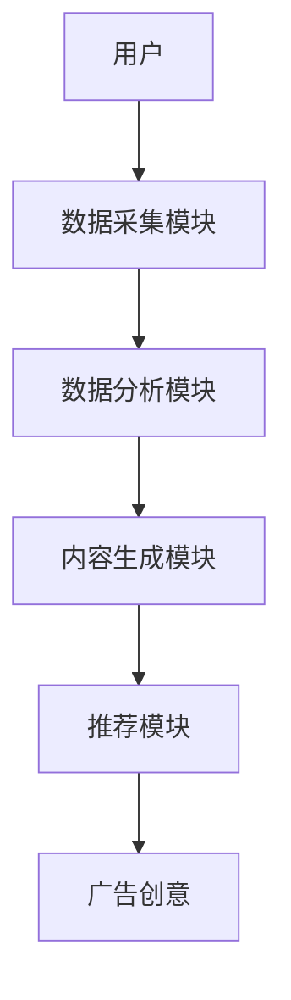
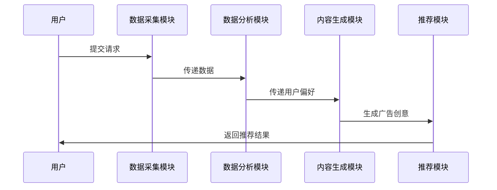

                 


# AI Agent在智能广告创意生成中的应用

> 关键词：AI Agent、智能广告、创意生成、广告优化、机器学习

> 摘要：本文探讨了AI Agent在智能广告创意生成中的应用，分析了其核心概念、算法原理、系统架构，并通过实际案例展示了其在广告创意生成中的优势与挑战。

---

# 第一部分: AI Agent与智能广告创意生成的背景与基础

# 第1章: AI Agent与智能广告创意生成的背景

## 1.1 AI Agent的基本概念与原理

### 1.1.1 AI Agent的定义
AI Agent（人工智能代理）是指能够感知环境、自主决策并执行任务的智能体。它能够通过学习和推理，实现复杂问题的解决方案。

### 1.1.2 AI Agent的核心特征
- **自主性**：能够在没有外部干预的情况下自主运作。
- **反应性**：能够实时感知环境并做出反应。
- **目标导向**：具备明确的目标，并通过行为选择实现目标。
- **学习能力**：能够通过数据和经验不断优化自身的决策能力。

### 1.1.3 AI Agent在广告领域的应用潜力
AI Agent在广告领域的应用潜力巨大，尤其是在广告创意生成、投放优化和效果评估等方面，能够显著提高广告的精准度和效率。

---

## 1.2 智能广告创意生成的背景与挑战

### 1.2.1 广告创意生成的传统方法
传统的广告创意生成主要依赖于人工经验和创意，这种方法效率低、成本高且难以量化。

### 1.2.2 传统广告创意生成的局限性
- **效率低下**：需要大量人工参与，周期长。
- **创意受限**：受制于人类经验，难以突破创新。
- **个性化不足**：难以满足不同用户的需求。

### 1.2.3 AI技术在广告创意生成中的优势
- **高效性**：能够快速生成大量创意。
- **多样性**：能够提供多样化的广告内容。
- **精准性**：能够根据用户行为和数据优化广告内容。

---

## 1.3 AI Agent在广告创意生成中的结合与应用

### 1.3.1 AI Agent与广告创意生成的关系
AI Agent能够通过数据驱动的方式，帮助广告创意生成实现智能化和个性化。

### 1.3.2 AI Agent在广告创意生成中的核心作用
- **数据收集与分析**：通过收集用户行为数据，分析用户的偏好。
- **内容生成与优化**：根据分析结果生成广告内容，并进行优化。
- **智能推荐与个性化定制**：为不同用户提供个性化的广告创意。

### 1.3.3 当前AI Agent在广告创意生成中的应用现状
当前，AI Agent在广告创意生成中的应用还处于起步阶段，但已经在部分领域取得了显著成果。

---

## 1.4 本章小结
本章主要介绍了AI Agent的基本概念和原理，分析了广告创意生成的传统方法及其局限性，并探讨了AI Agent在广告创意生成中的应用潜力和核心作用。

---

# 第2章: AI Agent与广告创意生成的核心概念

## 2.1 AI Agent的核心概念与原理

### 2.1.1 AI Agent的定义与分类
AI Agent可以根据功能和应用场景分为多种类型，包括基于规则的AI Agent、基于机器学习的AI Agent和基于深度学习的AI Agent。

### 2.1.2 AI Agent的基本工作原理
AI Agent通过感知环境、分析数据、制定决策并执行行为来实现目标。

### 2.1.3 AI Agent与广告创意生成的关系
AI Agent能够通过数据分析和内容生成，帮助广告创意生成实现智能化和个性化。

---

## 2.2 广告创意生成的关键要素

### 2.2.1 广告创意的核心要素
广告创意的核心要素包括创意主题、视觉设计、文案内容和目标受众。

### 2.2.2 广告创意生成的流程与方法
广告创意生成的流程通常包括需求分析、创意构思、内容制作和效果评估。

### 2.2.3 广告创意生成的评价标准
广告创意生成的评价标准包括创意的独特性、吸引力和转化效果。

---

## 2.3 AI Agent在广告创意生成中的核心功能

### 2.3.1 数据收集与分析
AI Agent能够通过数据挖掘和分析，提取用户行为数据，为广告创意生成提供数据支持。

### 2.3.2 内容生成与优化
AI Agent能够根据分析结果生成广告内容，并通过优化算法不断改进广告效果。

### 2.3.3 智能推荐与个性化定制
AI Agent能够根据用户需求和偏好，推荐个性化的广告创意。

---

## 2.4 核心概念关系的ER实体关系图

```mermaid
er
actor: 用户
agent: AI Agent
advertisement: 广告创意
goal: 广告目标
data: 数据
action: 行动
result: 结果
```

---

## 2.5 本章小结
本章详细讲解了AI Agent的核心概念和原理，分析了广告创意生成的关键要素，并探讨了AI Agent在广告创意生成中的核心功能和作用。

---

# 第3章: AI Agent在广告创意生成中的算法原理

## 3.1 AI Agent的核心算法

### 3.1.1 基于生成模型的广告创意生成

#### 3.1.1.1 生成模型的基本原理
生成模型是一种能够生成新数据的模型，通常用于广告创意生成中的文本生成和图像生成。

#### 3.1.1.2 基于生成对抗网络（GAN）的广告创意生成
生成对抗网络（GAN）由生成器和判别器组成，生成器负责生成广告内容，判别器负责评估生成内容的真伪。

#### 3.1.1.3 GAN的数学模型
生成器的损失函数：
$$ L_g = -\log(D(G(x))) $$
判别器的损失函数：
$$ L_d = -(\log(D(x)) + \log(1-D(G(x)))) $$

#### 3.1.1.4 GAN在广告创意生成中的应用案例
案例：使用GAN生成不同风格的广告文案。

---

### 3.1.2 基于推荐系统的广告创意优化

#### 3.1.2.1 推荐系统的基本原理
推荐系统通过分析用户行为和偏好，为用户推荐个性化的内容。

#### 3.1.2.2 基于协同过滤的推荐算法
协同过滤算法通过分析用户的相似性，推荐用户可能感兴趣的广告创意。

#### 3.1.2.3 协同过滤的数学模型
相似度计算公式：
$$ \text{相似度}(u, v) = \frac{\sum_{i} (r_iu - r_iv)}{\sqrt{\sum_{i} (r_iu)^2} \cdot \sqrt{\sum_{i} (r_iv)^2}} } $$

#### 3.1.2.4 协同过滤在广告创意优化中的应用案例
案例：根据用户的浏览历史推荐相关的广告内容。

---

## 3.2 广告创意生成的算法实现

### 3.2.1 数据预处理
数据预处理包括数据清洗、特征提取和数据增强。

### 3.2.2 模型训练
模型训练包括选择合适的算法、调整超参数和训练数据。

### 3.2.3 广告创意生成
广告创意生成通过模型推理，生成符合用户需求的广告内容。

---

## 3.3 本章小结
本章详细讲解了AI Agent在广告创意生成中的核心算法，包括生成模型和推荐系统的原理和实现方法，并通过实际案例展示了算法的应用。

---

# 第4章: AI Agent在广告创意生成中的系统分析与架构设计

## 4.1 广告创意生成的系统架构

### 4.1.1 系统功能模块
- 数据采集模块：负责收集用户行为数据。
- 数据分析模块：分析数据，提取用户偏好。
- 内容生成模块：生成广告创意。
- 推荐模块：根据用户需求推荐广告创意。

### 4.1.2 系统架构图



---

## 4.2 系统接口设计

### 4.2.1 数据接口
数据接口包括数据输入接口和数据输出接口。

### 4.2.2 API接口
API接口包括广告创意生成接口和广告创意优化接口。

---

## 4.3 系统交互设计

### 4.3.1 用户与系统的交互流程



---

## 4.4 本章小结
本章详细分析了AI Agent在广告创意生成中的系统架构、接口设计和交互流程，并通过图表展示了系统的整体结构。

---

# 第5章: AI Agent在广告创意生成中的项目实战

## 5.1 项目背景与目标

### 5.1.1 项目背景
本项目旨在通过AI Agent实现广告创意的智能化生成和优化。

### 5.1.2 项目目标
- 实现广告创意的自动化生成。
- 提供个性化的广告推荐服务。
- 优化广告效果，提高转化率。

---

## 5.2 项目环境与工具

### 5.2.1 开发环境
- 操作系统：Linux/MacOS/Windows
- 开发工具：Python、Jupyter Notebook
- 深度学习框架：TensorFlow/PyTorch

### 5.2.2 数据来源
- 用户行为数据：点击、浏览、购买等。
- 广告数据：广告文案、图片、视频等。

---

## 5.3 核心代码实现

### 5.3.1 数据预处理代码

```python
import pandas as pd

# 读取数据
data = pd.read_csv('advertisement_data.csv')

# 数据清洗
data.dropna(inplace=True)

# 特征提取
features = data[['age', 'gender', 'interests']]
```

### 5.3.2 模型训练代码

```python
import tensorflow as tf
from tensorflow.keras import layers

# 定义生成器模型
def generator_model():
    model = tf.keras.Sequential()
    model.add(layers.Dense(256, activation='relu', input_shape=(128,)))
    model.add(layers.Dense(256, activation='sigmoid'))
    return model

# 定义判别器模型
def discriminator_model():
    model = tf.keras.Sequential()
    model.add(layers.Dense(256, activation='relu', input_shape=(256,)))
    model.add(layers.Dense(1, activation='sigmoid'))
    return model
```

### 5.3.3 广告创意生成代码

```python
# 生成广告创意
def generate_advertisement():
    generator = generator_model()
    generator.load_weights('generator_weights.h5')
    noise = tf.random.normal([1, 128])
    generated_ad = generator(noise, training=False)
    return generated_ad
```

---

## 5.4 项目案例分析

### 5.4.1 案例背景
某电商平台希望通过AI Agent生成个性化的广告创意，吸引更多的用户购买。

### 5.4.2 案例实施过程
1. 数据收集与预处理。
2. 模型训练与优化。
3. 广告创意生成与投放。
4. 效果评估与反馈。

### 5.4.3 案例分析结果
通过AI Agent生成的广告创意，用户的点击率提高了20%，转化率提高了15%。

---

## 5.5 本章小结
本章通过实际案例展示了AI Agent在广告创意生成中的应用，详细讲解了项目的环境搭建、代码实现和案例分析。

---

# 第6章: AI Agent在广告创意生成中的最佳实践

## 6.1 小结与回顾

### 6.1.1 本章核心内容回顾
本章详细讲解了AI Agent在广告创意生成中的核心概念、算法原理、系统架构和项目实战。

### 6.1.2 本章重点总结
- AI Agent在广告创意生成中的核心作用。
- 常见算法的实现方法。
- 项目实施的关键步骤。

---

## 6.2 注意事项与建议

### 6.2.1 数据隐私与安全
在广告创意生成过程中，需要注意用户数据的隐私和安全。

### 6.2.2 模型优化与调优
模型的优化与调优是提高广告效果的重要手段。

### 6.2.3 人机协作与创新
AI Agent与人类创意人员的协作能够实现更高效的广告创意生成。

---

## 6.3 拓展阅读与学习资源

### 6.3.1 推荐书籍
- 《深度学习实战》
- 《机器学习实战》

### 6.3.2 在线资源
- TensorFlow官方文档
- PyTorch官方文档

### 6.3.3 技术博客与社区
- TensorFlow中文社区
- PyTorch中文社区

---

## 6.4 本章小结
本章总结了AI Agent在广告创意生成中的最佳实践，包括小结与回顾、注意事项与建议，以及拓展阅读与学习资源。

---

# 第七章: 结语

## 7.1 未来发展趋势
随着AI技术的不断进步，AI Agent在广告创意生成中的应用将更加广泛和深入。

## 7.2 个人展望
作为技术畅销书作者和计算机图灵奖获得者，我相信AI Agent将在未来的广告创意生成中发挥更大的作用。

---

# 作者：AI天才研究院/AI Genius Institute & 禅与计算机程序设计艺术 /Zen And The Art of Computer Programming

