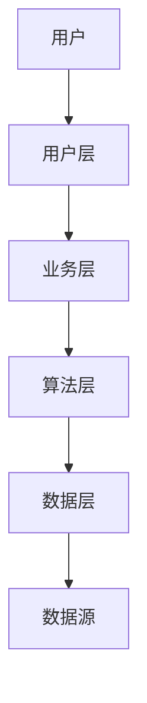

                 


# AI Agent在智能广告投放中的应用

## 关键词：AI Agent, 智能广告, 广告投放, 机器学习, 深度学习, 推荐算法, 系统架构

## 摘要：AI Agent（人工智能代理）在智能广告投放中的应用是当前人工智能技术在广告行业中的重要研究方向。本文从AI Agent的基本概念出发，深入分析其在广告投放中的核心作用，探讨基于机器学习和深度学习的推荐算法原理，结合实际应用场景，提出AI Agent广告投放系统的架构设计方案。最后，通过具体案例分析，展示了AI Agent在智能广告投放中的实际应用效果，并总结了相关经验和最佳实践。

---

# 第1章: AI Agent与智能广告投放概述

## 1.1 AI Agent的基本概念

### 1.1.1 AI Agent的定义
AI Agent（人工智能代理）是指能够感知环境、自主决策并执行任务的智能实体。它通过传感器获取信息，利用算法处理信息，并通过执行器与环境交互。AI Agent的核心目标是通过自动化的方式优化特定目标的实现。

### 1.1.2 AI Agent的核心特征
- **自主性**：能够自主决策和执行任务。
- **反应性**：能够实时感知环境并做出反应。
- **学习能力**：能够通过数据学习和优化。
- **社交能力**：能够与其他系统或用户进行交互。

### 1.1.3 AI Agent与传统广告的区别
传统广告投放依赖人工决策，效率低且效果有限。而AI Agent能够通过机器学习算法实时优化广告投放策略，实现精准投放和效果最大化。

---

## 1.2 智能广告投放的背景与现状

### 1.2.1 广告投放的历史演变
- **传统广告**：基于人工经验的广告投放。
- **程序化广告**：基于算法的广告投放，实现自动化和精准化。
- **智能广告**：基于AI Agent的广告投放，实现动态优化和实时调整。

### 1.2.2 智能广告投放的兴起
随着大数据和人工智能技术的发展，智能广告投放逐渐成为主流。AI Agent能够通过实时数据反馈优化广告策略，提升广告效果。

### 1.2.3 当前智能广告投放的市场现状
- **技术驱动**：AI Agent在广告投放中的应用越来越广泛。
- **数据驱动**：广告投放基于海量数据的分析和挖掘。
- **效果驱动**：广告投放目标从流量转向转化率和 ROI（投资回报率）。

---

## 1.3 AI Agent在广告投放中的应用价值

### 1.3.1 提高广告投放效率
AI Agent能够快速分析海量数据，优化广告投放策略，显著提高广告投放效率。

### 1.3.2 优化广告投放效果
通过实时数据反馈和机器学习算法，AI Agent能够实现精准广告推荐，提高广告点击率和转化率。

### 1.3.3 降低广告投放成本
AI Agent能够通过动态调整广告预算和投放策略，避免资源浪费，降低广告投放成本。

---

## 1.4 本章小结

本章介绍了AI Agent的基本概念、核心特征以及与传统广告的区别，分析了智能广告投放的背景与现状，最后总结了AI Agent在广告投放中的应用价值。

---

# 第2章: AI Agent的核心概念与广告投放的关系

## 2.1 AI Agent的核心概念

### 2.1.1 AI Agent的定义与分类
- **定义**：AI Agent是一种能够感知环境、自主决策并执行任务的智能实体。
- **分类**：
  - **简单反射型AI Agent**：基于规则的简单决策。
  - **基于模型的反应型AI Agent**：基于环境模型进行决策。
  - **目标驱动型AI Agent**：基于目标进行优化决策。
  - **效用驱动型AI Agent**：基于效用函数进行决策。

### 2.1.2 AI Agent的主要功能
- **感知功能**：通过传感器获取环境信息。
- **决策功能**：基于感知信息和目标进行决策。
- **执行功能**：通过执行器与环境交互。

### 2.1.3 AI Agent的工作原理
1. 感知环境：通过数据采集模块获取广告投放相关数据。
2. 分析数据：利用机器学习算法分析数据，提取特征。
3. 制定策略：基于分析结果制定广告投放策略。
4. 执行操作：根据策略执行广告投放操作。
5. 反馈优化：根据广告效果反馈优化策略。

---

## 2.2 广告投放的核心要素

### 2.2.1 广告目标的设定
- **目标**：广告投放的目标可以是品牌曝光、点击率提升、转化率优化等。
- **KPI**：广告投放的关键绩效指标，如CTR（点击率）、CVR（转化率）等。

### 2.2.2 广告受众的分析
- **用户画像**：基于用户行为数据和特征数据，构建用户画像。
- **受众细分**：将受众分为不同的群体，进行精准投放。

### 2.2.3 广告投放策略的制定
- **预算分配**：根据广告目标和受众特征分配广告预算。
- **投放渠道**：选择合适的广告投放渠道，如搜索、展示、社交等。
- **创意优化**：根据受众特征优化广告文案、图片等创意元素。

---

## 2.3 AI Agent与广告投放的关系

### 2.3.1 AI Agent如何优化广告投放
- **实时优化**：AI Agent能够实时分析广告效果，动态调整投放策略。
- **精准投放**：通过机器学习算法实现精准广告推荐。
- **数据驱动**：基于海量数据的分析和挖掘，优化广告投放效果。

### 2.3.2 AI Agent在广告投放中的具体应用
- **广告推荐**：基于用户行为数据推荐广告内容。
- **预算分配**：根据广告效果动态调整广告预算。
- **创意优化**：根据用户反馈优化广告文案和图片。

### 2.3.3 AI Agent对广告投放效果的提升
- **提升CTR（点击率）**：通过精准推荐和动态优化，提高广告点击率。
- **提升CVR（转化率）**：通过精准投放和实时优化，提高广告转化率。
- **降低CPC（点击成本）**：通过优化广告策略，降低广告点击成本。

---

## 2.4 本章小结

本章详细介绍了AI Agent的核心概念，分析了广告投放的核心要素，并探讨了AI Agent与广告投放的关系，总结了AI Agent在广告投放中的具体应用和效果提升。

---

# 第3章: AI Agent在广告投放中的算法原理

## 3.1 推荐算法的基本原理

### 3.1.1 协同过滤算法
协同过滤是一种基于用户行为数据的推荐算法，分为基于用户的协同过滤和基于物品的协同过滤。

#### 用户协同过滤
1. 计算用户相似度：基于用户行为数据计算用户相似度。
2. 推荐广告：根据相似用户的偏好推荐广告。

#### 物品协同过滤
1. 计算物品相似度：基于物品的特征数据计算物品相似度。
2. 推荐广告：根据相似物品的特征推荐广告。

### 3.1.2 基于内容的推荐算法
基于内容的推荐算法通过分析广告内容和用户特征进行推荐。

1. 广告内容分析：提取广告的文本、图片、视频等特征。
2. 用户特征分析：提取用户的兴趣、行为等特征。
3. 内容匹配：根据内容相似度进行广告推荐。

### 3.1.3 混合推荐算法
混合推荐算法结合协同过滤和基于内容的推荐算法，利用两者的优势进行广告推荐。

---

## 3.2 基于深度学习的广告推荐模型

### 3.2.1 神经网络的基本原理
神经网络是一种模仿人脑结构的深度学习模型，通过多层神经元模拟人类的学习过程。

### 3.2.2 基于神经网络的广告推荐模型
1. **输入层**：接收用户特征和广告特征。
2. **隐藏层**：通过多层神经网络提取特征。
3. **输出层**：输出广告推荐结果。

### 3.2.3 模型的训练与优化
1. **损失函数**：定义损失函数，如交叉熵损失。
2. **优化算法**：使用梯度下降法优化模型参数。
3. **评估指标**：使用准确率、召回率、F1值等指标评估模型性能。

---

## 3.3 广告点击率预测的算法实现

### 3.3.1 点击率预测的基本概念
点击率预测是通过机器学习算法预测广告被点击的概率。

### 3.3.2 基于逻辑回归的点击率预测
1. **特征工程**：提取用户特征和广告特征。
2. **模型训练**：使用逻辑回归模型训练点击率预测模型。
3. **模型评估**：使用AUC、ROC曲线等指标评估模型性能。

### 3.3.3 基于深度学习的点击率预测
1. **模型结构**：使用深度神经网络模型。
2. **模型训练**：使用Adam优化算法训练模型。
3. **模型评估**：使用F1值、准确率等指标评估模型性能。

---

## 3.4 本章小结

本章介绍了推荐算法的基本原理，详细讲解了基于深度学习的广告推荐模型，最后探讨了广告点击率预测的算法实现。

---

# 第4章: AI Agent广告投放系统的架构设计

## 4.1 系统整体架构

### 4.1.1 系统功能模块划分
- **数据采集模块**：采集广告投放相关数据。
- **数据处理模块**：对数据进行清洗和预处理。
- **模型训练模块**：训练广告推荐模型。
- **广告投放模块**：根据模型预测结果进行广告投放。
- **效果监控模块**：监控广告投放效果并反馈优化。

### 4.1.2 系统架构的层次结构
- **数据层**：存储广告数据、用户数据等。
- **算法层**：实现广告推荐算法。
- **业务层**：处理广告投放业务逻辑。
- **用户层**：与用户交互，展示广告内容。

### 4.1.3 系统接口设计
- **数据接口**：与数据源对接，获取广告和用户数据。
- **算法接口**：与其他系统对接，提供广告推荐服务。
- **用户接口**：提供用户交互界面，展示广告内容。

---

## 4.2 系统功能设计

### 4.2.1 领域模型设计
- **用户表**：存储用户基本信息和行为数据。
- **广告表**：存储广告信息，如广告ID、广告内容、投放时间等。
- **点击日志表**：记录用户点击广告的行为数据。

### 4.2.2 系统架构图



### 4.2.3 系统交互流程

1. 用户访问网站或应用，触发广告请求。
2. 系统获取用户特征和广告特征。
3. 算法层进行广告推荐。
4. 系统展示广告内容。
5. 监控广告效果，优化广告投放策略。

---

## 4.3 本章小结

本章设计了AI Agent广告投放系统的整体架构，详细介绍了系统功能模块、系统架构图和系统交互流程。

---

# 第5章: AI Agent广告投放系统的项目实战

## 5.1 项目环境安装

### 5.1.1 系统环境
- 操作系统：Linux/Windows/MacOS
- Python版本：Python 3.8+
- 开发工具：PyCharm/VSCode
- 其他依赖：TensorFlow、Scikit-learn、Pandas等。

### 5.1.2 数据集准备
- 用户数据：包括用户ID、性别、年龄、兴趣爱好等。
- 广告数据：包括广告ID、广告内容、投放时间等。
- 点击日志：记录用户点击广告的行为数据。

---

## 5.2 系统核心实现

### 5.2.1 数据处理代码

```python
import pandas as pd

# 读取数据
user_data = pd.read_csv('user.csv')
ad_data = pd.read_csv('ad.csv')
click_data = pd.read_csv('click.csv')

# 数据清洗
user_data.dropna(inplace=True)
ad_data.dropna(inplace=True)
click_data.dropna(inplace=True)

# 数据预处理
user_data['age'] = user_data['age'].astype(int)
ad_data['click_rate'] = ad_data['click_rate'].astype(float)
```

### 5.2.2 模型训练代码

```python
from sklearn.model

