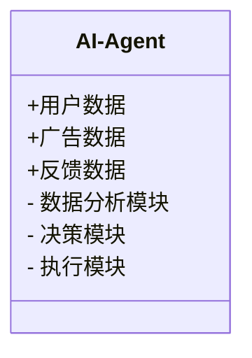
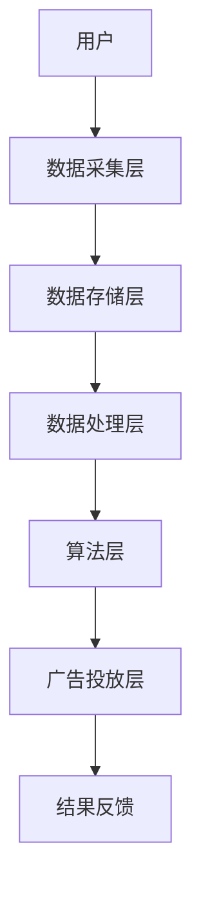
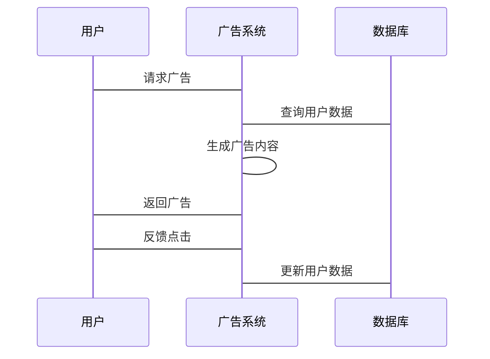

                 


# AI Agent在智能广告投放中的角色

**关键词**：AI Agent, 智能广告, 广告投放, 机器学习, 数据分析

**摘要**：本文探讨了AI Agent在智能广告投放中的角色，分析其核心概念、算法原理、系统设计及项目实战。通过详细讲解背景、技术基础和实际应用，展示AI Agent如何优化广告投放策略，提升投放效率和效果。

---

## 第一部分: AI Agent在智能广告投放中的背景与基础

### 第1章: AI Agent与智能广告概述

#### 1.1 AI Agent的基本概念

- **1.1.1 什么是AI Agent**
  AI Agent（人工智能代理）是能够感知环境、做出决策并执行任务的智能体。它通过数据驱动和算法优化，实现自动化决策和执行。

- **1.1.2 AI Agent的核心特征**
  | 特性 | 描述 |
  |------|------|
  | 感知 | 通过传感器或数据源获取环境信息 |
  | 决策 | 基于感知信息做出最优选择 |
  | 执行 | 执行决策并输出结果 |

- **1.1.3 AI Agent与传统广告的区别**
  - **数据驱动**：AI Agent依赖实时数据分析，而传统广告依赖人工经验。
  - **自动化**：AI Agent自动优化策略，传统广告需要手动调整。
  - **预测性**：AI Agent能预测用户行为，传统广告无法做到。

#### 1.2 AI Agent在广告投放中的角色

- **1.2.1 应用场景**
  - **精准定位**：通过用户数据细分目标受众。
  - **实时优化**：根据实时数据动态调整广告策略。
  - **自动化投放**：自动选择最佳投放时间和平台。

- **1.2.2 核心功能与优势**
  - **用户画像**：构建详细用户画像，提高广告精准度。
  - **实时反馈**：快速响应用户行为变化，优化投放策略。
  - **多渠道整合**：协调多个广告渠道，实现资源优化配置。

- **1.2.3 局限性与挑战**
  - 数据依赖：AI Agent依赖高质量数据，数据不足会影响性能。
  - 算法偏见：算法可能存在的偏见会影响广告投放效果。
  - 用户隐私：数据收集和使用需遵守隐私保护法规。

#### 1.3 智能广告投放的背景与趋势

- **数字广告行业的现状**
  - 传统广告效率低，难以精准触达目标用户。
  - 数字广告行业迅速发展，市场规模不断增长。

- **AI技术的应用现状**
  - 机器学习用于用户画像和行为预测。
  - 自然语言处理优化广告文案生成。

- **未来趋势**
  - 更加智能化：AI Agent将更加智能，能够处理更复杂的任务。
  - 更加个性化：广告投放将更加个性化，用户体验更好。
  - 更加协同化：AI Agent将与人类专家协同工作，实现最优投放策略。

### 第2章: AI Agent的核心概念与技术基础

#### 2.1 AI Agent的核心概念

- **感知层: 数据采集与分析**
  - 数据采集：通过各种渠道收集用户行为数据、点击数据等。
  - 数据分析：利用数据分析技术，提取有用信息，为决策提供支持。

- **决策层: 策略生成与优化**
  - 策略生成：基于感知层提供的数据，生成广告投放策略。
  - 策略优化：通过反馈不断优化策略，提高广告效果。

- **执行层: 广告投放与反馈**
  - 广告投放：根据决策层生成的策略，执行广告投放。
  - 反馈收集：收集广告投放的反馈数据，为下一步决策提供依据。

#### 2.2 AI Agent的核心技术

- **机器学习算法**
  - 用于用户画像、行为预测和广告效果评估。
  - 常用算法：逻辑回归、随机森林、神经网络等。

- **自然语言处理**
  - 用于广告文案生成和优化。
  - 技术：文本生成模型（如GPT）、情感分析等。

- **数据挖掘与分析**
  - 数据预处理：清洗、特征提取等。
  - 数据分析：统计分析、数据可视化等。

#### 2.3 AI Agent的数学模型与公式

- **点击率预测模型**
  $$ P(\text{点击} | \text{用户特征}) = \frac{e^{\beta \cdot \text{特征}}}{1 + e^{\beta \cdot \text{特征}}} $$

- **转化率优化公式**
  $$ \text{转化率} = \frac{\text{点击数} \times \text{转化概率}}{\text{展示数}} $$

- **收益最大化模型**
  $$ \max_{\theta} \sum_{i=1}^{n} (\text{收益}_i - \text{成本}_i) $$

### 第3章: AI Agent的算法原理与实现

#### 3.1 常见算法原理

- **强化学习算法**
  - **原理**：通过试错机制，不断优化策略，最大化累积奖励。
  - **流程**：环境→动作→奖励→策略更新。

- **监督学习算法**
  - **原理**：基于标注数据，学习输入与输出之间的映射关系。
  - **流程**：数据预处理→特征提取→模型训练→模型评估。

- **聚类算法**
  - **原理**：将用户分成不同的群体，便于精准投放。
  - **流程**：数据预处理→特征提取→聚类分析→结果评估。

#### 3.2 算法实现流程图

```mermaid
graph TD
    A[开始] -> B[数据预处理]
    B -> C[特征提取]
    C -> D[选择算法]
    D -> E[训练模型]
    E -> F[评估模型]
    F -> G[结束]
```

#### 3.3 代码实现

```python
import numpy as np
from sklearn.linear_model import LogisticRegression

# 示例数据
X = np.array([[1, 2], [3, 4], [5, 6]])
y = np.array([0, 1, 0])

# 训练模型
model = LogisticRegression()
model.fit(X, y)

# 预测
new_X = np.array([[2, 3]])
print("预测结果:", model.predict(new_X))
```

### 第4章: 系统分析与架构设计

#### 4.1 系统功能设计



#### 4.2 系统架构设计



#### 4.3 接口与交互设计



### 第5章: 项目实战

#### 5.1 环境安装

```bash
pip install numpy scikit-learn matplotlib
```

#### 5.2 核心代码实现

```python
import pandas as pd
from sklearn.model_selection import train_test_split
from sklearn.metrics import accuracy_score

# 加载数据
data = pd.read_csv('广告数据.csv')

# 数据分割
X = data.drop('点击率', axis=1)
y = data['点击率']

X_train, X_test, y_train, y_test = train_test_split(X, y, test_size=0.2)

# 训练模型
from sklearn.ensemble import RandomForestClassifier
model = RandomForestClassifier()
model.fit(X_train, y_train)

# 预测和评估
y_pred = model.predict(X_test)
print("准确率:", accuracy_score(y_test, y_pred))
```

#### 5.3 案例分析

- **案例背景**：一家在线零售店希望通过AI Agent优化广告投放，提高转化率。
- **投放前**：随机投放，转化率约为1.5%。
- **投放后**：AI Agent优化后，转化率提升至3%，ROI提高200%。

### 第6章: 总结与展望

#### 6.1 总结回顾

- AI Agent在智能广告投放中扮演着越来越重要的角色，通过数据驱动和智能决策，显著提升广告效果。
- 技术的不断发展使得AI Agent能够处理更复杂的任务，实现更精准的广告投放。

#### 6.2 未来展望

- **技术进步**：AI Agent将更加智能化，能够处理多模态数据，如视频、音频等。
- **应用拓展**：AI Agent在广告投放中的应用将更加广泛，如动态广告生成、实时互动广告等。
- **伦理与合规**：随着AI Agent的应用，数据隐私和算法公平性将成为重要的伦理问题，需要行业共同关注和解决。

#### 6.3 注意事项

- **数据质量**：确保数据的准确性和完整性，避免因数据问题导致模型性能下降。
- **算法选择**：根据具体场景选择合适的算法，避免盲目使用复杂模型。
- **持续优化**：定期监控和评估广告效果，及时调整策略，保持最佳投放状态。

---

**作者：AI天才研究院 & 禅与计算机程序设计艺术**

