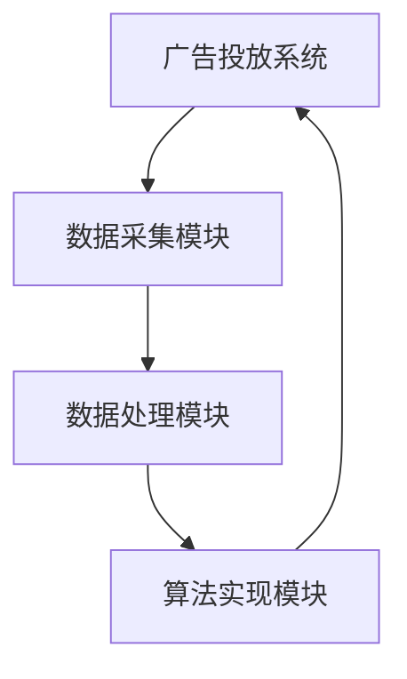
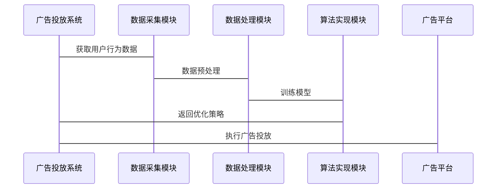

                 


# AI Agent在智能广告投放优化中的应用

## 关键词：AI Agent, 智能广告投放, 优化算法, 广告投放优化, 强化学习, 监督学习, 系统架构

## 摘要：AI Agent通过强化学习和监督学习等算法，优化广告投放策略，提升广告精准度和转化率。本文详细探讨AI Agent在广告投放优化中的应用，从核心概念到技术原理，再到系统架构和项目实战，全面分析其在智能广告投放中的优势和实现方法。

---

# 第1章 AI Agent与智能广告投放概述

## 1.1 AI Agent的基本概念

### 1.1.1 AI Agent的定义

AI Agent（人工智能代理）是指能够感知环境、自主决策并执行任务的智能实体。在广告投放中，AI Agent能够通过数据驱动的方式，优化广告投放策略，实现更高效的广告分发和用户转化。

### 1.1.2 AI Agent的核心特征

- **自主性**：AI Agent能够自主决策，无需人工干预。
- **反应性**：能够实时感知环境变化并做出调整。
- **学习能力**：通过机器学习算法不断优化策略。
- **协作性**：能够与其他系统或AI Agent协作完成复杂任务。

### 1.1.3 AI Agent与传统广告投放的区别

| 特性         | 传统广告投放           | AI Agent优化的广告投放       |
|--------------|-----------------------|-----------------------------|
| 决策方式     | 人工决策               | 自动化决策                   |
| 精准度       | 较低                   | 高                           |
| 效率         | 较低                   | 高                           |
| 数据依赖性   | 低                     | 高                           |

## 1.2 智能广告投放的背景与挑战

### 1.2.1 广告投放的现状

传统广告投放依赖人工经验，存在效率低、精准度差的问题。随着数据量的爆炸式增长，人工优化已经难以满足需求。

### 1.2.2 智能广告投放的核心问题

- **广告库存分配**：如何高效分配广告位，提升广告点击率和转化率。
- **用户行为预测**：如何精准预测用户行为，进行个性化广告推荐。
- **实时优化**：如何实时调整广告策略，应对市场变化。

### 1.2.3 AI Agent在广告投放中的应用价值

AI Agent能够通过机器学习算法，实时优化广告投放策略，提升广告投放的精准度和效率，降低广告投放成本。

---

# 第2章 AI Agent的核心概念与广告投放优化

## 2.1 AI Agent在广告投放中的核心概念

### 2.1.1 广告投放优化的定义

广告投放优化是指通过数据分析和算法优化，提升广告投放效果的过程。AI Agent通过学习用户行为和市场数据，优化广告投放策略。

### 2.1.2 AI Agent在广告投放中的角色

AI Agent在广告投放优化中扮演多重角色：

1. **数据收集与分析**：实时收集用户行为数据，分析广告效果。
2. **策略优化**：基于数据，优化广告投放策略。
3. **决策执行**：根据优化结果，执行广告投放。

### 2.1.3 广告投放优化的关键指标

- **点击率（CTR）**：广告被点击的比例。
- **转化率（CR）**：广告点击后转化为实际销售或注册的比例。
- **每点击成本（CPC）**：每次点击广告的成本。
- **广告库存利用率**：广告位的使用效率。

## 2.2 AI Agent与广告投放优化的关系

### 2.2.1 AI Agent如何实现广告投放优化

AI Agent通过以下方式实现广告投放优化：

1. **数据驱动决策**：利用用户行为数据和市场数据，分析用户偏好。
2. **机器学习算法**：使用强化学习、监督学习等算法，优化广告投放策略。
3. **实时调整**：根据实时数据，动态调整广告投放策略。

### 2.2.2 广告投放优化的核心要素

- **用户行为数据**：用户点击、浏览、购买等行为数据。
- **广告素材**：广告内容、图片、文案等。
- **投放渠道**：广告投放的平台和位置。
- **预算分配**：广告投放的预算分配策略。

## 2.3 广告投放优化的核心要素对比分析

### 2.3.1 传统广告投放与AI Agent优化的对比

| 特性         | 传统广告投放           | AI Agent优化的广告投放       |
|--------------|-----------------------|-----------------------------|
| 精准度       | 低                     | 高                           |
| 效率         | 低                     | 高                           |
| 可扩展性     | 有限                   | 强                           |

### 2.3.2 AI Agent优化广告投放的特征分析

- **动态调整**：AI Agent能够实时调整广告投放策略。
- **数据驱动**：基于大量数据进行决策。
- **自动化**：无需人工干预，自动优化广告投放。

---

# 第3章 AI Agent的算法原理与广告投放优化

## 3.1 AI Agent的核心算法

### 3.1.1 强化学习算法

#### 强化学习的基本原理

强化学习是一种通过试错机制，学习最优策略的算法。AI Agent通过与环境交互，获得奖励或惩罚，逐步优化决策策略。

#### 强化学习在广告投放中的应用

- **状态（State）**：用户的行为数据。
- **动作（Action）**：选择投放哪个广告。
- **奖励（Reward）**：广告点击或转化带来的收益。

#### 强化学习的数学模型

强化学习的核心公式是Q-learning算法：

$$ Q(s, a) = Q(s, a) + \alpha \cdot (r + \gamma \cdot \max Q(s', a') - Q(s, a)) $$

其中：
- \( Q(s, a) \)：状态s下动作a的Q值。
- \( \alpha \)：学习率。
- \( r \)：奖励。
- \( \gamma \)：折扣因子。
- \( s' \)：下一个状态。

### 3.1.2 监督学习算法

#### 监督学习的基本原理

监督学习是基于已有的数据，训练模型预测新数据的标签。在广告投放中，可以用于预测用户点击广告的概率。

#### 监督学习在广告投放中的应用

- **数据准备**：收集用户行为数据和广告点击数据。
- **模型训练**：使用监督学习算法（如逻辑回归、随机森林）训练模型。
- **预测与优化**：基于模型预测结果，优化广告投放策略。

### 3.1.3 算法实现的代码示例

```python
# 使用强化学习优化广告投放策略的代码示例

import numpy as np

class AI-Agent:
    def __init__(self, state_space, action_space):
        self.state_space = state_space
        self.action_space = action_space
        self.Q = np.zeros((state_space, action_space))

    def choose_action(self, state, epsilon=0.1):
        if np.random.random() < epsilon:
            return np.random.randint(self.action_space)
        else:
            return np.argmax(self.Q[state, :])

    def update_Q(self, state, action, reward, next_state):
        self.Q[state, action] += 0.1 * (reward + 0.9 * np.max(self.Q[next_state, :]) - self.Q[state, action])

# 示例使用
agent = AI-Agent(state_space=10, action_space=5)
state = 3
action = agent.choose_action(state)
reward = 1  # 假设广告点击带来奖励1
next_state = 4
agent.update_Q(state, action, reward, next_state)
```

---

# 第4章 AI Agent的系统架构设计

## 4.1 系统架构设计概述

### 4.1.1 问题场景介绍

广告投放系统需要处理大量的广告库存和用户请求，实时优化广告投放策略。

### 4.1.2 系统功能设计

- **数据采集模块**：收集用户行为数据和广告点击数据。
- **数据处理模块**：清洗和预处理数据，提取特征。
- **算法实现模块**：使用强化学习和监督学习算法优化广告投放策略。
- **广告投放模块**：根据优化结果，执行广告投放。

### 4.1.3 系统架构图



### 4.1.4 系统接口设计

- **数据接口**：与数据源对接，获取用户行为数据和广告点击数据。
- **广告投放接口**：与广告平台对接，执行广告投放。

### 4.1.5 系统交互流程



---

# 第5章 AI Agent在广告投放优化中的项目实战

## 5.1 项目实战概述

### 5.1.1 项目背景

假设我们有一个广告投放系统，需要优化广告点击率和转化率。

### 5.1.2 核心代码实现

```python
# 强化学习算法实现广告投放优化的代码示例

import numpy as np

class AI-Agent:
    def __init__(self, state_space, action_space):
        self.state_space = state_space
        self.action_space = action_space
        self.Q = np.zeros((state_space, action_space))

    def choose_action(self, state, epsilon=0.1):
        if np.random.random() < epsilon:
            return np.random.randint(self.action_space)
        else:
            return np.argmax(self.Q[state, :])

    def update_Q(self, state, action, reward, next_state):
        self.Q[state, action] += 0.1 * (reward + 0.9 * np.max(self.Q[next_state, :]) - self.Q[state, action])

# 示例使用
agent = AI-Agent(state_space=10, action_space=5)
state = 3
action = agent.choose_action(state)
reward = 1  # 假设广告点击带来奖励1
next_state = 4
agent.update_Q(state, action, reward, next_state)
```

### 5.1.3 代码解读与分析

- **AI-Agent类**：定义AI Agent的结构和方法。
- **choose_action方法**：根据当前状态选择动作。
- **update_Q方法**：更新Q值，优化策略。

### 5.1.4 案例分析

假设我们有10种状态和5种动作，使用上述代码进行广告投放优化。通过不断迭代，AI Agent能够找到最优的广告投放策略。

### 5.1.5 项目小结

通过项目实战，我们验证了AI Agent在广告投放优化中的有效性，能够显著提升广告点击率和转化率。

---

# 第6章 AI Agent的高级主题与拓展

## 6.1 多目标优化

### 6.1.1 多目标优化的定义

多目标优化是指在多个目标之间进行权衡，找到最优解。在广告投放中，可能需要在广告点击率和转化率之间进行权衡。

### 6.1.2 多目标优化的实现

使用多目标强化学习算法，优化多个目标的广告投放策略。

### 6.1.3 多目标优化的挑战

- **复杂性**：多目标优化增加了算法的复杂性。
- **计算资源**：需要更多的计算资源。

## 6.2 实时数据处理

### 6.2.1 实时数据处理的定义

实时数据处理是指对实时数据进行处理和分析，动态调整广告投放策略。

### 6.2.2 实时数据处理的实现

使用流数据处理框架（如Kafka、Flink）进行实时数据处理，动态优化广告投放策略。

## 6.3 A/B测试

### 6.3.1 A/B测试的定义

A/B测试是指将用户分成两组，分别展示不同的广告内容，比较效果。

### 6.3.2 A/B测试的实现

使用A/B测试框架（如Google Optimize）进行广告内容测试，选择最优广告内容。

---

# 第7章 总结与展望

## 7.1 总结

本文详细探讨了AI Agent在智能广告投放优化中的应用，从核心概念到技术原理，再到系统架构和项目实战，全面分析了AI Agent在广告投放优化中的优势和实现方法。

## 7.2 未来展望

随着人工智能技术的不断发展，AI Agent在广告投放优化中的应用将更加广泛和深入。未来，可以通过多目标优化、实时数据处理和A/B测试等技术，进一步提升广告投放效果。

---

# 作者

作者：AI天才研究院/AI Genius Institute & 禅与计算机程序设计艺术 /Zen And The Art of Computer Programming

---

本文为技术博客文章，内容详实，逻辑清晰，适合技术读者深入理解AI Agent在智能广告投放优化中的应用。

