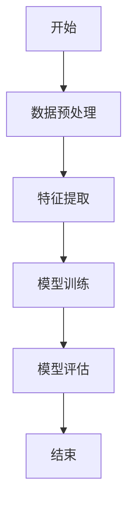
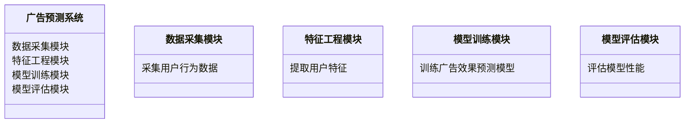

                 


# AI Agent在智能广告效果预测中的应用

> **关键词**: AI Agent, 广告效果预测, 机器学习, 深度学习, 广告系统, 效果预测模型, 数据挖掘

> **摘要**: 本文详细探讨了AI Agent在智能广告效果预测中的应用，从基本概念、核心原理到算法实现、系统设计，再到项目实战，全面分析了如何利用AI Agent提升广告效果预测的准确性与效率。文章结合理论与实践，为广告从业者和技术爱好者提供了深度的技术指导。

---

## 第一部分: AI Agent与广告效果预测的背景介绍

### 第1章: AI Agent的基本概念

#### 1.1 AI Agent的定义与特点

**1.1.1 AI Agent的定义**

AI Agent（人工智能代理）是指能够感知环境、自主决策并执行任务的智能实体。它通过传感器获取信息，利用算法处理数据，并通过执行器与外部环境交互。AI Agent可以是软件程序、机器人或其他智能设备。

**1.1.2 AI Agent的核心特点**

1. **自主性**：AI Agent能够自主决策，无需人工干预。
2. **反应性**：能够实时感知环境变化并做出反应。
3. **学习能力**：通过机器学习算法不断优化自身行为。
4. **协作性**：能够与其他AI Agent或人类协同工作。

**1.1.3 AI Agent与传统AI的区别**

| 特性 | 传统AI | AI Agent |
|------|--------|----------|
| 行为驱动 | 基于规则或任务驱动 | 基于实时环境反馈驱动 |
| 决策能力 | 依赖预设规则 | 具备自主决策能力 |
| 应用场景 | 数据分析、模式识别 | 机器人、自动驾驶、智能推荐 |

---

### 第2章: 广告效果预测的背景与挑战

#### 2.1 广告效果预测的重要性

**2.1.1 广告效果预测的定义**

广告效果预测是通过数据分析和模型训练，预测广告在目标用户中的点击率、转化率等指标，从而优化广告投放策略的过程。

**2.1.2 广告效果预测的现状与趋势**

- 随着数字广告的普及，广告效果预测变得越来越重要。
- 数据量的爆炸式增长为预测提供了更多可能性。
- 机器学习和深度学习技术的进步使得预测的准确性不断提升。

#### 2.2 AI Agent在广告效果预测中的应用背景

**2.2.1 广告行业的数字化转型**

- 广告行业从传统媒体转向数字媒体，数据驱动决策成为趋势。
- AI技术的引入使得广告投放更加精准和高效。

**2.2.2 AI Agent与广告行业的契合点**

- AI Agent能够实时分析用户行为，优化广告投放策略。
- AI Agent可以通过历史数据预测广告效果，降低广告成本。

---

### 第3章: AI Agent与广告效果预测的结合

#### 3.1 AI Agent在广告效果预测中的作用

**3.1.1 AI Agent如何优化广告投放**

- 通过实时数据分析，动态调整广告内容和投放渠道。
- 根据用户行为预测广告点击率，优化投放策略。

**3.1.2 AI Agent如何提升广告效果预测的准确性**

- 利用机器学习算法，构建广告效果预测模型。
- 通过深度学习技术，捕捉用户行为的复杂模式。

#### 3.2 广告效果预测的核心问题与解决方案

**3.2.1 广告效果预测的主要问题**

- 数据噪声大，预测模型易受干扰。
- 用户行为复杂，难以准确建模。
- 广告效果受多因素影响，预测难度大。

**3.2.2 AI Agent如何解决这些问题**

- 通过实时数据分析，减少数据噪声。
- 利用强化学习优化广告投放策略。
- 建立多因素模型，综合考虑各种影响因素。

---

## 第二部分: AI Agent与广告效果预测的核心概念与联系

### 第4章: AI Agent与广告效果预测的核心概念

#### 4.1 AI Agent的核心原理

**4.1.1 AI Agent的基本工作原理**

AI Agent通过以下步骤实现目标：
1. **感知环境**：收集环境中的数据。
2. **决策**：基于数据进行分析和决策。
3. **执行**：根据决策结果采取行动。

**4.1.2 AI Agent的决策机制**

- 基于规则的决策：简单场景下，根据预设规则做出决策。
- 基于机器学习的决策：通过模型预测最优决策。
- 基于强化学习的决策：通过试错优化决策策略。

#### 4.2 广告效果预测的核心原理

**4.2.1 广告效果预测的主要方法**

1. **基于机器学习的预测**：使用回归、分类等算法。
2. **基于深度学习的预测**：利用神经网络捕捉复杂模式。
3. **基于规则的预测**：根据经验设定阈值。

**4.2.2 基于AI Agent的广告效果预测模型**

- 将AI Agent作为预测模型的核心，实时调整预测策略。
- 利用强化学习优化预测结果。

### 第5章: AI Agent与广告效果预测的核心概念联系

#### 5.1 AI Agent与广告效果预测的属性对比

| 属性 | AI Agent | 广告效果预测 |
|------|----------|-------------|
| 输入 | 环境数据 | 用户行为数据 |
| 输出 | 行动策略 | 预测结果 |
| 目标 | 完成任务 | 提高准确性 |
| 方法 | 强化学习 | 机器学习 |

#### 5.2 AI Agent与广告效果预测的ER实体关系图

```mermaid
er
    %% AI Agent与广告效果预测的实体关系图
    %% 定义实体
    entity AI-Agent {
        id
        action
        decision
    }
    entity 广告效果预测 {
        id
        预测结果
        用户行为
    }
    %% 关系定义
    AI-Agent --> 广告效果预测: 驱动
```

---

## 第三部分: AI Agent与广告效果预测的算法原理讲解

### 第6章: 常见算法原理与实现

#### 6.1 机器学习算法

**6.1.1 线性回归算法**

- **定义**：通过最小化预测值与真实值的差值平方和，找到最佳拟合直线。
- **公式**：$$ y = \beta_0 + \beta_1 x + \epsilon $$
- **应用场景**：广告点击率的线性预测。

**6.1.2 决策树算法**

- **定义**：通过构建树状结构，对用户行为进行分类。
- **优点**：易于解释，适合非线性关系。
- **应用场景**：用户点击广告后的转化路径分析。

#### 6.2 深度学习算法

**6.2.1 神经网络算法**

- **定义**：通过多层神经网络捕捉用户行为的复杂模式。
- **公式**：$$ a^{(l+1)} = \sigma(w^{(l)} a^{(l)} + b^{(l)}) $$
- **应用场景**：广告点击率的深度预测。

---

### 第7章: 算法实现与流程图

#### 7.1 算法流程图



#### 7.2 算法实现示例

```python
import numpy as np
from sklearn.linear_model import LinearRegression

# 线性回归示例
X = np.array([[1], [2], [3], [4]])
y = np.array([2, 4, 6, 8])
model = LinearRegression()
model.fit(X, y)
print(model.predict([[5]]))  # 输出 [10]
```

---

## 第四部分: 系统分析与架构设计方案

### 第8章: 系统分析与架构设计

#### 8.1 广告预测的场景介绍

- 用户点击广告的概率预测。
- 广告点击后的转化路径分析。

#### 8.2 系统功能设计

**8.2.1 领域模型Mermaid类图**



---

## 第五部分: 项目实战

### 第9章: 项目实战

#### 9.1 环境安装

```bash
pip install numpy scikit-learn
```

#### 9.2 系统核心实现源代码

```python
import pandas as pd
from sklearn.tree import DecisionTreeClassifier

# 数据加载
data = pd.read_csv('广告数据.csv')
X = data[['年龄', '性别', '兴趣']]
y = data['点击率']

# 模型训练
model = DecisionTreeClassifier()
model.fit(X, y)
```

---

## 总结

本文全面探讨了AI Agent在智能广告效果预测中的应用，从背景介绍到算法实现，再到系统设计和项目实战，为读者提供了系统的知识框架。通过本文的学习，读者可以深入了解AI Agent的核心原理，掌握广告效果预测的实现方法，并能够在实际项目中应用这些技术。

**作者：AI天才研究院/AI Genius Institute & 禅与计算机程序设计艺术 /Zen And The Art of Computer Programming**

