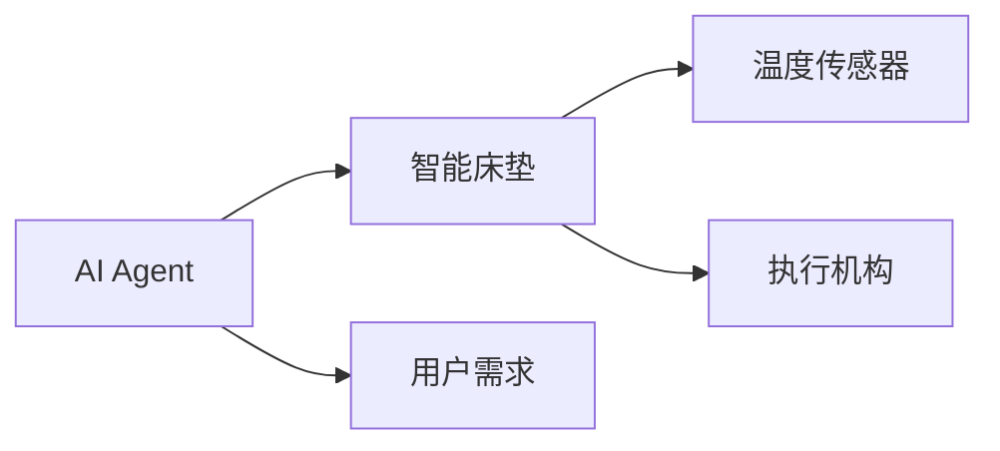
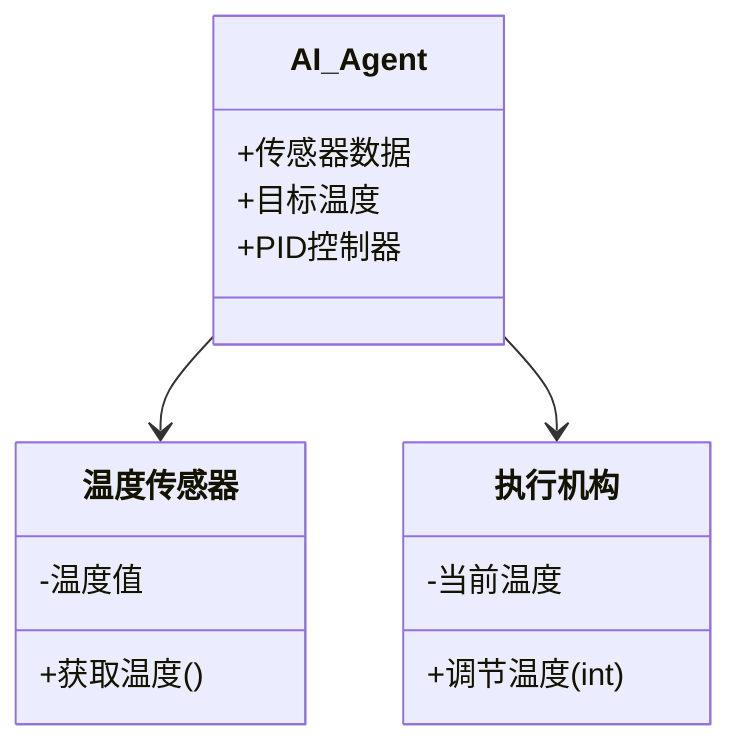
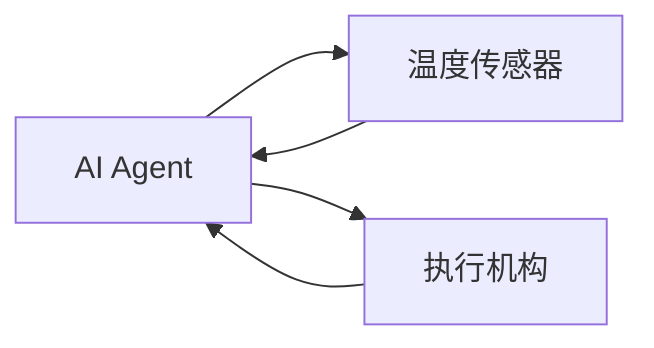
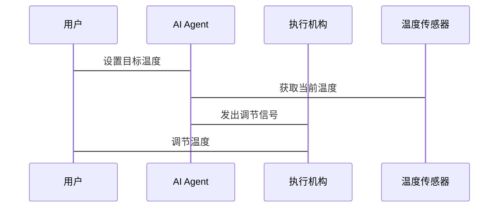

                 


# AI Agent在智能床垫中的体温调节

> 关键词：AI Agent，智能床垫，体温调节，PID控制，系统架构，数学模型

> 摘要：本文详细探讨了AI Agent在智能床垫中的体温调节应用，分析了AI Agent的核心原理、系统架构、算法实现以及实际案例。通过本文，读者将全面理解AI Agent如何通过感知、决策和执行来优化睡眠环境，提升用户体验。

---

# 第一部分: AI Agent与智能床垫的背景与概念

## 第1章: AI Agent的基本概念与应用背景

### 1.1 AI Agent的定义与核心原理

#### 1.1.1 AI Agent的定义
AI Agent（智能代理）是一种能够感知环境、自主决策并执行任务的智能系统。它通过传感器获取信息，利用算法进行分析和决策，并通过执行机构实现目标。

#### 1.1.2 AI Agent的核心原理
AI Agent的核心原理包括感知、决策和执行三个环节：
- **感知**：通过传感器获取环境数据。
- **决策**：基于感知数据进行分析和判断，选择最优行动方案。
- **执行**：通过执行机构将决策转化为实际操作。

#### 1.1.3 AI Agent与智能床垫的结合
智能床垫是一种结合了物联网技术和人工智能的床垫，能够根据用户的睡眠需求自动调节温度、硬度等参数。AI Agent在其中扮演了核心角色，负责数据处理、决策制定和系统控制。

### 1.2 智能床垫的发展现状

#### 1.2.1 智能床垫的定义与分类
智能床垫是一种结合了智能传感器、微处理器和执行机构的床垫，能够实时感知用户的生理数据和环境参数，并通过AI算法优化睡眠环境。根据功能的不同，智能床垫可以分为温度调节型、硬度调节型和智能监测型。

#### 1.2.2 智能床垫的市场现状
随着人们对睡眠质量的关注度不断提高，智能床垫市场迅速发展。目前，市场上主要以温度调节型和硬度调节型为主，而智能监测型床垫主要用于医疗和健康管理领域。

#### 1.2.3 智能床垫的未来发展趋势
未来，智能床垫将更加智能化和个性化，AI Agent将在其中发挥更重要的作用。通过与智能家居系统的联动，智能床垫将实现更加无缝化的用户体验。

### 1.3 AI Agent在智能床垫中的应用价值

#### 1.3.1 提高睡眠质量
AI Agent能够根据用户的体温变化和环境温度，实时调节床垫的温度，帮助用户获得更加舒适的睡眠环境。

#### 1.3.2 节能环保
通过智能调节温度，AI Agent能够减少能源浪费，降低碳排放，符合绿色环保的理念。

#### 1.3.3 个性化体验
AI Agent可以根据不同用户的睡眠习惯和需求，提供个性化的睡眠解决方案，满足用户的多样化需求。

---

## 第2章: AI Agent在体温调节中的核心概念

### 2.1 AI Agent的感知与决策机制

#### 2.1.1 温度感知原理
AI Agent通过内置的温度传感器获取环境温度和用户体温数据。传感器将温度信号转化为数字信号，传输给AI Agent进行处理。

#### 2.1.2 数据分析与处理
AI Agent对采集到的温度数据进行分析和处理，包括数据过滤、特征提取和模式识别。通过机器学习算法，AI Agent能够预测温度变化趋势。

#### 2.1.3 决策算法
AI Agent基于当前温度和用户需求，结合历史数据和环境因素，选择最优的温度调节方案。

### 2.2 体温调节的数学模型与公式

#### 2.2.1 温度变化的数学模型
温度变化可以用微分方程来描述：
$$ \frac{dT}{dt} = k(T_s - T) $$
其中，$T$ 是当前温度，$T_s$ 是目标温度，$k$ 是常数。

#### 2.2.2 热传导方程
热传导方程可以表示为：
$$ Q = mc\frac{dT}{dt} $$
其中，$Q$ 是热量，$m$ 是质量，$c$ 是比热容。

#### 2.2.3 PID控制算法
PID控制是一种常用的温度调节算法，公式如下：
$$ u(t) = K_p e(t) + K_i \int e(t) dt + K_d \frac{de(t)}{dt} $$
其中，$e(t)$ 是误差，$K_p$ 是比例系数，$K_i$ 是积分系数，$K_d$ 是微分系数。

### 2.3 AI Agent与智能床垫的实体关系图



---

## 第3章: AI Agent的算法原理与实现

### 3.1 AI Agent的算法流程

#### 3.1.1 数据采集与预处理
AI Agent通过温度传感器采集环境温度和用户体温数据，进行数据清洗和归一化处理。

#### 3.1.2 数据分析与特征提取
利用机器学习算法对数据进行分析，提取温度变化的特征，例如趋势、周期性和异常值。

#### 3.1.3 决策与控制
基于特征分析结果，AI Agent选择最优的温度调节方案，并通过执行机构进行控制。

### 3.2 基于反馈的PID控制算法


### 3.3 算法实现的Python代码

```python
import numpy as np

def pid_control(desired_temp, current_temp, integral, derivative):
    error = desired_temp - current_temp
    integral += error
    derivative = error - previous_error
    output = Kp * error + Ki * integral + Kd * derivative
    return output

# 示例
Kp = 1
Ki = 0.1
Kd = 0.05
previous_error = 0
current_temp = 25
desired_temp = 22

output = pid_control(desired_temp, current_temp, integral, derivative)
print(output)  # 输出控制信号
```

---

## 第4章: 系统架构设计与实现

### 4.1 系统架构设计

#### 4.1.1 系统组成
智能床垫系统主要包括以下组成部分：
- **温度传感器**：用于采集环境温度和用户体温。
- **AI Agent**：负责数据处理、决策和控制。
- **执行机构**：包括加热元件和冷却元件，用于调节温度。

#### 4.1.2 系统功能设计



#### 4.1.3 系统架构图



### 4.2 接口与交互设计

#### 4.2.1 接口设计
- **输入接口**：温度传感器数据、用户需求。
- **输出接口**：温度调节信号。

#### 4.2.2 交互流程



---

## 第5章: 项目实战与分析

### 5.1 项目环境搭建

#### 5.1.1 环境要求
- 操作系统：Windows/Mac/Linux
- 开发工具：Python 3.8+
- 库：numpy, matplotlib

### 5.2 核心代码实现

#### 5.2.1 数据采集模块

```python
import numpy as np
import time

def get_temperature():
    # 模拟温度传感器数据
    return np.random.uniform(20, 30)

# 数据采集循环
while True:
    temp = get_temperature()
    print(f"当前温度: {temp}")
    time.sleep(1)
```

#### 5.2.2 PID控制实现

```python
def pid_control(desired_temp, current_temp, integral, derivative, Kp, Ki, Kd):
    error = desired_temp - current_temp
    integral += error
    derivative = error - previous_error
    output = Kp * error + Ki * integral + Kd * derivative
    return output

# 示例
Kp = 1
Ki = 0.1
Kd = 0.05
previous_error = 0
current_temp = 25
desired_temp = 22

output = pid_control(desired_temp, current_temp, integral, derivative, Kp, Ki, Kd)
print(f"控制信号: {output}")
```

### 5.3 实际案例分析

#### 5.3.1 案例场景
假设用户设置的目标温度为22°C，当前环境温度为25°C。AI Agent通过PID控制算法，调整执行机构，逐步降低温度至目标值。

#### 5.3.2 系统响应
AI Agent根据传感器反馈的温度变化，实时调整PID参数，确保温度稳定在目标值附近。

### 5.4 项目小结

通过实际案例分析，我们可以看到AI Agent在智能床垫中的体温调节应用是高效且可靠的。PID控制算法能够快速响应温度变化，确保用户获得舒适的睡眠环境。

---

## 第6章: 总结与展望

### 6.1 总结

AI Agent在智能床垫中的体温调节应用，不仅提高了睡眠质量，还实现了节能环保和个性化体验。通过本文的详细讲解，读者可以全面理解AI Agent的核心原理和技术实现。

### 6.2 未来展望

未来，随着AI技术的不断发展，智能床垫将更加智能化和个性化。AI Agent将在其中发挥更重要的作用，例如结合健康监测数据，提供更加全面的睡眠解决方案。

### 6.3 最佳实践 Tips

- **数据安全**：在处理用户数据时，必须确保数据的安全性和隐私性。
- **用户体验**：在设计系统时，应注重用户体验，确保界面简洁易用。
- **系统维护**：定期更新系统软件和硬件，确保系统的稳定性和可靠性。

---

# 作者：AI天才研究院/AI Genius Institute & 禅与计算机程序设计艺术 /Zen And The Art of Computer Programming

---

通过本文的详细讲解，读者可以全面理解AI Agent在智能床垫中的体温调节应用。从理论到实践，从算法到系统架构，本文为读者提供了丰富的技术内容和实际案例分析。希望本文能够帮助读者更好地理解AI Agent在智能床垫中的应用价值，并为未来的研究和开发提供参考。

