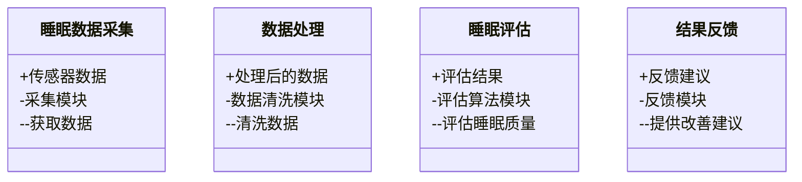
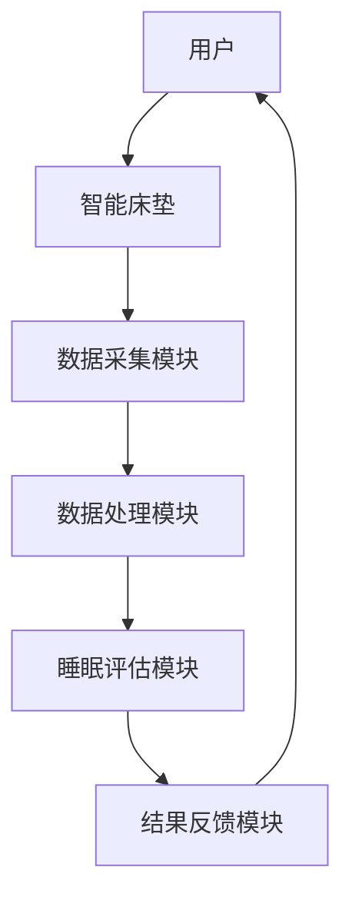

                 


# AI Agent在智能床垫中的睡眠质量评估

## 关键词：
AI Agent，智能床垫，睡眠质量，数据分析，机器学习，健康监测

## 摘要：
本文深入探讨了AI Agent在智能床垫中的应用，特别是在睡眠质量评估方面。通过分析睡眠数据，AI Agent能够实时监测用户的睡眠状态，提供个性化的睡眠改善建议。文章详细介绍了AI Agent的核心原理、算法实现、系统架构设计以及实际项目案例，为读者提供了全面的技术解析。

---

## 第一章：AI Agent与智能床垫概述

### 1.1 AI Agent的基本概念  
AI Agent（智能代理）是一种能够感知环境、自主决策并执行任务的智能系统。它通过传感器或数据输入获取信息，利用算法进行分析和推理，从而做出最优决策。AI Agent的核心在于其智能性和自主性，能够适应复杂多变的环境。

### 1.2 智能床垫的基本概念  
智能床垫是一种结合了物联网和人工智能技术的床垫，能够通过内置的传感器采集用户的睡眠数据，如心率、呼吸频率、体动频率等。这些数据通过AI Agent进行分析，能够评估用户的睡眠质量，并提供个性化的睡眠改善建议。

### 1.3 睡眠质量评估的背景与意义  
随着人们对健康生活的关注增加，睡眠质量成为衡量个人健康的重要指标。传统的睡眠评估方法依赖于人工记录和医生诊断，耗时且不够精准。而通过智能床垫和AI Agent的结合，可以实时、连续地监测睡眠数据，为用户提供科学的睡眠评估和改善方案。

### 1.4 问题背景与解决方法  
睡眠质量差可能导致疲劳、注意力不集中等问题，影响日常生活和工作效率。传统的睡眠评估方法存在数据采集不全面、分析不够精准的问题。AI Agent通过实时监测和智能分析，能够更准确地评估睡眠质量，并提供个性化的改善建议。

### 1.5 边界与外延  
智能床垫的睡眠质量评估系统主要关注用户的睡眠数据，如心率、呼吸频率、体动频率等。系统的边界包括数据采集、分析和反馈，不涉及用户的其他健康数据。外延方面，未来可以结合用户的其他健康数据，如心电图、血压等，提供更全面的健康评估。

---

## 第二章：核心概念与联系

### 2.1 AI Agent的核心原理  
AI Agent通过传感器采集数据，利用机器学习算法进行分析，识别用户的睡眠状态，如浅睡、深睡和觉醒状态。基于这些分析结果，AI Agent能够提供个性化的睡眠改善建议，如调整床垫硬度、优化睡眠环境等。

### 2.2 睡眠数据的特征分析  
睡眠数据包括心率、呼吸频率、体动频率等。这些数据可以通过智能床垫上的传感器采集，并通过AI Agent进行分析。睡眠数据的特征包括周期性、波动性等，这些特征可以帮助识别用户的睡眠状态。

### 2.3 实体关系图  
使用Mermaid绘制的实体关系图如下：

```mermaid
er
actor 用户
actormaster 睡眠数据
actormaster 睡眠评估结果
```

图中展示了用户、睡眠数据和睡眠评估结果之间的关系。用户通过智能床垫生成睡眠数据，AI Agent对数据进行分析，生成睡眠评估结果。

---

## 第三章：算法原理讲解

### 3.1 机器学习算法在睡眠质量评估中的应用  
常用的机器学习算法包括决策树、随机森林和支持向量机（SVM）。这些算法能够对睡眠数据进行分类，识别用户的睡眠状态。

### 3.2 机器学习算法的实现  
以下是使用Python实现的决策树算法示例：

```python
from sklearn.tree import DecisionTreeClassifier
from sklearn.model_selection import train_test_split

# 假设数据集为sleep_data，特征为X，标签为y
X = sleep_data.drop('label', axis=1)
y = sleep_data['label']

X_train, X_test, y_train, y_test = train_test_split(X, y, test_size=0.2)

# 初始化决策树模型
model = DecisionTreeClassifier()
model.fit(X_train, y_train)

# 预测测试数据
y_pred = model.predict(X_test)

# 计算准确率
from sklearn.metrics import accuracy_score
accuracy = accuracy_score(y_test, y_pred)
print(f'准确率：{accuracy}')
```

### 3.3 算法原理的数学公式  
决策树算法的核心在于信息增益的计算。信息增益的公式如下：

$$ \text{信息增益} = \text{熵}(S) - \sum \frac{|S_i|}{|S|} \cdot \text{熵}(S_i) $$

其中，$S$是数据集，$S_i$是根据特征划分后的子集。

---

## 第四章：系统分析与架构设计

### 4.1 问题场景介绍  
智能床垫的睡眠质量评估系统需要实时监测用户的睡眠数据，并通过AI Agent进行分析，提供个性化的睡眠改善建议。

### 4.2 系统功能设计  
系统功能包括数据采集、数据处理、睡眠评估和结果反馈。以下是领域模型类图：



### 4.3 系统架构设计  
以下是系统架构图：



---

## 第五章：项目实战

### 5.1 环境安装  
需要安装Python和相关的机器学习库，如scikit-learn、pandas等。

### 5.2 系统核心实现  
以下是睡眠评估系统的代码实现：

```python
import pandas as pd
from sklearn.tree import DecisionTreeClassifier
from sklearn.model_selection import train_test_split
from sklearn.metrics import accuracy_score

# 加载数据集
sleep_data = pd.read_csv('sleep.csv')

# 数据预处理
X = sleep_data.drop('label', axis=1)
y = sleep_data['label']

# 划分训练集和测试集
X_train, X_test, y_train, y_test = train_test_split(X, y, test_size=0.2)

# 初始化决策树模型
model = DecisionTreeClassifier()
model.fit(X_train, y_train)

# 预测测试数据
y_pred = model.predict(X_test)

# 计算准确率
accuracy = accuracy_score(y_test, y_pred)
print(f'准确率：{accuracy}')
```

### 5.3 案例分析  
以一个用户的睡眠数据为例，分析其睡眠状态，并提供改善建议。例如，如果用户的浅睡时间过长，AI Agent可能会建议调整床垫硬度或改善睡眠环境。

---

## 第六章：总结与展望

### 6.1 总结  
本文详细介绍了AI Agent在智能床垫中的应用，特别是睡眠质量评估方面。通过机器学习算法和系统架构设计，AI Agent能够实时监测用户的睡眠数据，并提供个性化的改善建议。

### 6.2 未来展望  
未来，可以进一步优化算法，结合更多的睡眠数据特征，提高睡眠评估的准确性。此外，还可以将AI Agent应用于其他健康领域，如心率监测、血压监测等，提供更全面的健康评估。

---

## 作者：AI天才研究院/AI Genius Institute & 禅与计算机程序设计艺术 /Zen And The Art of Computer Programming

