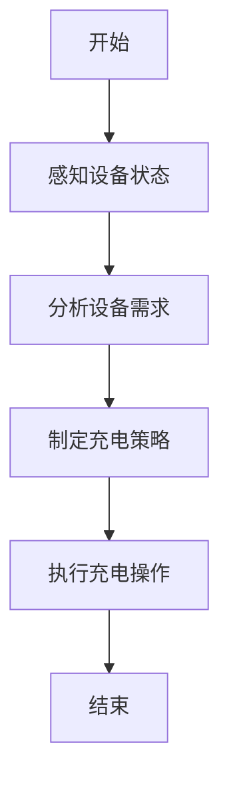
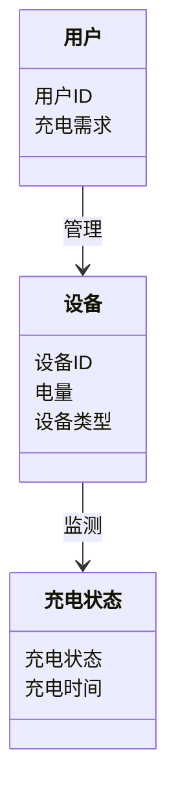
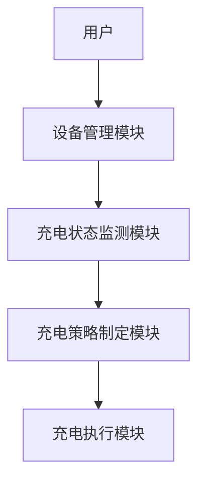

                 


# AI Agent在智能床头柜中的充电管理

> 关键词：AI Agent, 智能床头柜, 充电管理, 智能家居, 人工智能

> 摘要：本文详细探讨了AI Agent在智能床头柜充电管理中的应用，从背景介绍、核心概念、算法原理到系统架构设计、项目实战及最佳实践，全面解析了AI Agent在智能床头柜中的充电管理技术。通过具体案例和代码实现，展示了AI Agent如何优化充电过程，提升用户体验。

---

# 第1章: AI Agent与智能床头柜概述

## 1.1 AI Agent的基本概念

### 1.1.1 AI Agent的定义
AI Agent（人工智能代理）是一种能够感知环境、自主决策并执行任务的智能实体。它通过传感器获取信息，利用算法进行分析，并通过执行器完成目标。

### 1.1.2 AI Agent的核心特点
- **自主性**：能够自主决策，无需人工干预。
- **反应性**：能够实时感知环境变化并做出反应。
- **学习性**：通过数据和经验不断优化自身的算法。

### 1.1.3 AI Agent与传统充电管理的区别
| 特性      | AI Agent充电管理 | 传统充电管理 |
|-----------|------------------|--------------|
| 智能性     | 高               | 低           |
| 自适应性   | 高               | 无           |
| 用户体验   | 优               | 差           |

## 1.2 智能床头柜的背景与应用

### 1.2.1 智能床头柜的发展历程
- **早期阶段**：传统床头柜，仅用于放置物品。
- **发展阶段**：具备基本智能功能，如LED灯、USB接口。
- **成熟阶段**：集成AI Agent，实现智能充电管理。

### 1.2.2 智能床头柜的主要功能
- **设备连接**：支持多种设备的无线连接。
- **状态监测**：实时监测设备的电量和充电状态。
- **充电策略**：根据用户需求和设备特性优化充电顺序。

### 1.2.3 智能床头柜的市场现状
- **市场需求**：智能家居普及，用户对智能设备的需求增加。
- **技术进步**：AI技术的快速发展推动了智能床头柜的功能升级。
- **竞争格局**：市场上涌现出多种智能床头柜产品，竞争激烈。

## 1.3 AI Agent在智能床头柜充电管理中的应用背景

### 1.3.1 充电管理的痛点与挑战
- **设备兼容性问题**：不同设备的充电需求不同，传统充电管理难以满足。
- **充电效率低下**：设备数量增加，传统充电管理效率不高。
- **用户体验差**：用户需要手动管理充电设备，体验不佳。

### 1.3.2 AI Agent在充电管理中的优势
- **智能化**：AI Agent能够自主决策，优化充电顺序。
- **自适应性**：能够根据设备状态和用户需求动态调整充电策略。
- **提升用户体验**：通过智能管理，用户无需手动操作，充电过程更加便捷。

### 1.3.3 智能床头柜充电管理的应用场景
- **家庭场景**：多个设备同时充电，AI Agent优化充电顺序，提高效率。
- **办公场景**：办公室中多个设备需要充电，AI Agent帮助用户高效管理。
- **酒店场景**：酒店房间中的智能床头柜为 guests 提供便捷的充电服务。

---

# 第2章: AI Agent在智能床头柜充电管理中的核心概念与联系

## 2.1 AI Agent的核心概念原理

### 2.1.1 AI Agent的感知能力
AI Agent通过传感器和API接口获取设备的实时状态，包括电量、设备类型、充电需求等。

### 2.1.2 AI Agent的决策能力
AI Agent根据感知到的信息，结合预设的充电策略，制定最优的充电计划。

### 2.1.3 AI Agent的执行能力
AI Agent通过控制充电接口和执行器，按照决策结果执行充电操作。

## 2.2 核心概念属性特征对比表格

| 概念       | 智能性 | 自适应性 | 可扩展性 |
|------------|--------|----------|----------|
| AI Agent   | 高     | 高       | 高       |
| 传统充电管理 | 低     | 无       | 低       |

## 2.3 ER实体关系图

```mermaid
er
    actor 用户
    actor 设备
    actor 充电状态
    actor 充电策略
    actor 充电记录
    用户 --> 充电策略:
    设备 --> 充电状态:
    充电策略 --> 充电记录:
```

---

# 第3章: AI Agent在智能床头柜充电管理中的算法原理

## 3.1 AI Agent的核心算法

### 3.1.1 状态感知算法
AI Agent通过传感器获取设备的实时状态，包括电量、设备类型、充电需求等。

### 3.1.2 决策算法
AI Agent根据感知到的信息，结合预设的充电策略，制定最优的充电计划。

### 3.1.3 执行控制算法
AI Agent通过控制充电接口和执行器，按照决策结果执行充电操作。

## 3.2 算法流程图



## 3.3 算法实现代码

```python
def charging_management(devices, priority):
    charged_devices = []
    for device in devices:
        if device电量 < 100:
            if device优先级 >= priority:
                charged_devices.append(device)
    return charged_devices
```

## 3.4 数学模型与公式

### 3.4.1 优化目标
$$ \text{最大化充电效率} = \sum_{i=1}^{n} \text{充电时间}_i $$

### 3.4.2 约束条件
$$ \text{设备电量}_i \leq 100\% $$
$$ \text{充电接口数量} \leq \text{设备数量} $$

---

# 第4章: AI Agent在智能床头柜充电管理中的系统分析与架构设计

## 4.1 系统功能设计

### 4.1.1 领域模型



### 4.1.2 系统架构设计



---

# 第5章: AI Agent在智能床头柜充电管理中的项目实战

## 5.1 环境搭建

### 5.1.1 安装必要的库
```bash
pip install python-mermaid
pip install requests
pip install json
```

## 5.2 核心代码实现

### 5.2.1 充电管理模块

```python
class ChargingManager:
    def __init__(self, devices):
        self.devices = devices
        self.charging_priority = {}

    def set_priority(self, device_id, priority):
        self.charging_priority[device_id] = priority

    def manage_charging(self):
        available_devices = []
        for device in self.devices:
            if device['电量'] < 100:
                available_devices.append(device)
        available_devices.sort(key=lambda x: self.charging_priority[x['设备ID']], reverse=True)
        return available_devices[:len(self.charging_priority)]
```

---

# 第6章: AI Agent在智能床头柜充电管理中的最佳实践

## 6.1 小结

### 6.1.1 项目总结
通过AI Agent实现智能床头柜的充电管理，能够显著提高充电效率和用户体验。

### 6.1.2 经验分享
- **安全性**：确保充电过程的安全性，避免过载和短路。
- **算法优化**：根据实际情况不断优化充电策略。
- **用户隐私**：保护用户的隐私数据，避免泄露。

## 6.2 注意事项

### 6.2.1 安全性
- 避免设备过载充电，确保充电过程的安全性。

### 6.2.2 算法优化
- 根据设备特性和用户需求动态调整充电策略。

### 6.2.3 用户隐私
- 保护用户的隐私数据，避免数据泄露。

## 6.3 拓展阅读

### 6.3.1 推荐书籍
- 《人工智能: 一种现代的方法》
- 《算法导论》

### 6.3.2 技术博客
- AI Agent在智能家居中的应用
- 智能充电管理的最新技术进展

---

# 作者：AI天才研究院 & 禅与计算机程序设计艺术

