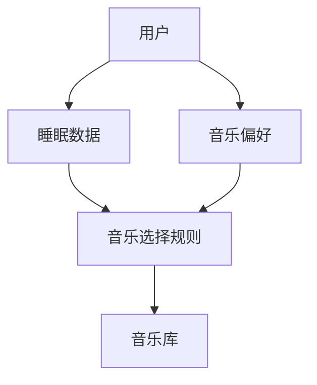
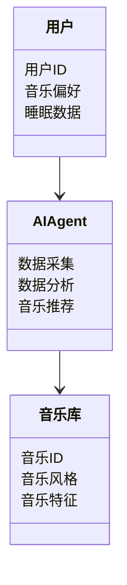
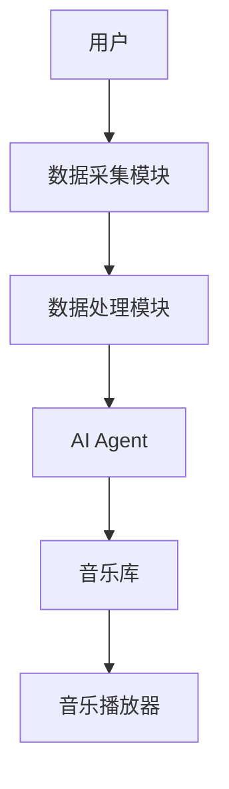

                 


# AI Agent在智能床头柜中的助眠音乐选择

> 关键词：AI Agent，智能床头柜，助眠音乐，个性化推荐，机器学习

> 摘要：本文探讨了AI Agent在智能床头柜中的应用，特别是在助眠音乐选择方面的创新。通过分析睡眠问题的普遍性、助眠音乐的作用，以及AI技术在睡眠辅助中的潜力，本文详细介绍了AI Agent的核心算法、音乐推荐系统的原理、系统架构设计，以及实际项目实现的过程。结合数学模型和Mermaid图，本文为读者提供了一个全面了解AI Agent在助眠音乐选择中的技术实现与应用的视角。

---

## 第1章: 背景与概念

### 1.1 问题背景

#### 1.1.1 睡眠问题的普遍性
现代社会中，睡眠障碍已成为一个普遍问题。根据世界卫生组织的数据，全球约有10%的人口受失眠困扰，而这一比例在发达国家可能更高。睡眠不足或睡眠质量差直接影响个人的健康、工作效率和生活质量。

#### 1.1.2 助眠音乐的作用与局限性
助眠音乐通过调节神经系统，帮助人们放松身心，缓解压力，从而改善睡眠质量。传统的助眠音乐通常基于固定的分类（如白噪音、古典音乐、自然声音等），但这种一刀切的方法难以满足不同用户的个性化需求。

#### 1.1.3 AI技术在睡眠辅助中的潜力
人工智能技术能够通过分析用户的生理数据、行为习惯和音乐偏好，动态调整助眠音乐的选择，从而提供个性化的睡眠辅助方案。

### 1.2 问题描述

#### 1.2.1 睡眠障碍的主要表现
睡眠障碍主要表现为入睡困难、睡眠中断和早醒。这些问题可能由压力、焦虑、环境因素或生活习惯等多种因素引起。

#### 1.2.2 助眠音乐选择的核心问题
传统助眠音乐选择方法存在以下问题：
- **缺乏个性化**：不同用户对音乐的偏好差异较大，固定分类的方法难以满足个性化需求。
- **单一维度**：传统方法通常只考虑音乐的风格或节奏，忽视了用户的实时生理状态和情绪变化。
- **反馈缺失**：缺乏对用户反馈的实时调整机制。

#### 1.2.3 AI Agent在音乐选择中的角色定位
AI Agent（智能体）通过收集用户的实时数据（如心率、体温、呼吸频率等），结合历史行为数据和音乐偏好，动态生成最优的助眠音乐方案。

### 1.3 问题解决

#### 1.3.1 AI Agent如何优化音乐选择
AI Agent通过以下方式优化音乐选择：
- **实时数据采集**：采集用户的生理数据和环境数据。
- **个性化推荐**：基于用户数据，推荐适合当前状态的音乐。
- **动态调整**：根据用户的反馈实时调整音乐选择。

#### 1.3.2 数据驱动的个性化助眠方案
通过收集和分析大量数据，AI Agent能够为用户提供个性化的助眠方案，包括音乐风格、节奏和音量的调整。

#### 1.3.3 多模态信息融合的决策机制
AI Agent整合多模态信息（如生理数据、环境数据、用户偏好）进行决策，从而实现更精准的音乐推荐。

### 1.4 边界与外延

#### 1.4.1 助眠音乐选择的适用场景
助眠音乐选择主要适用于以下场景：
- 睡眠障碍患者
- 工作压力大的人群
- 睡眠环境不佳的人群

#### 1.4.2 AI Agent的局限性与适用边界
AI Agent的局限性包括：
- 数据采集的准确性依赖传感器技术
- 用户隐私保护问题
- 算法的泛化能力需要进一步提升

#### 1.4.3 与其他睡眠辅助技术的协同
AI Agent可以与智能床垫、可穿戴设备等协同工作，提供更全面的睡眠辅助方案。

### 1.5 概念结构与核心要素

#### 1.5.1 AI Agent的组成要素
AI Agent主要由以下几个部分组成：
- **感知层**：负责采集用户的实时数据
- **决策层**：负责分析数据并生成决策
- **执行层**：负责根据决策调整音乐播放

#### 1.5.2 助眠音乐选择的决策流程
1. 采集用户数据
2. 分析数据并生成推荐列表
3. 根据反馈调整音乐选择

#### 1.5.3 系统的核心功能模块
- 数据采集模块
- 数据分析模块
- 音乐推荐模块
- 反馈调整模块

---

## 第2章: 核心概念与联系

### 2.1 AI Agent的核心原理

#### 2.1.1 基于规则的推理机制
基于规则的推理机制通过预设的规则来生成音乐推荐。例如：
- 如果用户的心率低于正常值，推荐舒缓的音乐。

#### 2.1.2 基于机器学习的决策模型
机器学习模型（如随机森林、神经网络）通过学习用户数据和音乐偏好，生成个性化的推荐。

#### 2.1.3 多模态数据的融合方法
多模态数据融合方法（如注意力机制、特征提取）能够更准确地捕捉用户的实时需求。

### 2.2 助眠音乐选择的属性特征对比

#### 2.2.1 音乐风格的分类与特征
音乐风格可以分为古典、爵士、自然声音等，每种风格都有其独特的特征。

#### 2.2.2 不同用户的个性化需求
不同用户的音乐偏好和生理需求存在显著差异。

#### 2.2.3 音乐与生理数据的关联性
通过分析音乐特征和生理数据的关联性，可以更好地理解音乐对睡眠的影响。

### 2.3 ER实体关系图



### 2.4 本章小结

#### 2.4.1 核心概念的总结
- AI Agent通过多模态数据融合实现个性化的音乐推荐。
- 助眠音乐选择的核心在于实时数据的采集与分析。

#### 2.4.2 系统各模块的交互关系
- 用户数据驱动音乐推荐
- 音乐推荐与用户反馈相互影响

#### 2.4.3 未来发展的方向
- 提升AI算法的泛化能力
- 优化数据采集的准确性
- 加强用户隐私保护

---

## 第3章: 算法原理讲解

### 3.1 机器学习模型的选择与实现

#### 3.1.1 基于协同过滤的音乐推荐
协同过滤是一种常用的推荐算法，通过分析用户的行为数据，找到相似的用户群体，推荐他们喜欢的音乐。

#### 3.1.2 基于内容的音乐推荐
内容推荐算法通过分析音乐的特征（如节奏、音调）和用户的偏好，推荐相似的音乐。

#### 3.1.3 混合推荐模型
混合推荐模型结合协同过滤和内容推荐的优点，能够提供更精准的推荐。

### 3.2 算法实现步骤

1. 数据预处理：清洗和归一化用户数据。
2. 模型训练：选择合适的算法进行训练。
3. 模型评估：通过交叉验证评估模型的性能。
4. 模型部署：将模型部署到智能床头柜中。

### 3.3 算法的数学模型

#### 3.3.1 协同过滤的相似度计算
$$ \text{相似度} = \frac{\sum (x_i - \bar{x})(y_i - \bar{y})}{\sqrt{\sum (x_i - \bar{x})^2} \cdot \sqrt{\sum (y_i - \bar{y})^2}} $$

#### 3.3.2 内容推荐的特征提取
$$ \text{音乐特征} = \text{主成分分析}(\text{原始特征}) $$

---

## 第4章: 系统分析与架构设计方案

### 4.1 系统功能设计

#### 4.1.1 领域模型设计


#### 4.1.2 系统架构设计


#### 4.1.3 系统接口设计
- 用户与系统交互接口：手机APP或床头柜的触摸屏
- 数据采集接口：与智能床垫或可穿戴设备的数据接口

### 4.2 系统实现方案

#### 4.2.1 项目介绍
本项目旨在通过AI Agent实现智能床头柜的助眠音乐选择功能。

#### 4.2.2 核心代码实现
```python
def recommend_music(user_id):
    # 获取用户数据
    user_data = get_user_data(user_id)
    # 分析数据
    features = extract_features(user_data)
    # 推荐音乐
    recommendations = model.predict(features)
    return recommendations
```

#### 4.2.3 数据集准备
数据集包括用户的生理数据、音乐特征和用户偏好。

#### 4.2.4 模型训练
使用训练数据训练机器学习模型，评估模型的性能。

### 4.3 本章小结

#### 4.3.1 系统设计的总结
- 领域模型清晰地展示了系统的组成
- 系统架构设计明确了各模块的交互关系

#### 4.3.2 系统实现的关键点
- 数据采集的准确性
- 模型的泛化能力
- 系统的实时性

---

## 第5章: 项目实战

### 5.1 环境配置

#### 5.1.1 开发环境
- Python 3.8+
- Jupyter Notebook
- PyTorch或Scikit-learn

#### 5.1.2 数据库配置
- 数据存储：使用MongoDB存储用户数据和音乐库
- 数据库连接：通过API接口连接数据库

### 5.2 核心代码实现

#### 5.2.1 数据预处理
```python
import pandas as pd
from sklearn.preprocessing import StandardScaler

data = pd.read_csv('sleep_music.csv')
scaled_data = StandardScaler().fit_transform(data)
```

#### 5.2.2 模型训练
```python
from sklearn.model

