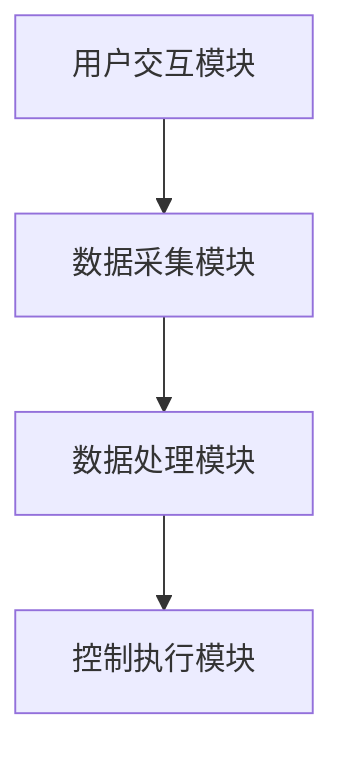

                 

# AI Agent在智能床头柜中的渐进式唤醒

## 关键词：AI Agent, 渐进式唤醒, 智能床头柜, 智能家居, 物联网

## 摘要：本文深入探讨了AI Agent在智能床头柜中的渐进式唤醒技术。首先介绍了AI Agent的基本概念和渐进式唤醒的定义，分析了智能床头柜的背景与现状。接着详细讲解了渐进式唤醒的核心算法和系统架构设计，包括数据采集、特征提取、分类器设计等关键步骤。然后通过实际项目实战，展示了如何利用Python实现渐进式唤醒功能，并进行了系统优化与调优。最后展望了该技术的未来发展，并总结了全文。

---

# 第一部分: AI Agent在智能床头柜中的渐进式唤醒概述

## 第1章: AI Agent与渐进式唤醒概述

### 1.1 AI Agent的基本概念

#### 1.1.1 什么是AI Agent

AI Agent（人工智能代理）是指能够感知环境并采取行动以实现目标的智能实体。它可以是一个软件程序，也可以是嵌入在硬件中的智能模块，具备自主决策和执行任务的能力。

#### 1.1.2 AI Agent的特点

AI Agent具有以下特点：
- **自主性**：能够在没有外部干预的情况下独立运作。
- **反应性**：能够实时感知环境并做出反应。
- **目标导向**：所有行动都以实现特定目标为导向。
- **学习能力**：通过数据和经验不断优化自身的性能。

#### 1.1.3 AI Agent的应用场景

AI Agent广泛应用于多个领域，包括智能家居、医疗健康、自动驾驶等。在智能家居领域，AI Agent通常用于实现设备之间的智能交互和协同工作。

### 1.2 渐进式唤醒的定义与特点

#### 1.2.1 渐进式唤醒的定义

渐进式唤醒是指设备在接收到用户的唤醒指令后，逐步启动并提供服务的过程。与传统的全盘唤醒不同，渐进式唤醒更加注重用户体验，能够在用户需求明确前，逐步提供服务。

#### 1.2.2 渐进式唤醒的特点

渐进式唤醒具有以下特点：
- **逐步启动**：设备在接收到初步唤醒指令后，逐步加载功能模块。
- **低功耗**：在未完全唤醒之前，设备处于低功耗状态，节省能源。
- **高响应性**：一旦用户需求明确，设备能够快速响应并提供服务。

#### 1.2.3 渐进式唤醒在智能床头柜中的应用

在智能床头柜中，渐进式唤醒技术能够使床头柜在用户发出初步唤醒指令后，逐步启动灯光、音乐、闹钟等功能，提供更加智能化的服务。

### 1.3 智能床头柜的背景与现状

#### 1.3.1 智能床头柜的发展历程

智能床头柜的概念起源于智能家居的发展。随着物联网技术的成熟，智能床头柜逐渐从单一的照明功能向多功能的智能家居控制中心发展。

#### 1.3.2 当前智能床头柜的功能特点

当前智能床头柜的功能特点包括：
- **智能灯光控制**：能够根据用户的需求调节灯光亮度和颜色。
- **智能音箱集成**：支持音乐播放、语音助手等功能。
- **智能闹钟**：能够根据用户的睡眠周期智能调节唤醒时间。
- **智能家居控制**：能够通过床头柜控制家中的其他智能设备。

#### 1.3.3 渐进式唤醒在智能床头柜中的应用前景

随着AI技术的不断发展，渐进式唤醒技术在智能床头柜中的应用前景广阔。通过渐进式唤醒，智能床头柜能够提供更加智能化、个性化的服务，提升用户体验。

### 1.4 本章小结

本章主要介绍了AI Agent的基本概念和渐进式唤醒的定义与特点，分析了智能床头柜的背景与现状，探讨了渐进式唤醒在智能床头柜中的应用前景。

---

# 第二部分: 渐进式唤醒的核心原理

## 第2章: 渐进式唤醒的原理与技术实现

### 2.1 渐进式唤醒的定义与技术特点

#### 2.1.1 渐进式唤醒的定义

渐进式唤醒是一种基于用户行为和环境信息的智能化唤醒方式，能够在用户需求明确前，逐步启动设备功能模块。

#### 2.1.2 渐进式唤醒的技术特点

渐进式唤醒的技术特点包括：
- **用户行为分析**：通过分析用户的动作和声音，判断用户的唤醒意图。
- **环境感知**：利用传感器感知环境信息，如光线、温度、声音等。
- **动态调整**：根据用户的反馈和环境变化，动态调整唤醒策略。

### 2.2 渐进式唤醒的核心算法

#### 2.2.1 唤醒算法的分类

唤醒算法主要分为两类：
1. **基于声音识别的唤醒算法**：通过声音识别技术，判断用户的唤醒指令。
2. **基于行为识别的唤醒算法**：通过分析用户的动作和行为，判断用户的唤醒意图。

#### 2.2.2 基于声音识别的唤醒算法

基于声音识别的唤醒算法通常采用语音识别技术，通过训练模型识别特定的唤醒词。例如，训练模型识别“床头柜唤醒”这个词作为唤醒指令。

#### 2.2.3 基于行为识别的唤醒算法

基于行为识别的唤醒算法通过分析用户的动作，如挥手、轻敲等，判断用户的唤醒意图。这种算法通常结合了传感器数据和行为识别技术。

### 2.3 渐进式唤醒的实现步骤

#### 2.3.1 数据采集与预处理

数据采集与预处理是渐进式唤醒实现的基础。首先需要采集用户的唤醒指令，如声音或动作数据，然后对数据进行预处理，去除噪声，提取特征。

#### 2.3.2 特征提取与分类

特征提取与分类是渐进式唤醒的核心步骤。通过对采集到的数据进行特征提取，构建特征向量，然后利用分类器对特征向量进行分类，判断用户的唤醒意图。

#### 2.3.3 唤醒阈值的动态调整

为了提高渐进式唤醒的准确性，需要动态调整唤醒阈值。根据用户的反馈和环境变化，不断优化唤醒阈值，提升用户体验。

### 2.4 本章小结

本章详细讲解了渐进式唤醒的核心算法，包括基于声音识别和基于行为识别的唤醒算法，分析了实现步骤，重点介绍了数据采集与预处理、特征提取与分类以及唤醒阈值的动态调整。

---

# 第三部分: 渐进式唤醒的系统架构与实现

## 第3章: 智能床头柜的系统架构设计

### 3.1 智能床头柜的功能模块划分

智能床头柜的功能模块划分为以下几个部分：
1. **用户交互模块**：负责与用户的交互，接收用户的唤醒指令。
2. **数据采集模块**：采集用户的唤醒数据，如声音、动作等。
3. **数据处理模块**：对采集到的数据进行处理，提取特征并分类。
4. **控制执行模块**：根据分类结果，执行相应的功能。

### 3.2 系统架构的实现

#### 3.2.1 系统架构的总体设计

智能床头柜的系统架构设计采用模块化设计，各功能模块之间通过标准接口进行通信。系统架构图如图1所示。

#### 3.2.2 各功能模块的实现细节

1. **用户交互模块**：支持多种交互方式，如语音唤醒、手势唤醒等。
2. **数据采集模块**：集成麦克风、摄像头、加速度传感器等设备，采集用户的唤醒数据。
3. **数据处理模块**：利用机器学习算法，对采集到的数据进行特征提取和分类。
4. **控制执行模块**：根据分类结果，执行相应的功能，如打开灯光、播放音乐等。

### 3.3 系统接口设计

#### 3.3.1 用户交互接口设计

用户交互接口设计包括：
- **语音唤醒接口**：支持特定唤醒词的识别。
- **手势唤醒接口**：支持特定手势的识别。

#### 3.3.2 数据采集接口设计

数据采集接口设计包括：
- **麦克风接口**：采集用户的语音数据。
- **摄像头接口**：采集用户的图像数据。
- **加速度传感器接口**：采集用户的动作数据。

#### 3.3.3 系统交互流程设计

系统交互流程设计包括：
1. 用户发出唤醒指令。
2. 数据采集模块采集用户的唤醒数据。
3. 数据处理模块对数据进行处理和分类。
4. 控制执行模块根据分类结果执行相应的功能。

### 3.4 本章小结

本章详细讲解了智能床头柜的系统架构设计，包括功能模块划分、系统架构实现、接口设计和系统交互流程设计。

---

## 第4章: 渐进式唤醒的实现与优化

### 4.1 渐进式唤醒的核心算法实现

#### 4.1.1 唤醒算法的实现

唤醒算法的实现包括：
1. 数据采集与预处理。
2. 特征提取与分类。
3. 唤醒阈值的动态调整。

#### 4.1.2 基于机器学习的特征提取

基于机器学习的特征提取通常采用深度学习模型，如卷积神经网络（CNN）和长短期记忆网络（LSTM）。通过训练模型，提取用户的唤醒数据特征。

#### 4.1.3 分类器设计与实现

分类器设计与实现包括：
1. 选择合适的分类算法，如支持向量机（SVM）、随机森林（Random Forest）等。
2. 对训练数据进行分类器训练。
3. 对测试数据进行分类器测试，评估分类器的准确率。

### 4.2 渐进式唤醒的系统优化

#### 4.2.1 系统性能优化

系统性能优化包括：
- **数据处理效率优化**：通过并行计算和分布式处理，提高数据处理效率。
- **算法优化**：通过优化算法参数和模型结构，提高分类准确率。

#### 4.2.2 用户体验优化

用户体验优化包括：
- **响应速度优化**：通过优化系统架构和算法，提高系统的响应速度。
- **唤醒阈值优化**：通过动态调整唤醒阈值，提高唤醒的准确性。

### 4.3 本章小结

本章详细讲解了渐进式唤醒的核心算法实现，包括数据采集与预处理、特征提取与分类、分类器设计与实现。同时，探讨了系统的优化方法，包括性能优化和用户体验优化。

---

## 第5章: 渐进式唤醒的未来展望

### 5.1 技术发展趋势

#### 5.1.1 深度学习的应用

深度学习在渐进式唤醒中的应用前景广阔。通过深度学习模型，可以实现更加精准的特征提取和分类，提高唤醒的准确率。

#### 5.1.2 边缘计算的应用

边缘计算在渐进式唤醒中的应用可以减少数据传输延迟，提高系统的实时响应能力。

### 5.2 未来应用场景

#### 5.2.1 智能家居中的广泛应用

渐进式唤醒技术可以广泛应用于智能家居的各个领域，如智能灯光、智能音箱、智能空调等。

#### 5.2.2 与其他智能设备的联动

通过与其他智能设备的联动，智能床头柜可以实现更加智能化的服务，如与智能门锁联动，实现远程开门功能。

### 5.3 本章小结

本章展望了渐进式唤醒技术的未来发展趋势，包括深度学习和边缘计算的应用，分析了其在智能家居和其他智能设备中的广泛应用前景。

---

## 第6章: 总结

### 6.1 全文总结

本文深入探讨了AI Agent在智能床头柜中的渐进式唤醒技术，分析了其核心算法和系统架构设计，展示了其在智能家居中的广泛应用前景。

### 6.2 未来展望

随着AI技术的不断发展，渐进式唤醒技术将在智能家居中发挥越来越重要的作用，为用户提供更加智能化、个性化的服务。

---

## 作者：AI天才研究院/AI Genius Institute & 禅与计算机程序设计艺术 /Zen And The Art of Computer Programming

---

**注**：由于篇幅限制，本文仅为节选内容，实际完整的文章将包含详细的技术细节、代码实现和图表展示。

