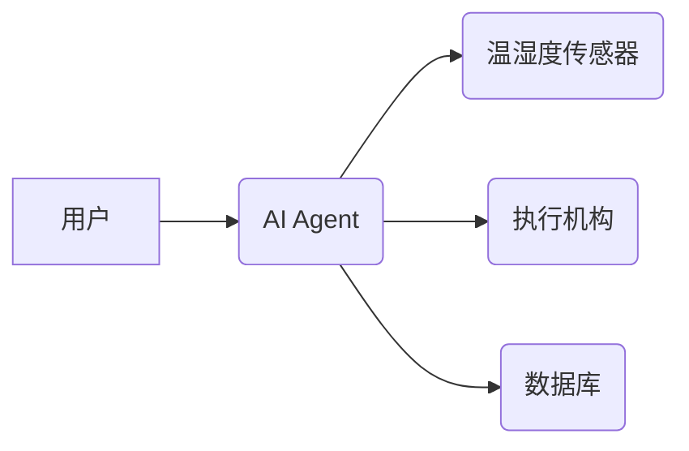
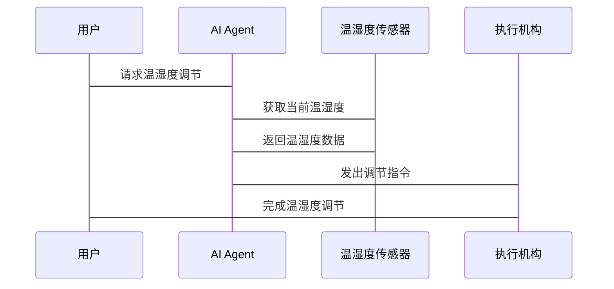

                 


# AI Agent在智能床头柜中的温湿度调节

> 关键词：AI Agent，温湿度调节，智能床头柜，模糊控制，PID控制，物联网

> 摘要：本文详细探讨了AI Agent在智能床头柜中的温湿度调节应用，从基本概念到算法实现，再到系统架构设计，最后通过项目实战展示具体实现过程。文章内容涵盖AI Agent的核心原理、温湿度调节的数学模型、多种控制算法的实现方式以及系统架构的设计与优化，为读者提供全面而深入的技术解析。

---

## 第1章: AI Agent与温湿度调节概述

### 1.1 AI Agent的基本概念
AI Agent（智能代理）是一种能够感知环境并采取行动以实现目标的智能实体。它可以自主决策、执行任务，并与用户和其他系统进行交互。AI Agent的核心特征包括自主性、反应性、目标导向性和社会性。

### 1.2 温湿度调节的背景与需求
温湿度调节是智能家居的重要组成部分，传统的温湿度调节系统依赖于固定的预设值，无法根据环境变化实时调整。智能床头柜作为智能家居的一部分，需要一个能够动态适应环境变化的温湿度调节系统，以提高用户体验。

### 1.3 AI Agent在智能床头柜中的应用
AI Agent通过感知环境数据（如温度、湿度）并结合用户需求，动态调整温湿度参数，实现精准的环境控制。AI Agent的优势在于其智能化和自适应能力，能够根据实时数据优化调节策略。

---

## 第2章: AI Agent的核心概念与原理

### 2.1 AI Agent的感知与决策
AI Agent通过传感器感知环境数据，利用算法进行分析和决策。感知层负责数据采集，决策层负责制定调节策略，执行层负责输出控制指令。

### 2.2 温湿度调节的数学模型
温湿度调节涉及复杂的数学模型，包括模糊控制和PID控制。模糊控制适用于非线性问题，而PID控制适用于线性调节问题。

### 2.3 AI Agent的实体关系图


---

## 第3章: AI Agent的算法原理与实现

### 3.1 模糊控制算法
模糊控制是一种基于模糊逻辑的控制方法，适用于非线性、复杂系统的控制。模糊控制的基本步骤包括 fuzzification、模糊推理和去模糊化。

### 3.2 PID控制算法
PID控制是一种常用的反馈控制方法，适用于线性调节问题。PID控制器由比例、积分和微分三个部分组成，能够有效消除系统偏差。

### 3.3 算法实现的Python代码
```python
# PID控制器实现
class PIDController:
    def __init__(self, Kp, Ki, Kd):
        self.Kp = Kp
        self.Ki = Ki
        self.Kd = Kd
        self.error_prev = 0
        self.integral_prev = 0

    def compute(self, setpoint, measured_value):
        error = setpoint - measured_value
        integral = self.integral_prev + error * dt
        derivative = (error - self.error_prev) / dt
        output = self.Kp * error + self.Ki * integral + self.Kd * derivative
        return output

    def update(self, setpoint, measured_value, dt):
        output = self.compute(setpoint, measured_value)
        self.error_prev = error
        self.integral_prev = integral
        return output
```

---

## 第4章: 系统架构设计与实现

### 4.1 系统组成部分
智能床头柜温湿度调节系统由传感器、AI Agent控制器、执行机构和用户界面四部分组成。传感器负责采集环境数据，AI Agent控制器负责数据处理和决策，执行机构负责输出控制指令，用户界面负责交互。

### 4.2 系统架构图


### 4.3 系统交互图


---

## 第5章: 项目实战与实现

### 5.1 开发环境搭建
需要安装Python、paho-mqtt库和必要的硬件设备。开发环境包括传感器模块、单片机和物联网通信模块。

### 5.2 核心代码实现
```python
import paho.mqtt.client as mqtt

# 连接mqtt服务器
client = mqtt.Client()
client.connect("localhost", 1883, 60)

# 发布温湿度调节指令
client.publish("bedside cabinet/temperature", "25")
client.publish("bedside cabinet/humidity", "50")
```

### 5.3 实际案例分析
通过实际案例分析，展示AI Agent在智能床头柜中的温湿度调节效果。例如，在湿度异常时，AI Agent能够快速响应并调整除湿模式。

---

## 第6章: 总结与展望

### 6.1 核心内容总结
本文详细探讨了AI Agent在智能床头柜中的温湿度调节应用，从算法原理到系统架构设计，再到项目实战，为读者提供了全面的技术解析。

### 6.2 未来展望
随着AI技术的不断发展，AI Agent在智能家居中的应用将更加广泛。未来的研究方向包括优化算法性能、提升系统可扩展性以及增强用户体验。

---

## 第7章: 附录

### 7.1 参考文献
1. 《模糊控制原理与应用》
2. 《PID控制算法及其应用》
3. 《物联网技术入门与实战》

### 7.2 工具推荐
1. Python编程语言
2. paho-mqtt库
3. MQTT协议

---

作者：AI天才研究院/AI Genius Institute & 禅与计算机程序设计艺术 /Zen And The Art of Computer Programming

