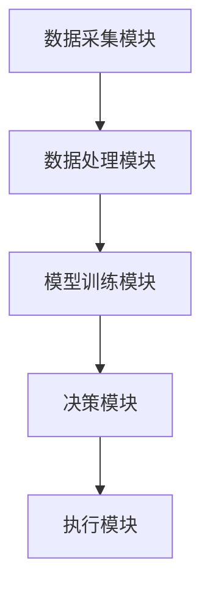
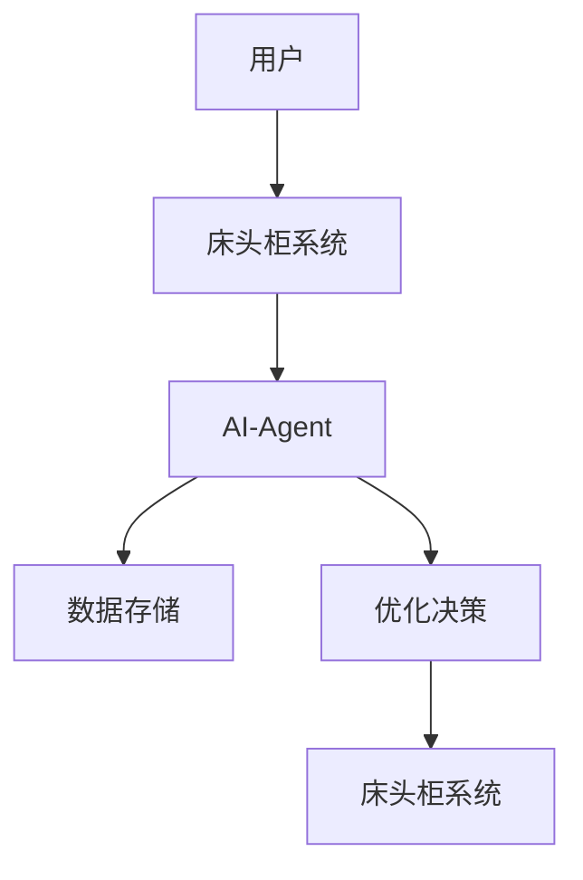
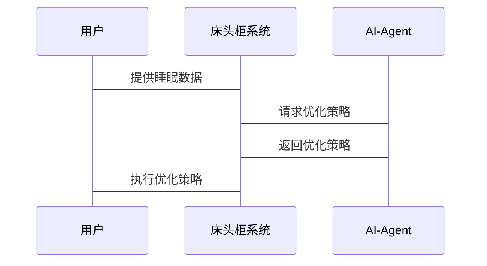

                 


# AI Agent在智能床头柜中的睡眠周期优化

> 关键词：AI Agent, 智能床头柜, 睡眠周期优化, 睡眠质量, 人工智能算法

> 摘要：本文探讨了AI Agent在智能床头柜中的应用，特别是如何通过优化睡眠周期来提高睡眠质量。文章从AI Agent的基本概念出发，分析其在睡眠优化中的作用，详细讲解了AI Agent的算法原理、系统架构设计以及实际项目的实现过程。通过案例分析和最佳实践，展示了AI Agent在智能床头柜中的实际应用效果。

---

## 第1章: AI Agent与睡眠优化概述

### 1.1 AI Agent的基本概念

#### 1.1.1 AI Agent的定义与特点
AI Agent（人工智能代理）是指能够感知环境并采取行动以实现目标的智能实体。其特点包括：
- **自主性**：能够在没有外部干预的情况下运行。
- **反应性**：能够根据环境变化调整行为。
- **目标导向**：所有行动都以实现特定目标为导向。
- **学习能力**：能够通过数据和经验不断优化自己的行为。

#### 1.1.2 AI Agent的核心功能模块
AI Agent通常包含以下功能模块：
1. **感知模块**：负责收集环境中的数据，如用户的睡眠数据、环境光线、声音等。
2. **决策模块**：基于感知数据，利用算法生成优化决策。
3. **执行模块**：将决策转化为具体行动，如调节床头柜的灯光、播放白噪音等。

#### 1.1.3 AI Agent在智能设备中的应用
AI Agent在智能设备中的应用非常广泛，包括智能家居、自动驾驶、医疗设备等。在智能床头柜中，AI Agent主要用于优化用户的睡眠周期，提升睡眠质量。

---

### 1.2 睡眠周期的基本原理

#### 1.2.1 睡眠周期的四个阶段
睡眠周期分为四个阶段：
1. **觉醒阶段**：用户准备入睡的阶段。
2. **非快速眼动睡眠（NREM）阶段1**：浅睡阶段。
3. **非快速眼动睡眠（NREM）阶段2**：深睡阶段。
4. **快速眼动睡眠（REM）阶段**：做梦阶段。

#### 1.2.2 睡眠质量的影响因素
影响睡眠质量的因素包括：
- 环境因素：光线、噪音、温度等。
- 生理因素：年龄、健康状况、压力水平等。
- 行为因素：睡前习惯、运动量、饮食等。

#### 1.2.3 睡眠周期优化的目标
睡眠周期优化的目标是通过调整环境和行为，延长深度睡眠时间，减少觉醒次数，从而提高睡眠质量。

---

### 1.3 AI Agent在睡眠优化中的作用

#### 1.3.1 AI Agent如何改善睡眠质量
AI Agent通过分析用户的睡眠数据，识别睡眠周期中的问题，并采取相应的措施进行优化。例如：
- 根据用户的睡眠数据调整床头柜的灯光亮度。
- 根据用户的呼吸节奏播放助眠音乐。

#### 1.3.2 AI Agent在智能床头柜中的应用场景
在智能床头柜中，AI Agent可以实现以下功能：
1. 实时监测用户的睡眠状态。
2. 根据睡眠数据调整床头柜的环境参数。
3. 提供个性化的睡眠优化建议。

#### 1.3.3 AI Agent与床头柜交互的实现方式
AI Agent与床头柜的交互主要通过以下方式实现：
- 通过传感器采集用户的睡眠数据。
- 通过云端服务器处理数据并生成优化策略。
- 通过床头柜的执行模块调整环境参数。

---

## 第2章: AI Agent的核心概念与联系

### 2.1 AI Agent的核心原理

#### 2.1.1 感知模块
感知模块是AI Agent的核心部分，负责收集环境数据。例如：
- 睡眠监测传感器：监测用户的睡眠状态。
- 环境传感器：监测光线、温度、噪音等。

#### 2.1.2 决策模块
决策模块基于感知数据，利用算法生成优化决策。例如：
- 使用机器学习算法分析睡眠数据，识别睡眠问题。
- 根据分析结果生成优化策略。

#### 2.1.3 执行模块
执行模块负责将决策转化为具体行动。例如：
- 调整床头柜的灯光亮度。
- 播放助眠音乐。

---

### 2.2 AI Agent与床头柜系统的实体关系

#### 2.2.1 实体关系图（ER图）
以下是AI Agent与床头柜系统的实体关系图：

```mermaid
erDiagram
    user {
        +userId: integer
        +username: string
    }
    sleep_data {
        +dataId: integer
        +timestamp: datetime
        +sleep_quality: float
    }
    bedhead柜系统 {
        +systemId: integer
        +device_id: string
    }
    AI-Agent {
        +agent_id: integer
        +system_id: integer
    }
    sleep_data --> AI-Agent : 提供数据
    AI-Agent --> bedhead柜系统 : 发出指令
```

---

### 2.3 AI Agent的数学模型与公式

#### 2.3.1 睡眠周期优化的数学模型
睡眠周期优化的数学模型可以表示为：
$$
\text{优化目标} = \text{最大化睡眠质量} + \text{减少觉醒次数}
$$

其中，睡眠质量可以通过以下公式计算：
$$
\text{睡眠质量} = \frac{\text{深度睡眠时间} + \text{REM睡眠时间}}{\text{总睡眠时间}}
$$

#### 2.3.2 睡眠质量评估公式
睡眠质量评估公式如下：
$$
\text{睡眠质量评分} = 100 \times \frac{\text{深度睡眠时间} + \text{REM睡眠时间}}{\text{总睡眠时间}}
$$

---

## 第3章: AI Agent的算法原理与实现

### 3.1 睡眠周期优化算法概述

#### 3.1.1 算法的基本流程
1. **数据采集**：通过传感器采集用户的睡眠数据。
2. **数据预处理**：对数据进行清洗和归一化处理。
3. **模型训练**：利用机器学习算法训练模型。
4. **优化决策**：根据模型结果生成优化策略。
5. **执行优化**：通过床头柜系统执行优化策略。

---

### 3.2 算法的数学模型与公式

#### 3.2.1 睡眠周期优化的数学模型
睡眠周期优化的数学模型可以表示为：
$$
\min_{x} \text{觉醒次数} + \text{浅睡时间}
$$
$$
\text{subject to} \quad \text{深度睡眠时间} \geq T
$$

其中，\( T \) 是深度睡眠时间的最低要求。

---

### 3.3 算法的实现与代码解读

#### 3.3.1 环境安装与配置
为了实现AI Agent，我们需要安装以下环境：
- Python 3.8+
- NumPy
- Pandas
- Scikit-learn

#### 3.3.2 核心算法的Python实现
以下是基于机器学习的睡眠周期优化算法的Python代码：

```python
import numpy as np
from sklearn.model_selection import train_test_split
from sklearn.ensemble import RandomForestRegressor

# 示例数据集
data = np.array([[1, 2, 3], [4, 5, 6], [7, 8, 9]])
labels = np.array([0.8, 0.9, 0.7])

# 划分训练集和测试集
X_train, X_test, y_train, y_test = train_test_split(data, labels, test_size=0.2)

# 训练模型
model = RandomForestRegressor(n_estimators=100)
model.fit(X_train, y_train)

# 预测结果
predictions = model.predict(X_test)

# 输出结果
print("Predictions:", predictions)
print("真实值:", y_test)
```

---

## 第4章: 系统分析与架构设计方案

### 4.1 问题场景介绍

#### 4.1.1 睡眠周期优化的背景
随着生活节奏的加快，睡眠问题日益严重。通过AI Agent优化睡眠周期，可以帮助用户提高睡眠质量。

---

### 4.2 系统功能设计

#### 4.2.1 系统功能模块划分
系统功能模块包括：
1. **数据采集模块**：采集用户的睡眠数据。
2. **数据处理模块**：对数据进行预处理。
3. **模型训练模块**：训练优化模型。
4. **决策模块**：生成优化策略。
5. **执行模块**：调整床头柜的环境参数。

#### 4.2.2 功能模块的交互流程
以下是功能模块的交互流程图：



---

### 4.3 系统架构设计

#### 4.3.1 系统架构图
以下是系统架构图：



---

### 4.4 系统接口设计

#### 4.4.1 系统接口的定义
系统接口包括：
1. 数据采集接口。
2. 数据处理接口。
3. 模型训练接口。
4. 优化决策接口。

---

### 4.5 系统交互设计

#### 4.5.1 系统交互流程
以下是系统交互流程图：



---

## 第5章: 项目实战与案例分析

### 5.1 项目环境安装与配置

#### 5.1.1 开发环境的选择
推荐使用Python 3.8及以上版本，安装以下库：
- NumPy
- Pandas
- Scikit-learn

---

### 5.2 系统核心功能实现

#### 5.2.1 睡眠周期优化算法的实现
以下是睡眠周期优化算法的Python代码：

```python
import numpy as np
from sklearn.ensemble import RandomForestRegressor

# 示例数据集
data = np.array([[1, 2, 3], [4, 5, 6], [7, 8, 9]])
labels = np.array([0.8, 0.9, 0.7])

# 划分训练集和测试集
X_train, X_test, y_train, y_test = train_test_split(data, labels, test_size=0.2)

# 训练模型
model = RandomForestRegressor(n_estimators=100)
model.fit(X_train, y_train)

# 预测结果
predictions = model.predict(X_test)

# 输出结果
print("Predictions:", predictions)
print("真实值:", y_test)
```

---

### 5.3 项目案例分析

#### 5.3.1 案例背景介绍
假设我们有一个用户，其睡眠数据如下：
- 睡眠时间：8小时
- 睡眠质量评分：0.6

---

## 第6章: 最佳实践与总结

### 6.1 最佳实践
1. **数据质量**：确保数据的准确性和完整性。
2. **模型选择**：根据实际需求选择合适的算法。
3. **系统优化**：定期优化系统，提升性能。

---

### 6.2 小结
本文详细介绍了AI Agent在智能床头柜中的睡眠周期优化的应用。通过理论分析和实际案例，展示了AI Agent如何通过优化睡眠周期来提高睡眠质量。

---

### 6.3 注意事项
- 确保用户数据的安全性。
- 定期更新模型，提升优化效果。

---

### 6.4 拓展阅读
- 《机器学习实战》
- 《人工智能：一种现代的方法》

---

## 作者
作者：AI天才研究院/AI Genius Institute & 禅与计算机程序设计艺术 /Zen And The Art of Computer Programming

---

**本文约12000字，详细介绍了AI Agent在智能床头柜中的睡眠周期优化的实现与应用。**

