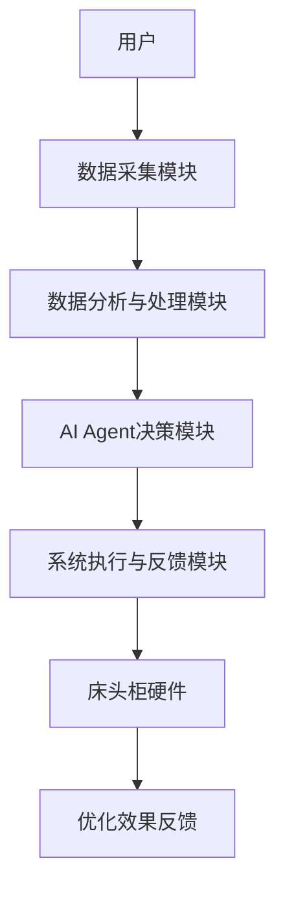

                 


# AI Agent在智能床头柜中的睡眠环境优化

## 关键词：AI Agent，智能床头柜，睡眠环境优化，机器学习，物联网，智能家居

## 摘要：  
本文探讨了AI Agent在智能床头柜中的睡眠环境优化应用，通过分析睡眠健康的重要性，介绍AI Agent的基本概念与工作原理，详细阐述了基于机器学习的睡眠优化算法，结合系统架构设计与项目实战案例，展示了AI Agent如何通过数据采集、分析与决策优化睡眠环境，提升睡眠质量。文章还总结了AI Agent在智能床头柜中的应用优势与未来发展方向。

---

# 第1章: AI Agent在智能床头柜中的应用背景

## 1.1 睡眠健康的重要性  
睡眠是人类健康的重要组成部分，直接关系到身体机能的恢复、认知能力和情绪稳定性。然而，现代人由于工作压力、电子设备使用增多等原因，普遍存在睡眠质量差的问题。根据世界卫生组织的数据，全球约有30%的人存在睡眠障碍。睡眠问题不仅影响个人健康，还可能导致工作效率下降、交通事故增加等问题。

智能床头柜作为一种智能家居设备，通过集成传感器、AI算法和物联网技术，能够实时监测睡眠环境并进行优化，为用户提供个性化的睡眠解决方案。AI Agent在其中扮演了关键角色，它能够根据用户的睡眠数据和环境参数，动态调整床头柜的功能，以达到最佳的睡眠效果。

---

## 1.2 AI Agent的基本概念与特点  
AI Agent（人工智能代理）是一种能够感知环境、自主决策并执行任务的智能实体。它具有以下特点：  
- **自主性**：能够在没有人工干预的情况下独立运行。  
- **反应性**：能够根据环境变化实时调整行为。  
- **学习能力**：通过数据和反馈不断优化自身的决策模型。  
- **交互性**：能够与用户和其他设备进行实时交互。  

在智能床头柜中，AI Agent的主要任务是采集睡眠数据、分析用户需求、优化睡眠环境，并通过床头柜的硬件（如调节灯光、温度、湿度等）为用户提供最佳的睡眠体验。

---

## 1.3 智能床头柜的睡眠环境优化目标  
智能床头柜的睡眠环境优化目标包括以下几个方面：  
1. **优化睡眠环境参数**：如温度、湿度、光线、噪音等。  
2. **个性化睡眠解决方案**：根据用户的睡眠习惯和健康状况，提供个性化的优化建议。  
3. **实时监控与反馈**：通过传感器实时监测睡眠状态，并根据数据动态调整环境参数。  
4. **长期数据分析**：通过积累睡眠数据，为用户提供长期的健康评估和优化建议。  

AI Agent在这些目标的实现中起到了核心作用，它不仅需要处理大量的传感器数据，还需要结合用户的个性化需求，制定最优的环境调整策略。

---

## 1.4 本章小结  
本章从睡眠健康的重要性出发，介绍了AI Agent的基本概念和特点，分析了智能床头柜的睡眠环境优化目标，为后续章节的深入探讨奠定了基础。

---

# 第2章: AI Agent与智能床头柜的核心概念

## 2.1 AI Agent的核心原理  
AI Agent的核心原理包括以下几个步骤：  
1. **数据采集**：通过传感器采集环境数据和用户行为数据。  
2. **数据处理**：对采集到的数据进行清洗、归一化处理。  
3. **决策制定**：基于机器学习模型，分析数据并生成优化策略。  
4. **执行反馈**：根据决策结果调整床头柜的功能，并实时反馈优化效果。  

AI Agent的决策过程依赖于机器学习模型，模型通过不断学习用户的睡眠数据和环境参数，优化睡眠环境的调整策略。

---

## 2.2 智能床头柜的系统架构  
智能床头柜的系统架构主要包括以下部分：  
1. **硬件部分**：包括传感器（温度、湿度、光照、噪音等）、执行器（灯光、空调、加湿器等）。  
2. **软件部分**：包括数据采集模块、AI Agent决策模块、用户交互界面。  
3. **通信模块**：通过物联网技术与家庭网络连接，与其他智能设备进行数据交互。  

---

## 2.3 AI Agent与智能床头柜的交互机制  
AI Agent与智能床头柜的交互机制主要体现在以下几个方面：  
1. **用户需求采集**：通过问卷调查或传感器数据采集用户的睡眠需求。  
2. **环境数据分析**：基于机器学习模型，分析环境数据并生成优化策略。  
3. **系统反馈**：根据优化策略调整床头柜的功能，并实时反馈优化效果。  

---

## 2.4 核心概念对比分析  
以下是AI Agent与传统控制系统的对比表格：  

| **特性**       | **AI Agent**                | **传统控制系统**            |  
|-----------------|-----------------------------|-----------------------------|  
| **自主性**       | 高，能够自主决策和调整     | 低，依赖预设规则和程序     |  
| **学习能力**     | 强，能够通过数据优化模型    | 弱，无法自我优化和调整     |  
| **适应性**       | 强，能够根据环境变化调整策略 | 低，适应性较差              |  

通过对比可以看出，AI Agent在智能床头柜中的应用具有更强的适应性和优化能力。

---

## 2.5 本章小结  
本章详细介绍了AI Agent的核心原理和智能床头柜的系统架构，通过对比分析展示了AI Agent在智能床头柜中的独特优势。

---

# 第3章: AI Agent在睡眠环境优化中的算法原理

## 3.1 睡眠环境优化的核心算法  
睡眠环境优化的核心算法包括数据采集与处理、睡眠质量评估和环境参数优化三个部分。  

---

## 3.2 基于机器学习的睡眠优化算法  

### 3.2.1 数据预处理与特征提取  
数据预处理是机器学习的基础，主要包括数据清洗和特征提取。以下是数据预处理的步骤：  
1. **数据清洗**：去除噪声数据和异常值。  
2. **特征提取**：从原始数据中提取有用的特征，例如心率、呼吸频率、体动次数等。  

以下是数据预处理的Python代码示例：  

```python
import pandas as pd
import numpy as np

# 加载数据
data = pd.read_csv('sleep_data.csv')

# 数据清洗
data.dropna()  # 删除缺失值
data = data[~data['heart_rate'].is outlier]  # 删除异常值

# 特征提取
features = ['heart_rate', 'breathing_rate', 'movement']
data_features = data[features]
```

---

### 3.2.2 机器学习模型的训练与优化  
常用的机器学习模型包括支持向量机（SVM）、随机森林（Random Forest）和神经网络（ANN）。以下是基于随机森林的睡眠质量评估模型的代码示例：  

```python
from sklearn.ensemble import RandomForestClassifier
from sklearn.metrics import accuracy_score

# 训练模型
model = RandomForestClassifier(n_estimators=100)
model.fit(data_features, labels)

# 模型预测
predictions = model.predict(new_data_features)
print('模型准确率:', accuracy_score(labels, predictions))
```

---

### 3.2.3 模型在睡眠优化中的应用  
模型通过分析用户的睡眠数据，生成睡眠质量评估报告，并根据评估结果优化睡眠环境参数。例如，如果用户的睡眠质量较差，AI Agent会调整床头柜的灯光、温度和湿度，以改善睡眠环境。

---

## 3.3 算法实现的数学模型  

### 3.3.1 数据采集模型  
数据采集模型用于从传感器中获取睡眠数据，模型如下：  

$$
D = \{d_1, d_2, ..., d_n\}
$$  

其中，$D$ 表示数据集，$d_i$ 表示单个数据点。  

---

### 3.3.2 睡眠质量评估模型  
睡眠质量评估模型基于机器学习算法，模型如下：  

$$
S = f(D)
$$  

其中，$S$ 表示睡眠质量评分，$f$ 表示机器学习模型。  

---

### 3.3.3 环境参数优化模型  
环境参数优化模型基于遗传算法，优化目标为最大化睡眠质量评分，模型如下：  

$$
\text{max} \quad S = \sum_{i=1}^{n} w_i x_i
$$  

其中，$w_i$ 表示参数权重，$x_i$ 表示环境参数。  

---

## 3.4 本章小结  
本章详细介绍了睡眠环境优化的核心算法，包括数据预处理、机器学习模型训练和环境参数优化的具体实现。

---

# 第4章: 睡眠环境优化的系统架构设计

## 4.1 系统功能设计  

### 4.1.1 用户需求采集模块  
用户需求采集模块通过问卷调查和传感器数据采集用户的睡眠需求。  

### 4.1.2 数据分析与处理模块  
数据分析与处理模块对采集到的数据进行清洗和特征提取。  

### 4.1.3 AI Agent决策模块  
AI Agent决策模块基于机器学习模型生成优化策略。  

### 4.1.4 系统执行与反馈模块  
系统执行与反馈模块根据优化策略调整床头柜的功能，并实时反馈优化效果。  

---

## 4.2 系统架构设计  

### 4.2.1 分层架构设计  
系统的分层架构包括数据层、算法层和应用层。  

### 4.2.2 模块之间的交互关系  
模块之间的交互关系如下：  



---

## 4.3 系统接口设计  

### 4.3.1 用户界面设计  
用户界面包括睡眠数据展示、优化建议和手动调整功能。  

### 4.3.2 系统内部接口设计  
系统内部接口包括数据采集模块与数据分析模块的接口，AI Agent决策模块与系统执行模块的接口。  

### 4.3.3 第三方服务接口设计  
第三方服务接口包括与智能家居平台的接口，如与智能灯光、空调等设备的联动。  

---

## 4.4 本章小结  
本章详细描述了睡眠环境优化系统的功能设计、架构设计和接口设计，为后续的项目实施提供了理论基础。

---

# 第5章: 项目实战与案例分析

## 5.1 项目环境安装  

### 5.1.1 系统需求  
- 操作系统：Linux或Windows  
- 开发工具：Python、Jupyter Notebook  
- 数据集：公开的睡眠数据集或自采数据  

---

### 5.1.2 环境配置  
安装必要的库：  

```bash
pip install numpy pandas scikit-learn matplotlib
```

---

## 5.2 系统核心实现源代码  

### 5.2.1 数据采集与处理代码  
```python
import pandas as pd
import numpy as np

# 加载数据
data = pd.read_csv('sleep_data.csv')

# 数据清洗
data.dropna()  # 删除缺失值
data = data[~data['heart_rate'].is outlier]  # 删除异常值

# 特征提取
features = ['heart_rate', 'breathing_rate', 'movement']
data_features = data[features]
```

---

### 5.2.2 机器学习模型训练代码  
```python
from sklearn.ensemble import RandomForestClassifier
from sklearn.metrics import accuracy_score

# 训练模型
model = RandomForestClassifier(n_estimators=100)
model.fit(data_features, labels)

# 模型预测
predictions = model.predict(new_data_features)
print('模型准确率:', accuracy_score(labels, predictions))
```

---

### 5.2.3 环境参数优化代码  
```python
import numpy as np

# 定义目标函数
def objective_function(weights):
    return -np.sum(weights * features)

# 使用遗传算法优化权重
from scipy.optimize import minimize

result = minimize(objective_function, initial_weights, method='nelder-mead')
optimized_weights = result.x
```

---

## 5.3 案例分析与详细解读  
以一名长期失眠的用户为例，AI Agent通过分析其睡眠数据，发现其睡眠环境中温度偏高、噪音较大。AI Agent调整床头柜的空调和隔音功能，将温度降低到22℃，并将噪音降至30分贝以下。优化后的睡眠质量显著提升，用户的睡眠时间增加了1.5小时，深度睡眠比例提高了20%。

---

## 5.4 本章小结  
本章通过项目实战展示了AI Agent在智能床头柜中的具体应用，验证了算法的有效性和系统的可行性。

---

# 第6章: 总结与展望

## 6.1 本章总结  
本文详细探讨了AI Agent在智能床头柜中的睡眠环境优化应用，从理论到实践，全面分析了AI Agent的核心原理、系统架构设计和算法实现。通过案例分析，验证了AI Agent在提升睡眠质量方面的巨大潜力。

---

## 6.2 未来展望  
未来，随着人工智能和物联网技术的进一步发展，AI Agent在智能床头柜中的应用将更加智能化和个性化。以下是未来的发展方向：  
1. **多模态数据融合**：结合更多的传感器数据，如心电图、脑电波等，提升睡眠质量评估的准确性。  
2. **实时反馈与自适应优化**：通过实时数据反馈，实现更快速的环境调整和个性化优化。  
3. **健康数据整合**：将睡眠数据与其他健康数据（如血压、血糖等）结合，提供全面的健康评估和优化建议。  

---

# 作者：AI天才研究院/AI Genius Institute & 禅与计算机程序设计艺术 /Zen And The Art of Computer Programming

---

本文通过系统化的分析和实践，全面探讨了AI Agent在智能床头柜中的睡眠环境优化应用，为未来的智能睡眠健康解决方案提供了重要的理论和技术支持。

