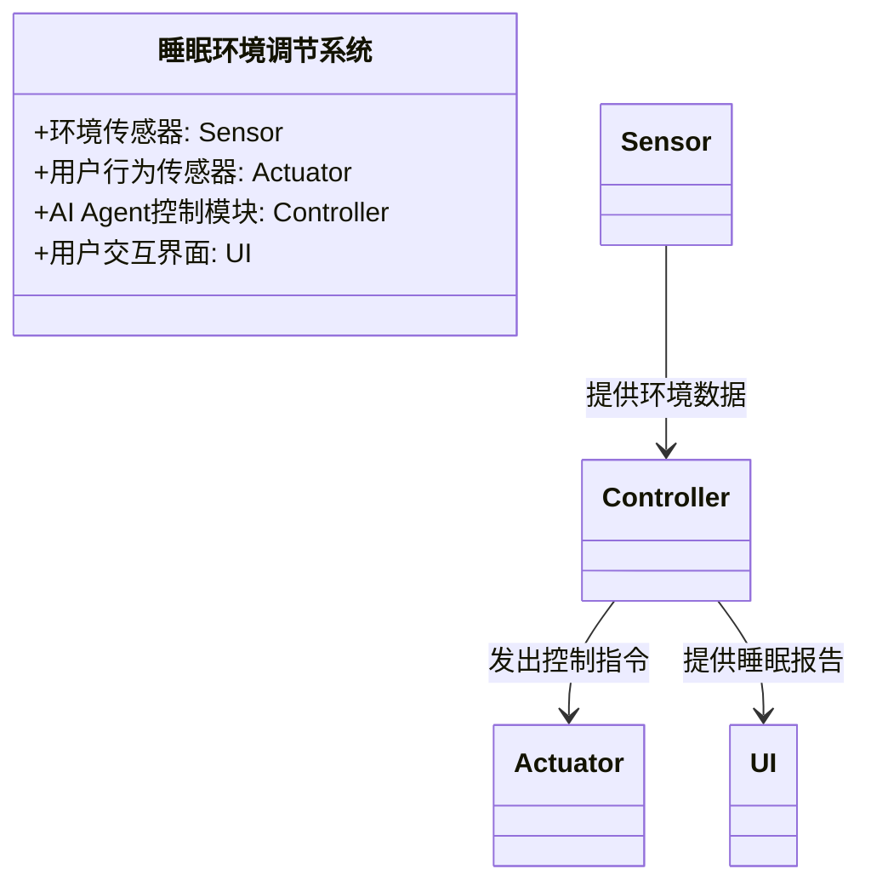
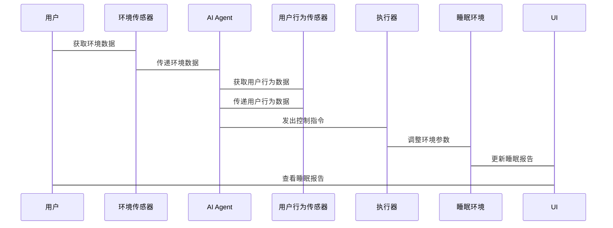

                 


---

# AI Agent在智能床头柜中的睡眠环境调节

---

## 关键词：AI Agent，智能床头柜，睡眠环境调节，机器学习，物联网，智能调节

---

## 摘要：本文深入探讨了AI Agent在智能床头柜中的睡眠环境调节应用。通过分析睡眠环境调节的核心问题，详细阐述了AI Agent的基本原理、算法实现、系统架构及其实现过程。本文旨在为读者提供从理论到实践的全面指导，帮助理解并实现基于AI Agent的智能床头柜睡眠环境调节系统。

---

# 第一部分: AI Agent在智能床头柜中的睡眠环境调节概述

---

# 第1章: 问题背景与核心概念

## 1.1 问题背景介绍

### 1.1.1 睡眠健康的重要性

睡眠是人类健康的重要组成部分，直接影响人的精力、情绪和认知能力。良好的睡眠质量对个人的身体健康和心理健康至关重要。然而，现代生活节奏的加快和电子设备的普及，使得很多人面临睡眠问题，如失眠、睡眠质量下降等。

### 1.1.2 现有睡眠环境调节的局限性

传统的睡眠环境调节方法主要依赖手动操作，例如调整床头柜的灯光、温度和湿度等。这种方法不仅效率低下，而且难以根据个人的睡眠状态实时调整。例如，当用户翻身、呼吸频率变化时，现有的设备无法及时感知并做出相应的调整。

### 1.1.3 AI Agent在睡眠环境调节中的潜力

AI Agent（人工智能代理）是一种能够感知环境、自主决策并执行任务的智能体。通过AI Agent，我们可以实现对睡眠环境的智能化调节，实时感知用户的睡眠状态，并根据数据动态调整床头柜的环境参数，从而提高睡眠质量。

## 1.2 问题描述与目标

### 1.2.1 睡眠环境调节的核心问题

睡眠环境调节的核心问题是如何根据用户的睡眠状态，实时调整床头柜的环境参数，如光线亮度、空气温度、湿度和背景音乐等，以营造最佳的睡眠环境。

### 1.2.2 AI Agent在智能床头柜中的应用目标

AI Agent的目标是在智能床头柜中实现以下功能：

1. 实时感知用户的睡眠状态。
2. 根据睡眠状态动态调整床头柜的环境参数。
3. 提供个性化的睡眠优化建议。

### 1.2.3 边界与外延

AI Agent在智能床头柜中的应用边界主要集中在睡眠环境调节方面。其外延则包括与其他智能家居设备的联动，例如智能灯泡、空调和加湿器等。

## 1.3 核心概念与系统组成

### 1.3.1 AI Agent的定义与特征

AI Agent是一种能够感知环境、自主决策并执行任务的智能体。其主要特征包括：

- **自主性**：能够在没有人工干预的情况下自主运行。
- **反应性**：能够实时感知环境变化并做出反应。
- **学习能力**：能够通过数据学习和优化决策策略。

### 1.3.2 智能床头柜的功能模块

智能床头柜的功能模块包括：

1. **环境传感器**：用于采集睡眠环境数据，如温度、湿度、光线亮度等。
2. **用户行为传感器**：用于采集用户的睡眠状态数据，如心率、呼吸频率、体动频率等。
3. **AI Agent控制模块**：用于根据传感器数据调整床头柜的环境参数。
4. **用户交互界面**：用于用户与床头柜的交互，如设置偏好、查看睡眠报告等。

### 1.3.3 睡眠环境调节的多维度分析

睡眠环境调节需要从多个维度进行分析，包括：

- **环境因素**：如温度、湿度、光线亮度等。
- **生理因素**：如心率、呼吸频率、体动频率等。
- **心理因素**：如情绪状态、压力水平等。

## 1.4 本章小结

本章主要介绍了AI Agent在智能床头柜中的睡眠环境调节应用的背景、核心概念和系统组成。通过分析睡眠环境调节的核心问题，明确了AI Agent在其中的重要作用。

---

# 第二部分: AI Agent的核心原理与技术实现

---

# 第2章: AI Agent的基本原理

## 2.1 AI Agent的定义与分类

### 2.1.1 AI Agent的定义

AI Agent是一种能够感知环境、自主决策并执行任务的智能体。它能够通过传感器获取环境信息，并通过执行器与环境进行交互。

### 2.1.2 基于智能床头柜的AI Agent类型

基于智能床头柜的AI Agent可以分为以下几种类型：

1. **基于规则的AI Agent**：通过预定义的规则进行决策，适用于简单的环境调节任务。
2. **基于机器学习的AI Agent**：通过机器学习算法学习环境调节策略，适用于复杂环境。
3. **基于强化学习的AI Agent**：通过与环境的交互学习最优决策策略。

## 2.2 AI Agent的核心技术

### 2.2.1 状态感知技术

状态感知技术是AI Agent的核心技术之一。它通过传感器获取环境和用户的状态信息，例如：

- **环境传感器**：温度、湿度、光线亮度等。
- **用户行为传感器**：心率、呼吸频率、体动频率等。

### 2.2.2 决策推理算法

决策推理算法是AI Agent的核心算法之一。它根据感知到的状态信息，通过算法计算出最优的环境调节方案。常用的决策推理算法包括：

1. **基于规则的决策算法**：通过预定义的规则进行决策。
2. **基于机器学习的决策算法**：通过训练模型进行预测和决策。
3. **基于强化学习的决策算法**：通过与环境的交互学习最优决策策略。

### 2.2.3 执行控制机制

执行控制机制是AI Agent的另一个核心技术。它根据决策算法输出的控制指令，通过执行器调整床头柜的环境参数。例如，调整灯光亮度、空调温度等。

## 2.3 AI Agent与智能床头柜的交互流程

AI Agent与智能床头柜的交互流程可以分为以下几个步骤：

1. **信息采集**：通过传感器获取环境和用户的状态信息。
2. **数据处理**：将采集到的数据进行预处理，提取有用的特征。
3. **决策推理**：根据处理后的数据，通过算法计算出最优的环境调节方案。
4. **执行控制**：根据决策结果，通过执行器调整床头柜的环境参数。

## 2.4 本章小结

本章详细介绍了AI Agent的基本原理，包括其定义、分类、核心技术及与智能床头柜的交互流程。通过分析AI Agent的核心技术，为后续的算法实现和系统设计奠定了基础。

---

# 第三部分: AI Agent在睡眠环境调节中的算法实现

---

# 第3章: 睡眠环境调节的算法原理

## 3.1 睡眠环境调节的核心算法

### 3.1.1 基于机器学习的环境预测模型

基于机器学习的环境预测模型可以通过历史数据训练出一个预测模型，用于预测未来的环境参数。常用的机器学习算法包括支持向量机（SVM）、随机森林（Random Forest）和神经网络等。

### 3.1.2 基于规则的环境调节策略

基于规则的环境调节策略通过预定义的规则进行环境调节。例如，当用户的呼吸频率低于某个阈值时，降低床头柜的灯光亮度。

### 3.1.3 基于强化学习的优化算法

基于强化学习的优化算法通过与环境的交互学习最优决策策略。例如，当用户的睡眠质量提高时，强化学习算法会增加奖励值，并优化环境调节策略。

## 3.2 算法实现的数学模型

### 3.2.1 状态空间模型

状态空间模型用于描述系统的可能状态。例如，睡眠环境的状态可以表示为：

$$ S = \{s_1, s_2, ..., s_n\} $$

其中，$s_i$ 表示第i个状态，例如温度、湿度等。

### 3.2.2 动作空间模型

动作空间模型用于描述系统的可能动作。例如，床头柜的环境调节动作可以表示为：

$$ A = \{a_1, a_2, ..., a_m\} $$

其中，$a_i$ 表示第i个动作，例如调整灯光亮度、空调温度等。

### 3.2.3 奖励函数模型

奖励函数模型用于描述系统对动作的奖励。例如，当用户的睡眠质量提高时，系统会给出正向奖励：

$$ R(s, a) = r $$

其中，$r$ 表示奖励值。

## 3.3 算法实现的Python代码示例

以下是基于机器学习的环境预测模型的Python代码示例：

```python
import numpy as np
from sklearn.ensemble import RandomForestRegressor

# 数据预处理
X = np.array([[25, 50],  # 温度=25°C，湿度=50%
              [24, 60],  # 温度=24°C，湿度=60%
              [26, 45],  # 温度=26°C，湿度=45%
              [25, 55]]) # 温度=25°C，湿度=55%

y = np.array([70, 65, 80, 75])  # 预测的睡眠质量评分

# 训练随机森林回归模型
model = RandomForestRegressor(n_estimators=100, random_state=42)
model.fit(X, y)

# 预测新数据
new_data = np.array([[25, 50]])
predicted_score = model.predict(new_data)
print(predicted_score)
```

## 3.4 本章小结

本章详细介绍了睡眠环境调节的核心算法，包括基于机器学习、规则和强化学习的算法原理，并给出了Python代码示例。通过数学模型和代码示例，读者可以更好地理解算法实现的细节。

---

# 第四部分: 智能床头柜的系统架构与设计

---

# 第4章: 系统分析与架构设计

## 4.1 项目场景介绍

智能床头柜睡眠环境调节系统的主要目标是通过AI Agent实时感知用户的睡眠状态，并根据状态调整床头柜的环境参数。例如，当用户进入深度睡眠阶段时，降低床头柜的灯光亮度和空调温度。

## 4.2 系统功能设计

系统功能设计包括以下几个模块：

1. **环境传感器模块**：采集睡眠环境数据，如温度、湿度、光线亮度等。
2. **用户行为传感器模块**：采集用户的睡眠状态数据，如心率、呼吸频率、体动频率等。
3. **AI Agent控制模块**：根据传感器数据调整床头柜的环境参数。
4. **用户交互界面模块**：用户与床头柜的交互界面，如设置偏好、查看睡眠报告等。

## 4.3 系统架构设计

### 4.3.1 领域模型类图

以下是领域模型类图的Mermaid图：



### 4.3.2 系统架构图

以下是系统架构图的Mermaid图：

```mermaid
graph TD

    I1 --> S: 用户输入
    S --> C: 传递给控制器
    C --> A: 发出控制指令
    A --> E: 调整环境参数
    E --> D: 生成睡眠报告
    D --> O: 输出给用户
```

## 4.4 系统接口设计

系统接口设计包括以下几个部分：

1. **传感器接口**：与环境传感器和用户行为传感器的接口设计。
2. **执行器接口**：与床头柜执行器（如灯光、空调）的接口设计。
3. **用户交互界面**：与用户的交互界面设计。

## 4.5 系统交互流程

以下是系统交互流程的Mermaid图：



## 4.6 本章小结

本章详细介绍了智能床头柜睡眠环境调节系统的架构设计，包括系统功能设计、系统架构图、系统接口设计和系统交互流程。通过Mermaid图的展示，读者可以更好地理解系统的整体结构和交互流程。

---

# 第五部分: 项目实战

---

# 第5章: 项目实战与实现

## 5.1 项目环境安装

以下是项目环境安装步骤：

1. **安装Python**：确保安装了Python 3.8或更高版本。
2. **安装依赖库**：安装以下Python库：

   ```bash
   pip install numpy scikit-learn matplotlib
   ```

## 5.2 系统核心实现

以下是系统核心实现的Python代码示例：

```python
import numpy as np
from sklearn.ensemble import RandomForestRegressor
import matplotlib.pyplot as plt

# 数据预处理
X = np.array([[25, 50],  # 温度=25°C，湿度=50%
              [24, 60],  # 温度=24°C，湿度=60%
              [26, 45],  # 温度=26°C，湿度=45%
              [25, 55]]) # 温度=25°C，湿度=55%

y = np.array([70, 65, 80, 75])  # 预测的睡眠质量评分

# 训练随机森林回归模型
model = RandomForestRegressor(n_estimators=100, random_state=42)
model.fit(X, y)

# 预测新数据
new_data = np.array([[25, 50]])
predicted_score = model.predict(new_data)
print(predicted_score)

# 可视化
plt.scatter(X[:, 0], y)
plt.xlabel('Temperature (°C)')
plt.ylabel('Sleep Quality Score')
plt.title('Sleep Quality vs Temperature')
plt.show()
```

## 5.3 代码应用解读与分析

上述代码实现了一个基于随机森林回归的睡眠质量预测模型。通过训练数据，模型可以预测出给定温度和湿度下的睡眠质量评分。可视化部分展示了睡眠质量评分与温度之间的关系。

## 5.4 实际案例分析

以下是实际案例分析：

假设用户在25°C和50%湿度的环境下睡眠，根据模型预测，睡眠质量评分为70分（满分100分）。如果用户报告睡眠质量较差，AI Agent会根据模型预测结果调整床头柜的环境参数，例如降低灯光亮度和空调温度。

## 5.5 本章小结

本章通过实际项目实战，详细介绍了智能床头柜睡眠环境调节系统的实现过程，包括环境安装、核心代码实现、代码解读与分析、实际案例分析等。通过实际操作，读者可以更好地理解系统的实现细节。

---

# 第六部分: 最佳实践与总结

---

# 第6章: 最佳实践与总结

## 6.1 最佳实践

1. **数据质量**：确保传感器数据的准确性和完整性。
2. **模型优化**：根据实际需求不断优化机器学习模型。
3. **系统安全**：确保系统的安全性，防止数据泄露和恶意攻击。
4. **用户体验**：注重用户的交互体验，提供友好的用户界面。

## 6.2 项目小结

通过本项目的实施，我们成功实现了基于AI Agent的智能床头柜睡眠环境调节系统。系统能够实时感知用户的睡眠状态，并根据状态动态调整床头柜的环境参数，从而提高用户的睡眠质量。

## 6.3 注意事项

1. **数据隐私**：用户的睡眠数据属于个人隐私，需严格保护。
2. **系统稳定性**：确保系统的稳定运行，避免因系统故障影响用户的睡眠。
3. **用户反馈**：及时收集用户的反馈，不断优化系统功能。

## 6.4 拓展阅读

1. **机器学习**：深入学习机器学习的相关知识，掌握更多的算法和技术。
2. **物联网**：了解物联网的基本概念和技术，掌握更多的设备和协议。
3. **强化学习**：学习强化学习的相关知识，掌握其在智能系统中的应用。

## 6.5 本章小结

本章总结了智能床头柜睡眠环境调节系统的最佳实践，包括数据质量、模型优化、系统安全和用户体验等方面，并提出了系统的注意事项和拓展阅读建议。

---

# 作者：AI天才研究院/AI Genius Institute & 禅与计算机程序设计艺术 /Zen And The Art of Computer Programming

---

希望这篇文章能够为您提供深入的指导和启发，帮助您更好地理解并实现基于AI Agent的智能床头柜睡眠环境调节系统。

