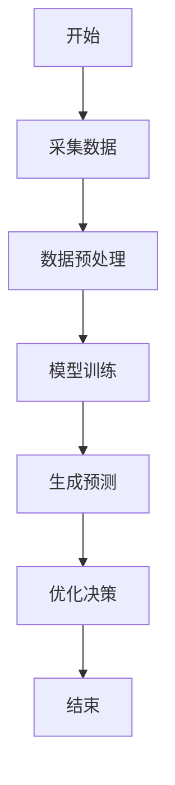
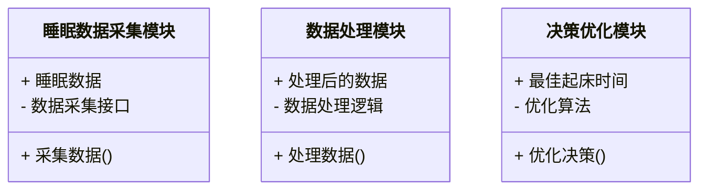
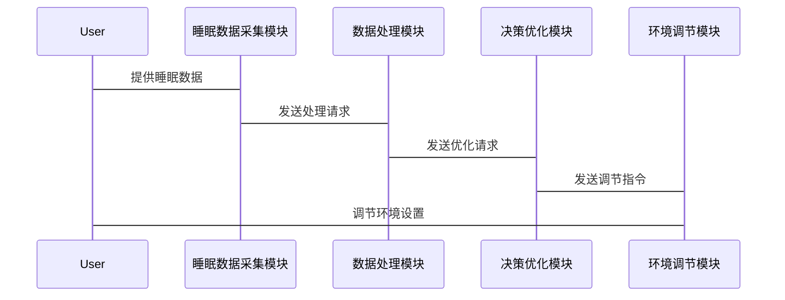

                 


```markdown
# 第一部分: AI Agent与智能床头柜的背景介绍

# 第1章: AI Agent与智能床头柜概述

## 1.1 AI Agent的基本概念
### 1.1.1 AI Agent的定义与特点
AI Agent，即人工智能代理，是一种能够感知环境并采取行动以实现目标的智能实体。它具备以下特点：
- **自主性**：能够在没有外部干预的情况下独立运行。
- **反应性**：能够根据环境变化实时调整行为。
- **目标导向**：通过优化目标函数来实现预定目标。
- **学习能力**：能够通过数据和经验不断优化自身算法。

### 1.1.2 AI Agent的核心功能与应用场景
AI Agent的核心功能包括：
- 数据采集与处理
- 智能决策与推理
- 行为执行与反馈
- 自适应优化

应用场景广泛，例如智能家居、自动驾驶、智能助手等。

### 1.1.3 智能床头柜的定义与功能
智能床头柜是一种结合了物联网技术的智能家居设备，具备以下功能：
- 睡眠监测
- 起床提醒
- 环境调节
- 健康数据采集

## 1.2 起床优化系统的背景与问题背景
### 1.2.1 传统起床方式的痛点分析
传统起床方式存在以下问题：
- **闹钟依赖**：过度依赖闹钟可能导致睡眠紊乱。
- **效率低下**：起床后可能需要较长时间才能完全清醒。
- **个性化不足**：无法根据个人习惯和健康状况调整起床时间。

### 1.2.2 AI Agent在起床优化中的作用
AI Agent可以通过以下方式优化起床过程：
- 智能调节起床时间
- 个性化提醒策略
- 结合环境数据优化起床体验

### 1.2.3 智能床头柜的市场需求与发展趋势
随着智能家居的普及，智能床头柜市场需求增长迅速，未来发展趋势包括：
- 更高的智能化
- 更强的个性化
- 更多的健康监测功能

## 1.3 起床优化系统的边界与外延
### 1.3.1 系统边界与功能范围
起床优化系统的边界包括：
- 用户输入：睡眠数据、健康数据
- 输出：起床时间建议、环境调节指令

功能范围涵盖：
- 数据采集
- 数据分析
- 决策优化
- 用户反馈

### 1.3.2 系统外延与扩展可能性
系统外延包括：
- 与其他智能家居设备的联动
- 数据共享与分析
- 远程控制功能

### 1.3.3 系统核心要素与组成结构
系统核心要素包括：
- AI Agent
- 数据采集模块
- 决策优化模块
- 执行模块

# 第二部分: AI Agent与起床优化系统的核心概念与联系

# 第2章: AI Agent的核心原理与特性

## 2.1 AI Agent的核心原理
### 2.1.1 感知与决策机制
AI Agent通过感知环境数据，利用算法进行决策，主要包括：
- 数据采集：通过传感器获取环境和用户数据
- 数据处理：对数据进行清洗、分析和建模
- 决策优化：基于优化算法生成决策方案

### 2.1.2 行为执行与反馈优化
AI Agent根据决策结果执行相应动作，并通过反馈机制不断优化自身行为。

### 2.1.3 多目标优化算法
多目标优化算法用于在多个目标之间找到平衡点，例如在起床时间优化中，需要平衡起床效率和舒适度。

## 2.2 AI Agent的属性特征对比
### 2.2.1 不同AI Agent模型的对比分析
使用表格对比不同AI Agent模型的特点，例如基于规则的AI Agent和基于机器学习的AI Agent。

### 2.2.2 基于表格的核心属性特征对比
| 属性 | 基于规则的AI Agent | 基于机器学习的AI Agent |
|------|---------------------|--------------------------|
| 决策方式 | 预定义规则         | 数据驱动模型             |
| 灵活性 | 较低                | 较高                     |
| 学习能力 | 无                 | 有                      |

### 2.2.3 ER实体关系图架构
使用Mermaid图展示系统中的实体及其关系：
```mermaid
er
    entity 用户 {
        key 用户ID
        属性 睡眠数据
        属性 偏好设置
    }
    entity 时间 {
        key 时间戳
        属性 环境数据
    }
```

# 第3章: 起床优化系统

## 3.1 起床优化系统的核心原理
### 3.1.1 数据采集与分析
通过智能床头柜采集用户的睡眠数据和环境数据，例如心率、体温、光线、噪音等。

### 3.1.2 数据建模与分析
使用时间序列分析模型预测最佳起床时间，例如ARIMA模型：
$$ARIMA(p, d, q)$$

### 3.1.3 决策优化
基于预测模型和优化算法（如遗传算法）生成最优起床时间。

## 3.2 起床优化系统的算法实现
### 3.2.1 基于时间序列预测的起床时间优化算法
使用Mermaid流程图展示算法步骤：


### 3.2.2 算法实现的Python代码
```python
import pandas as pd
from statsmodels.tsa.arima_model import ARIMA

# 数据预处理
data = pd.read_csv('sleep_data.csv')
data = data['sleep_duration'].values

# 模型训练
model = ARIMA(data, order=(5,1,0))
model_fit = model.fit(disp=0)

# 预测未来时间点的起床时间
forecast = model_fit.forecast(steps=1)
```

### 3.2.3 数学模型与公式
ARIMA模型的数学公式：
$$
\phi(B)X_t = \theta(B)\epsilon_t
$$

其中，$\phi(B)$和$\theta(B)$分别是自回归多项式和滑动平均多项式。

## 3.3 系统架构设计

### 3.3.1 系统功能设计
使用Mermaid类图展示系统功能：


### 3.3.2 系统架构设计
使用Mermaid架构图展示系统架构：


### 3.3.3 系统接口设计
系统接口设计包括：
- 数据采集接口：负责采集用户的睡眠数据
- 决策优化接口：负责生成最佳起床时间
- 环境调节接口：负责调节床头柜的环境设置

### 3.3.4 系统交互设计
使用Mermaid序列图展示系统交互：


## 3.4 项目实战

### 3.4.1 环境安装与配置
安装必要的库：
```bash
pip install pandas statsmodels
```

### 3.4.2 系统核心实现
实现决策优化模块的Python代码：
```python
def optimize_wakeup_time(sleep_data):
    # 数据预处理
    processed_data = preprocess(sleep_data)
    # 模型训练
    model = train_model(processed_data)
    # 优化决策
    optimal_time = model.predict(processed_data)
    return optimal_time

def preprocess(sleep_data):
    # 数据清洗和转换
    pass

def train_model(processed_data):
    # 训练模型并返回最优解
    pass
```

### 3.4.3 代码解读与应用分析
详细解读上述代码，并分析其在实际应用中的表现，例如预测准确率和运行效率。

### 3.4.4 实际案例分析
通过具体案例展示系统在实际中的应用，例如分析用户睡眠数据，生成最佳起床时间，并评估系统效果。

## 3.5 小结与展望

### 3.5.1 小结
总结本章内容，回顾AI Agent在起床优化系统中的核心作用和实现过程。

### 3.5.2 未来展望
探讨未来的研究方向，例如更高级的算法、更多功能的扩展。

# 第4章: 总结与参考文献

## 4.1 总结
总结全书内容，强调AI Agent在智能床头柜中的重要性。

## 4.2 参考文献
列出本书中参考的相关文献和资料。

## 4.3 索引
提供书中出现的专业术语和概念的索引。

---

作者：AI天才研究院/AI Genius Institute & 禅与计算机程序设计艺术 /Zen And The Art of Computer Programming
```

