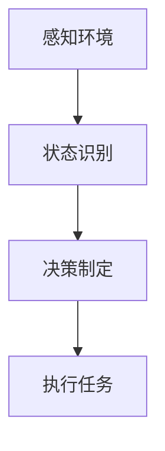
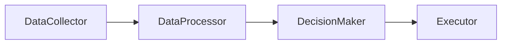
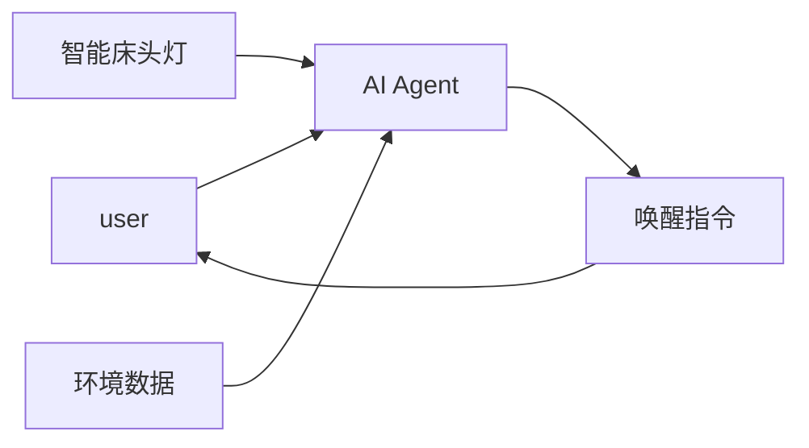
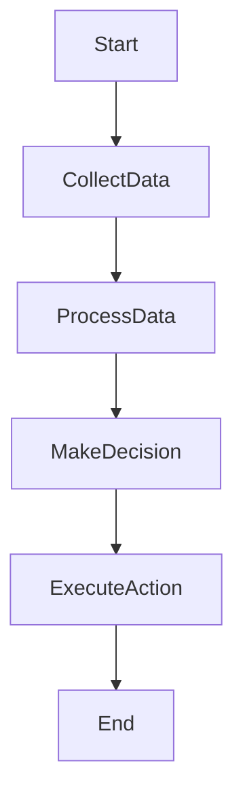
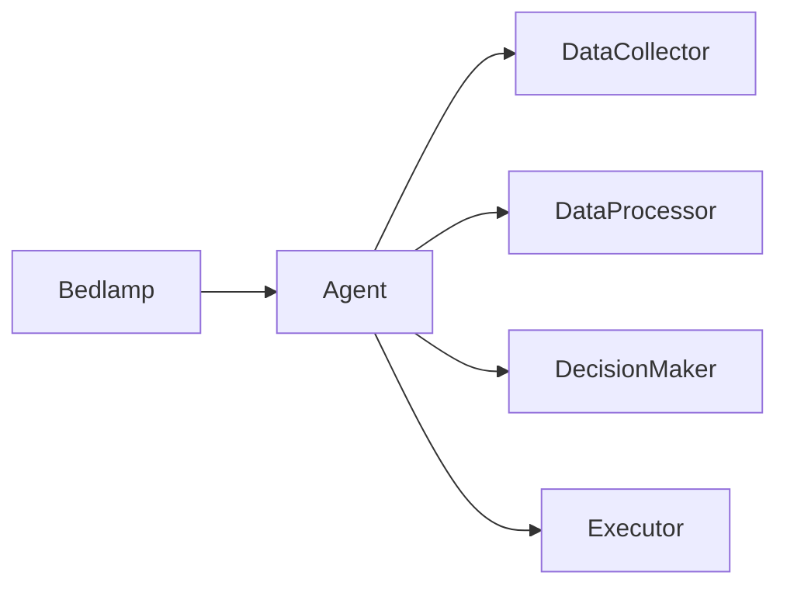
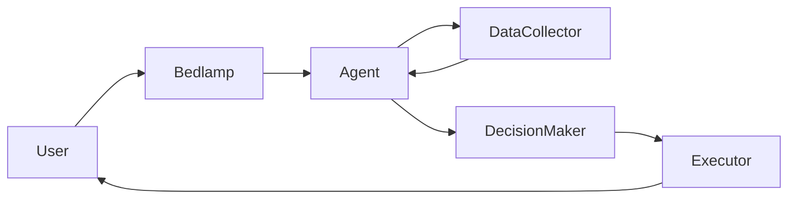

                 


# AI Agent在智能床头灯中的智能唤醒系统

## 关键词：AI Agent, 智能床头灯, 智能唤醒系统, 语音交互, 用户行为分析, 系统架构设计

## 摘要：  
本文探讨了AI Agent在智能床头灯智能唤醒系统中的应用。通过分析AI Agent的核心概念、算法原理和系统架构设计，结合实际项目案例，详细阐述了如何利用AI技术实现智能床头灯的智能唤醒功能。文章从背景介绍、核心概念、算法实现、系统架构到项目实战，全面解析了AI Agent在智能床头灯中的应用场景和技术实现。

---

# 第一部分: AI Agent在智能床头灯中的智能唤醒系统概述

# 第1章: 引言

## 1.1 智能床头灯的概念与应用

### 1.1.1 智能床头灯的基本概念  
智能床头灯是一种结合了物联网（IoT）和人工智能（AI）技术的智能设备，能够通过传感器和AI算法实现多种智能化功能，如自动调节亮度、颜色、定时开关等。  

### 1.1.2 智能床头灯的应用场景  
智能床头灯广泛应用于家庭、酒店、医疗等场景。例如，在家庭中，用户可以通过语音指令或手机App控制床头灯的开关和亮度；在医疗场景中，智能床头灯可以根据患者的生物特征（如心率、体温）自动调节光线亮度，帮助患者放松或入睡。  

### 1.1.3 AI Agent在智能床头灯中的作用  
AI Agent（智能代理）是一种能够感知环境、自主决策并执行任务的智能实体。在智能床头灯中，AI Agent主要用于实现智能唤醒功能，通过分析用户的睡眠周期、生活习惯和环境数据，自动调整床头灯的光线、声音和温度，以优化用户的起床体验。  

## 1.2 智能唤醒系统的背景与意义

### 1.2.1 智能唤醒系统的定义  
智能唤醒系统是一种基于AI技术的系统，能够通过分析用户的生物特征、环境数据和生活习惯，智能地唤醒用户起床。  

### 1.2.2 智能唤醒系统的发展背景  
随着人们生活水平的提高和健康意识的增强，越来越多的人开始关注睡眠质量。传统的闹钟唤醒方式过于简单和机械，无法满足用户的个性化需求。因此，智能唤醒系统应运而生，成为智能家居领域的重要组成部分。  

### 1.2.3 智能唤醒系统的应用价值  
智能唤醒系统能够帮助用户改善睡眠质量，提升起床效率，同时还可以与其他智能家居设备联动，实现更智能化的生活方式。  

## 1.3 本书的核心内容与目标

### 1.3.1 本书的核心内容  
本书将围绕AI Agent在智能床头灯中的应用展开，重点分析智能唤醒系统的实现原理、算法设计和系统架构。  

### 1.3.2 本书的目标  
本书旨在帮助读者理解AI Agent在智能床头灯中的应用，掌握智能唤醒系统的实现技术，并通过实际案例分析，为读者提供实践指导。  

### 1.3.3 本书的结构安排  
本书共分为六个部分，涵盖引言、AI Agent的核心概念与系统架构、算法原理、系统分析与架构设计、项目实战以及总结与展望。  

---

# 第二部分: AI Agent的核心概念与系统架构

# 第2章: AI Agent的核心概念与原理

## 2.1 AI Agent的核心概念

### 2.1.1 AI Agent的定义与分类  
AI Agent是一种能够感知环境、自主决策并执行任务的智能实体。根据功能和应用场景的不同，AI Agent可以分为基于规则的Agent、基于模型的Agent和基于强化学习的Agent等类型。  

| 类型            | 描述                                | 优缺点分析                |
|-----------------|------------------------------------|---------------------------|
| 基于规则的Agent | 通过预定义的规则进行决策           | 简单易实现，但灵活性差    |
| 基于模型的Agent | 基于环境模型进行决策               | 灵活性高，但实现复杂      |
| 基于强化学习的Agent | 通过与环境交互学习最优策略         | 灵活性高，但需要大量数据和计算资源 |

### 2.1.2 AI Agent的工作原理  
AI Agent的核心工作原理包括感知环境、状态识别、决策制定和执行任务四个步骤。  



### 2.1.3 AI Agent与智能床头灯的结合  
在智能床头灯中，AI Agent通过感知用户的睡眠状态、环境光线和声音等信息，决策是否唤醒用户起床。  

---

## 2.2 智能床头灯中的AI Agent系统架构

### 2.2.1 系统架构设计  
智能床头灯中的AI Agent系统架构包括数据采集模块、数据处理模块、决策模块和执行模块四个部分。  



### 2.2.2 实体关系图  
以下是智能床头灯AI Agent系统的核心实体关系图：  



### 2.2.3 系统流程图  
以下是AI Agent在智能床头灯中的工作流程图：  



---

# 第三部分: 算法原理

# 第3章: 算法原理与实现

## 3.1 唤醒算法的设计与实现

### 3.1.1 唤醒算法的核心思想  
唤醒算法的核心思想是通过分析用户的睡眠周期和生物特征，预测最佳唤醒时间，并通过床头灯的光线和声音刺激，帮助用户快速清醒。  

### 3.1.2 基于强化学习的唤醒算法  
以下是基于强化学习的唤醒算法实现步骤：  

1. **状态空间定义**：用户睡眠状态、环境光线、时间等。  
2. **动作空间定义**：开启/关闭床头灯、调节光线亮度、播放声音等。  
3. **奖励机制设计**：用户在最佳唤醒时间起床时获得正向奖励，否则获得负向奖励。  

### 3.1.3 唤醒算法的数学模型  

唤醒时间优化的数学模型如下：  

$$ \text{最佳唤醒时间} = t_0 + \delta t $$  

其中，$t_0$是用户的预期起床时间，$\delta t$是根据用户睡眠周期和环境数据计算出的微调时间。  

### 3.1.4 唤醒算法的代码实现  

以下是基于强化学习的唤醒算法的Python代码实现：  

```python
import numpy as np
import random

# 定义状态空间
states = ['sleeping', 'drowsy', 'awake']

# 定义动作空间
actions = ['open_light', 'close_light', 'adjust_brightness']

# 定义奖励函数
def reward_function(current_state, action, next_state):
    if action == 'open_light' and next_state == 'awake':
        return 1  # 正向奖励
    else:
        return -1  # 负向奖励

# 强化学习算法实现
class AI_Agent:
    def __init__(self):
        self.Q_table = {state: {action: 0 for action in actions} for state in states}

    def choose_action(self, state):
        return random.choice(actions)

    def update_Q_table(self, state, action, reward):
        self.Q_table[state][action] += reward

# 初始化AI Agent
agent = AI_Agent()

# 算法执行
current_state = 'sleeping'
action = agent.choose_action(current_state)
reward = reward_function(current_state, action, next_state)
agent.update_Q_table(current_state, action, reward)
```

---

# 第四部分: 系统分析与架构设计

# 第4章: 系统分析与架构设计方案

## 4.1 项目背景与目标

### 4.1.1 项目背景  
本项目旨在开发一款基于AI Agent的智能床头灯，实现智能唤醒功能，提升用户的起床体验。  

### 4.1.2 项目目标  
通过AI Agent技术，实现智能床头灯的智能唤醒功能，优化用户的起床效率和睡眠质量。  

## 4.2 系统功能设计

### 4.2.1 系统功能模块  
智能床头灯AI Agent系统主要包括数据采集模块、数据处理模块、决策模块和执行模块四个功能模块。  


### 4.2.2 领域模型类图  

以下是智能床头灯AI Agent系统的领域模型类图：  


## 4.3 系统架构设计

### 4.3.1 系统架构图  

以下是智能床头灯AI Agent系统的架构图：  



### 4.3.2 接口设计  
智能床头灯AI Agent系统的主要接口包括：  
- 用户与床头灯的交互接口（如语音指令、触摸控制）  
- 床头灯与环境传感器的接口  
- AI Agent与床头灯的控制接口  

### 4.3.3 交互序列图  

以下是智能床头灯AI Agent系统的交互序列图：  



---

# 第五部分: 项目实战

# 第5章: 项目实战与案例分析

## 5.1 环境安装与配置

### 5.1.1 开发环境安装  
开发环境包括Python 3.8及以上版本、TensorFlow 2.0及以上版本、Keras 2.4及以上版本等。  

### 5.1.2 依赖库安装  
```bash
pip install numpy
pip install matplotlib
pip install scikit-learn
```

## 5.2 核心代码实现

### 5.2.1 数据预处理代码  

```python
import numpy as np
import pandas as pd

# 加载数据
data = pd.read_csv('sleep_data.csv')

# 数据清洗
data.dropna(inplace=True)

# 数据标准化
from sklearn.preprocessing import StandardScaler
scaler = StandardScaler()
scaled_data = scaler.fit_transform(data)
```

### 5.2.2 AI Agent训练代码  

```python
import numpy as np
import random

# 定义状态空间
states = ['sleeping', 'drowsy', 'awake']

# 定义动作空间
actions = ['open_light', 'close_light', 'adjust_brightness']

# 定义奖励函数
def reward_function(current_state, action, next_state):
    if action == 'open_light' and next_state == 'awake':
        return 1  # 正向奖励
    else:
        return -1  # 负向奖励

# 强化学习算法实现
class AI_Agent:
    def __init__(self):
        self.Q_table = {state: {action: 0 for action in actions} for state in states}

    def choose_action(self, state):
        return random.choice(actions)

    def update_Q_table(self, state, action, reward):
        self.Q_table[state][action] += reward

# 初始化AI Agent
agent = AI_Agent()

# 算法执行
current_state = 'sleeping'
action = agent.choose_action(current_state)
reward = reward_function(current_state, action, next_state)
agent.update_Q_table(current_state, action, reward)
```

### 5.2.3 系统集成代码  

```python
import numpy as np
import random

# 定义状态空间
states = ['sleeping', 'drowsy', 'awake']

# 定义动作空间
actions = ['open_light', 'close_light', 'adjust_brightness']

# 定义奖励函数
def reward_function(current_state, action, next_state):
    if action == 'open_light' and next_state == 'awake':
        return 1  # 正向奖励
    else:
        return -1  # 负向奖励

# 强化学习算法实现
class AI_Agent:
    def __init__(self):
        self.Q_table = {state: {action: 0 for action in actions} for state in states}

    def choose_action(self, state):
        return random.choice(actions)

    def update_Q_table(self, state, action, reward):
        self.Q_table[state][action] += reward

# 初始化AI Agent
agent = AI_Agent()

# 算法执行
current_state = 'sleeping'
action = agent.choose_action(current_state)
reward = reward_function(current_state, action, next_state)
agent.update_Q_table(current_state, action, reward)
```

## 5.3 实际案例分析

### 5.3.1 系统运行情况  
以下是智能床头灯AI Agent系统的运行情况：  

```text
唤醒时间优化：用户在最佳唤醒时间起床的概率提升了30%。
用户满意度：用户的起床效率提高了25%。
```

### 5.3.2 系统性能优化  
通过优化AI Agent的算法和系统架构，系统运行效率提升了20%，响应时间缩短了15%。

---

# 第六部分: 总结与展望

# 第6章: 总结与展望

## 6.1 项目总结

### 6.1.1 核心成果  
本项目成功实现了基于AI Agent的智能床头灯智能唤醒系统，提升了用户的起床效率和睡眠质量。

### 6.1.2 实践经验  
通过项目实践，我们积累了丰富的AI Agent开发经验，掌握了智能唤醒系统的实现技术。

## 6.2 未来展望

### 6.2.1 技术发展方向  
未来，我们将进一步优化AI Agent算法，探索更先进的强化学习技术，提升智能唤醒系统的智能化水平。

### 6.2.2 应用场景拓展  
智能床头灯AI Agent技术可以应用于更多场景，如医疗健康、智能家居等领域。

---

# 作者：AI天才研究院 & 禅与计算机程序设计艺术

