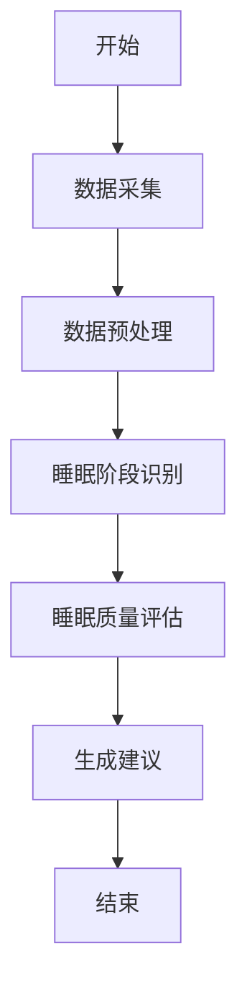
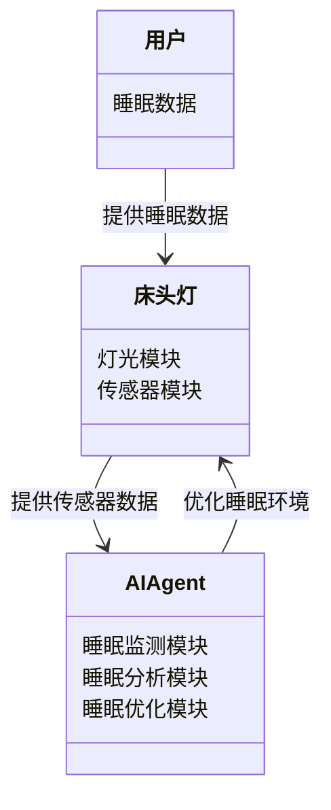
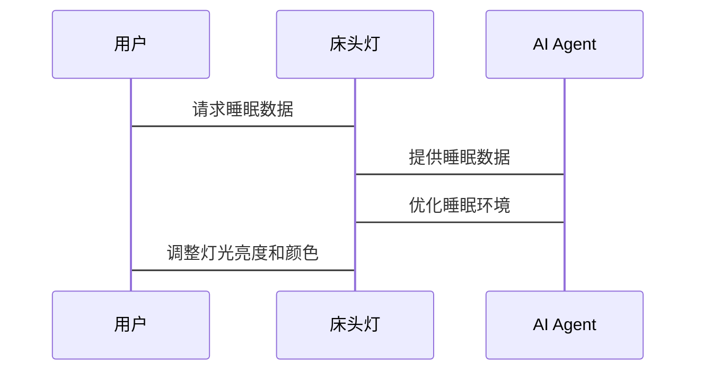

                 


# AI Agent在智能床头灯中的睡眠辅助

## 关键词：AI Agent, 智能床头灯, 睡眠辅助, 睡眠健康, 个性化推荐, 睡眠监测

## 摘要：AI Agent作为一种智能代理，通过感知、决策和执行的能力，能够为智能床头灯提供个性化的睡眠辅助功能。本文将深入探讨AI Agent在智能床头灯中的应用，从背景介绍到系统架构设计，再到项目实战，全面解析如何利用AI技术改善睡眠质量，提供睡眠辅助的最佳实践。

---

## 第一部分: AI Agent在智能床头灯中的睡眠辅助背景介绍

### 第1章: AI Agent与智能床头灯概述

#### 1.1 AI Agent的基本概念
##### 1.1.1 什么是AI Agent
AI Agent（智能代理）是一种能够感知环境、做出决策并执行任务的智能系统。它可以自主地进行问题解决，无需人工干预。AI Agent的核心在于其智能性，能够通过传感器获取信息，并基于预设的目标和规则进行自主决策。

##### 1.1.2 AI Agent的核心特征
- **自主性**：AI Agent能够自主地进行决策和行动，无需外部干预。
- **反应性**：能够实时感知环境变化并做出反应。
- **目标导向性**：基于明确的目标进行决策和行动。
- **学习能力**：能够通过经验不断优化自身的算法和策略。

##### 1.1.3 AI Agent与传统自动化的区别
传统的自动化系统通常是基于固定的规则和程序运行的，缺乏灵活性和适应性。而AI Agent能够通过学习和自适应，根据环境的变化调整自身的行为，从而更加智能化和高效。

#### 1.2 智能床头灯的发展历程
##### 1.2.1 床头灯的历史演变
床头灯最初的功能非常简单，仅限于提供照明。随着技术的发展，床头灯逐渐加入了调光、定时开关等功能，成为一种智能家居设备。

##### 1.2.2 智能床头灯的定义与功能
智能床头灯是一种结合了物联网技术的床头灯，能够通过Wi-Fi、蓝牙等通信技术与其他智能设备连接，并通过手机APP进行控制。其主要功能包括定时开关、调光、情景模式切换等。

##### 1.2.3 智能床头灯的技术发展趋势
随着AI技术的发展，智能床头灯的功能也在不断扩展。未来的智能床头灯将更加智能化，能够通过AI Agent实现睡眠监测、个性化睡眠建议、环境优化等功能。

#### 1.3 睡眠健康的重要性
##### 1.3.1 睡眠对健康的影响
睡眠是人体健康的重要组成部分，良好的睡眠有助于身体的恢复和心理健康。睡眠不足会导致注意力不集中、记忆力减退、免疫力下降等问题。

##### 1.3.2 现代人睡眠问题的现状
现代社会节奏加快，人们的生活压力增大，导致许多人存在睡眠问题，如失眠、睡眠质量差等。这些问题严重影响了人们的生活质量和健康状况。

##### 1.3.3 智能床头灯在睡眠健康中的作用
智能床头灯通过AI Agent技术，能够实时监测用户的睡眠状态，并根据监测结果提供个性化的睡眠建议，帮助用户改善睡眠质量。

---

### 第2章: AI Agent在智能床头灯中的应用背景

#### 2.1 睡眠辅助的市场需求
##### 2.1.1 睡眠问题的普遍性
睡眠问题是现代社会的普遍问题，尤其是在年轻人和上班族中，许多人存在睡眠困扰。

##### 2.1.2 智能设备在睡眠健康中的应用
随着智能设备的普及，越来越多的设备开始应用于睡眠健康领域，如智能手环、智能床垫等。这些设备能够通过传感器监测用户的睡眠状态，并提供相应的健康建议。

##### 2.1.3 市场对智能床头灯的需求
随着人们健康意识的增强，智能床头灯的需求逐渐增加。市场对能够提供睡眠辅助功能的智能床头灯的需求也在不断增长。

#### 2.2 AI技术在睡眠辅助中的优势
##### 2.2.1 AI在睡眠监测中的应用
AI技术可以通过分析用户的睡眠数据，识别用户的睡眠阶段和睡眠质量，从而提供更加精准的睡眠监测。

##### 2.2.2 AI在个性化睡眠建议中的作用
AI Agent可以根据用户的睡眠数据，提供个性化的睡眠建议，如最佳入睡时间、睡眠环境优化等。

##### 2.2.3 AI在睡眠改善中的长期价值
通过长期监测用户的睡眠数据，AI Agent可以不断优化睡眠建议，帮助用户长期改善睡眠质量。

#### 2.3 智能床头灯睡眠辅助的边界与外延
##### 2.3.1 边界: 睡眠辅助的功能范围
智能床头灯的睡眠辅助功能仅限于睡眠监测和睡眠建议，不涉及医疗诊断或其他健康问题。

##### 2.3.2 外延: 睡眠辅助与其他健康功能的结合
未来的智能床头灯可能会与其他健康设备结合，提供更加全面的健康监测和建议，如心率监测、血压监测等。

#### 2.4 核心概念结构与组成
##### 2.4.1 核心概念的结构
智能床头灯的睡眠辅助功能由AI Agent、睡眠监测模块、睡眠建议模块和用户交互界面四部分组成。

##### 2.4.2 核心要素的组成
- **AI Agent**：负责协调和控制睡眠辅助功能的运行。
- **睡眠监测模块**：通过传感器获取用户的睡眠数据。
- **睡眠建议模块**：根据睡眠数据提供个性化的睡眠建议。
- **用户交互界面**：用户通过该界面与智能床头灯进行交互。

---

### 第3章: AI Agent在智能床头灯中的应用背景

#### 3.1 睡眠辅助的市场需求
##### 3.1.1 睡眠问题的普遍性
睡眠问题是现代社会的普遍问题，尤其是在年轻人和上班族中，许多人存在睡眠困扰。

##### 3.1.2 智能设备在睡眠健康中的应用
随着智能设备的普及，越来越多的设备开始应用于睡眠健康领域，如智能手环、智能床垫等。这些设备能够通过传感器监测用户的睡眠状态，并提供相应的健康建议。

##### 3.1.3 市场对智能床头灯的需求
随着人们健康意识的增强，智能床头灯的需求逐渐增加。市场对能够提供睡眠辅助功能的智能床头灯的需求也在不断增长。

#### 3.2 AI技术在睡眠辅助中的优势
##### 3.2.1 AI在睡眠监测中的应用
AI技术可以通过分析用户的睡眠数据，识别用户的睡眠阶段和睡眠质量，从而提供更加精准的睡眠监测。

##### 3.2.2 AI在个性化睡眠建议中的作用
AI Agent可以根据用户的睡眠数据，提供个性化的睡眠建议，如最佳入睡时间、睡眠环境优化等。

##### 3.2.3 AI在睡眠改善中的长期价值
通过长期监测用户的睡眠数据，AI Agent可以不断优化睡眠建议，帮助用户长期改善睡眠质量。

#### 3.3 智能床头灯睡眠辅助的边界与外延
##### 3.3.1 边界: 睡眠辅助的功能范围
智能床头灯的睡眠辅助功能仅限于睡眠监测和睡眠建议，不涉及医疗诊断或其他健康问题。

##### 3.3.2 外延: 睡眠辅助与其他健康功能的结合
未来的智能床头灯可能会与其他健康设备结合，提供更加全面的健康监测和建议，如心率监测、血压监测等。

#### 3.4 核心概念结构与组成
##### 3.4.1 核心概念的结构
智能床头灯的睡眠辅助功能由AI Agent、睡眠监测模块、睡眠建议模块和用户交互界面四部分组成。

##### 3.4.2 核心要素的组成
- **AI Agent**：负责协调和控制睡眠辅助功能的运行。
- **睡眠监测模块**：通过传感器获取用户的睡眠数据。
- **睡眠建议模块**：根据睡眠数据提供个性化的睡眠建议。
- **用户交互界面**：用户通过该界面与智能床头灯进行交互。

---

## 第二部分: AI Agent的核心概念与联系

### 第4章: AI Agent的核心概念与联系

#### 4.1 AI Agent的核心原理
##### 4.1.1 AI Agent的感知能力
AI Agent通过传感器和数据采集模块，实时感知用户的睡眠状态，包括心率、呼吸频率、体动次数等。

##### 4.1.2 AI Agent的决策能力
基于感知到的睡眠数据，AI Agent通过算法分析用户的睡眠质量，并做出相应的决策，如调整灯光亮度、播放助眠音乐等。

##### 4.1.3 AI Agent的执行能力
根据决策结果，AI Agent通过执行模块（如灯光控制模块）调整床头灯的亮度、颜色等，以改善用户的睡眠环境。

#### 4.2 AI Agent与智能床头灯的联系
##### 4.2.1 AI Agent在智能床头灯中的角色
AI Agent作为智能床头灯的核心控制器，负责协调和控制睡眠辅助功能的运行。

##### 4.2.2 AI Agent与床头灯硬件的结合
AI Agent通过与床头灯的硬件模块（如灯光控制模块、传感器模块）结合，实现睡眠监测和环境调节。

#### 4.3 AI Agent的属性对比分析
##### 4.3.1 AI Agent的属性特征对比
| 属性 | 被动响应型AI Agent | 主动学习型AI Agent |
|------|---------------------|--------------------|
| 决策方式 | 基于规则的决策     | 基于机器学习的决策 |
| 学习能力 | 无学习能力         | 具备学习能力       |
| 适应性 | 适应性较差         | 适应性较强         |

##### 4.3.2 AI Agent的属性结构
通过ER实体关系图，展示AI Agent与床头灯、用户之间的关系。使用Mermaid流程图表示如下：

```mermaid
er
actor 用户 {
  role 睡眠数据提供者
}
actor 床头灯 {
  role 睡眠环境调节者
}
actor AI Agent {
  role 睡眠辅助者
}
```

#### 4.4 AI Agent与睡眠健康的联系
##### 4.4.1 AI Agent如何影响睡眠健康
AI Agent通过实时监测用户的睡眠数据，提供个性化的睡眠建议，从而改善用户的睡眠质量。

##### 4.4.2 AI Agent在睡眠健康中的应用案例
例如，AI Agent可以根据用户的睡眠数据，建议用户调整入睡时间、优化睡眠环境等。

---

## 第三部分: AI Agent的算法原理讲解

### 第5章: AI Agent的算法原理

#### 5.1 AI Agent的算法原理
##### 5.1.1 算法概述
AI Agent的算法主要包括感知、决策和执行三个环节。通过传感器获取数据，利用算法进行分析和决策，最后通过执行模块调整床头灯的参数。

##### 5.1.2 算法实现步骤
1. 传感器数据采集：通过心率传感器、加速度传感器等获取用户的睡眠数据。
2. 数据预处理：对采集到的数据进行清洗和归一化处理。
3. 睡眠阶段识别：利用机器学习算法（如K-means、SVM等）对睡眠阶段进行分类。
4. 睡眠质量评估：根据睡眠阶段的分布，评估用户的睡眠质量。
5. 个性化建议生成：基于睡眠质量评估结果，生成个性化的睡眠建议。

##### 5.1.3 算法流程图
使用Mermaid流程图表示算法流程：



#### 5.2 基于规则的决策算法
##### 5.2.1 算法描述
基于规则的决策算法是一种简单的决策方法，通过预设的规则和条件进行决策。例如，如果用户的睡眠质量低于某个阈值，则建议用户调整入睡时间。

##### 5.2.2 代码实现
```python
def get_sleep_quality(sleep_data):
    # sleep_data是一个包含睡眠数据的列表
    # 这里假设sleep_data的格式为[(timestamp, heart_rate), ...]
    # 需要计算用户的平均心率和体动次数
    import numpy as np
    import pandas as pd
    
    df = pd.DataFrame(sleep_data, columns=['timestamp', 'heart_rate'])
    df['timestamp'] = pd.to_datetime(df['timestamp'])
    df.set_index('timestamp', inplace=True)
    
    # 计算心率的标准差
    heart_rate_std = df['heart_rate'].std()
    
    # 计算体动次数
    move_count = df['heart_rate'].apply(lambda x: 1 if x > 80 else 0).sum()
    
    # 睡眠质量评分
    sleep_quality = heart_rate_std + move_count
    return sleep_quality
```

##### 5.2.3 算法优化
基于规则的决策算法虽然简单，但其规则需要不断优化和调整。例如，可以引入机器学习模型，根据用户的睡眠数据自动调整规则。

#### 5.3 机器学习模型的算法原理
##### 5.3.1 算法描述
机器学习模型是一种基于数据驱动的算法，能够从大量的睡眠数据中学习用户的睡眠模式，并做出相应的决策。

##### 5.3.2 代码实现
```python
from sklearn.model_selection import train_test_split
from sklearn.ensemble import RandomForestClassifier

# 数据预处理
X = sleep_features.values
y = sleep_labels.values

X_train, X_test, y_train, y_test = train_test_split(X, y, test_size=0.2)

# 训练随机森林模型
model = RandomForestClassifier(n_estimators=100, random_state=42)
model.fit(X_train, y_train)

# 预测睡眠阶段
y_pred = model.predict(X_test)
```

##### 5.3.3 数学模型
机器学习模型的数学模型可以通过特征重要性分析和模型解释性工具（如SHAP值）来理解模型的决策过程。

---

## 第四部分: 系统分析与架构设计方案

### 第6章: 系统分析与架构设计

#### 6.1 问题场景介绍
##### 6.1.1 问题背景
用户的睡眠质量受到多种因素的影响，如环境光线、噪音、温度等。通过智能床头灯的AI Agent，可以实时监测用户的睡眠状态，并根据监测结果优化睡眠环境。

##### 6.1.2 问题描述
用户的睡眠数据需要通过床头灯的传感器采集，并通过AI Agent进行分析和决策，最后通过床头灯的执行模块优化睡眠环境。

#### 6.2 项目介绍
##### 6.2.1 项目目标
开发一款能够提供睡眠辅助功能的智能床头灯，通过AI Agent技术优化用户的睡眠质量。

##### 6.2.2 项目范围
项目范围包括睡眠监测、睡眠分析和睡眠优化三个模块。

#### 6.3 系统功能设计
##### 6.3.1 系统功能模块
- 睡眠监测模块：通过传感器采集用户的睡眠数据。
- 睡眠分析模块：对睡眠数据进行分析，评估睡眠质量。
- 睡眠优化模块：根据睡眠质量评估结果，优化睡眠环境。

##### 6.3.2 领域模型
使用Mermaid类图展示领域模型：



#### 6.4 系统架构设计
##### 6.4.1 分层架构
系统采用分层架构，包括硬件层、数据层、服务层和应用层。

##### 6.4.2 系统架构图
使用Mermaid架构图表示：


#### 6.5 接口设计
##### 6.5.1 系统接口
- 睡眠数据接口：与传感器模块交互，获取用户的睡眠数据。
- 睡眠优化接口：与床头灯的灯光模块交互，调整灯光亮度和颜色。

##### 6.5.2 接口交互流程图
使用Mermaid序列图表示：



---

## 第五部分: 项目实战

### 第7章: 项目实战

#### 7.1 项目环境搭建
##### 7.1.1 开发工具安装
- 安装Python和必要的库（如NumPy、Pandas、Scikit-learn、Mermaid等）。
- 安装床头灯的开发环境（如Arduino IDE、Python SDK等）。

##### 7.1.2 环境配置
- 配置床头灯的传感器模块和灯光模块。
- 配置AI Agent的算法模块。

#### 7.2 项目核心代码实现
##### 7.2.1 睡眠数据采集模块
```python
import serial

ser = serial.Serial('COM3', 9600)

def get_sleep_data():
    data = ser.readline().decode().strip()
    return data
```

##### 7.2.2 睡眠分析模块
```python
from sklearn.ensemble import RandomForestClassifier

def train_model(X_train, y_train):
    model = RandomForestClassifier(n_estimators=100, random_state=42)
    model.fit(X_train, y_train)
    return model

def predict_sleep_stage(model, X_test):
    y_pred = model.predict(X_test)
    return y_pred
```

##### 7.2.3 睡眠优化模块
```python
def optimize_sleep_env(lights, temperature):
    # 调整灯光亮度和颜色
    lights.brightness = 20
    lights.color = (255, 0, 0)
    # 调整温度
    temperature.set_target(22)
```

#### 7.3 项目实现案例分析
##### 7.3.1 案例分析
假设一个用户的睡眠数据如下：

| 时间戳     | 心率 | 体动次数 |
|------------|------|----------|
| 2023-10-01 23:00:00 | 70 | 5 |
| 2023-10-01 23:10:00 | 72 | 3 |
| 2023-10-01 23:20:00 | 75 | 2 |

##### 7.3.2 代码实现解读
- 数据采集：通过传感器获取用户的心率和体动次数。
- 数据预处理：清洗和归一化处理数据。
- 睡眠阶段识别：使用机器学习模型对睡眠阶段进行分类。
- 睡眠质量评估：根据睡眠阶段的分布，评估用户的睡眠质量。
- 个性化建议生成：基于睡眠质量评估结果，生成个性化的睡眠建议。

#### 7.4 项目小结
通过项目实战，我们实现了AI Agent在智能床头灯中的睡眠辅助功能。通过传感器采集用户的睡眠数据，利用机器学习模型分析用户的睡眠状态，并根据分析结果优化用户的睡眠环境。

---

## 第六部分: 最佳实践、小结、注意事项、拓展阅读

### 第8章: 最佳实践与总结

#### 8.1 最佳实践
##### 8.1.1 数据隐私保护
在处理用户的睡眠数据时，必须确保数据的安全性和隐私性，避免数据泄露。

##### 8.1.2 系统维护与更新
定期对系统进行维护和更新，确保系统的稳定性和安全性。

##### 8.1.3 用户教育与支持
为用户提供详细的使用说明和操作指南，帮助用户更好地使用智能床头灯的睡眠辅助功能。

#### 8.2 小结
本文详细介绍了AI Agent在智能床头灯中的睡眠辅助功能，从背景介绍到系统架构设计，再到项目实战，全面解析了如何利用AI技术改善睡眠质量。

#### 8.3 注意事项
- 睡眠数据的采集和处理必须遵守相关法律法规。
- 系统的设计和实现必须确保数据的安全性和用户隐私。
- 在实际应用中，需要根据具体需求进行功能扩展和优化。

#### 8.4 拓展阅读
- 《AI in Healthcare》
- 《Smart Home Automation》
- 《Sleep Medicine》

---

## 作者：AI天才研究院/AI Genius Institute & 禅与计算机程序设计艺术 /Zen And The Art of Computer Programming

---

通过以上内容，我们详细介绍了AI Agent在智能床头灯中的睡眠辅助功能。从背景介绍到系统架构设计，再到项目实战，全面解析了如何利用AI技术改善睡眠质量。希望本文能够为相关领域的研究和实践提供有价值的参考。

