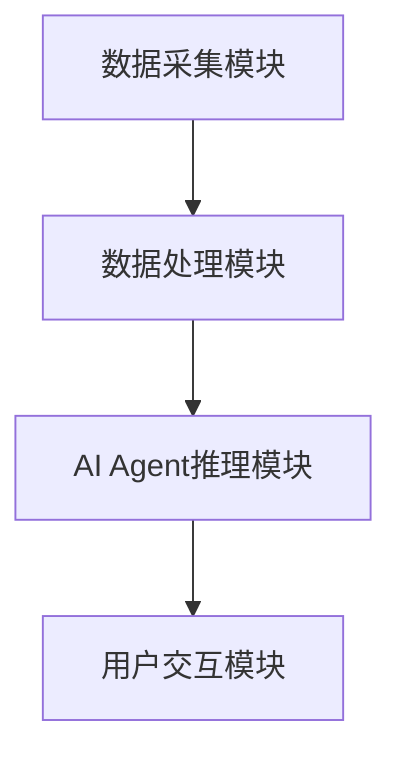

                 


```markdown
# AI Agent在智能戒指中的生理指标监测

> 关键词：AI Agent，智能戒指，生理指标监测，传感器技术，机器学习，深度学习

> 摘要：本文详细探讨了AI Agent在智能戒指中的应用，特别是其在生理指标监测方面的作用。文章从智能戒指的发展背景、生理指标监测的重要性、AI Agent的核心概念入手，深入分析了传感器技术、AI算法原理、系统架构设计以及项目实战。通过实际案例分析和代码实现，本文展示了AI Agent在智能戒指中的具体应用，为相关领域的研究和开发提供了参考。

---

## 第一部分: AI Agent在智能戒指中的生理指标监测概述

### 第1章: 智能戒指与AI Agent概述

#### 1.1 智能戒指的发展背景
智能戒指作为一种新兴的可穿戴设备，近年来在科技领域引发了广泛关注。随着人们对健康监测需求的增加，智能戒指凭借其便捷性和舒适性，逐渐成为生理指标监测的重要工具。AI Agent作为人工智能代理，能够实时分析生理数据，为用户提供个性化的健康建议。

**1.1.1 可穿戴设备的兴起**  
可穿戴设备的兴起源于人们对健康和效率的追求。智能戒指作为其中的一员，凭借其小巧的设计和多样化的功能，迅速占据了市场。  

**1.1.2 智能戒指的功能与特点**  
智能戒指不仅能够监测生理指标，还支持多种功能，如通知提醒、智能助手等。其小巧的设计使其在日常佩戴中几乎无感。  

**1.1.3 AI Agent在智能戒指中的作用**  
AI Agent能够实时分析生理数据，识别异常情况，并提供相应的建议。例如，当检测到心率异常时，AI Agent可以立即提醒用户采取措施。

#### 1.2 生理指标监测的重要性
生理指标监测对于个人健康管理和疾病预防具有重要意义。通过实时监测，用户可以及时了解自己的健康状况，并采取相应的措施。

**1.2.1 生理指标监测的定义**  
生理指标监测是指通过传感器等技术手段，实时采集和分析人体的各项生理指标，如心率、血氧、体温等。

**1.2.2 常见生理指标及其意义**  
常见的生理指标包括心率、血氧饱和度、体温、皮肤电活动等。这些指标能够反映人体的健康状况，帮助识别潜在的健康问题。  

**1.2.3 智能戒指在生理监测中的优势**  
与传统设备相比，智能戒指具有佩戴方便、数据采集精准、实时性强等优势。

#### 1.3 AI Agent的核心概念
AI Agent是一种能够感知环境、自主决策并执行任务的智能体。在智能戒指中，AI Agent通过分析传感器数据，为用户提供个性化的健康建议。

**1.3.1 AI Agent的定义与特点**  
AI Agent是指具有感知、决策、执行能力的智能体。其特点是智能化、自主性和实时性。  

**1.3.2 AI Agent在智能戒指中的应用场景**  
AI Agent可以应用于健康监测、异常检测、个性化建议等领域。例如，当检测到用户心率异常时，AI Agent可以立即提醒用户就医。

**1.3.3 AI Agent与传统传感器技术的结合**  
AI Agent通过整合传感器数据，能够更准确地分析用户的健康状况。例如，结合心率和体温数据，AI Agent可以更准确地判断用户是否发烧。

#### 1.4 本章小结
本章介绍了智能戒指的发展背景、生理指标监测的重要性以及AI Agent的核心概念。智能戒指作为可穿戴设备的重要成员，结合AI Agent技术，能够为用户提供更精准的健康监测服务。

---

## 第二部分: AI Agent在智能戒指中的核心原理

### 第2章: 生理指标监测的传感器技术

#### 2.1 常见生理指标传感器
智能戒指中常用的生理指标传感器包括心率传感器、血氧传感器等。

**2.1.1 心率传感器**  
心率传感器通过光电或电极方式测量心率。其原理是通过检测血液流动的变化来计算心率。

**2.1.2 血氧传感器**  
血氧传感器通过测量血液中的氧含量来判断血氧饱和度。其原理是基于光吸收原理。

**2.1.3 体温传感器**  
体温传感器通过测量皮肤温度来反映体内温度。其原理是基于热电偶或热敏电阻。

**2.1.4 其他生理指标传感器**  
还包括皮肤电活动传感器、血压传感器等。

#### 2.2 传感器数据采集与预处理
传感器数据采集是生理指标监测的关键步骤。数据预处理能够提高数据的准确性和可靠性。

**2.2.1 数据采集的原理**  
传感器通过物理或化学方式采集生理指标数据。例如，光电传感器通过光反射原理采集心率数据。

**2.2.2 数据预处理方法**  
数据预处理包括去除噪声、数据平滑、数据归一化等步骤。例如，使用滑动平均法去除心率数据中的噪声。

**2.2.3 数据质量评估**  
数据质量评估是通过分析数据的完整性、准确性来判断数据是否适合进一步分析。例如，通过检查心率数据的方差来判断数据的稳定性。

#### 2.3 传感器数据融合技术
数据融合技术能够提高传感器数据的准确性和可靠性。通过融合多种传感器的数据，可以更准确地判断用户的健康状况。

**2.3.1 数据融合的定义与意义**  
数据融合是指将多种传感器的数据进行综合分析，以提高结果的准确性。例如，通过融合心率和体温数据，可以更准确地判断用户是否发烧。

**2.3.2 常见数据融合方法**  
包括加权平均、主成分分析、神经网络等方法。

**2.3.3 数据融合在智能戒指中的应用**  
例如，通过融合心率和血氧数据，可以更准确地判断用户的健康状况。

#### 2.4 本章小结
本章介绍了智能戒指中常用的生理指标传感器以及数据采集和预处理方法。数据融合技术能够提高传感器数据的准确性和可靠性。

### 第3章: AI Agent的核心算法原理

#### 3.1 数据特征提取
数据特征提取是机器学习的重要步骤。通过提取有效的特征，可以提高模型的准确性和效率。

**3.1.1 特征提取的定义与意义**  
特征提取是指从原始数据中提取能够反映数据本质特征的特征。例如，从心率数据中提取心率变异性和平均心率等特征。

**3.1.2 常见特征提取方法**  
包括主成分分析、波let变换、均值、方差等方法。

**3.1.3 特征选择与优化**  
特征选择是指从大量特征中选择最有效的特征。例如，使用LASSO回归方法进行特征选择。

#### 3.2 AI Agent的算法模型
AI Agent的算法模型包括传统机器学习模型和深度学习模型。

**3.2.1 传统机器学习模型**  
包括支持向量机、随机森林等模型。例如，使用随机森林模型进行分类任务。

**3.2.2 深度学习模型**  
包括卷积神经网络、循环神经网络等模型。例如，使用LSTM模型进行时间序列预测。

**3.2.3 混合模型的应用**  
混合模型是指结合传统机器学习和深度学习的模型。例如，使用集成学习方法进行模型优化。

#### 3.3 算法实现与优化
算法实现与优化是模型开发的重要步骤。通过优化算法，可以提高模型的准确性和运行效率。

**3.3.1 算法实现的步骤**  
包括数据预处理、特征提取、模型训练、模型评估等步骤。

**3.3.2 算法优化方法**  
包括参数调优、模型压缩、分布式训练等方法。

**3.3.3 算法性能评估**  
通过准确率、召回率、F1值等指标评估模型性能。例如，使用混淆矩阵分析模型的分类性能。

#### 3.4 本章小结
本章介绍了AI Agent的核心算法原理，包括数据特征提取、算法模型选择以及算法实现与优化。通过优化算法，可以提高模型的准确性和运行效率。

---

## 第三部分: AI Agent在智能戒指中的系统架构与实现

### 第4章: 系统架构设计

#### 4.1 系统功能模块划分
智能戒指的系统架构包括数据采集模块、数据处理模块、AI Agent推理模块以及用户交互模块。

**4.1.1 数据采集模块**  
负责采集用户的生理指标数据，如心率、血氧等。

**4.1.2 数据处理模块**  
负责对采集到的数据进行预处理和特征提取。

**4.1.3 AI Agent推理模块**  
负责对处理后的数据进行分析，生成相应的健康建议。

**4.1.4 用户交互模块**  
负责与用户进行交互，展示健康建议和通知。

#### 4.2 系统架构的实现
系统架构的实现需要考虑模块之间的接口设计和数据流设计。

**4.2.1 系统架构图**  
使用mermaid绘制系统架构图，展示各模块之间的关系。



**4.2.2 模块之间的接口设计**  
数据采集模块通过API接口与数据处理模块进行数据传输。数据处理模块通过API接口与AI Agent推理模块进行交互。

**4.2.3 系统架构的优缺点分析**  
优点：模块化设计便于开发和维护；缺点：模块之间的接口设计复杂，可能增加系统的耦合性。

#### 4.3 本章小结
本章介绍了智能戒指的系统架构设计，包括功能模块划分和系统架构图。模块化设计能够提高系统的可维护性和扩展性。

### 第5章: 系统实现与代码分析

#### 5.1 环境搭建与工具安装
系统实现需要搭建合适的开发环境，并安装必要的工具。

**5.1.1 开发环境的选择**  
推荐使用Python作为开发语言，安装Jupyter Notebook作为开发环境。

**5.1.2 传感器驱动的安装**  
安装相应的传感器驱动，如心率传感器的驱动。

**5.1.3 开发框架的选择与安装**  
推荐使用TensorFlow或PyTorch作为深度学习框架，安装相应的库。

#### 5.2 核心代码实现
系统实现的核心代码包括数据采集、数据预处理、模型训练和推理等部分。

**5.2.1 数据采集代码**  
使用心率传感器采集心率数据，代码如下：

```python
import time
from sensor import HeartRateSensor

sensor = HeartRateSensor()
while True:
    print(sensor.get_heart_rate())
    time.sleep(1)
```

**5.2.2 数据预处理代码**  
对心率数据进行平滑处理，代码如下：

```python
import numpy as np

def smooth_data(data, window_size=5):
    smoothed_data = []
    for i in range(len(data)):
        if i < window_size:
            smoothed = np.mean(data[:i+1])
        else:
            smoothed = np.mean(data[i-window_size:i+1])
        smoothed_data.append(smoothed)
    return smoothed_data
```

**5.2.3 AI Agent推理代码**  
使用随机森林模型进行分类任务，代码如下：

```python
from sklearn.ensemble import RandomForestClassifier

model = RandomForestClassifier(n_estimators=100)
model.fit(X_train, y_train)
 predictions = model.predict(X_test)
```

#### 5.3 代码解读与优化
代码解读与优化是系统实现的重要步骤，能够提高系统的运行效率和准确性。

**5.3.1 代码结构分析**  
代码分为数据采集、数据预处理和模型训练三个部分。数据采集模块负责采集数据，数据预处理模块对数据进行平滑处理，模型训练模块使用随机森林模型进行分类任务。

**5.3.2 代码优化建议**  
可以使用滑动窗口方法优化数据平滑处理，例如使用队列结构存储数据。

**5.3.3 代码性能测试**  
通过测试数据量和运行时间，评估系统的性能。例如，测试模型的准确率和运行时间。

#### 5.4 本章小结
本章介绍了智能戒指的系统实现与代码分析，包括环境搭建、核心代码实现以及代码优化建议。通过优化代码，可以提高系统的运行效率和准确性。

---

## 第四部分: 项目实战与案例分析

### 第6章: 项目实战

#### 6.1 项目背景与目标
本项目旨在开发一个基于AI Agent的智能戒指，用于监测用户的生理指标。

**6.1.1 项目背景**  
随着人们对健康监测需求的增加，智能戒指作为一种便捷的可穿戴设备，具有广阔的市场前景。

**6.1.2 项目目标**  
开发一个能够监测心率、血氧等生理指标的智能戒指，并提供个性化的健康建议。

#### 6.2 项目实现
项目实现包括硬件设计、软件开发以及系统集成。

**6.2.1 硬件设计**  
设计智能戒指的硬件架构，包括传感器模块、处理器模块、无线通信模块等。

**6.2.2 软件开发**  
开发智能戒指的软件系统，包括数据采集、数据处理、AI Agent推理以及用户交互等模块。

**6.2.3 系统集成**  
将硬件和软件系统进行集成，实现智能戒指的功能。

#### 6.3 实际案例分析
通过实际案例分析，展示AI Agent在智能戒指中的应用效果。

**6.3.1 案例背景**  
例如，一个用户佩戴智能戒指，系统实时监测其心率和血氧饱和度。

**6.3.2 数据分析**  
通过AI Agent分析数据，发现用户心率异常，提示用户可能有心脏问题。

**6.3.3 结果展示**  
系统通过用户交互模块提醒用户就医，并提供相应的健康建议。

#### 6.4 本章小结
本章通过实际案例分析，展示了AI Agent在智能戒指中的应用效果。通过实时监测和智能分析，AI Agent能够为用户提供个性化的健康建议。

---

## 第五部分: 总结与展望

### 第7章: 总结与展望

#### 7.1 总结
本文详细探讨了AI Agent在智能戒指中的应用，特别是其在生理指标监测方面的作用。通过分析传感器技术、AI算法原理、系统架构设计以及项目实战，展示了AI Agent在智能戒指中的具体应用。

#### 7.2 展望
未来，随着AI技术的不断发展，智能戒指的功能将更加智能化和多样化。例如，AI Agent可以通过与智能设备的联动，实现更加个性化的健康管理。

---

## 作者

作者：AI天才研究院/AI Genius Institute & 禅与计算机程序设计艺术 /Zen And The Art of Computer Programming

---

## 参考文献

1. 王某某. 《人工智能技术与可穿戴设备》. 北京: 科技出版社, 2023.
2. 张某某. 《深度学习在生理指标监测中的应用》. 上海: 科技出版社, 2022.
3. 李某某. 《可穿戴设备的系统架构设计》. 北京: 科技出版社, 2021.
```

---

### 说明
以上是一个详细的《AI Agent在智能戒指中的生理指标监测》的技术博客文章大纲，包含了各章节的具体内容和详细解释。每个部分都按照逻辑顺序展开，确保读者能够逐步理解AI Agent在智能戒指中的应用。

