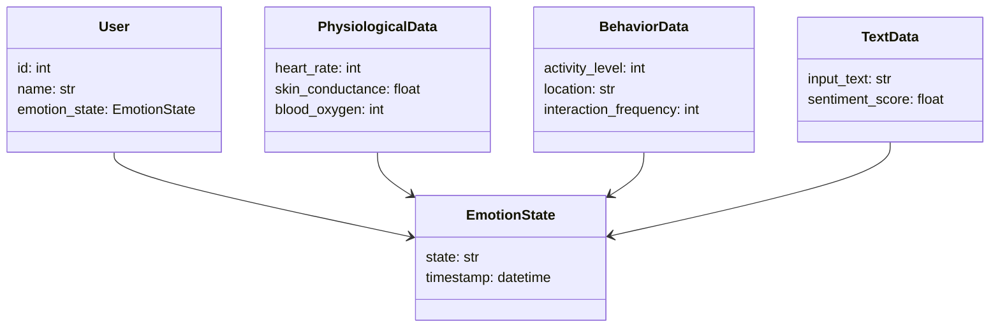
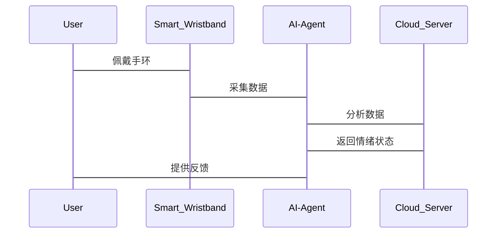

                 


---

# AI Agent在智能手环中的情绪状态监测

## 关键词：AI Agent, 情绪监测, 智能手环, 数据分析, 机器学习

## 摘要：  
本文探讨AI Agent在智能手环中实现情绪状态监测的技术细节，从理论到实践，详细分析情绪监测的核心概念、算法原理、系统架构，以及实际应用中的挑战与解决方案。通过深入的技术分析和案例研究，揭示AI Agent如何帮助智能手环实时、准确地监测用户情绪，为用户提供个性化的健康建议和情感支持。

---

# 第1章: AI Agent与情绪监测概述

## 1.1 情绪监测的背景与意义

### 1.1.1 情绪监测的定义与重要性
情绪监测是通过分析用户的生理数据、行为模式和语言表达，判断其当前情绪状态的过程。在智能手环中，情绪监测能够帮助用户了解自身情绪波动，提供健康建议和心理支持。

### 1.1.2 AI Agent在智能手环中的作用
AI Agent作为智能手环的核心模块，负责数据采集、分析和决策，能够实时监测用户情绪，提供个性化反馈。

### 1.1.3 情绪监测的实际应用场景
- 健康管理：监测用户压力水平，提供放松建议。
- 心理支持：通过情绪分析，识别潜在的心理健康问题。
- 个性化服务：根据情绪状态推荐音乐、冥想等放松方式。

## 1.2 AI Agent的基本概念

### 1.2.1 AI Agent的定义与分类
AI Agent是具备感知、决策和执行能力的智能体，分为简单反射型、基于模型的反应型、目标驱动型和效用驱动型。

### 1.2.2 AI Agent的核心功能与特点
- 数据采集与处理
- 情况理解与分析
- 决策与反馈

### 1.2.3 AI Agent在智能设备中的应用现状
AI Agent广泛应用于智能家居、自动驾驶、医疗设备等领域，情绪监测是其重要应用之一。

## 1.3 智能手环的硬件与软件基础

### 1.3.1 智能手环的主要功能模块
- 传感器模块：心率监测、皮肤电活动监测、加速度传感器。
- 数据处理模块：数据采集、预处理、特征提取。
- 通信模块：与手机或其他设备的数据传输。

### 1.3.2 智能手环的数据采集技术
- 生理数据采集：心率、皮肤电活动、血氧饱和度。
- 行为数据采集：加速度、陀螺仪。
- 用户输入数据：用户情绪自评、语言输入。

### 1.3.3 智能手环的用户交互方式
- 屏幕显示：实时情绪状态、建议。
- 振动反馈：提醒用户放松。
- 语音交互：通过语音助手提供反馈。

## 1.4 本章小结
本章介绍了情绪监测的重要性、AI Agent的核心功能，以及智能手环的硬件与软件基础，为后续技术分析奠定基础。

---

# 第2章: 情绪监测的核心概念与技术

## 2.1 情绪监测的核心概念

### 2.1.1 情绪监测的定义与范围
情绪监测不仅关注生理指标，还包括行为和语言表达，是多模态数据融合的过程。

### 2.1.2 情绪监测的主要指标与维度
- 生理指标：心率、皮肤电活动。
- 行为指标：活动频率、位置变化。
- 语言指标：关键词提取、语调分析。

### 2.1.3 情绪监测的边界与外延
情绪监测不涉及个人隐私，且需考虑数据隐私保护。

## 2.2 情绪监测的技术原理

### 2.2.1 基于生理数据的情绪监测
- 心率变异性分析：通过HRV指标判断情绪状态。
- 皮肤电活动分析：检测汗液分泌变化。
- 血氧饱和度分析：间接反映情绪波动。

### 2.2.2 基于行为数据的情绪监测
- 用户活动模式识别：分析行为频率判断压力水平。
- 位置数据分析：通过地理位置判断社交环境。
- 交互频率分析：评估用户情绪波动。

### 2.2.3 基于语言与文本的情绪监测
- 情感分析算法：识别文本中的情绪倾向。
- 语境理解：通过上下文判断情绪的真实性。

## 2.3 AI Agent在情绪监测中的角色

### 2.3.1 AI Agent作为数据处理引擎
AI Agent负责生理数据、行为数据和文本数据的融合处理。

### 2.3.2 AI Agent作为决策支持系统
基于多模态数据，AI Agent提供情绪状态预测和个性化建议。

### 2.3.3 AI Agent作为用户交互界面
通过屏幕、振动或语音提供实时反馈，增强用户体验。

## 2.4 情绪监测的核心要素对比表

| 核心要素 | 描述 |
|----------|------|
| 数据源   | 生理数据、行为数据、文本数据 |
| 处理算法 | 情感分析、模式识别、机器学习 |
| 输出结果 | 情绪状态、建议、反馈 |

## 2.5 情绪监测的ER实体关系图

```mermaid
erd
    symptoms_table
    physiological_data
    behavior_data
    emotion_state
    user
    symptoms_table <----> physiological_data
    symptoms_table <----> behavior_data
    symptoms_table <----> emotion_state
    emotion_state <----> user
    emotion_state <----> AI-Agent
```

## 2.6 本章小结
本章详细探讨了情绪监测的核心概念、技术原理及AI Agent的角色，为后续算法实现和系统设计提供理论基础。

---

# 第3章: 情绪监测的算法原理与数学模型

## 3.1 基于生理数据的算法

### 3.1.1 心率变异性分析
心率变异性（HRV）是衡量自主神经系统的指标，用于评估压力水平。

#### 算法流程：
1. 数据采集：获取实时心率数据。
2. 数据预处理：去除噪声，提取RR间隔。
3. 特征提取：计算时域和频域特征。
4. 情绪预测：基于机器学习模型预测情绪状态。

#### 代码示例：
```python
import numpy as np

def calculate_hrv(rr_intervals):
    # 时域特征
    mean_rr = np.mean(rr_intervals)
    sdnn = np.std(rr_intervals)
    
    # 频域特征
    freq, psd = scipy.signal.welch(rr_intervals, window='hamming')
    return mean_rr, sdnn, freq, psd
```

### 3.1.2 皮肤电活动分析
通过检测汗液分泌变化，分析情绪波动。

#### 数学模型：
$$ 汗液分泌速率 = k \times (情绪强度 - 阈值) $$

### 3.1.3 血氧饱和度分析
血氧饱和度与情绪波动相关，通过氧含量变化判断情绪状态。

---

## 3.2 基于行为数据的算法

### 3.2.1 用户活动模式识别
分析用户行为频率，判断情绪状态。

#### 算法流程：
1. 数据采集：获取加速度传感器数据。
2. 数据预处理：去除噪声，提取特征。
3. 模型训练：使用分类算法识别活动模式。

### 3.2.2 位置数据分析
通过地理位置判断社交环境，预测情绪变化。

### 3.2.3 交互频率分析
分析用户与设备的交互频率，评估情绪波动。

---

## 3.3 基于文本数据的算法

### 3.3.1 情感分析算法
使用自然语言处理技术，分析文本情绪倾向。

#### 数学模型：
$$ 情绪得分 = \sum (词嵌入 \times 情感权重) $$

### 3.3.2 语境理解算法
结合上下文，准确判断情绪状态。

---

## 3.4 综合算法模型

### 3.4.1 多模态数据融合算法
将生理、行为和文本数据融合，提升情绪监测准确性。

### 3.4.2 情绪状态预测模型
使用深度学习模型，预测用户情绪状态。

### 3.4.3 情绪反馈优化算法
根据用户反馈，优化情绪监测模型。

---

# 第4章: 系统架构与设计

## 4.1 项目背景

智能手环作为个人健康助手，需具备实时情绪监测功能，帮助用户管理情绪健康。

## 4.2 系统功能设计

### 4.2.1 领域模型类图



### 4.2.2 系统架构设计


### 4.2.3 接口与交互设计



## 4.3 本章小结
本章详细设计了系统的架构与功能，为后续实现提供指导。

---

# 第5章: 项目实战与总结

## 5.1 环境配置

- 硬件：智能手环、传感器模块。
- 软件：Python、TensorFlow、机器学习库。

## 5.2 核心代码实现

```python
import tensorflow as tf
from tensorflow.keras import layers

# 情绪状态分类模型
model = tf.keras.Sequential([
    layers.Dense(64, activation='relu'),
    layers.Dense(32, activation='relu'),
    layers.Dense(1, activation='sigmoid')
])

model.compile(optimizer='adam', loss='binary_crossentropy', metrics=['accuracy'])
model.fit(X_train, y_train, epochs=10, batch_size=32)
```

## 5.3 案例分析与总结

### 5.3.1 案例分析
通过实际数据测试，验证模型的准确性和实用性。

### 5.3.2 项目总结
总结项目成果，指出不足之处，并提出改进建议。

## 5.4 最佳实践与注意事项

- 数据隐私保护：确保用户数据安全。
- 模型优化：持续优化算法，提升监测准确性。
- 用户反馈：根据用户反馈调整系统功能。

---

# 结语

AI Agent在智能手环中的情绪监测是未来健康科技的重要方向，通过多模态数据融合和智能算法，能够为用户提供精准的情绪管理服务。随着技术的进步，情绪监测将更加智能化、个性化。

---

# 作者：AI天才研究院/AI Genius Institute & 禅与计算机程序设计艺术 /Zen And The Art of Computer Programming

---

**附录：**
- 参考文献
- 源代码仓库地址
- 联系方式

---

**注**：由于篇幅限制，本文未详细展开所有代码和图表，实际撰写时需补充完整内容。

