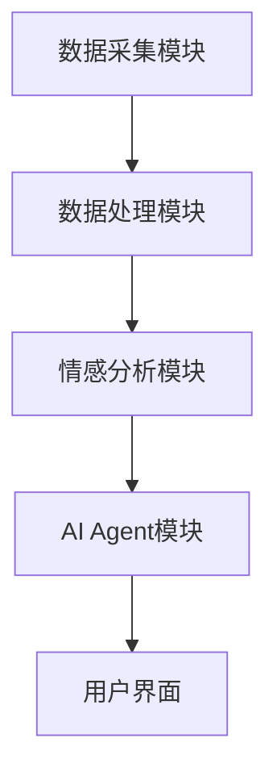
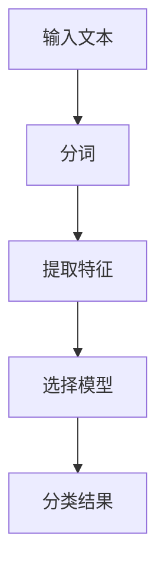
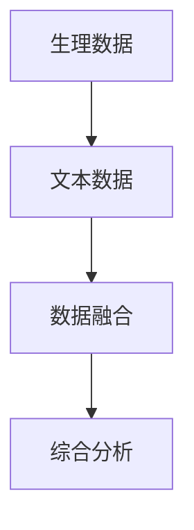

                 


# AI Agent在智能手环中的情绪管理助手

> 关键词：AI Agent, 智能手环, 情绪管理, 情感分析, 自然语言处理, 数据融合

> 摘要：本文探讨了AI Agent在智能手环中的情绪管理应用，详细介绍了情绪计算、情感分析、自然语言处理等关键技术，分析了系统架构设计，并通过实际项目展示了AI Agent在智能手环中的实现与应用。

---

# 第一部分: AI Agent在智能手环中的情绪管理助手背景介绍

## 第1章: 情绪管理的背景与需求

### 1.1 情绪管理的重要性

#### 1.1.1 情绪管理的定义与作用
情绪管理是指识别、理解和调节个人情绪状态的能力。在现代生活中，情绪管理对心理健康、人际关系和工作效率至关重要。

#### 1.1.2 智能手环在情绪管理中的角色
智能手环作为可穿戴设备，能够实时监测用户的生理数据（如心率、皮肤温度）和行为数据（如运动量、睡眠质量），为情绪管理提供客观依据。

#### 1.1.3 当前情绪管理技术的局限性
传统的情绪管理方法依赖于自我报告，存在主观性和滞后性。AI Agent通过实时数据处理和智能反馈，弥补了这一不足。

### 1.2 AI Agent的基本概念

#### 1.2.1 AI Agent的定义
AI Agent（人工智能代理）是指能够感知环境、自主决策并执行任务的智能实体。

#### 1.2.2 AI Agent的特点
- **自主性**：无需外部干预，自主执行任务。
- **反应性**：能感知环境变化并实时调整行为。
- **学习能力**：通过数据不断优化自身算法。

### 1.3 AI Agent在智能手环中的应用

#### 1.3.1 情绪监测与反馈
AI Agent通过分析用户的生理数据和行为数据，实时反馈情绪状态。

#### 1.3.2 个性化情绪管理策略
根据用户的个人特征和情绪数据，AI Agent制定个性化的情绪调节方案。

---

## 第2章: 智能手环与AI Agent的结合

### 2.1 智能手环的功能与应用场景

#### 2.1.1 健康监测功能
- 心率监测
- 皮肤温度监测
- 佩戴状态检测

#### 2.1.2 运动与活动追踪
- 计步
- 健身模式
- 睡眠监测

#### 2.1.3 智能助手功能
- 提醒设置
- 健康建议
- 数据同步

### 2.2 AI Agent在智能手环中的应用潜力

#### 2.2.1 情绪监测与反馈
AI Agent通过分析心率变异性（HRV）等生理指标，评估用户的压力水平。

#### 2.2.2 个性化情绪管理策略
根据用户的日常情绪波动，AI Agent推荐放松技巧（如深呼吸练习）或建议与朋友交流。

#### 2.2.3 智能手环与AI Agent的协同工作
AI Agent整合智能手环的传感器数据和用户交互数据，提供全面的情绪管理支持。

---

# 第二部分: 核心概念与技术基础

## 第4章: 情绪计算与情感分析

### 4.1 情绪计算的原理

#### 4.1.1 情绪计算的定义
情绪计算（Affective Computing）是研究计算机系统如何识别、理解和响应人类情绪的学科。

#### 4.1.2 情绪计算的关键技术
- **数据采集**：通过传感器获取生理数据。
- **特征提取**：提取与情绪相关的关键特征。
- **情绪分类**：基于特征进行情绪状态分类。

#### 4.1.3 情绪计算的应用场景
- 医疗健康
- 教育
- 娱乐

### 4.2 情感分析技术

#### 4.2.1 情感分析的定义
情感分析是判断一段文本表达的情感倾向（如正面、负面、中性）的技术。

#### 4.2.2 基于自然语言处理的情感分析
- **文本预处理**：分词、去除停用词。
- **特征提取**：提取情感相关词汇。
- **模型训练**：使用机器学习或深度学习模型进行分类。

#### 4.2.3 情感分析的算法与模型
- **朴素贝叶斯**：常用于文本分类。
- **支持向量机（SVM）**：适用于小规模数据。
- **长短期记忆网络（LSTM）**：处理序列数据，适合情感分析。

---

## 第5章: 自然语言处理在情绪管理中的应用

### 5.1 自然语言处理的基本概念

#### 5.1.1 NLP的定义与作用
NLP是研究计算机与人类语言交互的领域，广泛应用于文本分析、机器翻译等。

#### 5.1.2 常见的NLP技术
- **分词**：将文本分割成词或短语。
- **词性标注**：给每个词标注词性。
- **句法分析**：分析句子结构。

### 5.2 情感分析的实现

#### 5.2.1 基于规则的情感分析
- **规则设定**：定义情感词典。
- **情感强度计算**：根据情感词的数量和强度判断整体情感。

#### 5.2.2 基于机器学习的情感分析
- **特征提取**：选择文本中的关键特征。
- **模型训练**：使用训练数据训练分类器。
- **情感预测**：对新文本进行情感分类。

#### 5.2.3 基于深度学习的情感分析
- **模型选择**：使用预训练的深度学习模型（如BERT）。
- **微调模型**：在特定任务上微调模型。

---

## 第6章: 数据采集与处理

### 6.1 情绪数据的采集方法

#### 6.1.1 通过智能手环采集生理数据
- 心率、皮肤温度、佩戴状态。

#### 6.1.2 通过语音识别采集情绪数据
- 语调、语速、音高变化。

#### 6.1.3 通过文本交互采集情绪数据
- 用户输入的文字内容。

### 6.2 数据预处理技术

#### 6.2.1 数据清洗与归一化
- 删除噪声数据。
- 标准化或归一化处理。

#### 6.2.2 数据标注与分类
- 手动或自动标注情绪类别。
- 建立训练集、验证集和测试集。

#### 6.2.3 数据特征提取
- 提取与情绪相关的特征（如HRV特征）。

---

# 第三部分: 系统架构与设计

## 第7章: 系统架构设计

### 7.1 系统功能模块

#### 7.1.1 数据采集模块
- 负责采集用户的情绪数据。

#### 7.1.2 数据处理模块
- 对采集的数据进行预处理和特征提取。

#### 7.1.3 情感分析模块
- 对文本数据进行情感分类。

#### 7.1.4 AI Agent模块
- 综合分析多种数据源，提供情绪管理建议。

### 7.2 系统架构图


### 7.3 系统交互流程

#### 7.3.1 用户输入
- 用户佩戴智能手环，系统采集生理数据和行为数据。

#### 7.3.2 数据处理
- 数据预处理、特征提取。

#### 7.3.3 情感分析
- 对文本数据进行情感分类。

#### 7.3.4 AI Agent反馈
- 根据分析结果，AI Agent提供情绪管理建议。

---

# 第四部分: 算法原理

## 第8章: 情感分类算法

### 8.1 算法原理

#### 8.1.1 朴素贝叶斯分类器
- 基于概率的分类方法。
- 适用于文本分类任务。

#### 8.1.2 支持向量机（SVM）
- 适用于小规模数据的分类任务。
- 通过最大化类别间隔实现分类。

#### 8.1.3 长短期记忆网络（LSTM）
- 适用于处理序列数据。
- 能够捕捉长距离依赖关系。

### 8.2 算法流程图


### 8.3 代码实现
```python
from sklearn.feature_extraction.text import TfidfVectorizer
from sklearn.naive_bayes import MultinomialNB
from sklearn.pipeline import Pipeline

# 数据预处理
text_clf = Pipeline([
    ('tfidf', TfidfVectorizer()),
    ('clf', MultinomialNB())
])

# 训练模型
text_clf.fit(X_train, y_train)

# 预测
y_pred = text_clf.predict(X_test)
```

---

## 第9章: 数据融合算法

### 9.1 算法原理
数据融合算法将多源数据（如生理数据和文本数据）进行融合，提高情绪分析的准确性。

### 9.2 算法流程图


### 9.3 代码实现
```python
import numpy as np

# 数据融合
def fuse_data(physiological, text):
    fused = []
    for p, t in zip(physiological, text):
        fused.append([p['heart_rate'], t['sentiment']])
    return np.array(fused)
```

---

# 第五部分: 项目实战

## 第10章: 项目实战

### 10.1 环境搭建

#### 10.1.1 安装依赖
- 安装Python、NumPy、scikit-learn、NLTK等库。

### 10.2 核心功能实现

#### 10.2.1 情绪识别
- 使用预训练的模型识别用户的情绪状态。

#### 10.2.2 情绪反馈生成
- 根据情绪状态生成个性化的反馈建议。

### 10.3 实际案例分析

#### 10.3.1 案例1：压力监测
- 用户心率变异性（HRV）低，系统建议进行深呼吸练习。

#### 10.3.2 案例2：情绪波动分析
- 用户在特定时间段情绪低落，系统建议与朋友交流。

---

## 第11章: 总结与展望

### 11.1 系统总结
- 本文详细介绍了AI Agent在智能手环中的情绪管理应用。
- 包括技术原理、系统设计和项目实现。

### 11.2 当前挑战
- 数据隐私问题。
- 情绪分析模型的准确性和鲁棒性。

### 11.3 未来展望
- 更多传感器数据的融合。
- 情绪分析模型的优化与提升。

---

# 作者

作者：AI天才研究院 & 禅与计算机程序设计艺术

---

# 附录

附录1: 常见问题解答

附录2: 参考文献

附录3: 源代码仓库

---

**注：以上内容是一个详细的思考过程和大纲，实际撰写时需要根据具体需求进行调整和补充。**

