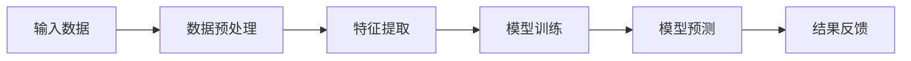
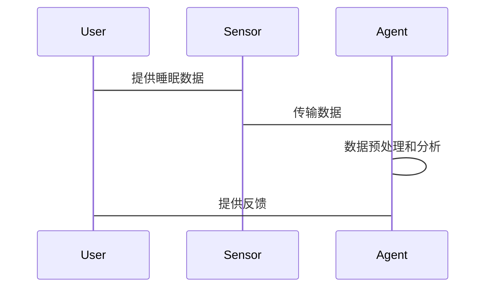

                 


# AI Agent在智能手环中的睡眠监测

> 关键词：AI Agent, 智能手环, 睡眠监测, 机器学习, 时间序列分析, 睡眠分期, 数据流处理

> 摘要：本文详细探讨了AI Agent在智能手环中的睡眠监测应用，从背景、核心概念、算法原理到系统设计和项目实战，全面解析了AI Agent如何优化睡眠监测的准确性、实时性和个性化。通过实际案例分析，展示了AI Agent在智能手环中的实际应用价值和未来发展方向。

---

# 第一部分: AI Agent与智能手环的背景与基础

## 第1章: AI Agent与智能手环概述

### 1.1 AI Agent的基本概念
#### 1.1.1 什么是AI Agent
- **定义**：AI Agent（人工智能代理）是一种能够感知环境、自主决策并执行任务的智能实体。
- **特征**：
  - **自主性**：无需外部干预，自主完成任务。
  - **反应性**：能够实时感知环境变化并做出反应。
  - **学习性**：通过数据和经验不断优化自身算法。
  - **社交能力**：能够与其他系统或用户进行交互。

#### 1.1.2 AI Agent的核心特征
- **数据驱动**：基于实时数据流进行分析和决策。
- **自适应性**：能够根据环境变化调整自身行为。
- **可扩展性**：能够处理不同类型和规模的数据。

#### 1.1.3 AI Agent与传统算法的区别
- **传统算法**：基于规则或预定义模型进行处理，缺乏灵活性。
- **AI Agent**：结合机器学习和深度学习，能够自适应和优化。

### 1.2 智能手环的发展历程
#### 1.2.1 智能手环的定义与功能
- **定义**：智能手环是一种 wearable device，能够采集和分析用户的生理数据，如心率、步数、睡眠质量等。
- **功能**：
  - 数据采集：通过传感器获取生理数据。
  - 数据分析：将采集的数据进行处理和分析。
  - 用户反馈：通过屏幕或APP向用户展示分析结果。

#### 1.2.2 智能手环的技术演进
- **第一代**：基本的健康监测功能，如心率、步数。
- **第二代**：加入睡眠监测功能，能够初步分析睡眠质量。
- **第三代**：结合AI技术，实现更精准的睡眠分期和睡眠障碍识别。

#### 1.2.3 当前市场主流智能手环产品分析
- **主流产品**：Fitbit、Apple Watch、Garmin、华为手环等。
- **共同特点**：
  - 高精度传感器。
  - 强大的数据处理能力。
  - 丰富的用户界面和反馈机制。

### 1.3 睡眠监测的重要性
#### 1.3.1 睡眠质量与健康的关系
- **睡眠分期**：
  - **NREM（非快速眼动睡眠）**：包括浅睡期（N1）、深睡期（N2）和慢波睡眠（N3）。
  - **REM（快速眼动睡眠）**：梦境阶段，对心理健康至关重要。
- **睡眠障碍**：如失眠、睡眠呼吸暂停综合征（Sleep Apnea）等。

#### 1.3.2 现有睡眠监测技术的局限性
- **单一数据源**：传统手环仅依赖心率和运动数据，缺乏多模态数据融合。
- **低准确性**：睡眠分期的准确性依赖于数据采集和算法优化。
- **实时性不足**：传统算法处理数据的时间较长，无法实现实时反馈。

#### 1.3.3 AI Agent在睡眠监测中的优势
- **多模态数据融合**：结合心率、运动、体温等多种数据，提高准确性。
- **实时处理**：基于流数据处理技术，实现实时反馈。
- **自适应优化**：通过机器学习模型不断优化睡眠监测算法。

---

## 第2章: AI Agent在睡眠监测中的应用背景

### 2.1 睡眠监测的常见问题
#### 2.1.1 睡眠分期的定义与挑战
- **睡眠分期**：将整个睡眠周期分为不同的阶段，用于评估睡眠质量。
- **挑战**：
  - 数据采集的准确性。
  - 数据处理的实时性。
  - 算法的可解释性。

#### 2.1.2 睡眠障碍的识别难点
- **失眠**：难以入睡或保持睡眠。
- **睡眠呼吸暂停综合征**：夜间呼吸暂停，影响睡眠质量。
- **其他障碍**：如 nightmares、睡眠惊醒等。

#### 2.1.3 睡眠数据的采集与处理
- **数据采集**：
  - 心率：通过光电传感器采集心率数据。
  - 运动：通过加速度传感器检测运动情况。
  - 体温：通过温度传感器采集体温数据。
- **数据处理**：
  - 数据清洗：去除噪声和异常值。
  - 数据特征提取：提取有用的生理特征，如心率变异、运动频率等。

### 2.2 AI Agent在睡眠监测中的作用
#### 2.2.1 AI Agent如何处理睡眠数据
- **实时数据流处理**：基于流数据处理技术，实现睡眠数据的实时分析。
- **多模态数据融合**：结合心率、运动、体温等多种数据，提高睡眠监测的准确性。
- **自适应学习**：通过机器学习模型，不断优化睡眠监测算法。

#### 2.2.2 AI Agent在睡眠分期中的应用
- **算法优化**：
  - 使用时间序列分析技术，对睡眠数据进行建模和预测。
  - 通过深度学习模型（如LSTM）实现睡眠分期的高精度分类。
- **实时反馈**：
  - 基于实时数据流，快速识别睡眠阶段变化。
  - 提供个性化的睡眠改善建议。

#### 2.2.3 AI Agent在睡眠障碍识别中的优势
- **精准识别**：
  - 通过AI Agent的自适应学习能力，精准识别睡眠障碍类型。
  - 提供个性化的治疗建议，如改善睡眠环境、调整作息时间等。

---

## 第3章: AI Agent与睡眠监测的核心概念

### 3.1 AI Agent的基本原理
#### 3.1.1 AI Agent的感知与决策机制
- **感知**：通过传感器获取环境数据。
- **决策**：基于感知数据，通过算法进行分析和决策。
- **执行**：根据决策结果，执行相应的操作。

#### 3.1.2 基于数据流的AI Agent工作流程
- **数据采集**：通过传感器获取实时数据。
- **数据预处理**：清洗和特征提取。
- **模型训练**：基于历史数据训练机器学习模型。
- **实时处理**：基于流数据处理技术，实时分析新数据。
- **反馈机制**：根据分析结果，提供反馈或调整算法参数。

#### 3.1.3 AI Agent的自适应学习能力
- **在线学习**：在数据流处理过程中，实时更新模型参数。
- **离线学习**：定期基于累积数据优化模型。

---

## 第4章: AI Agent与睡眠监测的核心概念图解

### 4.1 ER实体关系图
```mermaid
erd
  title 睡眠监测系统实体关系图
  User [用户]
  SleepData [睡眠数据]
  Agent [AI Agent]
  Sensor [传感器]
  Feedback [反馈]
  define
    User -- SleepData: 提供
    Sensor --> SleepData: 采集
    SleepData --> Agent: 分析
    Agent --> Feedback: 提供
```

---

## 第5章: AI Agent与睡眠监测的算法原理

### 5.1 算法原理概述
- **时间序列分析**：睡眠数据是典型的时序数据，适合使用时间序列分析技术。
- **机器学习模型**：如LSTM（长短期记忆网络）适合处理睡眠数据的时序特性。

### 5.2 时间序列分析的数学模型
- **ARIMA模型**：自回归积分滑动平均模型，常用于时间序列预测。
  $$ ARIMA(p, d, q) $$
  - p：自回归阶数。
  - d：差分阶数。
  - q：移动平均阶数。

- **LSTM网络**：
  $$ LSTMCell(t, h, c) $$
  - t：输入向量。
  - h：隐藏状态。
  - c：细胞状态。

### 5.3 LSTM网络的实现
```python
import numpy as np
from tensorflow.keras.layers import LSTM, Dense
from tensorflow.keras.models import Sequential

# 模型定义
model = Sequential()
model.add(LSTM(64, input_shape=(None, 1)))
model.add(Dense(1))
model.compile(loss='mse', optimizer='adam')
```

### 5.4 算法流程图


---

## 第6章: 系统分析与架构设计

### 6.1 系统架构设计
- **模块划分**：
  - 数据采集模块：负责采集睡眠数据。
  - 数据处理模块：负责数据预处理和特征提取。
  - 模型训练模块：负责训练和优化机器学习模型。
  - 实时处理模块：负责基于流数据处理技术，实时分析睡眠数据。
  - 反馈模块：负责向用户反馈睡眠监测结果。

### 6.2 系统交互设计


---

## 第7章: 项目实战与总结

### 7.1 项目实战
#### 7.1.1 环境配置
- **工具**：Python、TensorFlow、Keras、Matplotlib。
- **数据集**：公开的睡眠监测数据集（如UCI睡眠数据集）。

#### 7.1.2 核心代码实现
```python
import numpy as np
import pandas as pd
from tensorflow.keras.models import Sequential
from tensorflow.keras.layers import LSTM, Dense
from sklearn.model_selection import train_test_split

# 数据加载
data = pd.read_csv('sleep_dataset.csv')

# 数据分割
X = data.iloc[:, :-1].values
y = data.iloc[:, -1].values
X_train, X_test, y_train, y_test = train_test_split(X, y, test_size=0.2)

# 模型训练
model = Sequential()
model.add(LSTM(64, input_shape=(X_train.shape[1], 1)))
model.add(Dense(1))
model.compile(loss='mse', optimizer='adam', metrics=['accuracy'])

model.fit(X_train, y_train, epochs=100, batch_size=32, validation_data=(X_test, y_test))
```

### 7.2 总结与展望
- **总结**：AI Agent在智能手环中的睡眠监测应用，显著提高了睡眠监测的准确性、实时性和个性化。
- **展望**：未来，随着AI技术的不断发展，智能手环的睡眠监测功能将更加智能化和个性化，为用户的健康保驾护航。

---

## 第8章: 注意事项与最佳实践

### 8.1 注意事项
- **数据隐私**：睡眠数据涉及用户隐私，需严格加密和保护。
- **算法优化**：需不断优化模型，提高睡眠监测的准确性。
- **用户体验**：反馈结果需简洁明了，便于用户理解和使用。

### 8.2 最佳实践
- **数据融合**：结合多模态数据，提高睡眠监测的准确性。
- **实时反馈**：提供实时的睡眠监测结果，帮助用户及时调整作息。
- **个性化设置**：根据用户的个性化需求，提供定制化的睡眠改善建议。

---

## 第9章: 结语

AI Agent在智能手环中的睡眠监测应用，不仅提升了睡眠监测的准确性，还为用户的健康保驾护航。未来，随着AI技术的不断发展，智能手环的睡眠监测功能将更加智能化和个性化，为用户的健康生活提供更多的可能性。

---

## 作者

作者：AI天才研究院/AI Genius Institute & 禅与计算机程序设计艺术/Zen And The Art of Computer Programming

---

感谢您的阅读！希望本文对您了解AI Agent在智能手环中的睡眠监测有所帮助。

