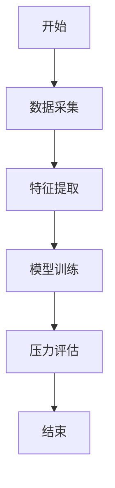
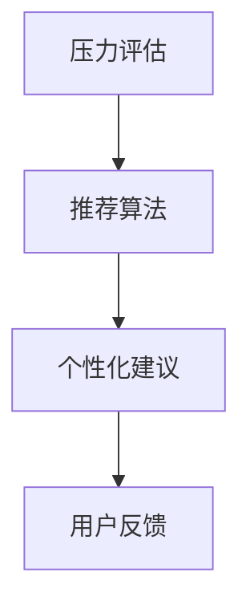

                 


# AI Agent在智能手表中的压力管理与放松指导

> 关键词：AI Agent, 智能手表, 压力管理, 放松指导, 健康监测, 数据分析

> 摘要：本文探讨AI Agent在智能手表中的应用，重点分析其如何通过压力监测和放松指导帮助用户管理压力。文章从背景、原理、系统架构到项目实战，全面解析AI在智能手表健康监测中的潜力和实现方式。

---

## 第一部分: 背景介绍

### 第1章: 问题背景

#### 1.1 现代社会中的压力问题
现代社会节奏加快，工作压力增大，长期的压力可能导致健康问题，如焦虑、失眠和心血管疾病。

#### 1.2 智能手表在健康监测中的作用
智能手表具备实时监测心率、血压和皮肤温度等功能，为压力监测提供基础数据。

#### 1.3 AI Agent在压力管理中的潜力
AI Agent能够分析生理数据，提供个性化的压力管理和放松建议，提升用户体验。

### 第2章: 问题描述

#### 2.1 压力的定义与分类
压力是身体对内外变化的反应，分为急性压力和慢性压力。

#### 2.2 压力对健康的影响
长期压力可能导致多种健康问题，包括免疫系统减弱和心理健康问题。

#### 2.3 智能手表监测压力的可行性
智能手表的数据采集能力为压力监测提供了可能性，但现有功能尚不完善。

### 第3章: 问题解决

#### 3.1 AI Agent在压力管理中的角色
AI Agent作为辅助工具，帮助用户实时监测压力，并提供放松建议。

#### 3.2 智能手表的数据采集能力
心率变异性（HRV）、皮肤温度和加速计数据可用于评估压力水平。

#### 3.3 综合解决方案的提出
结合AI算法和智能手表的监测功能，提供实时压力评估和个性化放松指导。

### 第4章: 边界与外延

#### 4.1 压力管理的适用场景
适用于长期处于高压环境的用户，如职场人士和学生。

#### 4.2 解决方案的局限性
依赖传感器精度和算法准确性，数据隐私问题需注意。

#### 4.3 与其他健康监测系统的区别
与单纯监测不同，本系统强调AI驱动的实时干预和个性化指导。

### 第5章: 概念结构与核心要素

#### 5.1 核心概念框架
包括压力监测、AI分析、个性化指导和用户反馈四个模块。

#### 5.2 各要素之间的关系
通过数据流连接，形成闭环系统，持续优化压力管理效果。

#### 5.3 系统的整体架构
分为数据采集、分析、反馈三个主要部分，确保实时性和准确性。

---

## 第二部分: 核心概念与联系

### 第2章: AI Agent的核心原理

#### 2.1 AI Agent的基本原理
AI Agent通过感知环境数据，运用算法做出决策，并执行相应操作。

#### 2.2 AI Agent与智能手表的交互
智能手表作为数据采集终端，AI Agent在后台处理数据，提供反馈。

#### 2.3 AI Agent在压力管理中的应用
实时监测生理指标，识别压力状态，并推荐放松策略。

### 第3章: 系统架构与数据流

#### 3.1 系统架构设计
- 数据采集模块：收集心率、皮肤温度等数据。
- 数据处理模块：进行特征提取和初步分析。
- AI决策模块：基于机器学习模型生成建议。
- 用户反馈模块：收集用户反馈，优化系统。

#### 3.2 数据流的可视化
- 数据采集流程：传感器收集生理数据。
- 数据处理流程：特征提取和预处理。
- 决策反馈流程：生成建议并发送给用户。

---

## 第三部分: 算法原理讲解

### 第4章: 压力监测算法

#### 4.1 算法概述
- 目标：实时监测压力水平。
- 输入：心率、皮肤温度等数据。
- 输出：压力状态评估。

#### 4.2 算法流程图


#### 4.3 算法实现代码
```python
import numpy as np
from sklearn.svm import SVC

# 数据预处理
data = np.array([...])  # 特征数据
labels = np.array([...])  # 压力标签

# 训练模型
model = SVC()
model.fit(data, labels)

# 预测压力状态
new_data = np.array([...])
predicted = model.predict(new_data)
```

### 第5章: 放松指导算法

#### 5.1 算法概述
- 目标：根据压力评估结果，推荐放松方法。
- 输入：压力评估结果和用户偏好。
- 输出：个性化放松建议。

#### 5.2 算法流程图


#### 5.3 算法实现代码
```python
def generate_recommendations(pressure_level, user_preferences):
    recommendations = []
    if pressure_level == 'high':
        if user_preferences['time'] == 'morning':
            recommendations.append('深呼吸练习')
        else:
            recommendations.append('冥想')
    else:
        recommendations.append('适度运动')
    return recommendations
```

---

## 第四部分: 系统分析与架构设计

### 第6章: 项目实战

#### 6.1 环境搭建
- 安装必要的库：如Python的机器学习库和智能手表SDK。

#### 6.2 核心代码实现
```python
class AIAssistant:
    def __init__(self, data):
        self.data = data
        self.model = self.train_model()

    def train_model(self):
        # 训练压力监测模型
        return SVC().fit(self.data, labels)

    def monitor_pressure(self):
        # 实时监测压力
        return self.model.predict(new_data)
```

#### 6.3 案例分析
- 案例1：用户A在高压状态下，系统推荐深呼吸练习。
- 案例2：用户B在中压状态下，建议适度运动。

#### 6.4 项目总结
系统通过AI Agent实时监测压力，提供个性化指导，有效帮助用户管理压力。

---

## 第五部分: 最佳实践与总结

### 第7章: 最佳实践

#### 7.1 技术建议
- 使用高精度传感器。
- 定期更新模型以提高准确性。

#### 7.2 用户建议
- 用户应定期校准设备。
- 及时反馈使用体验，帮助系统优化。

### 第8章: 小结

AI Agent在智能手表中的应用为压力管理提供了新的解决方案。通过实时监测和个性化指导，用户可以更有效地管理压力，提升生活质量。

### 第9章: 注意事项

- 数据隐私保护至关重要。
- 系统需定期维护和更新，确保准确性。

### 第10章: 拓展阅读

推荐相关书籍和论文，深入学习AI在健康监测中的应用。

---

# 作者：AI天才研究院 & 禅与计算机程序设计艺术

