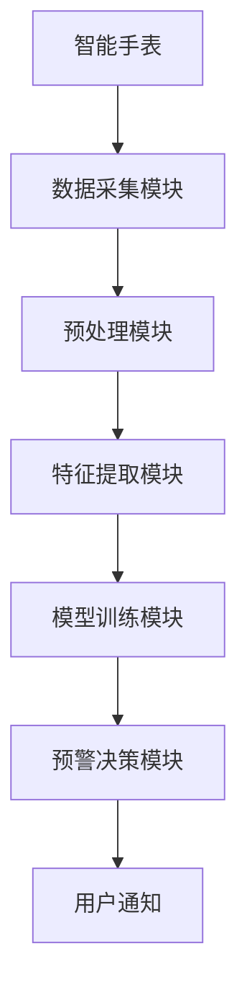

                 


```markdown
# AI Agent在智能手表中的心律失常预警系统

> 关键词：AI Agent，智能手表，心律失常，预警系统，算法实现，系统架构

> 摘要：本文深入探讨了AI Agent在智能手表中的心律失常预警系统的实现。通过背景介绍、核心概念、算法原理、系统架构、项目实战和最佳实践等多方面的详细分析，全面揭示了AI Agent在智能手表中的应用潜力和技术实现细节。文章旨在为读者提供一个清晰、完整的技术解决方案，帮助他们理解并掌握如何利用AI技术提升智能手表的健康监测能力。

---

# 第一部分: AI Agent在心律失常预警系统中的背景与概念

# 第1章: 背景介绍与问题定义

## 1.1 问题背景

### 1.1.1 心律失常的定义与危害
心律失常是指心脏跳动的节律异常，包括心动过速、心动过缓、早搏等多种类型。心律失常可能导致头晕、乏力、心悸等症状，严重时可引发心绞痛、心力衰竭甚至猝死。及时发现和预警心律失常对保障个人健康至关重要。

### 1.1.2 智能手表在健康监测中的作用
智能手表作为一种便携式可穿戴设备，已经成为人们日常生活中不可或缺的工具。它能够实时监测心率、血氧、心电图等生理指标，为用户提供健康数据支持。然而，智能手表在心律失常检测方面仍存在精度不足、误报率高等问题，亟需借助AI技术进行优化。

### 1.1.3 AI技术在医疗健康中的应用潜力
AI技术在医疗健康领域的应用日益广泛，尤其是在疾病早期预警、辅助诊断和个性化治疗等方面展现出巨大潜力。通过AI技术，智能手表可以更准确地识别心律失常，为用户提供及时的预警和建议。

## 1.2 问题描述

### 1.2.1 心律失常的常见类型
心律失常主要分为以下几类：
1. **窦性心律不齐**：心脏起搏点（窦房结）产生的电活动异常。
2. **房颤（心房颤动）**：心房电活动不规则，导致心脏跳动紊乱。
3. **室性早搏**：心脏室间隔出现异常电活动，导致心脏提前跳动。
4. **心动过速/心动过缓**：心跳速率超出正常范围。

### 1.2.2 智能手表心律监测的技术局限
尽管智能手表能够采集心率数据，但其精度和灵敏度有限。例如，心电图（ECG）采样频率不足、传感器精度不够等问题可能导致误报或漏报。

### 1.2.3 AI Agent在实时监测中的优势
AI Agent（智能体）能够实时分析心率数据，通过机器学习算法识别心律失常的特征，从而实现高精度的实时预警。

## 1.3 问题解决思路

### 1.3.1 AI Agent的核心功能
AI Agent在心律失常预警系统中的核心功能包括：
1. **实时数据采集**：通过智能手表采集心率数据。
2. **特征提取**：从心率数据中提取心律失常的特征。
3. **模型训练与推理**：利用机器学习模型对特征进行分类，判断是否存在心律失常。
4. **预警机制**：当检测到心律失常时，触发预警通知。

### 1.3.2 数据采集与处理流程
数据采集流程包括：
1. **心率数据采集**：通过智能手表的光学心率传感器或电极传感器采集心率数据。
2. **数据预处理**：去除噪声，提取心电图的关键特征。
3. **特征提取**：提取心率变异性、RR间期等关键特征。

### 1.3.3 预警机制的设计目标
预警机制的设计目标是实现快速、准确的预警，减少误报和漏报。通过设置不同的预警阈值，系统可以针对不同类型的用户（如老年人、运动员）提供个性化的预警服务。

## 1.4 边界与外延

### 1.4.1 系统的适用范围
本系统适用于智能手表用户，特别是有心律失常风险的用户，如高血压患者、心脏病患者等。

### 1.4.2 系统的局限性
1. **数据精度**：智能手表的传感器精度有限，可能导致数据采集误差。
2. **算法局限**：机器学习模型的泛化能力有限，可能无法覆盖所有类型的心律失常。
3. **用户依从性**：用户需要正确佩戴智能手表，否则可能导致数据采集失败。

### 1.4.3 系统与其他医疗设备的协同工作
AI Agent可以与医院的电子健康记录（EHR）系统集成，实现更全面的健康监测和管理。

## 1.5 概念结构与核心要素

### 1.5.1 AI Agent的组成要素
AI Agent由以下几部分组成：
1. **感知模块**：负责采集和处理心率数据。
2. **决策模块**：负责分析数据并做出预警决策。
3. **执行模块**：负责触发预警通知。

### 1.5.2 心律失常预警的关键指标
心律失常预警的关键指标包括：
1. **RR间期**：心电图中两个连续R波之间的间隔时间。
2. **心率变异性（HRV）**：心率的波动程度。
3. **心律不齐程度**：心电图的节律紊乱程度。

### 1.5.3 智能手表数据采集的核心技术
智能手表数据采集的核心技术包括：
1. **光学心率传感器**：通过光电容积法测量心率。
2. **电极传感器**：通过心电图采集更精确的心率数据。

---

# 第二部分: AI Agent的核心概念与技术原理

# 第2章: AI Agent的基本原理

## 2.1 AI Agent的定义与分类

### 2.1.1 AI Agent的定义
AI Agent是一种能够感知环境并采取行动以实现目标的智能实体。在心律失常预警系统中，AI Agent通过分析心率数据，判断是否存在心律失常。

### 2.1.2 AI Agent的主要分类
AI Agent可以分为以下几类：
1. **简单反射型Agent**：基于当前输入做出简单反应。
2. **基于模型的Agent**：通过内部模型分析环境并做出决策。
3. **基于目标的Agent**：根据目标采取行动。

### 2.1.3 AI Agent在医疗领域的应用
在医疗领域，AI Agent广泛应用于疾病诊断、药物研发、健康管理等方面。在心律失常预警系统中，AI Agent通过分析心率数据，帮助医生和患者及时发现潜在的健康问题。

## 2.2 心律失常检测的基本原理

### 2.2.1 心电图的基本原理
心电图（ECG）是通过电极测量心脏电活动的变化。正常心电图表现为规律的波形，异常心电图则表现为波形的异常。

### 2.2.2 心律失常的分类与特征
心律失常可以分为房颤、早搏等多种类型，每种类型都有其独特的波形特征。

### 2.2.3 数据采集与预处理技术
数据采集与预处理技术包括：
1. **数据采集**：通过传感器采集心率数据。
2. **数据预处理**：去除噪声，提取心电图的关键特征。

## 2.3 AI Agent的核心算法

### 2.3.1 机器学习算法在心律失常检测中的应用
机器学习算法在心律失常检测中的应用包括：
1. **支持向量机（SVM）**：用于分类心律失常类型。
2. **随机森林（Random Forest）**：用于分类心律失常类型。

### 2.3.2 深度学习算法的优势
深度学习算法在心律失常检测中的优势包括：
1. **卷积神经网络（CNN）**：能够自动提取心电图的特征。
2. **长短期记忆网络（LSTM）**：能够捕捉时间序列数据中的长程依赖关系。

### 2.3.3 算法选择与优化策略
算法选择与优化策略包括：
1. **数据预处理**：对心电图数据进行标准化和归一化处理。
2. **特征选择**：选择与心律失常相关的特征。
3. **模型训练**：通过交叉验证优化模型参数。

---

# 第三部分: 心律失常预警系统的算法实现

# 第3章: 算法原理与实现

## 3.1 数据采集与预处理

### 3.1.1 心电数据的采集方法
心电数据的采集方法包括：
1. **光学心率传感器**：通过光电容积法测量心率。
2. **电极传感器**：通过心电图采集心率数据。

### 3.1.2 数据预处理技术
数据预处理技术包括：
1. **去噪**：去除心电图中的噪声。
2. **特征提取**：提取心率变异性、RR间期等特征。

## 3.2 机器学习算法的实现

### 3.2.1 支持向量机（SVM）的实现
支持向量机（SVM）是一种常用的分类算法，适用于小样本数据的分类。在心律失常检测中，SVM可以通过训练分类器实现心律失常类型识别。

### 3.2.2 随机森林（Random Forest）的实现
随机森林是一种基于决策树的集成算法，适用于特征较多的分类问题。在心律失常检测中，随机森林可以通过集成多个决策树实现高精度分类。

## 3.3 深度学习算法的实现

### 3.3.1 卷积神经网络（CNN）的实现
卷积神经网络（CNN）是一种适用于图像处理的深度学习算法。在心律失常检测中，CNN可以通过自动提取心电图的特征实现分类。

### 3.3.2 长短期记忆网络（LSTM）的实现
长短期记忆网络（LSTM）是一种适用于时间序列数据的深度学习算法。在心律失常检测中，LSTM可以通过捕捉心电图的时间序列特征实现分类。

## 3.4 算法比较与优化

### 3.4.1 不同算法的性能比较
通过实验对比不同算法的性能，选择最优算法进行部署。

### 3.4.2 模型优化策略
模型优化策略包括：
1. **参数调优**：通过网格搜索优化模型参数。
2. **数据增强**：通过数据增强技术增加数据多样性。

---

# 第四部分: 系统分析与架构设计方案

# 第4章: 系统分析与架构设计

## 4.1 问题场景介绍
心律失常预警系统的目标是通过智能手表实时监测心率数据，利用AI Agent实现心律失常的实时预警。

## 4.2 项目介绍
本项目旨在开发一款基于AI Agent的智能手表心律失常预警系统，通过机器学习算法实现高精度的实时预警。

## 4.3 系统功能设计

### 4.3.1 领域模型
领域模型包括：
1. **数据采集模块**：负责采集心率数据。
2. **预处理模块**：负责数据预处理。
3. **特征提取模块**：负责特征提取。
4. **模型训练模块**：负责模型训练。
5. **预警模块**：负责预警决策。

### 4.3.2 系统架构设计
系统架构设计包括：
1. **数据采集层**：负责采集心率数据。
2. **数据处理层**：负责数据预处理和特征提取。
3. **模型训练层**：负责模型训练和优化。
4. **预警决策层**：负责预警决策和通知。

### 4.3.3 系统接口设计
系统接口设计包括：
1. **数据接口**：与智能手表的数据接口进行交互。
2. **用户接口**：提供用户预警通知和操作界面。

### 4.3.4 系统交互设计
系统交互设计包括：
1. **用户操作流程**：用户佩戴智能手表，系统采集心率数据。
2. **预警触发流程**：系统检测到心律失常时，触发预警通知。

## 4.4 系统架构图


## 4.5 系统交互流程

### 4.5.1 数据采集流程
1. 智能手表采集心率数据。
2. 数据采集模块将数据传输到预处理模块。

### 4.5.2 数据处理流程
1. 预处理模块对数据进行去噪处理。
2. 特征提取模块提取心率变异性、RR间期等特征。

### 4.5.3 模型训练流程
1. 模型训练模块利用特征数据训练机器学习模型。
2. 模型优化模块通过参数调优优化模型性能。

### 4.5.4 预警触发流程
1. 预警决策模块利用优化后的模型进行实时预测。
2. 当检测到心律失常时，触发预警通知。

---

# 第五部分: 项目实战

# 第5章: 项目实战

## 5.1 环境安装

### 5.1.1 安装Python环境
安装Python 3.8或更高版本。

### 5.1.2 安装机器学习库
安装以下机器学习库：
1. scikit-learn
2. xgboost
3. tensorflow
4. pytorch

### 5.1.3 安装心电数据处理库
安装以下心电数据处理库：
1. numpy
2. scipy
3. matplotlib

## 5.2 系统核心实现

### 5.2.1 数据采集实现
```python
import numpy as np
import pandas as pd

def采集心率数据():
    # 读取心电数据
    data = pd.read_csv('心电数据.csv')
    return data
```

### 5.2.2 数据预处理实现
```python
def数据预处理(data):
    # 去除噪声
    data = data.rolling(window=5).mean()
    return data
```

### 5.2.3 特征提取实现
```python
def特征提取(data):
    # 提取RR间期
    rr_intervals = data['RR间期'].values
    return rr_intervals
```

### 5.2.4 模型训练实现
```python
from sklearn.svm import SVC

def训练模型(rr_intervals, labels):
    # 训练支持向量机模型
    model = SVC()
    model.fit(rr_intervals, labels)
    return model
```

### 5.2.5 预警机制实现
```python
def触发预警(model, new_rr_intervals):
    # 预测心律失常类型
    prediction = model.predict(new_rr_intervals)
    if prediction == '心律失常':
        print("检测到心律失常，触发预警！")
```

## 5.3 代码应用解读与分析

### 5.3.1 数据采集模块
数据采集模块负责从智能手表中读取心电数据，并将其存储在CSV文件中。

### 5.3.2 数据预处理模块
数据预处理模块对采集到的数据进行去噪处理，确保数据的准确性。

### 5.3.3 特征提取模块
特征提取模块从预处理后的心电数据中提取心率变异性、RR间期等特征，为模型训练提供输入数据。

### 5.3.4 模型训练模块
模型训练模块利用特征数据训练机器学习模型，并通过参数调优优化模型性能。

### 5.3.5 预警决策模块
预警决策模块利用优化后的模型进行实时预测，当检测到心律失常时，触发预警通知。

## 5.4 实际案例分析

### 5.4.1 数据采集与处理
假设我们从智能手表中采集了以下心率数据：
```plaintext
时间    心率    RR间期
00:00  72      0.8
00:01  73      0.7
00:02  75      0.6
00:03  70      0.8
```

### 5.4.2 特征提取
从上述数据中提取RR间期特征：
```plaintext
RR间期序列: [0.8, 0.7, 0.6, 0.8]
```

### 5.4.3 模型训练
利用训练数据训练支持向量机模型，分类心律失常类型。

### 5.4.4 预警触发
当检测到RR间期异常时，触发预警通知。

## 5.5 项目小结

通过本项目实战，我们实现了基于AI Agent的智能手表心律失常预警系统。系统能够实时采集心率数据，通过预处理和特征提取，利用机器学习算法实现高精度的实时预警。

---

# 第六部分: 最佳实践

# 第6章: 最佳实践

## 6.1 小结
AI Agent在智能手表中的心律失常预警系统通过实时监测和分析心率数据，能够及时发现和预警心律失常，为用户提供健康保障。

## 6.2 注意事项
1. **数据精度**：智能手表的传感器精度有限，可能导致数据采集误差。
2. **算法优化**：需要不断优化算法模型，提高预警的准确率。
3. **用户隐私**：心率数据涉及用户隐私，需要严格保护数据安全。

## 6.3 拓展阅读
1. **机器学习在医疗领域的应用**
2. **深度学习在心电图分析中的应用**
3. **AI在可穿戴设备中的创新应用**

---

# 作者：AI天才研究院/AI Genius Institute & 禅与计算机程序设计艺术 /Zen And The Art of Computer Programming
```

