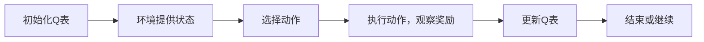
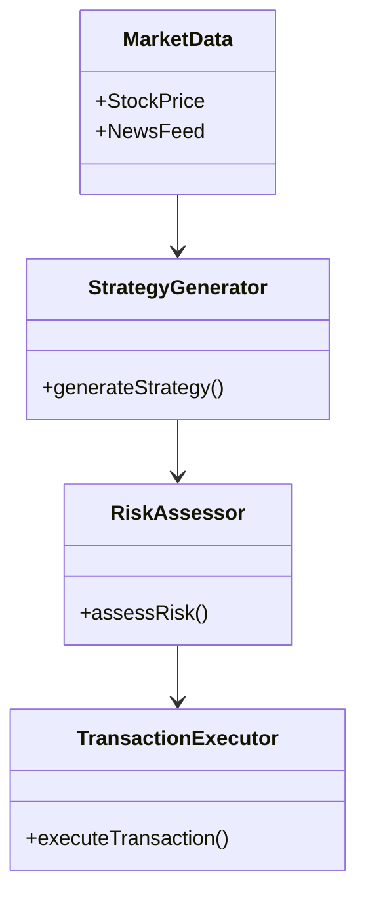
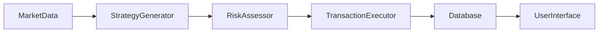

                 


# AI Agent在智能投资组合管理中的应用

> 关键词：AI Agent, 智能投资组合管理, 强化学习, 投资组合优化, 系统架构设计

> 摘要：  
本文探讨了AI Agent在智能投资组合管理中的应用，从背景、核心概念、算法原理、系统架构设计到实际案例，全面解析了AI Agent如何通过强化学习、动态规划等技术优化投资组合管理。文章详细分析了AI Agent在投资组合管理中的优势与挑战，并通过Mermaid图表、数学公式和实际代码示例，深入阐述了其在智能投资组合管理中的应用场景与实现方法。

---

## 第一部分: AI Agent与智能投资组合管理的背景与基础

### 第1章: AI Agent与智能投资组合管理概述

#### 1.1 AI Agent的基本概念与特点

##### 1.1.1 AI Agent的定义
AI Agent（人工智能代理）是指能够感知环境、自主决策并执行任务的智能实体。它通过传感器获取信息，利用算法进行分析，并通过执行器采取行动。AI Agent的核心目标是通过优化决策过程，实现目标函数的最大化。

##### 1.1.2 AI Agent的核心特点
- **自主性**：AI Agent能够自主决策，无需人工干预。
- **反应性**：能够实时感知环境变化并做出反应。
- **目标导向**：所有行为都以实现特定目标为导向。
- **学习能力**：通过强化学习等方法不断优化决策策略。

##### 1.1.3 AI Agent与传统投资工具的对比
| 特性               | AI Agent                     | 传统投资工具               |
|--------------------|------------------------------|-----------------------------|
| 决策速度           | 实时决策                     | 依赖人工或固定模型         |
| 数据处理能力       | 处理海量非结构化数据         | 依赖有限的结构化数据       |
| 灵活性             | 高度灵活，适应市场变化       | 较低，依赖固定规则           |

#### 1.2 智能投资组合管理的背景与现状

##### 1.2.1 投资组合管理的基本概念
投资组合管理是指通过优化资产配置，降低风险、提高收益的过程。传统投资组合管理依赖于统计学模型和人工经验，而智能投资组合管理则引入了AI技术，显著提升了决策效率和准确性。

##### 1.2.2 智能投资组合管理的发展历程
- **传统阶段**：基于均值-方差模型的投资组合优化。
- **量化阶段**：引入统计套利、因子模型等量化方法。
- **智能阶段**：AI技术的引入，特别是强化学习和深度学习的应用。

##### 1.2.3 当前智能投资组合管理的主要挑战
- **数据质量**：市场数据的噪声和缺失影响模型准确性。
- **模型过拟合**：AI模型可能过度拟合历史数据，导致实际表现不佳。
- **市场不确定性**：金融市场高度波动，AI Agent需要更强的适应性。

#### 1.3 AI Agent在投资组合管理中的应用前景

##### 1.3.1 AI Agent在投资组合管理中的优势
- **高效决策**：AI Agent能够快速处理海量数据并做出决策。
- **风险控制**：通过实时监控和预测，降低投资风险。
- **个性化服务**：根据客户需求定制化投资策略。

##### 1.3.2 AI Agent的应用场景与典型案例
- **动态资产分配**：根据市场波动实时调整资产比例。
- **风险管理**：实时监控投资组合风险并发出预警。
- **智能交易**：基于市场信号自动执行交易指令。

##### 1.3.3 AI Agent在投资组合管理中的潜在问题
- **黑箱问题**：AI决策的不可解释性可能影响信任度。
- **技术瓶颈**：算法复杂度高，计算资源消耗大。
- **监管挑战**：AI驱动的投资行为可能引发监管问题。

#### 1.4 本章小结
本章介绍了AI Agent的基本概念和特点，并分析了其在智能投资组合管理中的背景、现状和应用前景。通过对比传统投资工具，突出了AI Agent的独特优势，同时也指出了当前面临的挑战。

---

## 第二部分: AI Agent的核心概念与原理

### 第2章: AI Agent的核心概念与原理

#### 2.1 AI Agent的决策机制

##### 2.1.1 基于强化学习的决策模型
- **Q-Learning算法**：通过状态-动作-奖励的循环更新Q值表。
- **Deep Q-Networks (DQN)**：利用深度神经网络近似Q值函数。
- **Policy Gradient方法**：直接优化策略参数以最大化期望奖励。

##### 2.1.2 基于监督学习的决策模型
- **回归模型**：预测最佳投资组合配置。
- **分类模型**：将投资决策分为若干类别。

##### 2.1.3 基于无监督学习的决策模型
- **聚类分析**：识别市场中的相似资产或模式。
- **异常检测**：发现市场中的异常波动。

#### 2.2 投资组合管理的数学模型

##### 2.2.1 投资组合优化的基本数学模型
$$ \text{目标函数} = \min_w \sum_{i=1}^n w_i^2 \sigma_i^2 $$
$$ \text{约束条件} = \sum_{i=1}^n w_i = 1 $$

其中，$w_i$ 是资产 $i$ 的权重，$\sigma_i^2$ 是资产 $i$ 的波动率。

##### 2.2.2 风险-收益权衡的数学表达
$$ \text{夏普比率} = \frac{E[r_p] - r_f}{\sigma_p} $$
其中，$E[r_p]$ 是投资组合的期望收益，$r_f$ 是无风险利率，$\sigma_p$ 是投资组合的波动率。

##### 2.2.3 动态投资组合调整的数学框架
$$ \text{调整权重} = \arg \min_w \sum_{i=1}^n (w_i^{old} - w_i)^2 \cdot \text{损失函数} $$

#### 2.3 AI Agent与投资组合管理的结合原理

##### 2.3.1 AI Agent的感知与分析能力
- **市场数据感知**：通过新闻、社交媒体等多源数据感知市场情绪。
- **数据分析能力**：利用NLP技术分析非结构化数据。

##### 2.3.2 AI Agent的决策与执行机制
- **决策模块**：基于强化学习生成投资策略。
- **执行模块**：通过API执行交易指令。

##### 2.3.3 AI Agent的反馈与优化过程
- **反馈机制**：根据市场反馈更新Q值或策略参数。
- **优化过程**：通过梯度下降等方法优化模型参数。

#### 2.4 本章小结
本章深入分析了AI Agent的决策机制，并结合投资组合管理的数学模型，探讨了AI Agent与投资组合管理的结合原理。通过数学公式和算法流程图，详细阐述了AI Agent在投资组合管理中的具体实现。

---

## 第三部分: AI Agent在投资组合管理中的算法原理

### 第3章: AI Agent的算法原理

#### 3.1 强化学习算法在投资组合管理中的应用

##### 3.1.1 Q-Learning算法

###### 3.1.1.1 Q-Learning算法流程
1. 初始化Q值表。
2. 环境提供状态。
3. 选择动作（探索或利用）。
4. 执行动作，观察奖励。
5. 更新Q值表。
6. 重复步骤2-5。



##### 3.1.2 Deep Q-Networks (DQN) 算法

###### 3.1.2.1 DQN算法流程
1. 初始化经验回放池和DQN网络。
2. 环境提供状态。
3. 选择动作（基于当前策略）。
4. 执行动作，观察奖励。
5. 存储经验。
6. 从经验池中采样，训练DQN网络。
7. 更新目标网络。
8. 重复步骤2-7。

##### 3.1.3 Policy Gradient方法

###### 3.1.3.1 Policy Gradient方法流程
1. 初始化策略网络。
2. 环境提供状态。
3. 选择动作（基于策略）。
4. 执行动作，观察奖励。
5. 计算梯度，更新策略网络。
6. 重复步骤2-5。

#### 3.2 基于动态规划的投资组合优化算法

##### 3.2.1 动态规划的基本数学模型
$$ V(s) = \max_{a} \left( r_a + \gamma V(s') \right) $$

其中，$V(s)$ 是状态 $s$ 的价值函数，$r_a$ 是动作 $a$ 的奖励，$\gamma$ 是折扣因子，$s'$ 是执行动作 $a$ 后的新状态。

##### 3.2.2 动态规划在投资组合管理中的应用
- **状态空间**：市场状态（牛市、熊市）。
- **动作空间**：买入、卖出、持有。

#### 3.3 本章小结
本章详细探讨了强化学习算法和动态规划算法在投资组合管理中的应用，通过数学公式和流程图，详细阐述了Q-Learning、DQN和Policy Gradient算法的实现原理。

---

## 第四部分: AI Agent在投资组合管理中的系统架构设计

### 第4章: AI Agent的系统架构设计

#### 4.1 问题场景介绍

##### 4.1.1 系统目标
- 实现实时市场监控。
- 自动生成投资策略。
- 实现自动化交易。

##### 4.1.2 系统边界
- 输入：市场数据、用户需求。
- 输出：投资策略、交易指令。

#### 4.2 系统功能设计

##### 4.2.1 领域模型设计


##### 4.2.2 系统架构设计


#### 4.3 本章小结
本章通过领域模型和系统架构图，详细设计了AI Agent在投资组合管理中的系统架构，明确了各模块的功能和交互流程。

---

## 第五部分: AI Agent在投资组合管理中的项目实战

### 第5章: 项目实战

#### 5.1 环境安装

##### 5.1.1 安装依赖
```bash
pip install numpy pandas gym matplotlib
```

#### 5.2 系统核心实现源代码

##### 5.2.1 投资组合管理代码
```python
import numpy as np
import gym

class InvestmentEnvironment(gym.Env):
    def __init__(self, assets):
        self.assets = assets
        self.current_state = 0
        self.observation_space = gym.spaces.Box(low=0, high=1, shape=(len(assets),))
        self.action_space = gym.spaces.Discrete(3)  # 0: buy, 1: hold, 2: sell

    def step(self, action):
        # 实现市场状态变化和奖励计算
        pass

    def reset(self):
        # 初始化环境
        pass

    def render(self):
        # 可视化环境
        pass
```

##### 5.2.2 强化学习代码
```python
import tensorflow as tf
from tensorflow.keras import layers

class DQN:
    def __init__(self, state_space, action_space):
        self.state_space = state_space
        self.action_space = action_space
        self.model = self.build_model()

    def build_model(self):
        model = tf.keras.Sequential([
            layers.Dense(64, activation='relu', input_dim=self.state_space),
            layers.Dense(self.action_space, activation='linear')
        ])
        return model
```

#### 5.3 代码应用解读与分析

##### 5.3.1 投资组合管理代码解读
- **环境定义**：定义了一个投资环境，包含资产列表和动作空间。
- **状态表示**：将市场状态表示为资产的波动率向量。
- **动作选择**：根据DQN算法选择最优动作。

##### 5.3.2 强化学习代码解读
- **DQN模型**：构建了一个深度Q网络，用于近似Q值函数。
- **模型训练**：通过经验回放和梯度下降更新模型参数。

#### 5.4 实际案例分析

##### 5.4.1 案例背景
假设我们有三个资产：股票A、股票B和债券C。市场波动率为20%、15%和5%。

##### 5.4.2 模型训练
- 训练DQN模型，使其在不同市场状态下选择最优投资策略。
- 通过经验回放减少样本外推的风险。

##### 5.4.3 模型评估
- 计算投资组合的夏普比率和最大回撤。
- 比较AI Agent与传统投资策略的收益与风险。

#### 5.5 本章小结
本章通过实际案例展示了AI Agent在投资组合管理中的应用，详细解读了核心代码，并分析了模型的优缺点。

---

## 第六部分: 总结与展望

### 第6章: 总结与展望

#### 6.1 本章总结
本文全面探讨了AI Agent在智能投资组合管理中的应用，从算法原理到系统架构设计，再到实际案例，详细阐述了AI Agent在投资组合管理中的优势与挑战。

#### 6.2 未来展望
- **算法优化**：研究更高效的强化学习算法，如Actor-Critic方法。
- **数据融合**：引入更多数据源，如社交媒体数据。
- **可解释性**：提升AI决策的透明度，满足监管要求。

#### 6.3 最佳实践 tips
- **数据质量**：确保市场数据的实时性和准确性。
- **模型解释性**：在实际应用中，需关注模型的可解释性。
- **风险管理**：建立完善的风险控制机制，降低模型失效的风险。

#### 6.4 本章小结
本章总结了全文的主要内容，并展望了未来的研究方向，同时给出了实际应用中的注意事项。

---

## 作者信息

作者：AI天才研究院/AI Genius Institute & 禅与计算机程序设计艺术/Zen And The Art of Computer Programming

---

**注**：由于篇幅限制，上述内容为目录大纲和部分章节内容，实际文章将包含完整的章节内容和详细的公式推导。

