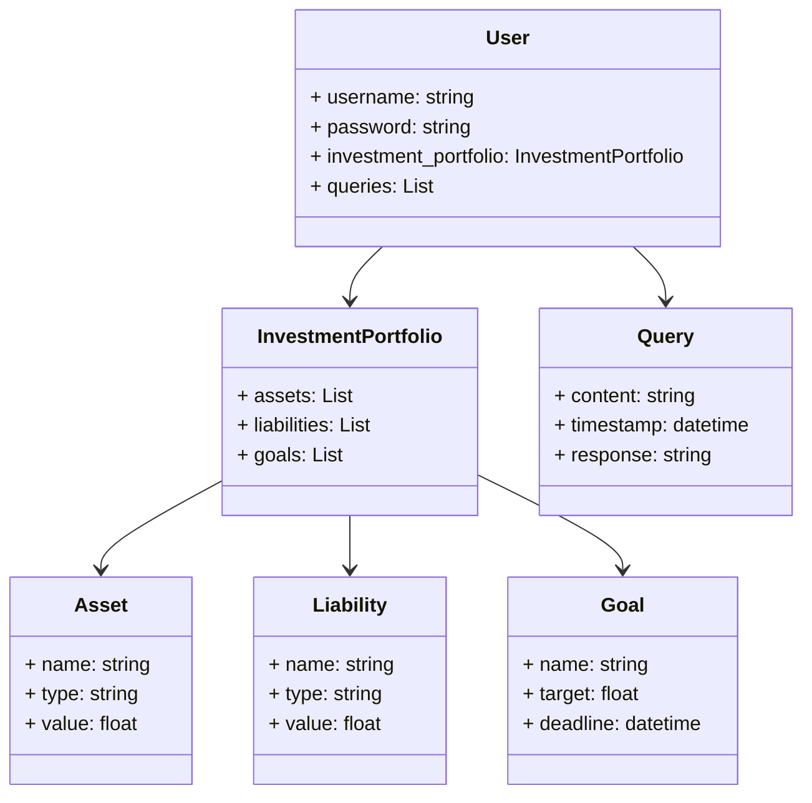

                 


# AI Agent在智能投资顾问中的应用

> 关键词：AI Agent, 智能投资顾问, 机器学习, 自然语言处理, 知识图谱, 强化学习

> 摘要：随着人工智能技术的快速发展，AI Agent（人工智能代理）在投资顾问领域的应用越来越广泛。本文将详细介绍AI Agent的基本概念、核心技术及其在智能投资顾问中的具体应用。通过分析投资顾问的背景、算法原理、系统架构以及项目实战，本文旨在为读者提供一个全面且深入的技术视角，展示AI Agent如何帮助投资者做出更明智的决策。

---

## 第1章: AI Agent 的基本概念与技术背景

### 1.1 AI Agent 的定义与核心概念

#### 1.1.1 AI Agent 的定义
AI Agent（人工智能代理）是指能够感知环境、自主决策并执行任务的智能实体。它可以是一个软件程序，也可以是一个物理设备，其目标是通过与环境交互来实现特定的目标。

#### 1.1.2 AI Agent 的核心特征
AI Agent 具备以下几个核心特征：
1. **自主性**：能够在没有外部干预的情况下自主运行。
2. **反应性**：能够感知环境并实时做出反应。
3. **目标导向**：具备明确的目标，并能够采取行动以实现目标。
4. **学习能力**：能够通过数据和经验不断优化自身性能。

#### 1.1.3 AI Agent 的分类与应用场景
AI Agent 可以根据不同的标准进行分类，常见的分类方式包括：
1. **基于智能水平**：
   - 单一智能体（Single Agent）
   - 多智能体系统（Multi-Agent System）
2. **基于应用场景**：
   - 金融领域：用于投资决策、风险控制等。
   - 医疗领域：用于诊断辅助、治疗方案推荐等。
   - 交通领域：用于自动驾驶、交通管理等。

### 1.2 AI Agent 的技术基础

#### 1.2.1 机器学习基础
机器学习是AI Agent的核心技术之一。通过训练模型，AI Agent能够从数据中学习规律，并做出预测和决策。

- **监督学习**：通过标记数据进行训练，模型学习输入与输出之间的映射关系。
- **无监督学习**：通过未标记数据进行训练，模型发现数据中的潜在结构。
- **强化学习**：通过与环境交互，模型通过试错学习最优策略。

#### 1.2.2 自然语言处理（NLP）基础
NLP 是让计算机理解和处理人类语言的技术。在投资顾问中，NLP 用于解析用户的自然语言查询，并生成相应的投资建议。

- **文本分类**：将文本划分为不同的类别，如情感分析、主题分类等。
- **命名实体识别（NER）**：识别文本中的实体，如人名、地名、组织名等。
- **意图识别**：识别用户输入的意图，如“查询某只股票的历史数据”。

#### 1.2.3 知识图谱与推理
知识图谱是一种结构化的数据表示方式，能够将实体及其关系表示为图结构。在投资顾问中，知识图谱用于存储和推理投资相关知识。

- **知识图谱的构建**：通过爬取和分析数据，构建投资相关的知识图谱。
- **推理与决策**：基于知识图谱进行推理，生成最优的投资策略。

---

## 第2章: 智能投资顾问的背景与现状

### 2.1 投资顾问的定义与传统模式

#### 2.1.1 投资顾问的基本概念
投资顾问是指为投资者提供投资建议和决策支持的专业人士。传统投资顾问通常依赖于经验和市场分析，帮助客户制定投资策略。

#### 2.1.2 传统投资顾问的工作模式
传统投资顾问的工作模式包括：
1. **面对面咨询**：投资者与顾问进行一对一交流。
2. **电话咨询**：通过电话提供投资建议。
3. **书面报告**：定期向客户发送投资报告。

#### 2.1.3 传统投资顾问的局限性
传统投资顾问存在以下局限性：
1. **效率低**：依赖人工分析，效率较低。
2. **成本高**：需要大量人工投入，成本较高。
3. **主观性强**：受顾问个人经验和判断的影响较大。

### 2.2 智能投资顾问的定义与优势

#### 2.2.1 智能投资顾问的核心特点
智能投资顾问是基于人工智能技术的投资顾问服务。其核心特点是：
1. **自动化**：能够自动分析数据并生成建议。
2. **实时性**：能够实时跟踪市场动态并做出反应。
3. **个性化**：能够根据投资者的需求和风险偏好提供定制化服务。

#### 2.2.2 智能投资顾问的优势
智能投资顾问相比传统投资顾问具有以下优势：
1. **高效性**：能够快速处理大量数据，提供实时建议。
2. **客观性**：基于数据和算法，减少人为判断的偏差。
3. **可扩展性**：能够同时为大量投资者提供服务。

#### 2.2.3 智能投资顾问的市场现状
随着人工智能技术的快速发展，智能投资顾问在金融领域的应用越来越广泛。许多金融科技公司已经推出了基于AI的智能投资顾问服务，帮助投资者实现自动化和智能化的投资管理。

---

## 第3章: AI Agent 在投资顾问中的核心技术

### 3.1 强化学习算法

#### 3.1.1 强化学习的基本原理
强化学习是一种通过试错学习最优策略的算法。智能体通过与环境交互，不断调整策略以最大化累计奖励。

- **状态（State）**：智能体所处的环境状态。
- **动作（Action）**：智能体在状态下的行为。
- **奖励（Reward）**：智能体行为后获得的反馈。
- **策略（Policy）**：智能体选择动作的概率分布。

#### 3.1.2 Q-learning 算法的实现
Q-learning 是一种经典的强化学习算法，适用于离线学习场景。其核心思想是通过构建Q表来记录状态-动作对的期望奖励。

- **Q表更新公式**：
  $$ Q(s, a) = Q(s, a) + \alpha (r + \gamma \max Q(s', a') - Q(s, a)) $$

  其中，$\alpha$ 是学习率，$\gamma$ 是折扣因子。

- **算法流程**：
  1. 初始化Q表为零。
  2. 在当前状态下选择一个动作。
  3. 执行动作，观察新的状态和获得的奖励。
  4. 更新Q表中的对应值。
  5. 重复上述步骤直到达到终止条件。

#### 3.1.3 算法的数学模型与公式
Q-learning 的数学模型可以表示为：
$$ Q(s, a) = r + \gamma \max Q(s', a') $$

其中，$r$ 是当前动作的奖励，$\gamma$ 是折扣因子，$\max Q(s', a')$ 是下一个状态下的最大Q值。

### 3.2 自然语言处理技术

#### 3.2.1 Transformer 模型的原理
Transformer 是一种基于注意力机制的深度学习模型，广泛应用于自然语言处理任务。其核心思想是通过计算输入序列中每个词与其他词的相关性，生成位置感知的表示。

- **编码器**：将输入序列编码为固定长度的向量。
- **解码器**：根据编码器输出生成目标序列。

#### 3.2.2 BERT 模型在投资顾问中的应用
BERT（Bidirectional Encoder Representations from Transformers）是一种预训练的Transformer模型，能够理解上下文关系。在投资顾问中，BERT 可以用于文本分类、意图识别等任务。

- **文本分类**：将投资相关文本分类为不同的主题。
- **意图识别**：识别用户输入的意图，如“查询某只股票的历史数据”。

#### 3.2.3 NLP 在文本分析中的应用
NLP 技术在投资顾问中的文本分析应用包括：
1. **情感分析**：分析市场情绪，辅助投资决策。
2. **实体识别**：识别文本中的公司名称、股票代码等实体。
3. **文本摘要**：对长文本进行摘要，提取关键信息。

---

## 第4章: 知识图谱与推理

### 4.1 知识图谱的构建

#### 4.1.1 知识图谱的基本结构
知识图谱是一种结构化的数据表示方式，由实体（节点）和关系（边）组成。例如，实体可以是“公司”，关系可以是“属于行业”。

#### 4.1.2 实体与关系的定义
- **实体**：知识图谱中的基本单元，如“苹果公司”、“科技行业”。
- **关系**：实体之间的关联，如“苹果公司属于科技行业”。

#### 4.1.3 知识图谱的构建流程
1. 数据采集：从多种数据源采集投资相关数据。
2. 数据清洗：去除冗余和噪声数据。
3. 实体识别：识别文本中的实体。
4. 关系抽取：抽取实体之间的关系。
5. 知识融合：将抽取的关系合并到知识图谱中。

### 4.2 逻辑推理与决策

#### 4.2.1 基于知识图谱的推理算法
基于知识图谱的推理算法包括：
1. **路径推理**：通过遍历知识图谱中的路径，找到实体之间的关系。
2. **规则推理**：根据预定义的规则进行推理。
3. **概率推理**：基于概率模型进行推理，如贝叶斯网络。

#### 4.2.2 推理的数学模型与公式
概率推理的数学模型可以表示为：
$$ P(h|e) = \frac{P(e|h)}{P(e)} $$

其中，$h$ 是假设，$e$ 是证据。

---

## 第5章: 投资顾问系统的功能与架构设计

### 5.1 系统功能模块划分

#### 5.1.1 数据采集模块
数据采集模块负责从多种数据源（如股票数据、新闻数据）采集投资相关数据。

#### 5.1.2 数据分析模块
数据分析模块对采集的数据进行清洗、处理和分析，生成投资建议。

#### 5.1.3 投资建议生成模块
投资建议生成模块根据分析结果，生成个性化投资建议。

### 5.2 系统架构设计

#### 5.2.1 领域模型的类图


#### 5.2.2 系统架构图
```mermaid
service
    InvestmentAdvisorSystem
        ├── Data采集模块
        ├── 数据分析模块
        ├── 投资建议生成模块
        └── 用户交互界面
```

---

## 第6章: 项目实战——构建一个智能投资顾问系统

### 6.1 项目背景与目标
本项目旨在通过AI Agent技术，构建一个智能投资顾问系统，帮助投资者实现自动化和智能化的投资管理。

### 6.2 环境安装与配置
1. **安装Python**：确保安装了Python 3.8或更高版本。
2. **安装依赖库**：
   ```bash
   pip install numpy pandas scikit-learn transformers
   ```

### 6.3 系统核心实现

#### 6.3.1 数据采集模块实现
```python
import requests
import json

def fetch_stock_data(ticker):
    url = f"https://api.example.com/stock/{ticker}"
    response = requests.get(url)
    return json.loads(response.text)
```

#### 6.3.2 数据分析模块实现
```python
from sklearn.model_selection import train_test_split
from sklearn.linear_model import LinearRegression

def train_model(data):
    X = data.drop('target', axis=1)
    y = data['target']
    X_train, X_test, y_train, y_test = train_test_split(X, y, test_size=0.2)
    model = LinearRegression()
    model.fit(X_train, y_train)
    return model
```

#### 6.3.3 投资建议生成模块实现
```python
def generate_recommendation(model, user_data):
    prediction = model.predict(user_data)
    if prediction > 0.6:
        return "买入"
    elif prediction < 0.4:
        return "卖出"
    else:
        return "持有"
```

### 6.4 项目小结
通过本项目的实现，我们展示了AI Agent在智能投资顾问中的应用。数据采集模块负责获取数据，数据分析模块负责训练模型，投资建议生成模块负责生成投资建议。整个系统实现了从数据获取到投资决策的完整流程。

---

## 第7章: 总结与展望

### 7.1 总结
本文详细介绍了AI Agent在智能投资顾问中的应用，从基本概念到核心技术，从系统设计到项目实现，全面探讨了AI Agent在投资顾问中的潜力和价值。

### 7.2 展望
随着人工智能技术的不断发展，AI Agent在投资顾问中的应用前景广阔。未来，可以通过以下方面进一步提升：
1. **多模态数据处理**：结合图像、语音等多种数据源，提升系统的感知能力。
2. **强化学习优化**：通过强化学习进一步优化投资策略。
3. **知识图谱增强**：构建更复杂的知识图谱，提升系统的推理能力。

---

## 作者：AI天才研究院/AI Genius Institute & 禅与计算机程序设计艺术 /Zen And The Art of Computer Programming

