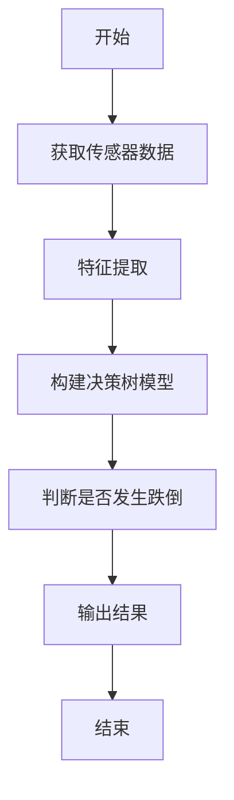
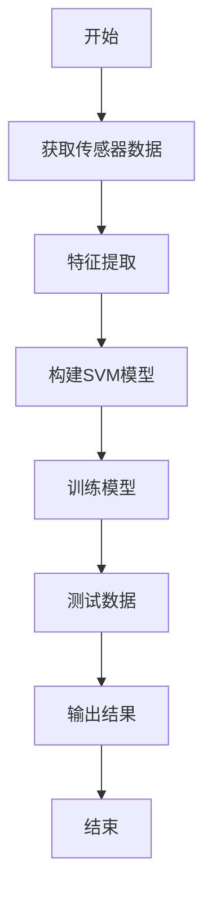
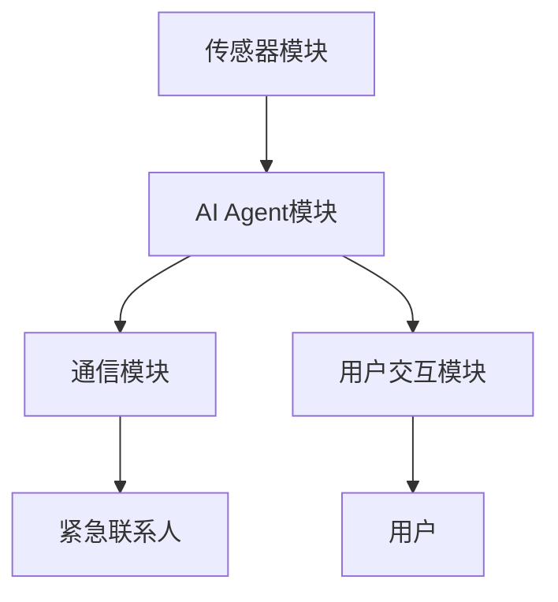

                 


# AI Agent在智能拐杖中的跌倒预防与紧急求助

> 关键词：AI Agent, 智能拐杖, 跌倒预防, 紧急求助, 系统架构, 算法原理, 项目实战

> 摘要：本文深入探讨了AI Agent在智能拐杖中的应用，重点分析了跌倒预防与紧急求助的核心技术。通过系统架构设计、算法原理分析、项目实战演示，详细阐述了AI Agent如何通过传感器数据采集、跌倒预测模型构建、紧急求助通信机制等实现智能拐杖的功能。文章内容涵盖背景介绍、核心概念、算法原理、系统架构、项目实战和最佳实践，为相关领域的研究与应用提供了全面的技术参考。

---

## 第一部分: 背景介绍

### 第1章: 问题背景

#### 1.1 老龄化社会与跌倒问题
随着全球人口老龄化的加剧，跌倒已成为老年人群中的常见健康问题。统计数据显示，老年人跌倒的概率显著高于年轻人，且跌倒可能导致骨折、脑损伤等严重后果。因此，如何有效预防跌倒并提供及时的紧急求助服务，成为智能健康设备研发的重要方向。

#### 1.2 智能拐杖的出现背景
传统拐杖仅能提供物理支撑，无法满足现代人对智能化、便捷化的需求。智能拐杖通过集成多种传感器和AI技术，能够实时监测用户状态，提供跌倒预防和紧急求助功能，显著提升了老年人的独立生活能力。

#### 1.3 跌倒预防与紧急求助的重要性
跌倒预防可以有效降低老年人受伤风险，而紧急求助功能则能在跌倒发生后第一时间联系医疗团队，为黄金救援时间争取宝贵时间。结合AI Agent的智能拐杖，能够实现主动预防与被动救助的无缝衔接。

---

### 第2章: 问题描述

#### 2.1 跌倒的常见原因与风险因素
- **步态不稳**：老年人常因肌肉萎缩、关节退化导致步态不稳。
- **环境因素**：地面湿滑、障碍物等环境因素增加了跌倒风险。
- **健康状况**：视力下降、平衡能力减弱等健康问题也是重要因素。

#### 2.2 紧急求助的需求分析
- **及时性**：跌倒后需要立即响应，避免错过最佳救援时间。
- **便捷性**：用户在跌倒后可能无法手动操作设备，因此需要自动触发求助功能。
- **隐私保护**：紧急求助时需要确保个人信息的安全性，避免隐私泄露。

#### 2.3 智能拐杖的功能需求
- **跌倒监测**：通过传感器实时监测用户的步态和平衡状态。
- **紧急求助**：在检测到跌倒后，自动拨打紧急电话或发送求救信号。
- **用户交互**：提供简单的用户操作界面，便于老年人使用。

---

## 第二部分: AI Agent的核心概念与联系

### 第3章: AI Agent的基本原理

#### 3.1 什么是AI Agent
AI Agent（人工智能代理）是一种能够感知环境、自主决策并执行任务的智能实体。它通过传感器获取数据，利用算法进行分析，并通过执行器完成动作。在智能拐杖中，AI Agent主要用于跌倒预防和紧急求助。

#### 3.2 AI Agent的核心特征
- **感知能力**：通过传感器获取环境和用户状态的数据。
- **决策能力**：基于数据进行分析，判断是否发生跌倒。
- **执行能力**：根据判断结果，触发相应的动作，如发出求助信号。

#### 3.3 AI Agent的分类与应用场景
- **按智能水平**：
  - 单一智能体：专注于单一任务，如跌倒监测。
  - 复杂智能体：能够同时处理多种任务，如跌倒监测和路径规划。
- **应用场景**：
  - 跌倒预防
  - 紧急求助
  - 用户行为分析

---

## 第三部分: 算法原理与实现

### 第4章: 跌倒预防算法

#### 4.1 算法原理
跌倒预防算法基于用户步态和平衡状态的分析，通过传感器数据构建跌倒预测模型。常用的算法包括决策树、支持向量机（SVM）和随机森林。

#### 4.2 决策树算法实现
决策树是一种基于树状结构的分类算法，适用于处理多分类问题。以下是决策树算法的流程：



#### 4.3 支持向量机（SVM）实现
SVM是一种监督学习算法，适用于分类问题。以下是SVM算法的流程：



#### 4.4 算法实现代码
以下是基于决策树的跌倒预测模型实现代码：

```python
from sklearn import tree
import numpy as np

# 传感器数据
X = np.array([[60, 1.7, 0.8],
              [70, 1.6, 0.7],
              [80, 1.5, 0.6],
              [50, 1.8, 0.9]])

# 标签（0表示正常，1表示跌倒）
y = np.array([0, 0, 0, 1])

# 训练决策树模型
model = tree.DecisionTreeClassifier()
model.fit(X, y)

# 预测
new_data = np.array([[65, 1.7, 0.8]])
print("预测结果：", model.predict(new_data))
```

---

## 第四部分: 系统架构与功能设计

### 第5章: 系统架构设计

#### 5.1 系统组成
智能拐杖系统主要包括以下模块：
- **传感器模块**：采集用户的步态、加速度等数据。
- **AI Agent模块**：分析传感器数据，判断是否发生跌倒。
- **通信模块**：在跌倒发生后，自动联系紧急联系人或医疗团队。
- **用户交互模块**：提供简单的操作界面，如按钮控制。

#### 5.2 系统架构图
以下是系统的架构图：



---

## 第五部分: 项目实战

### 第6章: 实战环境安装

#### 6.1 环境要求
- **硬件**：智能拐杖、传感器模块、通信模块。
- **软件**：Python编程环境，机器学习库（如scikit-learn）。

#### 6.2 环境安装步骤
1. 安装Python和必要的库：
   ```bash
   pip install numpy scikit-learn
   ```
2. 安装传感器模块驱动：
   - 根据传感器类型下载对应的驱动程序。

---

### 第7章: 核心代码实现

#### 7.1 传感器数据采集代码
以下是传感器数据采集的代码示例：

```python
import serial

# 连接传感器模块
ser = serial.Serial('COM3', 9600)

while True:
    data = ser.readline().decode().strip()
    print("传感器数据：", data)
```

#### 7.2 跌倒预测模型代码
以下是基于随机森林的跌倒预测模型实现代码：

```python
from sklearn.ensemble import RandomForestClassifier
import numpy as np

# 传感器数据
X = np.array([[60, 1.7, 0.8],
              [70, 1.6, 0.7],
              [80, 1.5, 0.6],
              [50, 1.8, 0.9]])

# 标签（0表示正常，1表示跌倒）
y = np.array([0, 0, 0, 1])

# 训练随机森林模型
model = RandomForestClassifier(n_estimators=10)
model.fit(X, y)

# 预测
new_data = np.array([[65, 1.7, 0.8]])
print("预测结果：", model.predict(new_data))
```

---

## 第六部分: 最佳实践

### 第8章: 小结与注意事项

#### 8.1 小结
本文详细介绍了AI Agent在智能拐杖中的应用，从背景介绍、算法原理到系统架构设计，再到项目实战，全面阐述了跌倒预防与紧急求助的技术实现。

#### 8.2 注意事项
- **数据隐私**：在处理用户数据时，必须确保数据的隐私性。
- **传感器精度**：传感器的精度直接影响跌倒预测的准确性。
- **系统稳定性**：确保系统在复杂环境下仍能稳定运行。

---

## 第七部分: 拓展阅读

### 第9章: 拓展阅读材料

#### 9.1 推荐书籍
- 《机器学习实战》
- 《Python机器学习》
- 《人工智能：一种现代的方法》

#### 9.2 在线资源
- [scikit-learn官方文档](https://scikit-learn.org/stable/index.html)
- [TensorFlow官方文档](https://tensorflow.org)

---

作者：AI天才研究院 & 禅与计算机程序设计艺术

