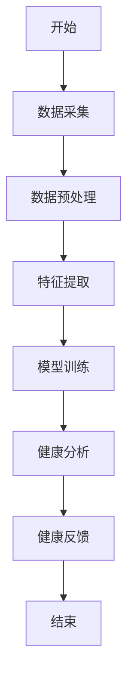
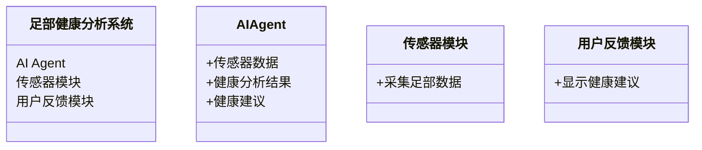
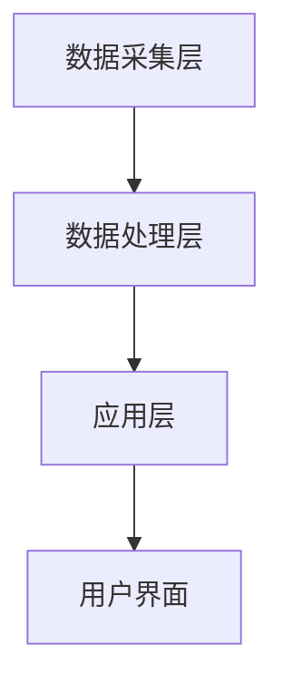

                 


# AI Agent在智能拖鞋中的足部健康分析

> 关键词：AI Agent，智能拖鞋，足部健康，传感器数据，机器学习

> 摘要：本文探讨了AI Agent在智能拖鞋中的应用，重点分析其在足部健康监测中的作用。通过传感器数据采集与处理、机器学习算法、系统架构设计等多方面的深入研究，展示了AI Agent如何帮助实现足部健康分析。文章结构清晰，内容详实，适合技术爱好者和健康领域从业者阅读。

---

# 第一部分: AI Agent与足部健康分析的背景与概念

---

## 第1章: 背景介绍

### 1.1 问题背景

#### 1.1.1 足部健康的重要性
足部健康是人体健康的重要组成部分。足部问题不仅会影响行走舒适度，还可能引发更严重的健康问题，如腰椎病、关节炎等。因此，足部健康监测具有重要意义。

#### 1.1.2 智能拖鞋的发展趋势
随着智能硬件技术的进步，智能拖鞋逐渐从单纯的舒适性工具向健康监测设备转变。通过集成传感器和AI技术，智能拖鞋能够实时监测足部健康状况。

#### 1.1.3 AI Agent在足部健康分析中的作用
AI Agent（人工智能代理）能够实时分析足部传感器数据，提供个性化健康建议。其优势在于能够快速响应、主动学习和自适应优化。

### 1.2 问题描述

#### 1.2.1 足部健康分析的常见问题
- 足部压力分布异常
- 足部血液循环问题
- 足部姿势矫正需求

#### 1.2.2 智能拖鞋的数据采集挑战
- 多传感器数据融合
- 数据实时性与准确性
- 用户行为习惯的多样性

#### 1.2.3 AI Agent在实时健康监测中的优势
- 高效数据处理能力
- 自动化健康分析
- 个性化健康建议

### 1.3 问题解决

#### 1.3.1 AI Agent的核心功能
- 数据采集与预处理
- 健康数据分析与建模
- 实时健康反馈与建议

#### 1.3.2 数据采集与处理的解决方案
- 多传感器融合技术
- 数据清洗与特征提取
- 实时数据分析

#### 1.3.3 系统架构的设计思路
- 分层架构设计
- 模块化功能实现
- 高可用性保障

### 1.4 边界与外延

#### 1.4.1 系统功能的边界
- 仅限于足部健康监测
- 不涉及其他健康指标（如心率、体温）
- 数据采集范围限定在足部区域

#### 1.4.2 系统应用的外延
- 数据可以上传至云端，供医生参考
- 数据可以与智能手表等设备联动
- 可扩展其他健康监测功能

#### 1.4.3 与相关领域的关联
- 与运动医学相关
- 与人体工程学相关
- 与健康管理平台相关

### 1.5 概念结构与核心要素

#### 1.5.1 系统构成要素
- 传感器模块
- AI Agent处理模块
- 用户反馈模块

#### 1.5.2 核心功能模块
- 数据采集
- 数据分析
- 健康反馈

#### 1.5.3 系统运行流程
1. 传感器采集足部数据
2. AI Agent分析数据
3. 提供健康反馈

---

## 第2章: 核心概念与联系

### 2.1 AI Agent的定义与原理

#### 2.1.1 AI Agent的基本概念
AI Agent是一种能够感知环境、自主决策并执行任务的智能实体。在智能拖鞋中，AI Agent通过传感器数据实时分析足部健康状况，并提供反馈。

#### 2.1.2 AI Agent的核心原理
AI Agent通过传感器数据输入，利用机器学习模型进行分析，生成健康建议。其核心在于数据处理和智能决策。

#### 2.1.3 AI Agent与足部健康分析的结合
AI Agent通过分析足部压力分布、步态特征等数据，识别足部健康问题，并提供矫正建议。

### 2.2 足部健康分析的传感器数据

#### 2.2.1 常见传感器类型与功能
| 传感器类型 | 功能 |
|------------|------|
| 压力传感器 | 测量足部压力分布 |
| 加速度传感器 | 分析步态特征 |
| 陀螺仪 | 检测足部运动姿态 |

#### 2.2.2 传感器数据的采集与处理
- 数据采集：通过多种传感器获取足部健康数据
- 数据预处理：去除噪声，提取特征
- 数据分析：通过算法识别健康问题

#### 2.2.3 数据特征分析
- 压力分布特征
- 步频特征
- 姿态特征

### 2.3 核心概念对比表

| 概念 | 描述 |
|------|------|
| AI Agent | 能够感知环境、自主决策的智能实体 |
| 传感器数据 | 来自硬件设备的原始数据 |
| 数据特征 | 数据中提取的有意义的特征 |

### 2.4 ER实体关系图

```mermaid
erd
    足部健康分析系统
    rectangle 足部健康分析系统 {
        AI Agent
        传感器模块
        用户反馈模块
    }
    足部健康分析系统 --> AI Agent: 数据处理
    AI Agent --> 传感器模块: 数据采集
    AI Agent --> 用户反馈模块: 健康建议
```

---

## 第3章: 算法原理讲解

### 3.1 算法流程



### 3.2 代码实现

```python
import numpy as np
from sklearn.tree import DecisionTreeClassifier

# 示例数据
X = np.array([[100, 200, 300],
              [200, 300, 400],
              [300, 400, 500]])

y = np.array([0, 1, 0])

# 训练决策树模型
model = DecisionTreeClassifier()
model.fit(X, y)

# 预测新数据
new_data = np.array([[250, 350, 450]])
prediction = model.predict(new_data)
print("健康状态预测结果:", prediction)
```

### 3.3 数学模型

健康分析模型的数学公式：
$$
y = f(x_1, x_2, \ldots, x_n)
$$
其中，$x_i$表示传感器数据特征，$y$表示健康状态。

---

## 第4章: 系统分析与架构设计方案

### 4.1 项目介绍

#### 4.1.1 项目目标
实现基于AI Agent的足部健康分析系统。

#### 4.1.2 项目范围
- 数据采集与处理
- 健康分析与反馈
- 用户界面设计

### 4.2 系统功能设计

#### 4.2.1 功能模块
- 数据采集模块
- 数据分析模块
- 用户反馈模块

#### 4.2.2 领域模型



### 4.3 系统架构设计

#### 4.3.1 架构选择
分层架构：数据采集层、数据处理层、应用层。

#### 4.3.2 架构图



---

## 第5章: 项目实战

### 5.1 环境安装

#### 5.1.1 安装Python
```bash
python --version
pip install numpy scikit-learn
```

### 5.2 系统核心实现源代码

```python
import numpy as np
from sklearn.ensemble import RandomForestClassifier

# 示例数据
X = np.array([[100, 200, 300],
              [200, 300, 400],
              [300, 400, 500]])

y = np.array([0, 1, 0])

# 训练随机森林模型
model = RandomForestClassifier(n_estimators=100)
model.fit(X, y)

# 预测新数据
new_data = np.array([[250, 350, 450]])
prediction = model.predict(new_data)
print("健康状态预测结果:", prediction)
```

### 5.3 案例分析

#### 5.3.1 实际案例
- 用户A：足部压力分布异常，建议使用矫正鞋垫。

---

## 第6章: 总结与展望

### 6.1 总结

#### 6.1.1 核心观点总结
AI Agent在智能拖鞋中的应用能够实时监测足部健康，提供个性化建议。

#### 6.1.2 重点内容回顾
- 传感器数据采集与处理
- AI Agent算法实现
- 系统架构设计

### 6.2 小结

#### 6.2.1 最佳实践 tips
- 数据采集要精准
- 算法要不断优化
- 用户反馈要及时

#### 6.2.2 注意事项
- 数据隐私保护
- 系统稳定性保障
- 用户体验优化

#### 6.2.3 拓展阅读
- 《人工智能技术与健康监测》
- 《传感器网络与智能硬件》

### 6.3 未来展望
随着AI技术的进步，足部健康监测将更加智能化、个性化。

---

作者：AI天才研究院/AI Genius Institute & 禅与计算机程序设计艺术 /Zen And The Art of Computer Programming

