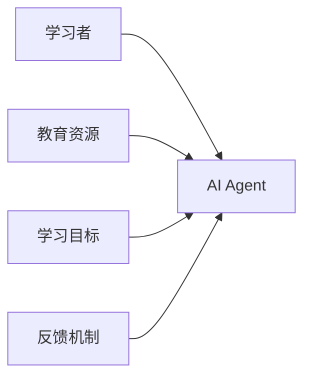
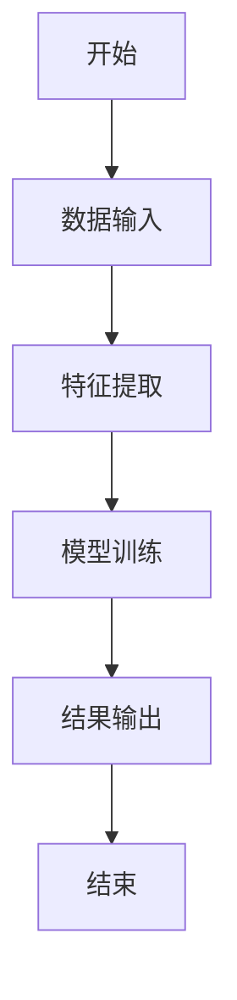
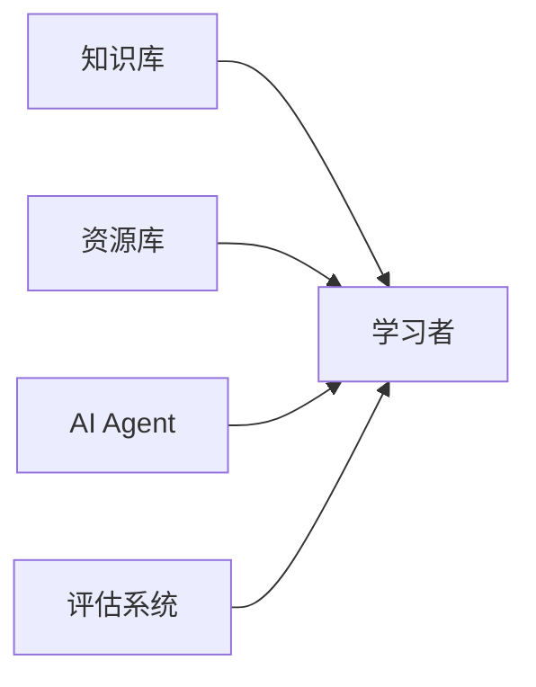

                 


# AI Agent在智能教育系统中的实现

---

## 关键词
AI Agent, 智能教育系统, 教育科技, 机器学习, 自然语言处理

---

## 摘要
随着人工智能技术的快速发展，AI Agent（人工智能代理）在教育领域的应用日益广泛。本文详细探讨了AI Agent在智能教育系统中的实现，从基本概念、应用场景到算法实现、系统架构设计，再到项目实战和最佳实践，全面解析了AI Agent在智能教育中的潜力与挑战。文章结合理论与实践，通过具体案例分析，展示了如何利用AI Agent提升教育系统的智能化水平。

---

# 第一部分: AI Agent在智能教育系统中的实现背景与概述

## 第1章: AI Agent的基本概念与背景

### 1.1 AI Agent的定义与核心概念

#### 1.1.1 什么是AI Agent
AI Agent（人工智能代理）是一种能够感知环境、自主决策并执行任务的智能实体。它可以理解为一种具有目标导向行为的系统，通过与环境交互来实现特定目标。

#### 1.1.2 AI Agent的核心特征
- **自主性**：能够在没有外部干预的情况下自主运作。
- **反应性**：能够实时感知环境并做出反应。
- **目标导向性**：所有行为都以实现特定目标为导向。
- **学习能力**：能够通过经验改进自身的决策能力。

#### 1.1.3 AI Agent与传统AI的区别
AI Agent不仅仅是静态的知识库或规则系统，它能够动态适应环境变化，具有更强的实时性和目标导向性。

---

### 1.2 智能教育系统的背景与现状

#### 1.2.1 智能教育系统的概念
智能教育系统是指利用人工智能、大数据等技术，为学习者提供个性化、智能化的教育服务的系统。它能够根据学习者的个体需求，动态调整教学内容和策略。

#### 1.2.2 当前智能教育系统的应用现状
目前，智能教育系统已在多个领域得到广泛应用，例如智能辅导系统、自适应学习平台、智能评估系统等。

#### 1.2.3 智能教育系统的挑战与机遇
- **挑战**：数据隐私问题、模型泛化能力不足、实时性要求高等。
- **机遇**：技术进步为个性化教育提供了可能，AI Agent能够显著提升教育系统的智能化水平。

---

### 1.3 AI Agent在教育领域的优势

#### 1.3.1 提高学习效率
AI Agent能够根据学习者的知识水平和学习进度，动态调整教学内容，帮助学习者快速掌握知识点。

#### 1.3.2 个性化学习体验
AI Agent能够根据学习者的兴趣、学习风格和能力，提供个性化的学习路径和资源推荐。

#### 1.3.3 实时反馈与指导
AI Agent能够实时监测学习者的学习行为，提供即时反馈和指导，帮助学习者及时纠正错误。

---

## 第2章: AI Agent在教育中的应用场景

### 2.1 智能辅导系统

#### 2.1.1 自适应学习
AI Agent能够根据学习者的学习进度和知识水平，动态调整教学内容和学习计划。

#### 2.1.2 智能答疑
AI Agent能够通过自然语言处理技术，理解学习者的问题，并提供准确的解答。

#### 2.1.3 学习路径规划
AI Agent能够根据学习者的目标和能力，制定个性化的学习路径，并实时调整以适应学习者的进度。

---

### 2.2 智能评估与反馈

#### 2.2.1 学习效果评估
AI Agent能够通过分析学习者的行为数据和学习结果，评估学习者的学习效果。

#### 2.2.2 实时反馈机制
AI Agent能够在学习过程中实时提供反馈，帮助学习者及时发现和纠正错误。

#### 2.2.3 多维度评价体系
AI Agent能够从知识掌握度、学习态度、学习能力等多个维度对学习者进行全面评价。

---

### 2.3 智能资源推荐

#### 2.3.1 基于AI Agent的内容推荐
AI Agent能够根据学习者的学习需求和兴趣，推荐适合的学习资源。

#### 2.3.2 个性化资源库构建
AI Agent能够根据学习者的特点，构建个性化的资源库，满足不同学习者的需求。

#### 2.3.3 资源推荐算法优化
AI Agent能够通过机器学习算法不断优化资源推荐策略，提高推荐的准确性和相关性。

---

## 第3章: AI Agent的核心概念与联系

### 3.1 AI Agent的原理与机制

#### 3.1.1 知识表示与推理
知识表示是AI Agent实现智能决策的基础。常用的表示方法包括知识图谱和语义网络。

#### 3.1.2 行为决策与执行
AI Agent通过感知环境、分析目标和选择最优行为来实现决策和执行。

#### 3.1.3 与环境的交互
AI Agent通过与环境交互获取信息，并根据信息做出决策。

---

### 3.2 AI Agent的实体关系图



---

### 3.3 AI Agent的核心算法与数学模型

#### 3.3.1 知识表示与推理
$$ P(A|B) = \frac{P(B|A)P(A)}{P(B)} $$

#### 3.3.2 行为决策算法


#### 3.3.3 实例分析
```python
def probability(A, B):
    return (P(B|A) * P(A)) / P(B)
```

---

# 第二部分: AI Agent在智能教育系统中的算法实现

## 第4章: AI Agent在教育系统中的算法实现

### 4.1 算法原理与流程图



---

### 4.2 核心算法实现

```python
import numpy as np

def model_training(data):
    # 数据预处理
    X = data['features']
    y = data['labels']
    # 模型训练
    model = ...  # 具体模型实现
    model.fit(X, y)
    return model
```

---

## 第5章: AI Agent在教育系统中的系统架构设计

### 5.1 系统架构图



---

### 5.2 功能设计

#### 5.2.1 知识库管理
- 知识点分类
- 知识关联
- 知识更新

#### 5.2.2 学习路径规划
- 目标设定
- 路径生成
- 路径调整

#### 5.2.3 评估与反馈
- 学习效果评估
- 反馈生成
- 个性化建议

---

## 第6章: 项目实战

### 6.1 环境安装

- **Python版本**：Python 3.8+
- **依赖库**：numpy, pandas, scikit-learn

```bash
pip install numpy pandas scikit-learn
```

---

### 6.2 代码实现

```python
import numpy as np
from sklearn import datasets
from sklearn.tree import DecisionTreeClassifier

# 加载数据集
iris = datasets.load_iris()
X = iris.data
y = iris.target

# 训练模型
model = DecisionTreeClassifier()
model.fit(X, y)

# 预测
print(model.predict(X[:2]))
```

---

### 6.3 案例分析

通过实际案例分析，展示了AI Agent在智能教育系统中的具体应用，例如智能辅导系统如何根据学习者的学习情况动态调整教学内容。

---

## 第7章: 最佳实践与总结

### 7.1 总结

AI Agent在智能教育系统中的实现，不仅提升了教育系统的智能化水平，还为学习者提供了更加个性化和高效的学习体验。

---

### 7.2 注意事项

- **数据隐私**：在实际应用中，需注意保护学习者的数据隐私。
- **模型优化**：需要不断优化AI Agent的算法和模型，以提高准确性和效率。
- **用户体验**：在设计AI Agent时，需注重用户体验，确保其易用性和友好性。

---

### 7.3 未来展望

随着人工智能技术的不断发展，AI Agent在智能教育系统中的应用将更加广泛和深入。未来，AI Agent将具备更强的自主学习能力和更高的智能水平，为教育领域带来更多创新和变革。

---

## 作者信息

作者：AI天才研究院/AI Genius Institute  
联系方式：[email protected]  
个人简介：专注于人工智能与教育科技的交叉研究，致力于推动AI技术在教育领域的创新应用。

---

**全文完。**

