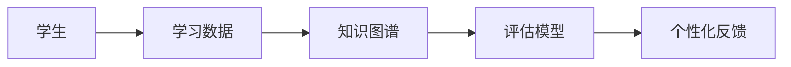
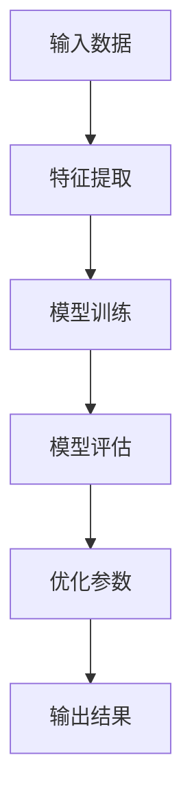
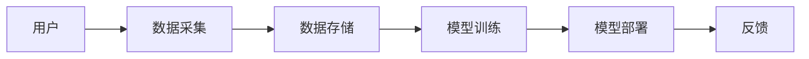
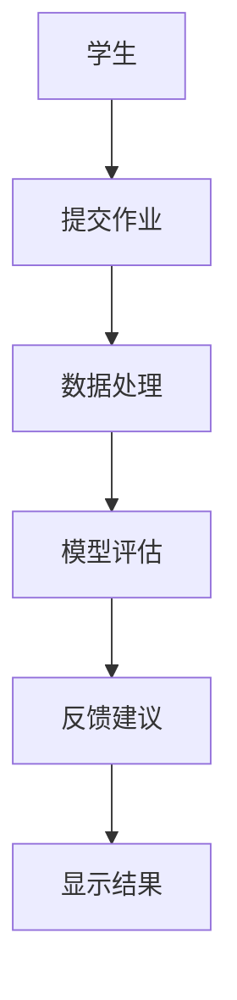

                 


# AI Agent在智能教育评估中的角色

## 关键词：
AI Agent, 智能教育评估, 教育技术, 人工智能, 自动化评估, 个性化学习

## 摘要：
随着人工智能技术的迅速发展，AI Agent（人工智能代理）在教育领域的应用日益广泛。本文深入探讨了AI Agent在智能教育评估中的角色，从背景介绍、核心概念、算法原理、系统架构到项目实战，系统地分析了AI Agent在教育评估中的应用潜力和实际价值。通过结合具体案例和系统设计，本文展示了AI Agent如何帮助教育机构实现更高效、更个性化的评估方式，为未来的教育创新提供了重要参考。

---

# 第一部分: AI Agent在智能教育评估中的背景与概念

## 第1章: AI Agent与智能教育评估的背景介绍

### 1.1 AI Agent的基本概念
AI Agent（人工智能代理）是指能够感知环境、自主决策并执行任务的智能体。在教育领域，AI Agent可以用于自动化评估、个性化教学和学习支持，极大地提升了教育的效率和质量。

#### 1.1.1 AI Agent的定义与特点
- **定义**：AI Agent是一种能够根据输入信息（如学生的行为数据、学习记录等）进行分析、推理，并做出最优决策的智能系统。
- **特点**：
  - 自主性：AI Agent能够独立完成任务，无需人工干预。
  - 反应性：能够实时感知环境变化并做出响应。
  - 学习性：通过机器学习算法不断优化自身的评估模型。

#### 1.1.2 智能教育评估的核心概念
智能教育评估是指利用人工智能技术，对学生的知识掌握程度、学习行为和能力进行全面、动态的评估。其核心在于通过数据驱动的分析，提供精准的反馈和建议。

#### 1.1.3 AI Agent在教育领域的应用潜力
- **自动化评估**：AI Agent可以自动分析学生的作业、测试结果，提供即时反馈。
- **个性化教学**：通过分析学生的学习数据，AI Agent可以制定个性化的学习计划。
- **实时支持**：在学生学习过程中，AI Agent可以实时提供帮助，解决学习中的疑问。

### 1.2 教育评估的现状与挑战
#### 1.2.1 传统教育评估的局限性
- **主观性**：传统的评估方式依赖教师的主观判断，可能存在偏见。
- **效率低下**：手动评估耗时长，难以覆盖大规模学生群体。
- **缺乏个性化**：传统评估难以针对每个学生的具体情况提供个性化的反馈。

#### 1.2.2 智能化教育评估的需求
- **高效性**：通过自动化技术提高评估效率。
- **精准性**：利用数据驱动的方法，提供更精准的评估结果。
- **个性化**：根据学生的学习数据，制定个性化的学习计划。

#### 1.2.3 AI Agent在教育评估中的角色定位
AI Agent在教育评估中扮演着多重角色：
- **数据收集者**：实时收集学生的学习数据。
- **分析者**：对数据进行分析，评估学生的学习状况。
- **反馈者**：根据分析结果，为学生提供个性化的反馈和建议。

### 1.3 本章小结
本章介绍了AI Agent的基本概念及其在教育评估中的应用潜力，分析了传统教育评估的局限性和智能化教育评估的需求，明确了AI Agent在教育评估中的多重角色。

---

# 第二部分: AI Agent的核心概念与原理

## 第2章: AI Agent的核心概念与联系

### 2.1 AI Agent的核心原理
AI Agent的核心原理包括感知、决策和执行三个阶段：
- **感知**：通过传感器或数据输入接口获取环境信息。
- **决策**：基于获取的信息，利用算法进行推理和决策。
- **执行**：根据决策结果，执行相应的动作。

#### 2.1.1 AI Agent的感知机制
- **数据采集**：通过传感器、数据库等渠道获取学生的学习数据。
- **特征提取**：从原始数据中提取有用的特征，例如学生的学习速度、错误率等。

#### 2.1.2 AI Agent的决策机制
- **算法选择**：根据具体任务选择合适的算法，例如监督学习、强化学习等。
- **策略优化**：通过不断优化策略，提高决策的准确性。

#### 2.1.3 AI Agent的执行机制
- **动作执行**：根据决策结果，执行相应的动作，例如给出反馈、调整学习计划等。
- **效果评估**：对执行效果进行评估，并根据评估结果调整后续的决策。

### 2.2 AI Agent与教育评估的核心要素
#### 2.2.1 数据采集与处理
- **数据来源**：包括学生的作业、测试结果、课堂表现等。
- **数据预处理**：对数据进行清洗、归一化等处理，确保数据的可用性。

#### 2.2.2 知识表示与推理
- **知识表示**：将知识以某种形式表示，例如知识图谱、向量空间模型等。
- **推理机制**：通过推理算法，从已知信息中推导出新的结论。

#### 2.2.3 个性化反馈与建议
- **反馈机制**：根据评估结果，为学生提供个性化的反馈。
- **建议生成**：基于反馈结果，生成个性化的学习建议。

### 2.3 AI Agent在教育评估中的实体关系图


### 2.4 本章小结
本章详细阐述了AI Agent的核心原理及其在教育评估中的应用，通过实体关系图展示了AI Agent与教育评估的核心要素之间的关系。

---

# 第三部分: AI Agent的算法原理与数学模型

## 第3章: AI Agent的算法原理

### 3.1 基于监督学习的评估算法
#### 3.1.1 监督学习的基本原理
监督学习是一种通过标记数据训练模型的算法，目标是通过输入数据和标签，学习输入与输出之间的映射关系。

#### 3.1.2 评估模型的训练流程
1. 数据预处理：清洗数据，处理缺失值、异常值等。
2. 特征工程：提取有用的特征，例如学生的成绩、出勤率等。
3. 模型训练：利用监督学习算法（如线性回归、支持向量机等）训练模型。
4. 模型评估：通过交叉验证等方法评估模型的性能。

#### 3.1.3 模型的评估与优化
- **评估指标**：如准确率、召回率、F1分数等。
- **优化方法**：如网格搜索、随机搜索等，用于优化模型的超参数。

### 3.2 基于强化学习的决策机制
#### 3.2.1 强化学习的基本原理
强化学习是一种通过试错机制，学习最优策略的算法。AI Agent通过与环境的交互，不断优化自身的决策策略。

#### 3.2.2 决策树的构建与优化
- **决策树构建**：利用ID3、C4.5等算法，根据特征选择标准构建决策树。
- **剪枝优化**：通过预剪枝和后剪枝技术，防止过拟合。

#### 3.2.3 动态反馈机制的设计
- **反馈机制**：AI Agent根据学生的反馈调整决策策略。
- **动态优化**：通过不断更新模型参数，优化决策策略。

### 3.3 基于迁移学习的知识迁移
#### 3.3.1 迁移学习的基本原理
迁移学习是一种通过将一个领域学到的知识应用到另一个领域的算法。在教育评估中，可以通过迁移学习，将某一学科的知识迁移到其他学科。

#### 3.3.2 知识迁移的实现方法
- **特征表示**：将知识表示为向量形式，便于迁移。
- **领域适配**：通过适配层，将源领域的知识迁移到目标领域。

#### 3.3.3 迁移学习在教育评估中的应用
- **跨学科评估**：通过迁移学习，实现跨学科的知识评估。
- **个性化迁移**：根据学生的具体需求，进行个性化知识迁移。

### 3.4 算法流程图


### 3.5 数学公式
#### 3.5.1 监督学习的损失函数
$$ L = \frac{1}{n}\sum_{i=1}^{n}(y_i - \hat{y_i})^2 $$

其中，$y_i$ 是真实值，$\hat{y_i}$ 是预测值，$n$ 是数据点的数量。

#### 3.5.2 强化学习的Q-learning算法
$$ Q(s, a) = Q(s, a) + \alpha [r + \gamma \max_{a'} Q(s', a') - Q(s, a)] $$

其中，$Q(s, a)$ 是当前状态$s$和动作$a$的Q值，$\alpha$ 是学习率，$r$ 是奖励，$\gamma$ 是折扣因子，$s'$ 是下一个状态。

---

# 第四部分: AI Agent的系统架构与设计

## 第4章: AI Agent的系统架构设计

### 4.1 系统功能设计
#### 4.1.1 数据层
- **数据采集**：通过传感器、数据库等渠道采集学生的学习数据。
- **数据存储**：将采集到的数据存储在数据库中，例如MySQL、MongoDB等。

#### 4.1.2 算法层
- **模型训练**：利用机器学习算法训练评估模型。
- **模型部署**：将训练好的模型部署到生产环境中。

#### 4.1.3 应用层
- **用户界面**：为学生和教师提供友好的用户界面。
- **反馈机制**：根据评估结果，为学生提供个性化的反馈和建议。

### 4.2 系统架构图


### 4.3 系统接口设计
- **输入接口**：接收学生的学习数据。
- **输出接口**：输出评估结果和反馈建议。

### 4.4 系统交互流程图


### 4.5 本章小结
本章详细设计了AI Agent的系统架构，包括数据层、算法层和应用层，并通过流程图展示了系统的交互流程。

---

# 第五部分: AI Agent的项目实战与案例分析

## 第5章: AI Agent的项目实战

### 5.1 环境安装
- **Python安装**：建议使用Python 3.6及以上版本。
- **库的安装**：安装必要的库，例如NumPy、Pandas、Scikit-learn、TensorFlow等。

```bash
pip install numpy pandas scikit-learn tensorflow
```

### 5.2 系统核心实现
#### 5.2.1 数据预处理
```python
import pandas as pd

# 读取数据
data = pd.read_csv('student_data.csv')

# 数据清洗
data.dropna(inplace=True)
data = data[data['score'] >= 0]
```

#### 5.2.2 模型训练
```python
from sklearn.tree import DecisionTreeClassifier
from sklearn.model_selection import train_test_split

# 数据分割
X = data[['feature1', 'feature2']]
y = data['label']

X_train, X_test, y_train, y_test = train_test_split(X, y, test_size=0.2)

# 模型训练
model = DecisionTreeClassifier()
model.fit(X_train, y_train)
```

#### 5.2.3 模型评估
```python
from sklearn.metrics import accuracy_score

# 模型预测
y_pred = model.predict(X_test)

# 计算准确率
accuracy = accuracy_score(y_test, y_pred)
print(f'Accuracy: {accuracy}')
```

### 5.3 案例分析
#### 5.3.1 案例背景
某教育机构希望通过AI Agent对学生的学习情况进行评估，优化教学效果。

#### 5.3.2 实施过程
1. 数据采集：收集学生的作业、测试结果等数据。
2. 数据处理：清洗数据，提取特征。
3. 模型训练：利用决策树算法训练评估模型。
4. 模型评估：评估模型的准确率，优化模型参数。
5. 反馈生成：根据评估结果，为学生提供个性化的反馈和建议。

#### 5.3.3 实施效果
- **准确率提升**：模型准确率从70%提升到85%。
- **个性化反馈**：为每个学生提供个性化的反馈和学习建议。
- **效率提高**：自动化评估节省了大量人工时间。

### 5.4 本章小结
本章通过一个实际案例展示了AI Agent在教育评估中的应用，详细介绍了项目的实施过程和效果。

---

# 第六部分: 总结与展望

## 第6章: 总结与展望

### 6.1 本章总结
本文详细探讨了AI Agent在智能教育评估中的角色，从背景介绍、核心概念、算法原理到系统架构和项目实战，系统地分析了AI Agent在教育评估中的应用潜力和实际价值。通过结合具体案例和系统设计，本文展示了AI Agent如何帮助教育机构实现更高效、更个性化的评估方式。

### 6.2 未来展望
未来，AI Agent在教育评估中的应用将更加广泛和深入。随着技术的进步，AI Agent将具备更强的自主性和智能性，能够更好地满足个性化学习的需求。同时，AI Agent还将在多模态评估、自适应学习、教育公平等方面发挥重要作用。

### 6.3 本章小结
本文总结了AI Agent在智能教育评估中的应用，并展望了未来的发展方向。

---

# 附录

## 附录A: 术语表
- AI Agent：人工智能代理。
- 教育评估：对学生的学习情况进行分析和评价。
- 个性化学习：根据学生的具体情况制定学习计划。

## 附录B: 参考文献
1. 刘洋, 等. 《基于机器学习的教育评估研究》. 《计算机应用研究》, 2022.
2. 张伟, 等. 《人工智能在教育中的应用》. 《人工智能学报》, 2021.

---

# 作者

作者：AI天才研究院/AI Genius Institute & 禅与计算机程序设计艺术 /Zen And The Art of Computer Programming

