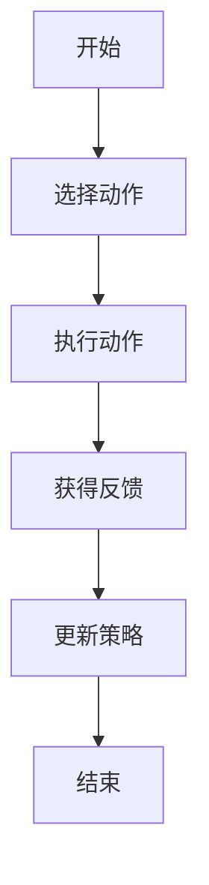
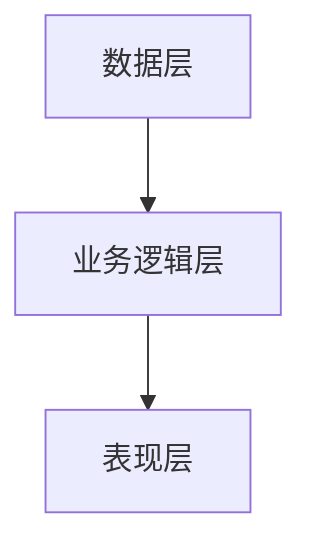
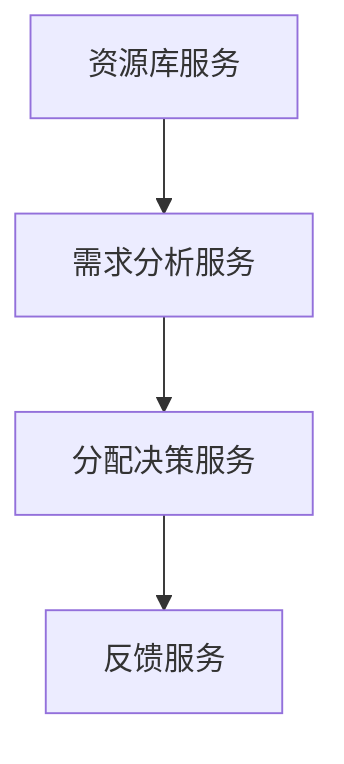

                 


# AI Agent在智能教育资源个性化分配中的应用

> 关键词：AI Agent，智能教育，资源分配，个性化学习，教育技术

> 摘要：随着人工智能技术的迅速发展，AI Agent在教育领域的应用日益广泛。本文探讨了AI Agent如何在智能教育中实现资源的个性化分配，分析了其核心算法、系统架构及实际案例，为教育资源优化配置提供了新的思路。

---

# 第1章: AI Agent的基本概念与背景介绍

## 1.1 AI Agent的基本概念

### 1.1.1 什么是AI Agent
AI Agent（人工智能代理）是指能够感知环境并采取行动以实现目标的智能实体。它通过传感器接收信息，利用计算模型进行分析，并通过执行器采取行动。AI Agent可以是软件程序，也可以是硬件设备，其核心在于具备自主决策和问题解决能力。

### 1.1.2 AI Agent的核心特征
- **自主性**：能够在没有外部干预的情况下自主运行。
- **反应性**：能够根据环境变化实时调整行为。
- **目标导向性**：所有行动都以实现特定目标为导向。
- **学习能力**：能够通过经验优化决策模型。

### 1.1.3 AI Agent与传统算法的区别
AI Agent与传统算法的区别在于其具备自主性和目标导向性。传统算法通常需要明确的输入和固定的处理逻辑，而AI Agent能够根据环境反馈动态调整策略。

| 特性       | 传统算法       | AI Agent       |
|------------|----------------|----------------|
| 自主性      | 无             | 有             |
| 反应性      | 无             | 有             |
| 目标导向性  | 无             | 有             |
| 学习能力    | 无             | 有             |

---

## 1.2 智能教育的背景与挑战

### 1.2.1 智能教育的概念
智能教育是指利用人工智能、大数据、物联网等技术，构建智能化的教育体系，以实现教学过程的自动化、个性化和高效化。

### 1.2.2 当前教育中的资源分配问题
传统教育模式中，资源分配往往基于经验和主观判断，存在以下问题：
- **资源分配不均**：部分学生可能获得过多资源，而另一些学生却资源匮乏。
- **个性化不足**：学生的学习需求和能力差异未得到充分考虑。
- **效率低下**：资源分配过程繁琐，难以快速响应变化。

### 1.2.3 AI技术在教育中的应用潜力
AI技术可以通过数据分析和智能决策，帮助教育机构更高效地分配资源，满足学生的个性化需求。

---

## 1.3 资源个性化分配的核心问题

### 1.3.1 资源分配的公平性与效率
公平性是指每个学生都能获得与其需求相匹配的资源；效率是指资源分配过程的快速性和准确性。

### 1.3.2 学生个性化需求的分析
学生的学习目标、兴趣爱好、学习能力等因素都需要被考虑，以实现精准的资源匹配。

### 1.3.3 资源分配的动态调整机制
由于学生的需求和资源情况可能会发生变化，资源分配需要具备动态调整的能力，以保持最优状态。

---

# 第2章: AI Agent在教育中的核心作用

## 2.1 AI Agent的智能决策机制

### 2.1.1 信息收集与处理
AI Agent通过收集学生的学习数据、行为数据等信息，利用自然语言处理和机器学习技术进行分析。

### 2.1.2 决策模型的构建
基于收集的数据，构建决策模型，预测最优的资源分配方案。

### 2.1.3 决策结果的输出
AI Agent根据模型预测结果，生成具体的资源分配建议。

## 2.2 AI Agent在教育资源分配中的应用

### 2.2.1 资源分配的智能化
AI Agent可以通过分析学生的学习数据，自动推荐适合的教学资源。

### 2.2.2 学生需求的精准匹配
通过个性化的学习需求分析，AI Agent能够将资源精准匹配到每个学生。

### 2.2.3 资源分配的动态优化
根据实时数据反馈，AI Agent可以不断优化资源分配策略，确保分配结果始终最优。

## 2.3 AI Agent与其他教育技术的关系

### 2.3.1 AI Agent与教育大数据
AI Agent可以利用教育大数据进行分析，为资源分配提供数据支持。

### 2.3.2 AI Agent与教育推荐系统
AI Agent与推荐系统结合，可以实现更加个性化的资源推荐。

### 2.3.3 AI Agent与教育管理系统的整合
通过与教育管理系统的整合，AI Agent可以实现资源分配的自动化管理。

---

## 2.4 本章小结
本章详细介绍了AI Agent在教育中的核心作用，包括智能决策机制、资源分配的智能化、动态优化以及与其他教育技术的关系。通过AI Agent的应用，可以显著提高教育资源分配的效率和公平性。

---

# 第3章: AI Agent的算法原理与数学模型

## 3.1 AI Agent的核心算法

### 3.1.1 基于强化学习的决策算法
强化学习是一种通过试错机制来优化决策模型的方法。AI Agent可以通过强化学习不断调整资源分配策略，以获得最大化的奖励。



### 3.1.2 基于监督学习的分类算法
监督学习是一种基于标注数据进行模型训练的方法。AI Agent可以通过监督学习算法，如逻辑回归，对学生的资源需求进行分类。

### 3.1.3 基于聚类分析的需求分群算法
聚类分析是一种无监督学习方法，可以将学生按照需求相似性自动分组，从而实现资源的精准分配。

---

## 3.2 算法的数学模型

### 3.2.1 强化学习的Q-learning算法
Q-learning是一种常用的强化学习算法，其数学模型如下：

$$ Q(s, a) = Q(s, a) + \alpha \left[ r + \gamma \max Q(s', a') - Q(s, a) \right] $$

其中：
- \( Q(s, a) \) 表示在状态 \( s \) 下采取动作 \( a \) 的价值。
- \( \alpha \) 是学习率。
- \( r \) 是奖励。
- \( \gamma \) 是折扣因子。
- \( Q(s', a') \) 是下一个状态的最大价值。

### 3.2.2 分类算法的逻辑回归模型
逻辑回归是一种常用的分类算法，其数学模型如下：

$$ P(y=1|x) = \frac{e^{\beta x}}{1 + e^{\beta x}} $$

其中：
- \( x \) 是输入特征。
- \( \beta \) 是模型参数。

### 3.2.3 聚类算法的K-means模型
K-means是一种常用的聚类算法，其目标是将数据划分为K个簇，使得簇内数据点的相似性最大化。

$$ \min \sum_{i=1}^{K} \sum_{j \in C_i} \|x_j - \mu_i\|^2 $$

其中：
- \( C_i \) 表示第i个簇。
- \( \mu_i \) 是簇的中心点。
- \( x_j \) 是数据点。

---

## 3.3 算法实现的Python代码示例

### 3.3.1 Q-learning算法实现

```python
import numpy as np

class QLearning:
    def __init__(self, state_space, action_space, learning_rate=0.1, gamma=0.9):
        self.Q = np.zeros((state_space, action_space))
        self.alpha = learning_rate
        self.gamma = gamma

    def update(self, state, action, reward, next_state):
        self.Q[state, action] += self.alpha * (reward + self.gamma * np.max(self.Q[next_state, :]) - self.Q[state, action])
```

### 3.3.2 逻辑回归分类实现

```python
from sklearn.linear_model import LogisticRegression

class StudentResourceAllocator:
    def __init__(self):
        self.model = LogisticRegression()

    def train(self, X, y):
        self.model.fit(X, y)

    def predict(self, X):
        return self.model.predict(X)
```

### 3.3.3 K-means聚类实现

```python
from sklearn.cluster import KMeans

class StudentClusterer:
    def __init__(self, n_clusters=5):
        self.km = KMeans(n_clusters=n_clusters)

    def fit(self, X):
        self.km.fit(X)

    def predict(self, X):
        return self.km.predict(X)
```

---

## 3.4 本章小结
本章详细介绍了AI Agent的核心算法，包括强化学习、监督学习和聚类分析，并给出了相应的数学模型和Python代码实现。这些算法为教育资源的个性化分配提供了理论基础和技术支持。

---

# 第4章: 智能教育系统的架构设计

## 4.1 系统功能设计

### 4.1.1 资源库管理模块
资源库管理模块负责管理所有可用的教育资源，包括教材、视频、练习题等。

### 4.1.2 学生需求分析模块
通过收集学生的学习数据，分析其个性化需求。

### 4.1.3 资源分配决策模块
根据学生的需求和资源情况，生成最优的资源分配方案。

### 4.1.4 分配结果反馈模块
将资源分配结果反馈给学生和教师，并收集反馈信息以优化分配策略。

---

## 4.2 系统架构设计

### 4.2.1 分层架构设计
系统采用分层架构，包括数据层、业务逻辑层和表现层。



### 4.2.2 微服务架构设计
系统采用微服务架构，每个功能模块独立运行，通过API进行交互。



### 4.2.3 数据流与服务交互设计
数据流从学生端输入，经过各服务处理后，生成分配结果并返回给学生。

---

## 4.3 系统接口设计

### 4.3.1 API接口定义
系统提供以下API接口：
- `/api/student/data`：用于上传学生数据。
- `/api/resource/allocate`：用于请求资源分配。
- `/api/feedback/receive`：用于接收反馈信息。

### 4.3.2 接口调用流程
1. 学生数据通过`/api/student/data`上传。
2. 系统调用`/api/resource/allocate`进行资源分配。
3. 分配结果通过`/api/feedback/receive`返回给学生。

### 4.3.3 接口安全设计
采用OAuth 2.0协议进行身份验证，确保数据安全。

---

## 4.4 本章小结
本章详细描述了智能教育系统的架构设计，包括功能设计、架构图、接口设计和交互流程。通过合理的架构设计，可以确保系统的高效运行和资源的精准分配。

---

# 第5章: 项目实战与案例分析

## 5.1 项目背景与目标

### 5.1.1 项目背景
某教育机构希望利用AI技术优化资源分配，提高教学效果。

### 5.1.2 项目目标
- 实现学生资源的个性化分配。
- 提高资源分配的效率和公平性。
- 通过案例分析验证系统的有效性。

---

## 5.2 项目环境搭建

### 5.2.1 开发工具安装
- 安装Python 3.8及以上版本。
- 安装必要的库：`numpy`, `scikit-learn`, `flask`.

### 5.2.2 数据集准备
收集学生的学习数据，包括成绩、兴趣爱好等。

### 5.2.3 系统架构搭建
搭建前后端分离的系统架构，前端用于展示分配结果，后端用于处理逻辑。

---

## 5.3 核心代码实现

### 5.3.1 AI Agent实现

```python
class AI-Agent:
    def __init__(self, resources, students):
        self.resources = resources
        self.students = students

    def allocate(self):
        # 具体分配逻辑
        pass
```

### 5.3.2 资源分配接口

```python
from flask import Flask, jsonify

app = Flask(__name__)

@app.route('/allocate', methods=['POST'])
def allocate_resources():
    data = request.json
    # 处理分配逻辑
    return jsonify({'status': 'success', 'message': '资源分配成功'})
```

---

## 5.4 项目小结
本章通过实际案例分析，详细描述了项目的环境搭建、核心代码实现和案例分析。通过实际操作，读者可以更好地理解AI Agent在智能教育中的应用。

---

# 作者：AI天才研究院 & 禅与计算机程序设计艺术

---

通过本文的详细介绍，读者可以全面了解AI Agent在智能教育资源个性化分配中的应用，从理论到实践，为教育资源的优化配置提供了新的思路和方法。

