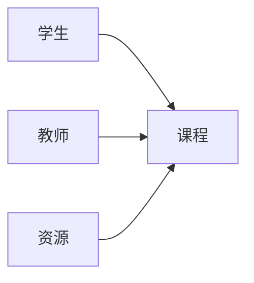
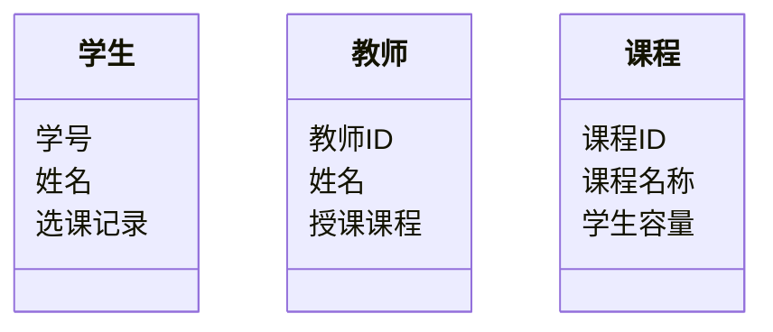

                 

<think>
好的，我将按照您的要求撰写《AI Agent在智能教育资源优化分配中的应用》的技术博客文章。首先，我会根据您提供的目录结构，逐步展开每个部分的内容。

### 第一部分: AI Agent与智能教育概述

---

#### 第1章: AI Agent与智能教育背景

##### 1.1 AI Agent的基本概念

###### 1.1.1 AI Agent的定义与特点

**AI Agent**（人工智能代理）是指能够感知环境、做出决策并执行任务的智能实体。AI Agent 的特点包括：

1. **自主性**：能够自主决策和行动。
2. **反应性**：能够实时感知环境变化并做出反应。
3. **目标导向**：以实现特定目标为导向。
4. **学习能力**：能够通过经验改进自身的决策能力。

###### 1.1.2 AI Agent的核心技术原理

AI Agent 的核心技术包括：

1. **知识表示**：将知识以结构化形式存储，如符号逻辑、语义网络等。
2. **推理引擎**：基于知识库进行逻辑推理，如基于规则的推理或概率推理。
3. **行为决策**：通过推理结果选择最优行动方案。
4. **人机交互**：与用户或环境进行自然交互。

###### 1.1.3 AI Agent与智能教育的关系

AI Agent 在智能教育中的作用主要体现在：

1. **个性化学习路径规划**：根据学生的学习情况和能力，推荐最优的学习资源和路径。
2. **资源分配优化**：通过分析资源使用情况，优化教育资源的分配，提高利用效率。
3. **智能辅助教学**：帮助教师进行教学决策，提升教学效果。

##### 1.2 智能教育的发展现状

###### 1.2.1 智能教育的定义与特征

智能教育是指利用人工智能、大数据等技术，实现教育资源的智能化配置和个性化学习。其主要特征包括：

1. **数据驱动**：基于大量数据进行分析和决策。
2. **个性化**：根据学生特点提供定制化学习方案。
3. **智能化**：通过AI技术实现自动化的教学辅助。

###### 1.2.2 当前智能教育的主要技术手段

目前，智能教育主要采用以下技术手段：

1. **自然语言处理**：用于智能对话系统和内容分析。
2. **机器学习**：用于学生行为分析和学习效果预测。
3. **推荐系统**：用于个性化资源推荐。
4. **知识图谱**：用于构建结构化的知识体系。

###### 1.2.3 AI Agent在智能教育中的应用潜力

AI Agent 在智能教育中的潜力主要体现在以下几个方面：

1. **智能化资源分配**：通过AI Agent 实现教育资源的动态分配，提高资源利用效率。
2. **个性化学习支持**：通过AI Agent 为学生提供个性化的学习指导和支持。
3. **智能化教学管理**：通过AI Agent 实现教学过程的智能化管理，提升教学效果。

##### 1.3 教育资源优化分配的挑战与需求

###### 1.3.1 教育资源分配的现状分析

当前教育资源分配面临以下问题：

1. **资源分配不均**：部分地区教育资源不足，导致教育不公平。
2. **资源浪费**：部分资源未被充分利用，造成浪费。
3. **分配效率低**：传统的分配方式效率低下，难以满足需求。

###### 1.3.2 资源分配中的主要问题

主要问题包括：

1. **信息不对称**：资源需求方和供给方之间信息不透明。
2. **决策复杂性**：资源分配涉及多方面的利益和需求，决策复杂。
3. **动态变化**：资源需求和供给情况不断变化，需要动态调整。

###### 1.3.3 AI Agent在资源优化中的作用

AI Agent 在资源优化中的作用主要体现在：

1. **动态感知**：实时感知资源需求和供给的变化。
2. **智能决策**：基于感知信息，制定最优分配方案。
3. **高效执行**：快速执行决策，确保资源分配的高效性。

##### 1.4 本章小结

本章主要介绍了AI Agent的基本概念及其在智能教育中的应用潜力，同时分析了教育资源优化分配的挑战和需求。通过本章的学习，读者可以了解AI Agent在智能教育中的重要作用及其应用前景。

---

#### 第2章: AI Agent的核心概念与原理

##### 2.1 AI Agent的基本构成

###### 2.1.1 知识表示

知识表示是AI Agent 的核心组成部分，主要形式包括：

1. **符号逻辑表示**：通过符号和规则表示知识，如“如果A，则B”。
2. **语义网络表示**：通过节点和关系表示知识，如“学生-学习-课程”。
3. **案例库表示**：通过存储典型案例进行类比推理。

###### 2.1.2 行为决策

行为决策是AI Agent 的核心功能，主要步骤如下：

1. **感知环境**：通过传感器或数据输入感知环境状态。
2. **目标设定**：根据感知信息设定目标。
3. **行动规划**：制定实现目标的行动方案。
4. **执行行动**：根据规划执行具体行动。

###### 2.1.3 交互与协作

AI Agent 的交互与协作主要通过以下方式实现：

1. **人机交互**：通过自然语言处理实现与用户的对话交互。
2. **多 Agent 协作**：通过通信协议实现多个AI Agent 之间的协作。

##### 2.2 AI Agent的工作原理

###### 2.2.1 状态感知

AI Agent 的状态感知主要通过以下方式实现：

1. **数据采集**：通过传感器或数据接口采集环境数据。
2. **数据处理**：对采集到的数据进行预处理和分析，提取有用信息。

###### 2.2.2 目标设定

目标设定是AI Agent 的关键步骤，主要方法包括：

1. **基于规则的目标设定**：通过预定义规则设定目标。
2. **基于学习的目标设定**：通过机器学习算法自动生成目标。

###### 2.2.3 行动规划

行动规划是AI Agent 的核心功能，主要步骤如下：

1. **目标分解**：将复杂目标分解为多个子目标。
2. **路径规划**：为每个子目标制定实现路径。
3. **行动选择**：根据路径选择最优行动方案。

##### 2.3 AI Agent与其他技术的对比

###### 2.3.1 与传统算法的区别

AI Agent 与传统算法的主要区别在于：

1. **自主性**：AI Agent 具有自主性，能够自主决策和行动，而传统算法需要人工干预。
2. **适应性**：AI Agent 具有较强的适应性，能够根据环境变化调整行为，而传统算法则不具备这种能力。

###### 2.3.2 与机器学习的联系

AI Agent 与机器学习的联系主要体现在：

1. **数据驱动**：AI Agent 的决策过程依赖于大量数据的分析和处理，而机器学习正是处理数据的核心技术。
2. **自我改进**：AI Agent 可以通过机器学习算法不断优化自身的决策能力。

###### 2.3.3 与自然语言处理的结合

AI Agent 与自然语言处理的结合主要体现在：

1. **人机交互**：通过自然语言处理技术实现与用户的自然对话。
2. **内容分析**：通过自然语言处理技术分析文本内容，提取有用信息。

##### 2.4 本章小结

本章详细介绍了AI Agent的核心概念和工作原理，并对比了其他相关技术。通过本章的学习，读者可以深入了解AI Agent 的技术特点及其与其他技术的关系。

---

#### 第3章: 教育资源优化分配的问题建模

##### 3.1 问题背景与目标

###### 3.1.1 问题背景分析

教育资源优化分配的主要问题包括：

1. **资源分配不均**：部分学生无法获得足够的资源，导致教育不公平。
2. **资源浪费**：部分资源未被充分利用，造成浪费。
3. **分配效率低**：传统的分配方式效率低下，难以满足需求。

###### 3.1.2 优化目标设定

教育资源优化分配的目标包括：

1. **最大化资源利用效率**：通过优化分配，提高资源的使用效率。
2. **实现教育公平**：确保每个学生都能获得公平的教育资源。
3. **提升教育质量**：通过资源优化，提升整体教育质量。

###### 3.1.3 边界条件与约束

教育资源优化分配的边界条件包括：

1. **资源总量限制**：分配的总资源不能超过可用资源总量。
2. **分配规则**：必须符合教育部门的相关规定和政策。
3. **时间约束**：资源分配必须在规定时间内完成。

##### 3.2 核心概念与联系

###### 3.2.1 实体关系图（ER图）

以下是教育资源优化分配的实体关系图：

从图中可以看出，学生、教师和资源之间存在关联关系。

###### 3.2.2 系统功能模块

以下是教育资源优化分配系统的功能模块类图：

##### 3.3 数学模型与公式

###### 3.3.1 资源分配模型

**目标函数**：最大化资源分配效率

$$\text{目标函数：最大化资源分配效率}$$

**约束条件**：

1. $$\sum_{i=1}^{n} x_{i} \leq C$$
2. $$x_{i} \geq 0$$

其中，\( x_{i} \) 表示分配给第 \( i \) 个资源的量，\( C \) 表示资源总量。

---

通过以上部分的内容，我们可以初步了解AI Agent在智能教育资源优化分配中的应用背景、核心概念和问题建模。接下来，我们将深入探讨AI Agent的具体实现原理和实际应用案例。

---

**作者：AI天才研究院/AI Genius Institute & 禅与计算机程序设计艺术 /Zen And The Art of Computer Programming**

---

如果需要进一步展开具体章节内容，请告诉我！

