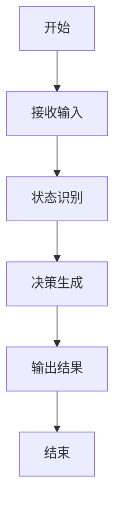
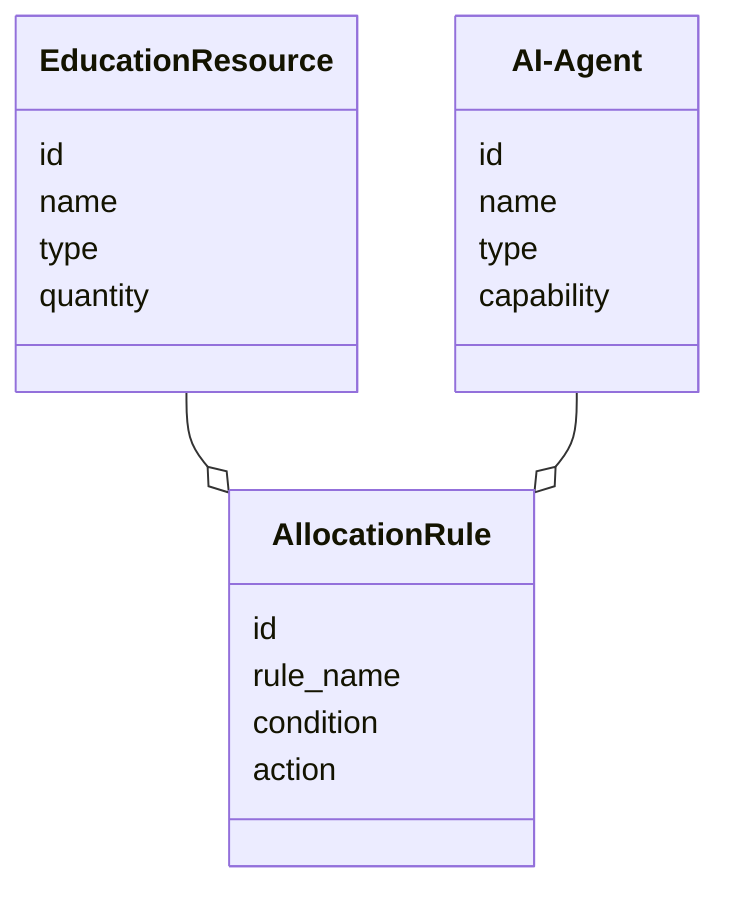
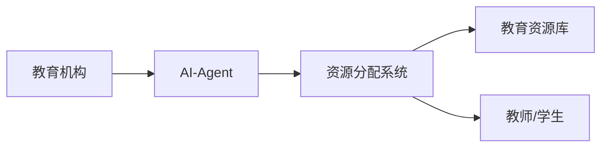
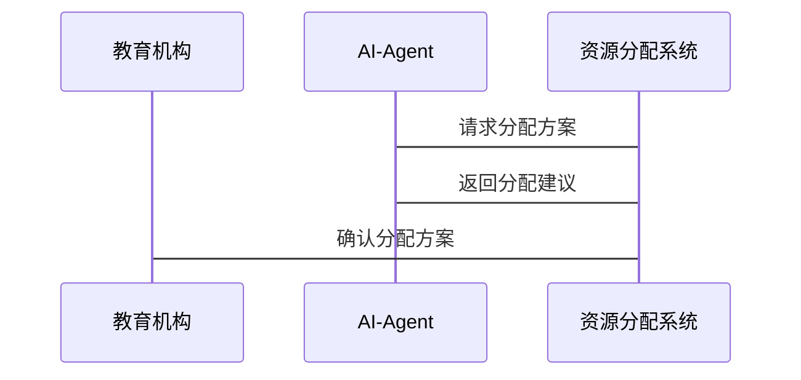

                 


# AI Agent在智能教育资源分配中的应用

## 关键词：AI Agent，教育资源分配，智能教育系统，教育公平，资源优化，人工智能教育

## 摘要：AI Agent在智能教育资源分配中的应用探讨了人工智能代理技术如何优化教育资源分配，实现教育公平。文章从AI Agent的基本概念出发，分析其在教育资源分配中的优势与挑战，详细介绍AI Agent的算法原理与数学模型，并通过系统架构设计和项目实战，展示AI Agent在教育资源分配中的具体应用。文章最后总结了AI Agent在教育领域的前景与价值，并提出未来研究方向。

---

## 第一部分: AI Agent与智能教育资源分配的背景与概念

### 第1章: AI Agent与智能教育资源分配的背景

#### 1.1 AI Agent的基本概念

- **1.1.1 人工智能代理（AI Agent）的定义**  
  AI Agent是一种能够感知环境、做出决策并采取行动的智能实体。它具备自主性、反应性、目标导向和学习能力，能够根据环境信息动态调整行为。

- **1.1.2 AI Agent的核心特征与分类**  
  AI Agent的核心特征包括自主性、适应性、目标导向和社交能力。根据智能水平，AI Agent可以分为反应式、基于模型和混合式代理。

- **1.1.3 AI Agent与传统教育技术的区别**  
  AI Agent不仅能够执行预设任务，还能通过学习和优化不断改进，区别于传统的教育管理系统和学习平台。

#### 1.2 教育资源分配的现状与挑战

- **1.2.1 当前教育资源分配的问题背景**  
  教育资源分配存在地域不均、城乡差距和校际差异，传统模式难以实现精准分配。

- **1.2.2 教育资源分配中的不均衡现象**  
  优质教育资源集中于发达地区，导致教育机会不均等。

- **1.2.3 传统教育资源分配模式的局限性**  
  传统模式依赖人工调配，效率低且难以满足个性化需求。

#### 1.3 AI Agent在教育领域的应用前景

- **1.3.1 AI Agent在教育中的潜在应用场景**  
  包括智能排课、个性化学习推荐、资源优化配置和教育管理自动化。

- **1.3.2 AI Agent技术对教育资源分配的促进作用**  
  AI Agent能够提高分配效率，实现资源的精准匹配和优化配置。

- **1.3.3 AI Agent在教育公平中的价值**  
  通过技术手段缩小教育差距，推动教育公平。

---

## 第二部分: AI Agent的核心概念与原理

### 第2章: AI Agent的核心概念与原理

#### 2.1 AI Agent的基本原理

- **2.1.1 AI Agent的感知与决策机制**  
  AI Agent通过传感器或数据接口感知环境，利用算法处理信息并做出决策。

- **2.1.2 AI Agent的学习与优化算法**  
  包括监督学习、无监督学习和强化学习，通过数据驱动不断优化决策策略。

- **2.1.3 AI Agent的自主性与适应性**  
  AI Agent能够自主运行，适应环境变化并动态调整行为。

#### 2.2 AI Agent的特征对比分析

- **2.2.1 AI Agent与传统软件系统的对比**  
  AI Agent具备自主性和智能性，而传统系统依赖于预设规则。

- **2.2.2 不同类型AI Agent的特征对比（表格形式）**

| 类型       | 自主性 | 学习能力 | 适应性 |
|------------|--------|----------|--------|
| 反应式     | 中     | 低       | 高     |
| 基于模型   | 高     | 高       | 中     |
| 混合式     | 高     | 高       | 高     |

- **2.2.3 AI Agent与教育资源的关联关系**  
  AI Agent通过分析教育资源需求和供给，优化资源配置，确保高效利用。

#### 2.3 AI Agent的ER实体关系图

```mermaid
erd
  education_resource: id, name, type, quantity
  ai_agent: id, name, type, capability
  allocation_rule: id, rule_name, condition, action
  relationship:
    education_resource -- allocation_rule: used_by
    ai_agent -- allocation_rule: implements
```

---

## 第三部分: AI Agent的算法原理与数学模型

### 第3章: AI Agent的算法原理

#### 3.1 AI Agent的核心算法

- **3.1.1 基于强化学习的AI Agent算法**  
  使用Q-learning算法，通过奖励机制优化决策策略。

- **3.1.2 基于监督学习的AI Agent算法**  
  利用标注数据训练模型，进行分类或回归任务。

- **3.1.3 基于无监督学习的AI Agent算法**  
  通过聚类分析发现数据中的隐含模式。

#### 3.2 算法流程图（mermaid）



#### 3.3 算法实现代码示例

```python
def ai_agent_algorithm(input):
    state = recognize_state(input)
    action = decide_action(state)
    return action
```

#### 3.4 数学模型与公式

- **3.4.1 强化学习中的Q-learning公式**

$$ Q(s,a) = Q(s,a) + \alpha (r + \gamma \max Q(s',a') - Q(s,a)) $$

---

## 第四部分: 系统分析与架构设计

### 第4章: 系统分析与架构设计

#### 4.1 问题场景介绍

- **教育机构资源分配问题**  
  包括课程资源、教师分配和教室调度。

#### 4.2 系统功能设计

- **领域模型（mermaid类图）**



- **系统架构设计（mermaid架构图）**



- **系统接口设计**

| 接口名称       | 输入           | 输出           |
|----------------|----------------|----------------|
| 获取资源需求   | 学生需求列表   | 资源分配方案   |
| 调整分配方案   | 用户反馈       | 新分配方案     |

- **系统交互流程（mermaid序列图）**



---

## 第五部分: 项目实战

### 第5章: 项目实战

#### 5.1 项目介绍

- **项目目标**  
  开发一个基于AI Agent的教育资源分配系统，实现资源的智能分配与优化。

#### 5.2 系统核心实现源代码

```python
class AI_Education_allocator:
    def __init__(self):
        self.resources = {}  # 教育资源库存
        self.demands = {}    # 学生需求

    def recognize_state(self):
        # 分析当前资源和需求状态
        pass

    def decide_action(self):
        # 根据状态做出决策
        pass

    def allocate_resources(self):
        # 执行分配操作
        pass
```

#### 5.3 案例分析与解读

- **案例背景**  
  某中学需要分配课程资源到不同班级。

- **分配过程**  
  AI Agent分析需求和资源，生成最优分配方案。

- **结果展示**  
  通过可视化工具展示分配结果。

#### 5.4 项目总结

- **经验总结**  
  AI Agent提高了分配效率和公平性。

- **问题与教训**  
  数据质量和模型泛化能力仍需提升。

---

## 第六部分: 总结与展望

### 第6章: 总结与展望

#### 6.1 总结

- AI Agent在教育资源分配中的优势  
  提高效率、实现精准分配和促进教育公平。

#### 6.2 展望

- **技术发展**  
  结合大语言模型和多智能体技术，提升AI Agent的智能水平。

- **应用领域拓展**  
  在教育管理、教师培训和学生支持等领域深入应用。

#### 6.3 最佳实践 Tips

- 数据质量是关键，需确保数据的准确性和全面性。

- 模型的泛化能力需要通过持续学习和优化来提升。

---

## 作者：AI天才研究院 & 禅与计算机程序设计艺术

---

以上是《AI Agent在智能教育资源分配中的应用》的技术博客文章的完整目录和内容框架。文章通过系统地分析AI Agent的基本概念、算法原理、系统设计和项目实战，全面展示了AI Agent在教育资源分配中的应用价值和实现方法。

