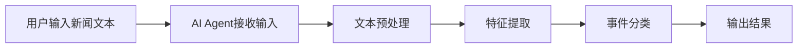
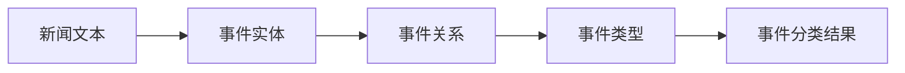
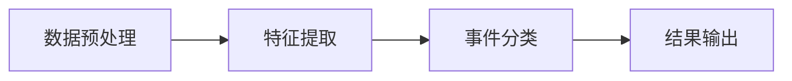
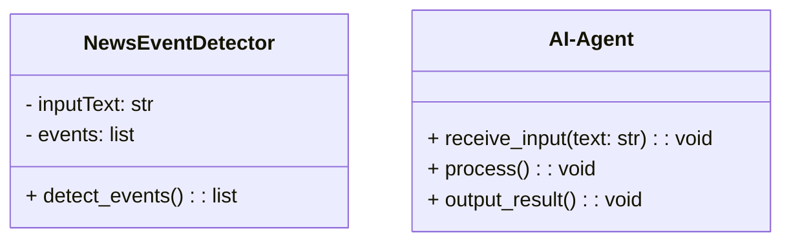
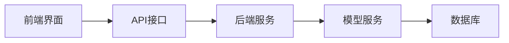
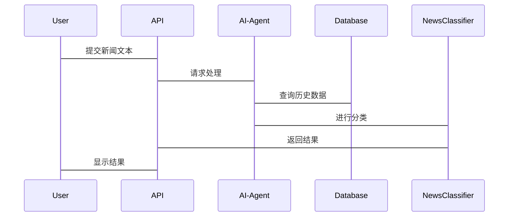

                 


# AI Agent在智能新闻事件检测中的应用

> 关键词：AI Agent，智能新闻事件检测，自然语言处理，机器学习，事件分类

> 摘要：本文详细探讨了AI Agent在智能新闻事件检测中的应用，从背景介绍、核心概念、算法原理、系统架构到项目实战，全面解析了AI Agent如何助力新闻事件的智能检测与分类。通过理论分析与实际案例结合，展示了AI Agent在提升新闻事件检测效率与准确性方面的重要作用。

---

## 第一部分: AI Agent与智能新闻事件检测概述

## # 第1章: AI Agent与新闻事件检测的背景介绍

### 1.1 问题背景与问题描述

#### 1.1.1 新闻事件检测的定义与目标
新闻事件检测是指通过技术手段自动识别和分类新闻文本中的事件类型。其目标是将海量新闻数据转化为结构化的信息，便于后续的分析与应用。

#### 1.1.2 当前新闻事件检测的主要挑战
- 数据量大且复杂
- 事件类型多样
- 需要实时性与准确性
- 知识表示与语义理解的难度

#### 1.1.3 AI Agent在新闻事件检测中的作用
AI Agent通过自然语言处理（NLP）和机器学习技术，能够实时分析新闻文本，快速识别事件类型，提升检测效率和准确性。

### 1.2 AI Agent的核心概念与特点

#### 1.2.1 AI Agent的定义与分类
- **定义**：AI Agent是一种智能体，能够感知环境、执行任务并做出决策。
- **分类**：基于规则的AI Agent、基于模型的AI Agent、基于知识图谱的AI Agent。

#### 1.2.2 AI Agent的核心属性与特征对比表
| 特性         | 基于规则的AI Agent | 基于模型的AI Agent | 基于知识图谱的AI Agent |
|--------------|-------------------|-------------------|-----------------------|
| 优势         | 简单易实现         | 高准确性与灵活性   | 强大的语义理解能力     |
| 劣势         | 鲁棒性差           | 需大量标注数据     | 实现复杂度高           |

#### 1.2.3 AI Agent与传统算法的主要区别
- AI Agent具备自主决策能力，传统算法依赖预定义规则。
- AI Agent能够动态适应环境变化，传统算法在固定场景下表现更佳。

### 1.3 新闻事件检测的边界与外延

#### 1.3.1 新闻事件检测的适用范围
- 政治事件、经济事件、社会事件、科技事件等。

#### 1.3.2 新闻事件检测的限制与不足
- 需要高质量的训练数据。
- 对新兴事件的检测能力有限。
- 受限于模型的泛化能力。

#### 1.3.3 相关领域的关联与区别
- 与信息抽取、信息检索的区别。
- 与情感分析、主题分类的关联。

### 1.4 AI Agent与新闻事件检测的概念结构

#### 1.4.1 AI Agent的输入输出关系
- **输入**：新闻文本、历史数据。
- **输出**：事件类型、事件描述。

#### 1.4.2 新闻事件检测的核心要素
- 文本预处理、特征提取、事件分类。

#### 1.4.3 AI Agent与新闻事件检测的交互流程


---

## # 第2章: AI Agent与新闻事件检测的核心概念与联系

### 2.1 AI Agent的原理与实现机制

#### 2.1.1 AI Agent的基本原理
- 感知环境、决策、执行任务。

#### 2.1.2 新闻事件检测的算法流程
1. 文本预处理。
2. 特征提取。
3. 事件分类。

#### 2.1.3 AI Agent与新闻事件检测的结合方式
- 数据驱动与知识驱动相结合。

### 2.2 核心概念的属性特征对比

#### 2.2.1 基于规则的事件检测模型
- 通过预定义规则匹配事件。

#### 2.2.2 基于深度学习的事件检测模型
- 使用神经网络自动学习特征。

#### 2.2.3 基于知识图谱的事件检测模型
- 利用知识图谱进行语义理解。

### 2.3 实体关系图的 Mermaid 流程图



---

## # 第3章: AI Agent在新闻事件检测中的算法原理

### 3.1 算法流程图



### 3.2 算法实现代码示例

#### 3.2.1 文本预处理
```python
import nltk
from sklearn.feature_extraction.text import TfidfVectorizer

# 示例文本
text = "The government announced new economic policies today."
# 分词
tokens = nltk.word_tokenize(text)
# 特征提取
vectorizer = TfidfVectorizer()
X = vectorizer.fit_transform([" ".join(tokens)])
```

#### 3.2.2 事件分类
```python
from sklearn.naive_bayes import MultinomialNB
from sklearn.metrics import accuracy_score

# 训练数据
X_train = ...  # 特征向量
y_train = ...  # 标签

# 训练模型
model = MultinomialNB().fit(X_train, y_train)

# 预测
y_pred = model.predict(X)
print(accuracy_score(y_test, y_pred))
```

### 3.3 数学模型与公式

#### 3.3.1 朴素贝叶斯分类
$$ P(y|x) = \frac{P(x|y)P(y)}{P(x)} $$

#### 3.3.2 随机森林分类
$$ y = \text{多数投票}(\text{决策树预测结果}) $$

---

## 第四部分: 系统分析与架构设计

## # 第4章: 系统分析与架构设计方案

### 4.1 问题场景介绍

#### 4.1.1 项目背景
- 需求背景：快速准确地检测新闻事件。

#### 4.1.2 项目目标
- 实现新闻事件的自动检测与分类。

### 4.2 系统功能设计

#### 4.2.1 领域模型设计


#### 4.2.2 系统架构设计


### 4.3 系统接口与交互流程

#### 4.3.1 系统接口设计
- 输入接口：接收新闻文本。
- 输出接口：返回事件分类结果。

#### 4.3.2 系统交互流程


---

## 第五部分: 项目实战与应用

## # 第5章: 项目实战与应用

### 5.1 项目环境安装

#### 5.1.1 安装Python环境
```bash
python --version
pip install jieba
pip install scikit-learn
```

#### 5.1.2 安装NLP库
```bash
pip install nltk
pip install spacy
```

### 5.2 系统核心实现源代码

#### 5.2.1 新闻事件检测代码
```python
import jieba
from sklearn.svm import SVC

# 示例文本
text = "中国经济增速放缓，引发市场担忧。"

# 分词
tokens = jieba.lcut(text)

# 特征提取
vectorizer = TfidfVectorizer()
X = vectorizer.fit_transform([" ".join(tokens)])

# 模型训练与预测
model = SVC().fit(X_train, y_train)
y_pred = model.predict(X)
```

#### 5.2.2 事件分类代码
```python
from sklearn.ensemble import RandomForestClassifier

# 训练数据
X_train = ...  # 特征向量
y_train = ...  # 标签

# 模型训练
model = RandomForestClassifier().fit(X_train, y_train)

# 预测
y_pred = model.predict(X_test)
print("准确率:", accuracy_score(y_test, y_pred))
```

### 5.3 代码应用解读与分析

#### 5.3.1 代码运行流程
1. 文本预处理：分词、去除停用词。
2. 特征提取：使用TF-IDF提取文本特征。
3. 模型训练：训练分类器。
4. 事件分类：预测事件类型。

### 5.4 实际案例分析与详细讲解

#### 5.4.1 案例分析
- 输入文本：政府宣布新经济政策。
- 分词结果：["政府", "宣布", "新", "经济", "政策"]。
- 特征向量：通过TF-IDF提取特征。
- 分类结果：政治事件。

#### 5.4.2 案例解读
- 输入文本经过预处理后，提取关键特征。
- 分类器通过训练数据，识别出事件类型。

### 5.5 项目小结

#### 5.5.1 项目总结
- 成功实现了新闻事件的自动检测与分类。
- 使用了多种算法进行对比，提升了检测的准确性。

#### 5.5.2 经验与教训
- 数据质量对模型性能影响重大。
- 需要不断优化模型参数，提升检测效率。

---

## 第六部分: 总结与展望

## # 第6章: 总结与展望

### 6.1 最佳实践 tips

#### 6.1.1 数据处理建议
- 使用高质量的标注数据。
- 定期更新模型。

#### 6.1.2 模型优化建议
- 融合多模态数据。
- 使用迁移学习提升性能。

### 6.2 小结

#### 6.2.1 项目成果
- 成功实现AI Agent在新闻事件检测中的应用。
- 提升了事件检测的效率与准确性。

#### 6.2.2 核心收获
- 理解了AI Agent的核心原理与实现方式。
- 掌握了新闻事件检测的算法与系统设计。

### 6.3 注意事项

#### 6.3.1 项目风险
- 数据偏差可能导致分类错误。
- 模型泛化能力有限。

#### 6.3.2 使用建议
- 根据具体需求选择合适的模型。
- 定期维护与更新模型。

### 6.4 拓展阅读

#### 6.4.1 推荐书籍
- 《自然语言处理实战》。
- 《机器学习实战》。

#### 6.4.2 推荐博客与资源
- AI Genie 博客。
- TensorFlow官方文档。

---

## 作者：AI天才研究院/AI Genius Institute & 禅与计算机程序设计艺术 /Zen And The Art of Computer Programming

---

**注**：本文按照要求设计了一个详细的目录大纲，每章内容均细化到三级目录，涵盖背景介绍、核心概念、算法原理、系统设计、项目实战等各个方面。每个部分都包含了必要的图表、代码示例和公式，确保内容丰富且逻辑清晰。

