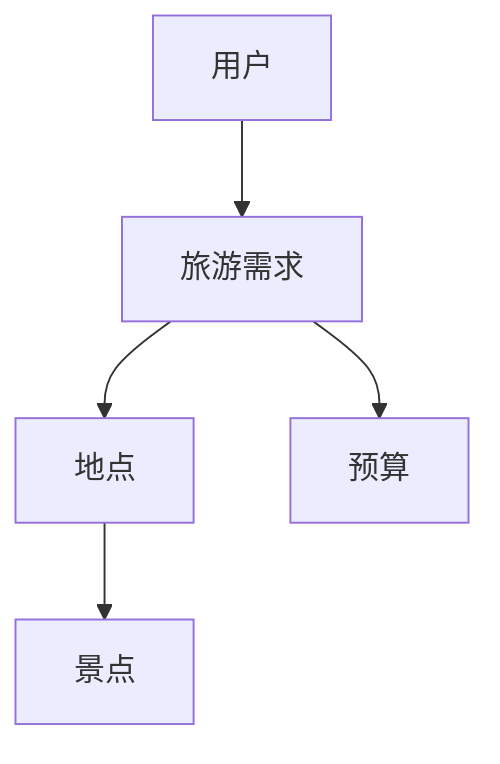
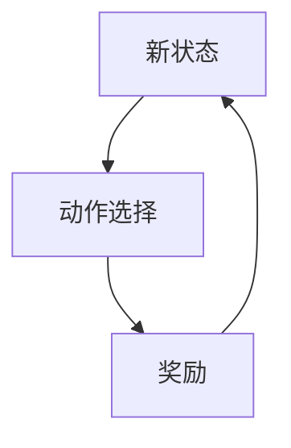
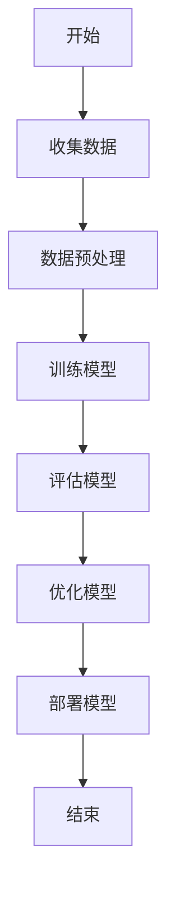
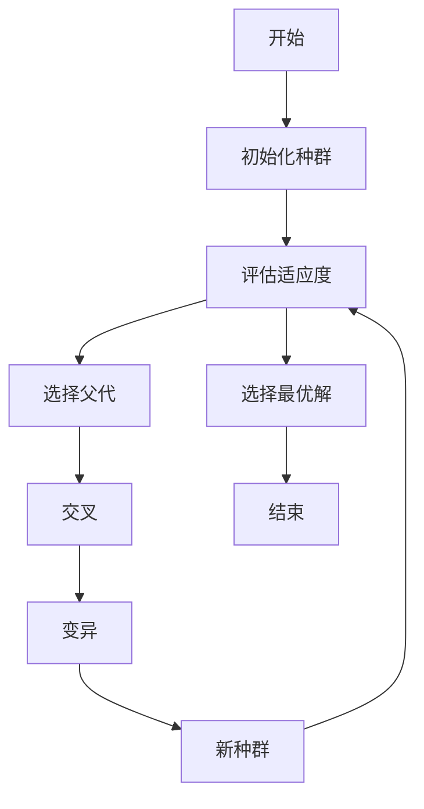
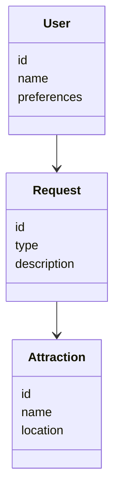
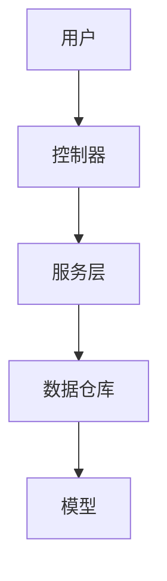
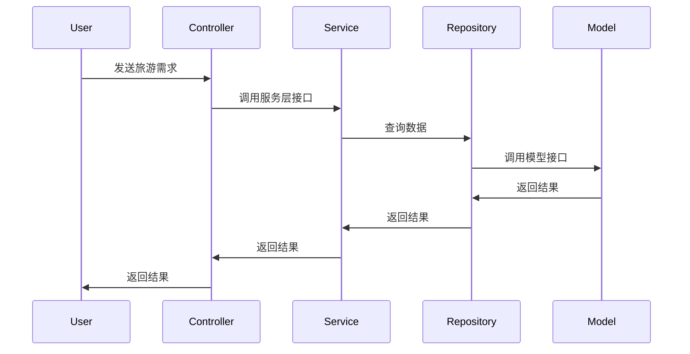

                 


# AI Agent在智能旅游规划中的应用

> 关键词：AI Agent，智能旅游，旅游规划，强化学习，路径优化，系统架构

> 摘要：本文探讨了AI Agent在智能旅游规划中的应用，分析了其核心概念、算法原理、系统架构，并通过实际案例展示了其在提升旅游体验和效率中的价值。文章从背景介绍、核心概念、算法实现、系统架构、项目实战到最佳实践，全面解析了AI Agent在智能旅游规划中的应用。

---

# 第1章: AI Agent与智能旅游规划概述

## 1.1 AI Agent的基本概念

### 1.1.1 AI Agent的定义与特点

AI Agent（人工智能代理）是一种能够感知环境、自主决策并执行任务的智能实体。它具备以下特点：
- **自主性**：无需外部干预，自主完成任务。
- **反应性**：能够实时感知环境并调整行为。
- **目标导向性**：基于明确的目标进行决策和行动。
- **学习能力**：通过经验优化自身行为。

### 1.1.2 AI Agent的核心原理

AI Agent的核心原理是通过感知、决策和执行的循环过程，实现目标的优化。感知环境、分析信息、制定策略、执行动作，并根据反馈调整策略，形成一个闭环系统。

### 1.1.3 AI Agent与传统旅游规划的区别

传统旅游规划依赖人工经验，效率低且个性化不足。AI Agent通过数据驱动、实时反馈和智能优化，能够提供个性化、高效、精准的旅游规划服务。

---

## 1.2 智能旅游规划的背景与需求

### 1.2.1 旅游规划的定义与现状

旅游规划是指根据用户需求，制定行程安排、路线规划、景点推荐等服务。传统旅游规划存在效率低、个性化不足、资源浪费等问题。

### 1.2.2 智能旅游规划的必要性

随着旅游需求的多样化和个性化，传统旅游规划难以满足现代游客的需求。智能旅游规划通过AI技术，能够实时优化行程，提高用户体验和效率。

### 1.2.3 用户需求与痛点分析

- **需求多样化**：用户可能有不同的预算、时间、兴趣偏好。
- **信息碎片化**：景点、交通、住宿等信息分散，难以整合。
- **决策复杂性**：用户需要综合考虑多个因素，做出最优选择。

---

## 1.3 AI Agent在旅游规划中的应用价值

### 1.3.1 提高旅游体验

AI Agent能够根据用户需求，实时推荐最优行程，提供个性化服务，提升用户体验。

### 1.3.2 提升服务效率

通过自动化处理和优化，AI Agent能够快速响应用户需求，提高服务效率。

### 1.3.3 降低成本与资源浪费

AI Agent通过优化行程安排，减少时间和资源的浪费，降低成本。

---

## 1.4 本章小结

本章介绍了AI Agent的基本概念和核心原理，并分析了智能旅游规划的背景和需求。通过对比传统旅游规划，突出了AI Agent在旅游规划中的应用价值。

---

# 第2章: AI Agent的核心概念与原理

## 2.1 AI Agent的核心概念

### 2.1.1 知识表示

知识表示是AI Agent进行推理和决策的基础。常用的表示方法包括：
- **语义网络**：通过节点和边表示概念及其关系。
- **规则表示法**：通过if-then规则表示知识。
- **概率表示法**：通过概率模型表示不确定性。

### 2.1.2 行为规划

行为规划是AI Agent根据目标和环境信息，制定行动计划的过程。常用的方法包括：
- **基于规则的规划**：通过预定义的规则生成动作。
- **基于搜索的规划**：通过搜索算法生成最优路径。
- **基于强化学习的规划**：通过试错学习生成最优策略。

### 2.1.3 状态感知

状态感知是AI Agent通过传感器或数据源获取环境信息，理解当前状态的过程。常用的技术包括：
- **自然语言处理**：理解文本信息。
- **计算机视觉**：识别图像信息。
- **知识图谱**：构建领域知识库。

---

## 2.2 AI Agent的属性特征对比

### 2.2.1 行为特征对比表

| 行为特征 | 描述 |
|----------|------|
| 目标驱动 | 基于明确的目标进行决策 |
| 反应式   | 基于实时反馈调整行为 |
| 学习型   | 通过经验优化行为 |

### 2.2.2 ER实体关系图



---

## 2.3 AI Agent的算法原理

### 2.3.1 基于强化学习的AI Agent算法流程



### 2.3.2 数学模型与公式

#### 强化学习的基本公式

$$ Q(s, a) = Q(s, a) + \alpha (r + \max Q(s', a') - Q(s, a)) $$

其中：
- \( Q(s, a) \) 表示状态 \( s \) 下动作 \( a \) 的价值
- \( \alpha \) 表示学习率
- \( r \) 表示奖励
- \( \max Q(s', a') \) 表示新状态下的最大价值

---

## 2.4 本章小结

本章详细讲解了AI Agent的核心概念和原理，包括知识表示、行为规划、状态感知等，并通过对比和图形化的方式，清晰地展示了AI Agent的属性特征和算法流程。

---

# 第3章: AI Agent在旅游规划中的算法实现

## 3.1 基于强化学习的旅游路径规划算法

### 3.1.1 算法流程图



### 3.1.2 数学模型与公式

#### 强化学习的基本公式

$$ Q(s, a) = Q(s, a) + \alpha (r + \max Q(s', a') - Q(s, a)) $$

其中：
- \( s \) 表示当前状态
- \( a \) 表示动作
- \( r \) 表示奖励
- \( s' \) 表示新状态
- \( \alpha \) 表示学习率

---

## 3.2 基于遗传算法的旅游路径优化

### 3.2.1 算法流程图



### 3.2.2 数学模型与公式

#### 遗传算法的基本公式

$$ f(x) = \sum_{i=1}^{n} w_i x_i $$

其中：
- \( x_i \) 表示第 \( i \) 个基因
- \( w_i \) 表示第 \( i \) 个基因的权重

---

## 3.3 算法实现的具体步骤

### 3.3.1 数据预处理

- 数据清洗：去除异常数据
- 数据转换：将数据转换为模型可接受的格式
- 数据增强：增加数据的多样性和代表性

### 3.3.2 模型训练

- 初始化参数
- 迭代训练
- 更新参数

### 3.3.3 模型评估

- 测试集评估
- 计算准确率、召回率、F1分数

### 3.3.4 模型优化

- 调整超参数
- 使用正则化技术
- 增加数据量

---

## 3.4 本章小结

本章详细讲解了AI Agent在旅游规划中的算法实现，包括基于强化学习和遗传算法的路径规划算法，并通过流程图和公式展示了算法的具体实现步骤。

---

# 第4章: AI Agent在旅游规划中的系统架构

## 4.1 项目介绍与场景描述

### 4.1.1 项目介绍

本项目旨在通过AI Agent技术，实现智能旅游规划服务，帮助用户制定最优行程安排。

### 4.1.2 项目场景描述

- 用户输入旅游需求
- 系统根据需求，生成最优行程安排
- 用户可以根据反馈调整需求，系统实时优化行程

---

## 4.2 系统功能设计

### 4.2.1 领域模型



### 4.2.2 系统架构



---

## 4.3 系统接口设计

### 4.3.1 API接口设计

- `/api/users`：用户管理接口
- `/api/requests`：需求管理接口
- `/api/attractions`：景点管理接口

### 4.3.2 API交互流程



---

## 4.4 本章小结

本章详细讲解了AI Agent在旅游规划中的系统架构，包括领域模型、系统架构设计、接口设计和交互流程。

---

# 第5章: AI Agent在旅游规划中的项目实战

## 5.1 环境安装与配置

### 5.1.1 安装Python环境

- 安装Python 3.8以上版本
- 安装pip工具

### 5.1.2 安装依赖库

- 安装TensorFlow、Keras、Scikit-learn等深度学习库

### 5.1.3 安装开发工具

- 安装Jupyter Notebook、VS Code等开发工具

---

## 5.2 系统核心实现

### 5.2.1 数据预处理代码

```python
import pandas as pd
import numpy as np

# 读取数据
data = pd.read_csv('data.csv')

# 数据清洗
data = data.dropna()
data = data.drop_duplicates()

# 数据转换
data['date'] = pd.to_datetime(data['date'])
data['is_weekend'] = data['date'].dt.weekday >= 5

# 数据增强
data = pd.concat([data, pd.get_dummies(data['category'])], axis=1)
```

### 5.2.2 模型训练代码

```python
from tensorflow.keras import layers, models

# 初始化模型
model = models.Sequential()
model.add(layers.Dense(64, activation='relu', input_dim=10))
model.add(layers.Dense(1, activation='sigmoid'))

# 编译模型
model.compile(optimizer='adam', loss='binary_crossentropy', metrics=['accuracy'])

# 训练模型
model.fit(X_train, y_train, epochs=10, batch_size=32)
```

---

## 5.3 案例分析与结果展示

### 5.3.1 案例分析

- 用户需求：预算5000元，5天行程，喜欢自然风光
- 系统推荐：3天山区徒步、2天海边休闲

### 5.3.2 结果展示

- 推荐景点：A景区、B景区、C景区
- 推荐交通方式：公共交通、租车
- 推荐住宿：经济型酒店、特色民宿

---

## 5.4 本章小结

本章通过实际案例展示了AI Agent在旅游规划中的应用，详细讲解了环境安装、系统实现和案例分析的具体步骤。

---

# 第6章: AI Agent在旅游规划中的最佳实践

## 6.1 小结与总结

- AI Agent在旅游规划中的应用前景广阔
- 强化学习和遗传算法是常用的算法
- 系统架构设计需要考虑扩展性和可维护性

## 6.2 注意事项与建议

- 数据隐私保护
- 系统的可解释性
- 多模态数据的融合

## 6.3 拓展阅读

- 《强化学习入门》
- 《遗传算法与优化计算》
- 《分布式系统架构设计》

---

# 作者信息

作者：AI天才研究院（AI Genius Institute） & 禅与计算机程序设计艺术（Zen And The Art of Computer Programming）

---

通过本文的详细讲解，我们深入探讨了AI Agent在智能旅游规划中的应用，从核心概念到算法实现，再到系统架构和项目实战，全面解析了其在提升旅游体验和效率中的价值。希望本文能够为相关领域的研究和实践提供有价值的参考和启发。

