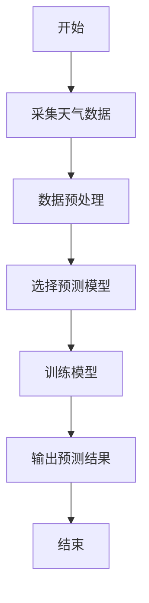
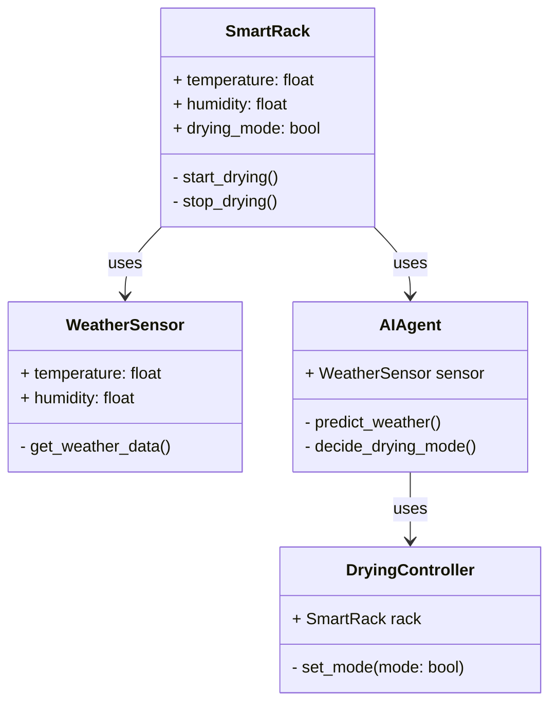

                 


# AI Agent在智能晾衣架中的天气感知烘干

## 关键词：智能晾衣架，AI Agent，天气感知，烘干控制，物联网

## 摘要：本文探讨了AI Agent在智能晾衣架中的应用，特别是在天气感知与烘干控制方面的创新。通过分析天气数据，AI Agent能够智能调整烘干参数，优化衣物干燥效率，同时保护衣物不受天气影响。本文详细讲解了AI Agent的核心原理、算法实现、系统架构，并通过实际案例展示了其在智能晾衣架中的应用价值。

---

## 第1章：背景介绍

### 1.1 问题背景

智能家居设备的普及推动了传统家居用品的智能化升级。智能晾衣架作为智能家居的一部分，其功能远超传统晾衣架的范畴。然而，现有的智能晾衣架大多仅具备基础的遥控和定时功能，未能充分考虑天气因素对晾衣效果的影响。例如，雨季或高湿度环境下，衣物晾干效率降低，甚至可能引发霉变问题。此外，传统晾衣架在恶劣天气下缺乏主动保护机制，可能导致衣物损坏或设备受损。

---

### 1.2 问题描述

AI Agent（人工智能代理）是一种能够感知环境并执行任务的智能实体。在智能晾衣架中，AI Agent可以通过集成天气传感器实时获取环境数据（如温度、湿度、风速等），结合历史数据和预测模型，判断当前天气状况，并据此优化烘干参数。例如，在湿度较高的天气下，AI Agent可以延长烘干时间，确保衣物完全干燥；在晴朗干燥的天气下，AI Agent可以缩短烘干时间，节省能源。

---

### 1.3 问题解决

AI Agent的核心作用在于实时感知环境并做出智能决策。通过集成天气传感器，AI Agent能够获取精确的天气数据，并利用这些数据优化烘干过程。例如：

- **天气预测**：基于历史数据和机器学习模型，AI Agent可以预测未来几小时的天气变化。
- **智能控制**：根据天气预测结果，AI Agent会调整烘干温度、时间和风速等参数，以确保衣物快速、安全地干燥。
- **主动保护**：在恶劣天气（如暴雨或台风）来临时，AI Agent可以关闭烘干功能，避免设备损坏和衣物受潮。

---

### 1.4 边界与外延

智能晾衣架的AI Agent系统具有明确的边界。其核心功能仅限于天气感知和烘干控制，与其他智能家居设备（如空调、灯光）的联动属于外延功能。此外，AI Agent的数据来源仅限于集成的天气传感器和本地天气预报API，不涉及其他外部数据源。

---

### 1.5 概念结构与核心要素

智能晾衣架的AI Agent系统由以下几个核心要素组成：

1. **天气传感器**：用于采集实时天气数据（温度、湿度、风速等）。
2. **AI Agent**：负责数据处理、天气预测和决策制定。
3. **烘干控制器**：根据AI Agent的指令调整烘干参数。
4. **用户交互界面**：用户可以通过手机APP或语音助手查看系统状态并进行操作。

这些要素通过物联网技术实现无缝连接，确保系统高效运行。

---

## 第2章：核心概念与联系

### 2.1 核心概念原理

AI Agent的核心原理基于实时数据处理和机器学习。通过天气传感器获取数据后，AI Agent会将这些数据输入到预训练的模型中，生成天气预测结果。根据预测结果，AI Agent会调整烘干控制器的参数，以优化烘干过程。

---

### 2.2 概念属性对比

以下表格对比了传统晾衣架和智能晾衣架（集成AI Agent）的核心属性：

| 属性                | 传统晾衣架         | 智能晾衣架（集成AI Agent） |
|---------------------|-------------------|-----------------------------|
| 天气感知能力        | 无                | 有                           |
| 烘干控制方式        | 手动/定时         | 智能优化                     |
| 数据处理能力        | 无                | 有（AI Agent）               |
| 用户交互方式        | 遥控/按钮         | 手机APP/语音助手             |
| 系统扩展性          | 无                | 支持与其他设备联动             |

---

### 2.3 ER实体关系图

以下是系统的核心实体关系图：

```mermaid
er
  actor: 用户
  smart_rack: 智能晾衣架
  weather_sensor: 天气传感器
  ai_agent: AI代理
 烘干_controller: 烘干控制器

 actor --> smart_rack: 操作智能晾衣架
 smart_rack --> weather_sensor: 集成天气传感器
 weather_sensor --> ai_agent: 提供天气数据
 ai_agent -->烘干_controller: 发出控制指令
 烘干_controller --> smart_rack: 执行烘干操作
```

---

## 第3章：算法原理讲解

### 3.1 天气预测算法

#### 3.1.1 数据采集与预处理

AI Agent从天气传感器和外部API获取数据，并进行预处理：

1. **数据清洗**：去除异常值和缺失数据。
2. **特征提取**：提取温度、湿度、风速等关键特征。

#### 3.1.2 算法流程图

以下是天气预测算法的流程图：



#### 3.1.3 算法实现

以下是基于线性回归的天气预测模型实现：

```python
import numpy as np
from sklearn.linear_model import LinearRegression

# 数据预处理
def preprocess(data):
    # 假设data是包含温度和湿度的二维数组
    # 返回预处理后的数据
    pass

# 训练模型
def train_model(data, labels):
    model = LinearRegression()
    model.fit(data, labels)
    return model

# 预测天气
def predict_weather(model, new_data):
    return model.predict(new_data)
```

---

### 3.2 烘干控制算法

#### 3.2.1 算法实现

以下是烘干控制算法的实现：

```python
def weather_based_drying(temperature, humidity):
    # 温度低于15℃或湿度高于60%时启动烘干
    if temperature < 15 or humidity > 60:
        return 'start'
    else:
        return 'stop'
```

#### 3.2.2 数学模型与公式

以下是烘干控制算法的数学模型：

$$
\text{烘干状态} = \begin{cases}
\text{start}, & \text{如果 } T < 15 \text{ 或 } H > 60 \\
\text{stop}, & \text{否则}
\end{cases}
$$

---

## 第4章：系统分析与架构设计

### 4.1 系统功能设计

智能晾衣架的AI Agent系统具有以下功能模块：

1. **天气数据采集模块**：通过传感器和API获取天气数据。
2. **AI Agent决策模块**：处理数据并生成控制指令。
3. **烘干控制模块**：根据指令调整烘干参数。
4. **用户交互模块**：提供直观的操作界面。

#### 领域模型类图



---

### 4.2 系统架构设计

以下是系统架构图：

```mermaid
graph TD
    AIAgent --> WeatherSensor: 获取天气数据
    AIAgent --> SmartRack: 控制晾衣架状态
    AIAgent --> DryingController: 发出烘干指令
```

---

## 第5章：项目实战

### 5.1 环境搭建

以下是Python环境搭建步骤：

1. **安装必要的库**：
   ```bash
   pip install numpy scikit-learn
   ```

2. **连接天气传感器**：
   - 使用Raspberry Pi或其他物联网设备连接天气传感器。

---

### 5.2 核心实现

以下是AI Agent的核心实现代码：

```python
import numpy as np
from sklearn.linear_model import LinearRegression
import requests

# 获取天气数据
def get_weather_data(api_key):
    response = requests.get(f'http://api.weather.com?api_key={api_key}')
    return response.json()

# 训练模型
def train_model(data, labels):
    model = LinearRegression()
    model.fit(data, labels)
    return model

# 预测天气
def predict_weather(model, new_data):
    return model.predict(new_data)

# 烘干控制
def weather_based_drying(temperature, humidity):
    if temperature < 15 or humidity > 60:
        return 'start'
    else:
        return 'stop'
```

---

### 5.3 案例分析

假设当前温度为20℃，湿度为70%。AI Agent会判断湿度超过60%，启动烘干功能。以下是具体步骤：

1. **获取天气数据**：温度=20℃，湿度=70%。
2. **AI Agent决策**：湿度>60%，启动烘干。
3. **执行烘干**：烘干控制器调整温度和风速，开始烘干过程。

---

## 第6章：总结

### 6.1 最佳实践 Tips

- 定期更新天气模型，以提高预测准确性。
- 在恶劣天气下，建议关闭烘干功能以保护设备。
- 定期检查传感器和设备状态，确保系统正常运行。

---

### 6.2 小结

本文详细探讨了AI Agent在智能晾衣架中的应用，特别是在天气感知和烘干控制方面的创新。通过实时数据分析和智能决策，AI Agent能够显著提升晾衣效率，同时保护衣物和设备免受天气影响。

---

### 6.3 注意事项

- 避免在恶劣天气下长时间使用烘干功能。
- 定期维护传感器和设备，确保数据准确性。
- 确保系统数据安全，防止数据泄露。

---

### 6.4 拓展阅读

- 《基于机器学习的天气预测模型优化》
- 《物联网设备的安全与隐私保护》
- 《智能家居系统的设计与实现》

---

## 作者：AI天才研究院/AI Genius Institute & 禅与计算机程序设计艺术 /Zen And The Art of Computer Programming

