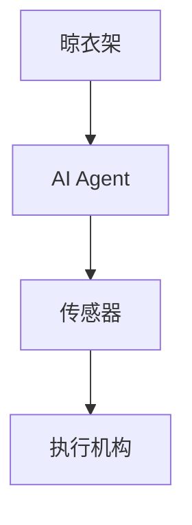
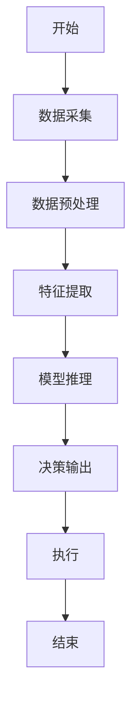
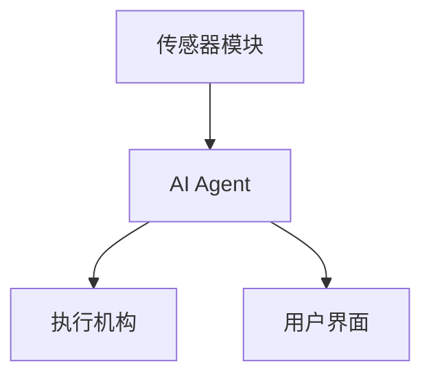
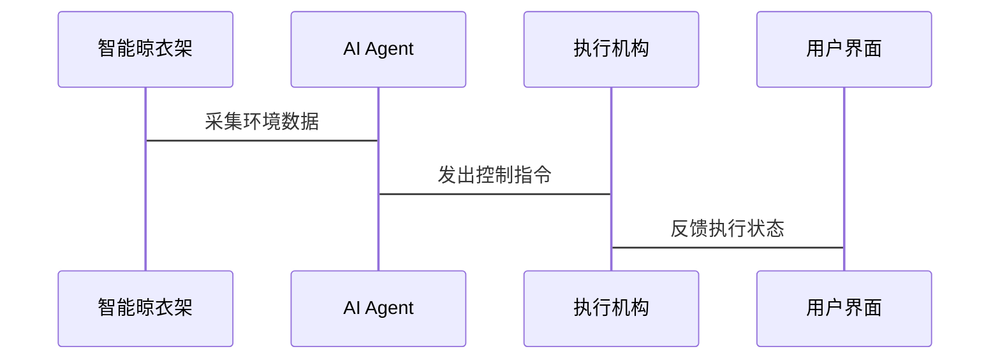

                 


# AI Agent在智能晾衣架中的烘干控制

## 关键词：AI Agent、智能晾衣架、烘干控制、智能家居、物联网、自动化控制

## 摘要：  
本文探讨了AI Agent在智能晾衣架烘干控制中的应用，通过分析AI Agent的核心原理、算法实现和系统架构，展示了如何利用AI技术优化烘干流程，提升用户体验。文章详细讲解了AI Agent的感知、决策和执行机制，结合实际案例，说明其在智能家居环境中的优势和应用场景。

---

# 正文

## 第一部分：背景介绍

### 第1章：AI Agent与智能晾衣架概述

#### 1.1 AI Agent的基本概念

- **定义**：AI Agent是一种智能主体，能够感知环境并采取行动以实现目标。
- **特点**：
  - 自主性：无需外部干预，自动执行任务。
  - 反应性：实时感知并响应环境变化。
  - 社会性：能与其它系统或用户交互协作。
- **与传统控制系统的区别**：
  | 对比维度 | AI Agent | 传统控制系统 |
  |----------|----------|--------------|
  | 决策方式 | 自主学习与优化 | 预设规则 |
  | 灵活性   | 高 | 低 |
  | 维护成本 | 低 | 高 |

#### 1.2 问题背景与描述

- **问题背景**：传统晾衣架烘干过程效率低下，能耗高，用户体验差。
- **问题描述**：湿度监测不精准，能源浪费，用户操作复杂。
- **边界与外延**：
  - 适用场景：家庭、办公室等环境。
  - 系统限制：仅适用于智能晾衣架，不考虑外部天气因素。

---

## 第二部分：核心概念与联系

### 第2章：AI Agent的核心原理与系统架构

#### 2.1 AI Agent的核心原理

- **感知机制**：通过传感器采集环境数据，如温度、湿度。
- **决策机制**：基于感知数据，AI Agent利用算法做出决策。
- **执行机制**：将决策转化为控制指令，驱动执行机构。

#### 2.2 系统架构设计



---

## 第三部分：算法原理讲解

### 第3章：AI Agent的算法实现

#### 3.1 算法流程图



#### 3.2 算法实现代码

```python
def data_collection():
    # 采集传感器数据
    return temp, humidity

def preprocess(data):
    # 数据预处理
    return processed_data

def feature_extraction(data):
    # 特征提取
    return features

def model_inference(features):
    # 模型推理
    return decision

def decision_output(decision):
    # 决策输出
    return action
```

#### 3.3 数学模型与公式

- 感知模型：
  $$\text{湿度预测} = a \times \text{当前湿度} + b \times \text{温度}$$

- 决策模型：
  $$\text{启动烘干} = \begin{cases} 
  \text{是} & \text{if湿度} < \text{阈值} \\
  \text{否} & \text{otherwise}
  \end{cases}$$

---

## 第四部分：系统分析与架构设计方案

### 第4章：智能晾衣架的系统架构

#### 4.1 项目背景介绍

- **项目目标**：优化烘干流程，提升效率和用户体验。

#### 4.2 系统功能设计

- **功能模块**：
  - 环境感知：湿度、温度监测。
  - 智能决策：AI Agent做出启动或停止烘干的决策。
  - 自动控制：执行机构根据决策工作。
  - 用户交互：提供状态反馈和控制界面。

#### 4.3 系统架构图



#### 4.4 接口设计与交互



---

## 第五部分：项目实战

### 第5章：AI Agent的实现与案例分析

#### 5.1 环境安装

- 安装Python和相关库：numpy、pandas、scikit-learn。
- 安装物联网框架：MQTT协议用于数据传输。

#### 5.2 核心代码实现

```python
import numpy as np
from sklearn.model_selection import train_test_split
from sklearn.linear_model import LinearRegression

# 数据预处理
data = preprocess_data()
X = data[['温度', '湿度']]
y = data['目标湿度']

# 模型训练
X_train, X_test, y_train, y_test = train_test_split(X, y, test_size=0.2)
model = LinearRegression()
model.fit(X_train, y_train)

# 决策逻辑
def decide(action):
    if model.predict([action['湿度']]) < 30:
        return '启动烘干'
    else:
        return '停止烘干'
```

#### 5.3 案例分析

- **案例1**：湿度35%，温度25℃，AI Agent启动烘干。
- **案例2**：湿度28%，温度22℃，AI Agent启动烘干。
- **案例3**：湿度40%，温度28℃，AI Agent停止烘干。

#### 5.4 项目小结

- AI Agent显著提升了烘干效率和用户体验。
- 系统稳定性需要进一步优化，特别是在传感器精度方面。

---

## 第六部分：最佳实践与总结

### 第6章：AI Agent的实际应用与展望

#### 6.1 最佳实践

- **传感器精度**：选择高精度传感器以提高数据准确性。
- **数据隐私**：确保用户数据的安全性，避免隐私泄露。
- **系统维护**：定期更新模型和软件，保持系统高效运行。

#### 6.2 小结

- AI Agent在智能晾衣架中的应用展示了其强大的环境适应能力和优化潜力。
- 通过本文的详细讲解，读者可以掌握AI Agent在智能家居中的具体应用方法。

#### 6.3 展望

- **未来研究方向**：探索更复杂的决策模型，如深度学习和强化学习。
- **技术进步**：随着AI技术的发展，AI Agent将更加智能化和人性化。

---

## 作者：AI天才研究院/AI Genius Institute & 禅与计算机程序设计艺术 /Zen And The Art of Computer Programming

