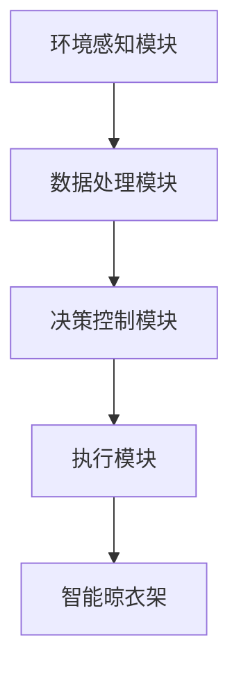
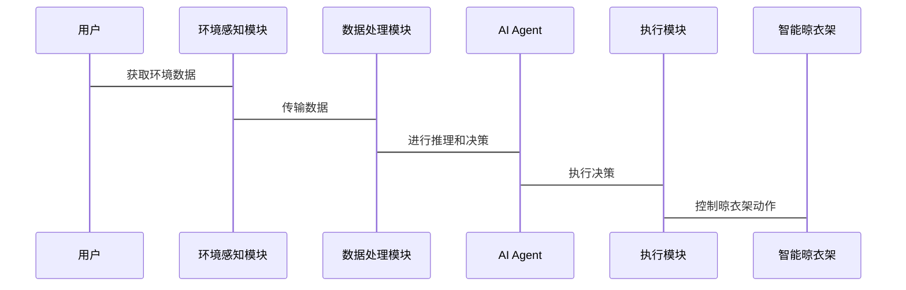

                 


# AI Agent在智能晾衣架中的衣物护理建议

> 关键词：AI Agent, 智能晾衣架, 衣物护理, 人工智能, 自动化系统

> 摘要：本文探讨了AI Agent在智能晾衣架中的应用，重点分析了AI Agent的核心原理、系统架构、算法实现及其在衣物护理中的实际应用。通过详细的技术分析和案例研究，本文展示了如何利用AI Agent提升智能晾衣架的功能，优化衣物护理流程。

---

# 第1章: AI Agent的背景与概念

## 1.1 AI Agent的基本定义

AI Agent（人工智能代理）是指能够感知环境、自主决策并执行任务的智能实体。它可以是一个软件程序、一个机器人，或者一个嵌入在设备中的智能模块。AI Agent的核心特征包括：

1. **自主性**：能够自主决策，无需外部干预。
2. **反应性**：能够感知环境并实时响应。
3. **目标导向**：基于目标驱动行为。
4. **学习能力**：能够通过数据优化自身的决策能力。

AI Agent与传统自动化系统的核心区别在于其智能化和自主性。传统系统依赖预设的规则，而AI Agent能够通过学习和推理动态调整行为。

---

## 1.2 AI Agent在智能晾衣架中的应用背景

智能晾衣架作为一种智能家居设备，主要用于衣物的晾晒和护理。然而，传统晾衣架仅具备简单的机械控制功能，无法满足用户对衣物护理的智能化需求。

AI Agent的引入为智能晾衣架带来了以下优势：

1. **智能化决策**：通过传感器数据和环境信息，AI Agent可以自动判断衣物的晾晒条件（如天气、温度、湿度）。
2. **个性化推荐**：根据用户的偏好和衣物类型，AI Agent可以提供个性化的晾晒建议。
3. **自动化控制**：AI Agent能够协调晾衣架的机械结构，实现自动晾晒和收回。

---

## 1.3 AI Agent与智能晾衣架的结合

### 1.3.1 智能晾衣架的功能需求
智能晾衣架需要满足以下功能需求：
1. **环境感知**：感知天气、温度、湿度等环境参数。
2. **衣物识别**：识别衣物的材质、颜色和类型。
3. **智能决策**：基于环境和衣物信息，优化晾晒方案。

### 1.3.2 AI Agent的应用场景
AI Agent在智能晾衣架中的应用场景包括：
1. **自动晾晒**：根据天气条件自动启动晾晒过程。
2. **防雨收回**：在恶劣天气自动收回衣物。
3. **智能推荐**：根据衣物类型推荐最佳晾晒时间。

### 1.3.3 问题背景与解决思路
传统晾衣架的痛点包括：
1. **缺乏智能化**：无法根据环境和衣物类型自动调整晾晒方案。
2. **用户体验差**：用户需要手动操作，体验不够便捷。
3. **能耗浪费**：无法优化能源使用，导致浪费。

AI Agent通过引入智能算法和自动化控制，解决了上述问题，提升了用户体验和系统效率。

---

# 第2章: AI Agent的核心原理

## 2.1 AI Agent的核心概念

AI Agent的核心概念包括：
1. **知识表示**：通过符号逻辑或概率模型表示知识。
2. **推理机制**：基于知识库进行逻辑推理。
3. **决策规划**：根据推理结果制定行动计划。

### 2.1.1 知识表示与推理
知识表示是AI Agent理解世界的基础。常用的表示方法包括：
- **逻辑表示**：使用谓词逻辑表示事实和规则。
- **语义网络**：通过节点和边表示概念及其关系。
- **概率表示**：使用贝叶斯网络表示不确定性。

推理是AI Agent基于知识库进行逻辑推理的过程。常见的推理方法包括：
- **逻辑推理**：基于逻辑规则进行推导。
- **概率推理**：基于概率模型进行推断。

### 2.1.2 行为决策与规划
AI Agent的行为决策过程包括：
1. **目标设定**：明确需要实现的目标。
2. **动作选择**：根据当前状态选择最优动作。
3. **执行计划**：制定并执行行动计划。

### 2.1.3 感知与学习机制
AI Agent通过感知环境信息并不断学习优化自身的决策能力。常见的学习方法包括：
- **监督学习**：通过标记数据进行训练。
- **强化学习**：通过奖励机制优化决策策略。
- **无监督学习**：通过聚类等方法发现数据中的规律。

---

## 2.2 AI Agent的核心算法

AI Agent的核心算法包括：
1. **机器学习算法**：如支持向量机（SVM）、随机森林（Random Forest）、神经网络等。
2. **自然语言处理技术**：如文本分类、实体识别等。
3. **规划与决策算法**：如A*算法、Dijkstra算法等。

### 2.2.1 机器学习算法
机器学习算法是AI Agent的核心工具，用于从数据中学习模式和规律。例如，使用支持向量机（SVM）进行分类任务，使用随机森林进行回归任务。

### 2.2.2 自然语言处理技术
自然语言处理技术用于AI Agent理解和生成自然语言文本。例如，使用文本分类算法识别用户的需求。

### 2.2.3 规划与决策算法
规划与决策算法用于AI Agent制定行动计划。例如，使用A*算法进行路径规划。

---

## 2.3 AI Agent与智能晾衣架的结合原理

### 2.3.1 数据采集与处理
智能晾衣架通过传感器采集环境数据（如温度、湿度）和衣物信息（如材质、颜色），并将数据传输给AI Agent。

### 2.3.2 状态识别与判断
AI Agent通过机器学习模型识别当前状态（如天气晴朗、衣物湿润），并判断是否需要晾晒或收回衣物。

### 2.3.3 行为决策与执行
AI Agent根据当前状态和目标，制定最优决策（如启动晾晒模式），并通过接口控制智能晾衣架执行相应的动作。

---

# 第3章: AI Agent的核心算法实现

## 3.1 机器学习算法实现

### 3.1.1 算法选择
在智能晾衣架的场景中，选择适合的机器学习算法是关键。例如，使用随机森林算法进行分类任务。

### 3.1.2 算法实现步骤
1. **数据预处理**：清洗和归一化数据。
2. **特征选择**：提取关键特征。
3. **模型训练**：训练机器学习模型。
4. **模型评估**：验证模型的准确性和性能。

### 3.1.3 算法代码示例
以下是一个简单的随机森林算法实现示例：

```python
from sklearn.ensemble import RandomForestClassifier
from sklearn.model_selection import train_test_split

# 数据预处理
X = processed_data  # 特征数据
y = labels  # 标签

# 划分训练集和测试集
X_train, X_test, y_train, y_test = train_test_split(X, y, test_size=0.2)

# 初始化模型
model = RandomForestClassifier(n_estimators=100)

# 训练模型
model.fit(X_train, y_train)

# 模型预测
y_pred = model.predict(X_test)

# 模型评估
print("准确率:", model.score(X_test, y_test))
```

---

## 3.2 算法优化与调参

### 3.2.1 超参数优化
通过网格搜索（Grid Search）等方法优化模型的超参数，以提高模型的性能。

### 3.2.2 模型评估指标
常用的评估指标包括准确率、召回率、F1分数等。

---

## 3.3 算法的数学模型

### 3.3.1 随机森林算法的数学模型
随机森林是一种基于决策树的集成学习算法，其数学模型如下：

$$
f(x) = \text{多数投票}(\{h_1(x), h_2(x), ..., h_n(x)\})
$$

其中，$h_i(x)$是基学习器，$n$是基学习器的数量。

---

# 第4章: AI Agent的系统架构设计

## 4.1 系统功能设计

### 4.1.1 系统功能模块
智能晾衣架AI Agent的系统功能模块包括：
1. **环境感知模块**：采集环境数据。
2. **衣物识别模块**：识别衣物类型。
3. **决策控制模块**：制定并执行决策。

### 4.1.2 系统功能流程
1. 环境感知模块采集数据并传输给决策控制模块。
2. 决策控制模块根据数据进行推理和决策。
3. 执行模块根据决策结果控制晾衣架的机械结构。

---

## 4.2 系统架构设计

### 4.2.1 系统架构图
以下是AI Agent在智能晾衣架中的系统架构图：



### 4.2.2 接口设计
系统主要接口包括：
1. **环境传感器接口**：与温湿度传感器通信。
2. **用户交互接口**：与用户手机APP通信。
3. **机械控制接口**：与晾衣架的电机和舵机通信。

---

## 4.3 系统交互设计

### 4.3.1 交互流程
1. 用户通过手机APP设置晾衣需求。
2. 环境感知模块采集环境数据。
3. AI Agent根据数据和用户需求制定决策。
4. 执行模块控制晾衣架执行相应动作。

### 4.3.2 交互序列图
以下是系统交互的序列图：



---

# 第5章: 项目实战与案例分析

## 5.1 环境安装与配置

### 5.1.1 系统环境
- 操作系统：Linux（推荐Ubuntu）
- 开发工具：Python、Jupyter Notebook
- 依赖库：scikit-learn、numpy、pandas

### 5.1.2 硬件设备
- 智能晾衣架（模拟设备）
- 温湿度传感器
- 电机和舵机驱动模块

---

## 5.2 系统核心实现

### 5.2.1 数据采集与处理
以下是数据处理的代码示例：

```python
import numpy as np
import pandas as pd

# 读取数据
data = pd.read_csv('environment_data.csv')

# 数据清洗
data = data.dropna()

# 数据归一化
from sklearn.preprocessing import MinMaxScaler
scaler = MinMaxScaler()
data_normalized = scaler.fit_transform(data)
```

### 5.2.2 AI Agent实现
以下是AI Agent的实现代码：

```python
from sklearn.ensemble import RandomForestClassifier

# 训练模型
model = RandomForestClassifier(n_estimators=100)
model.fit(X_train, y_train)

# 模型预测
y_pred = model.predict(X_test)
```

---

## 5.3 案例分析与优化

### 5.3.1 案例分析
通过实际测试案例，分析AI Agent在智能晾衣架中的表现。例如，测试AI Agent在不同天气条件下的决策准确性。

### 5.3.2 系统优化
根据测试结果，优化AI Agent的算法参数和系统架构，提升系统的性能和用户体验。

---

# 第6章: 总结与注意事项

## 6.1 总结

AI Agent在智能晾衣架中的应用极大地提升了衣物护理的智能化水平。通过引入AI技术，智能晾衣架能够实现环境感知、智能决策和自动化控制，为用户带来更便捷、更高效的衣物护理体验。

---

## 6.2 注意事项

1. **数据隐私**：确保用户数据的安全和隐私。
2. **系统稳定性**：确保AI Agent的决策逻辑稳定可靠。
3. **用户体验**：优化用户交互界面，提升用户体验。

---

## 6.3 拓展阅读

- 《机器学习实战》
- 《人工智能: 一种现代的方法》
- 《深度学习入门：基于Python和TensorFlow》

---

作者：AI天才研究院/AI Genius Institute & 禅与计算机程序设计艺术/Zen And The Art of Computer Programming

