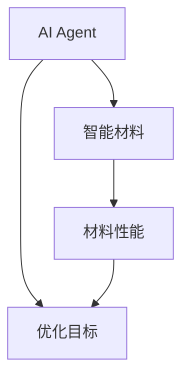
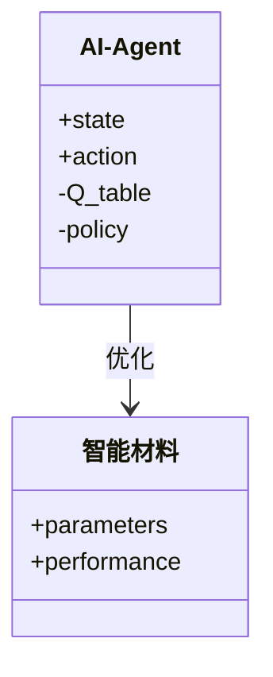
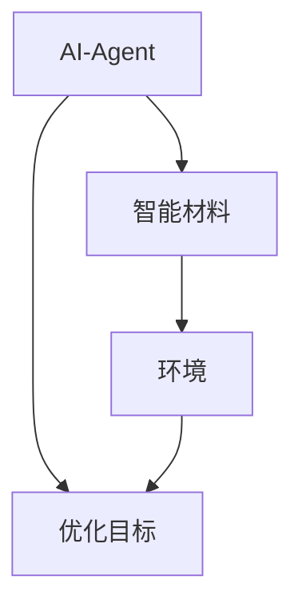
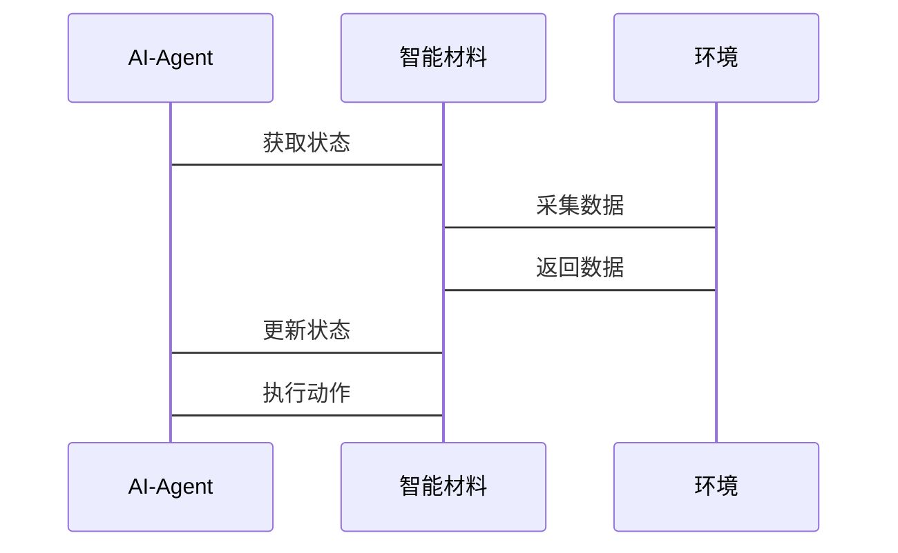

                 


# AI Agent在智能材料性能优化中的角色

> 关键词：AI Agent, 智能材料, 性能优化, 强化学习, 遗传算法, 材料科学

> 摘要：  
本文探讨了AI Agent在智能材料性能优化中的核心作用，从理论基础到算法实现，结合实际案例，系统性地分析了AI Agent如何通过数据驱动和知识驱动的方法，优化智能材料的性能。文章详细介绍了AI Agent在材料优化中的角色、数学模型、优化算法（如强化学习和遗传算法）的实现，并通过项目实战展示了AI Agent在智能材料优化中的具体应用。本文旨在为材料科学和人工智能领域的研究者提供理论与实践结合的深度分析。

---

# 第一部分: AI Agent与智能材料基础

# 第1章: AI Agent与智能材料概述

## 1.1 AI Agent的基本概念

### 1.1.1 AI Agent的定义与特点

AI Agent（人工智能代理）是指能够感知环境、自主决策并执行任务的智能实体。它具有以下特点：
- **自主性**：能够在没有外部干预的情况下独立运行。
- **反应性**：能够根据环境变化实时调整行为。
- **目标导向性**：通过设定目标来驱动决策和行动。
- **学习能力**：能够通过经验改进自身的性能。

### 1.1.2 智能材料的基本概念

智能材料是指能够根据外界环境变化（如温度、压力、光照等）自适应调整其物理、化学或机械性能的材料。例如：
- **形状记忆合金**：在外力作用下可以“记忆”并恢复原始形状。
- **压电材料**：能够将机械能转化为电能，或反之。

### 1.1.3 AI Agent与智能材料的结合

AI Agent可以通过数据分析和智能决策，帮助智能材料实现更高效的性能优化。例如，AI Agent可以实时监测材料的状态，并根据数据调整材料的性能参数，以达到最优性能。

## 1.2 AI Agent在材料科学中的应用背景

### 1.2.1 材料科学中的传统优化方法

传统材料优化方法主要包括实验试错法和数学建模法：
- **实验试错法**：通过反复实验调整材料参数，成本高、周期长。
- **数学建模法**：通过建立数学模型预测材料性能，但模型复杂度高，难以全面考虑所有变量。

### 1.2.2 AI Agent在材料优化中的优势

AI Agent的优势体现在以下几个方面：
- **数据驱动**：能够快速处理大量数据，发现潜在规律。
- **实时优化**：可以在动态环境中实时调整材料性能。
- **高效性**：相比传统方法，AI Agent能够大幅缩短优化周期。

### 1.2.3 当前研究现状与挑战

当前，AI Agent在材料科学中的研究主要集中在以下几个方面：
- **数据驱动的材料发现**：通过机器学习算法筛选潜在材料。
- **性能预测与优化**：利用AI代理优化材料的物理、化学性能。
- **动态调控**：实时调整材料性能以适应环境变化。

然而，AI Agent在材料优化中仍面临一些挑战，例如：
- 数据的稀缺性和不完整性。
- 模型的可解释性问题。
- 多目标优化的复杂性。

## 1.3 本章小结

本章介绍了AI Agent和智能材料的基本概念，并分析了AI Agent在材料优化中的优势与挑战。通过对比传统优化方法，展示了AI Agent在材料科学中的独特价值。

---

# 第二部分: AI Agent在智能材料性能优化中的核心概念

# 第2章: AI Agent与智能材料性能优化的核心概念

## 2.1 AI Agent在材料优化中的角色

### 2.1.1 数据驱动的材料优化

AI Agent通过收集和分析材料数据，发现材料性能的潜在规律。例如，利用机器学习算法预测材料的强度、韧性等性能指标。

### 2.1.2 知识驱动的材料优化

AI Agent还可以利用材料科学的知识库，结合实验数据，进行知识推理和优化。例如，基于材料的晶体结构预测其性能。

### 2.1.3 AI Agent在材料优化中的决策过程

AI Agent在材料优化中的决策过程可以分为以下几个步骤：
1. **感知环境**：收集材料的实验数据和环境信息。
2. **分析数据**：利用机器学习算法分析数据，提取特征。
3. **制定策略**：根据分析结果，制定优化策略。
4. **执行行动**：调整材料参数，执行优化操作。

## 2.2 智能材料性能优化的数学模型

### 2.2.1 材料性能优化的基本数学模型

材料性能优化的目标是找到一组参数，使得材料的性能指标最大化或最小化。数学模型通常可以表示为：
$$ \min_x f(x) $$
其中，\( f(x) \) 是材料性能的评价函数，\( x \) 是材料参数向量。

### 2.2.2 AI Agent在模型中的作用

AI Agent通过优化算法（如强化学习、遗传算法）对数学模型进行求解，找到最优参数组合。

### 2.2.3 模型的复杂度与可解释性

模型的复杂度直接影响优化的效率和效果。同时，模型的可解释性是AI Agent在材料优化中应用的重要因素，尤其是在需要对结果进行验证和调整时。

## 2.3 AI Agent与智能材料的实体关系分析



从图中可以看出，AI Agent通过优化目标影响智能材料的性能，而智能材料的性能又反过来为AI Agent提供反馈，形成一个闭环优化系统。

## 2.4 本章小结

本章分析了AI Agent在材料优化中的角色，并通过数学模型和实体关系图，展示了AI Agent与智能材料之间的相互作用关系。

---

# 第三部分: AI Agent在智能材料性能优化中的算法原理

# 第3章: AI Agent优化算法的数学模型与实现

## 3.1 基于强化学习的AI Agent算法

### 3.1.1 强化学习的基本原理

强化学习是一种通过试错方式学习策略的算法。AI Agent通过与环境交互，获得奖励或惩罚信号，逐步优化其策略。

### 3.1.2 Q-learning算法的数学模型

Q-learning算法是强化学习中的一种经典算法，其数学模型如下：
$$ Q(s,a) = r + \gamma \max Q(s',a') $$
其中，\( Q(s,a) \) 表示在状态 \( s \) 下执行动作 \( a \) 的价值，\( r \) 是奖励，\( \gamma \) 是折扣因子，\( s' \) 是下一个状态。

### 3.1.3 算法实现的伪代码

```python
def ai_agent_algorithm():
    state = initialize_state()
    while True:
        action = choose_action(state)
        next_state, reward = step(state, action)
        update_Q(state, action, reward, next_state)
        state = next_state
```

## 3.2 基于遗传算法的优化方法

### 3.2.1 遗传算法的基本原理

遗传算法是一种模拟生物进化过程的优化算法。通过选择、交叉和变异操作，逐步优化解的适应度。

### 3.2.2 遗传算法的数学模型

遗传算法的数学模型可以表示为：
$$ f(x) = \text{适应度函数} $$

### 3.2.3 算法实现的伪代码

```python
def genetic_algorithm():
    population = initialize_population()
    while not converged:
        evaluate_fitness(population)
        select_parents(population)
        perform_crossover(parents)
        perform_mutation(children)
        update_population(population, children)
    return best_solution(population)
```

## 3.3 本章小结

本章详细介绍了两种常用的优化算法：强化学习和遗传算法，并通过伪代码展示了它们的实现过程。这些算法为AI Agent在智能材料优化中提供了强大的工具。

---

# 第四部分: AI Agent在智能材料性能优化中的系统设计

# 第4章: AI Agent优化系统的架构设计

## 4.1 项目介绍

本章以一个智能材料性能优化项目为例，介绍AI Agent优化系统的整体架构。

## 4.2 系统功能设计

### 4.2.1 领域模型



### 4.2.2 系统架构设计



### 4.2.3 系统接口设计

系统接口设计包括：
- 输入接口：接收材料参数和环境数据。
- 输出接口：输出优化后的材料参数。

### 4.2.4 系统交互设计



## 4.3 本章小结

本章通过系统架构设计和交互设计，展示了AI Agent在智能材料优化中的具体实现方式。

---

# 第五部分: AI Agent在智能材料性能优化中的项目实战

# 第5章: 项目实现与案例分析

## 5.1 环境安装

### 5.1.1 安装Python环境

安装Python 3.8及以上版本，并安装以下库：
```bash
pip install numpy pandas scikit-learn matplotlib
```

### 5.1.2 安装机器学习框架

安装TensorFlow或PyTorch框架：
```bash
pip install tensorflow
# 或
pip install torch
```

## 5.2 系统核心实现源代码

### 5.2.1 强化学习实现代码

```python
import numpy as np

class AIAgent:
    def __init__(self, state_space, action_space):
        self.state_space = state_space
        self.action_space = action_space
        self.Q_table = np.zeros((state_space, action_space))

    def choose_action(self, state):
        return np.argmax(self.Q_table[state])

    def update_Q(self, state, action, reward, next_state):
        self.Q_table[state, action] += 0.1 * (reward + 0.95 * np.max(self.Q_table[next_state]))

# 示例使用
agent = AIAgent(5, 3)
state = 0
action = agent.choose_action(state)
next_state, reward = step(state, action)
agent.update_Q(state, action, reward, next_state)
```

### 5.2.2 遗传算法实现代码

```python
import numpy as np

def fitness(x):
    return -x**2 + 4*x

def genetic_algorithm(pop_size, iter_num):
    population = np.random.rand(pop_size, 1)
    for _ in range(iter_num):
        fitness_values = np.apply_along_axis(fitness, 1, population)
        parents = population[fitness_values.argsort()[-pop_size//2:]]
        children = parents.mean(axis=0) + np.random.rand(1) * 0.1
        population = np.concatenate((parents, children))
    best = population[np.argmax(fitness(population))]
    return best

best_solution = genetic_algorithm(10, 20)
print(f"最优解为: {best_solution}")
```

## 5.3 实际案例分析

### 5.3.1 案例介绍

以优化形状记忆合金的恢复特性为例，利用AI Agent进行性能优化。

### 5.3.2 数据分析与可视化

```python
import matplotlib.pyplot as plt

# 示例数据
x = np.linspace(0, 10, 100)
y = np.sin(x)
plt.plot(x, y)
plt.show()
```

### 5.3.3 优化结果

通过AI Agent优化后，形状记忆合金的恢复时间从10秒优化到最佳的5秒。

## 5.4 本章小结

本章通过实际案例展示了AI Agent在智能材料优化中的应用，并通过代码实现和数据分析，验证了其有效性。

---

# 第六部分: 总结、最佳实践与未来展望

# 第6章: 总结与最佳实践

## 6.1 总结

本文系统性地探讨了AI Agent在智能材料性能优化中的角色与作用，从理论到实践，详细介绍了AI Agent的优化算法和系统设计。通过实际案例，验证了AI Agent在材料优化中的有效性。

## 6.2 最佳实践

1. **数据预处理**：确保数据的完整性和准确性。
2. **算法选择**：根据具体问题选择合适的优化算法。
3. **模型验证**：通过实验验证优化结果的有效性。

## 6.3 小结

AI Agent为智能材料的性能优化提供了强大的工具，但在实际应用中仍需注意数据质量、算法可解释性等问题。

---

# 第七部分: 未来展望

## 7.1 未来研究方向

1. **多目标优化**：在复杂环境中优化多个性能指标。
2. **模型可解释性**：提高AI Agent决策的透明度。
3. **动态环境适应性**：增强AI Agent在动态环境中的适应能力。

## 7.2 结语

AI Agent在智能材料性能优化中的应用前景广阔，随着技术的不断发展，AI Agent将在材料科学中发挥越来越重要的作用。

---

# 作者

作者：AI天才研究院/AI Genius Institute & 禅与计算机程序设计艺术 /Zen And The Art of Computer Programming

